# ARCHITECTURE

CCYA is a local-LLM-backed text RPG engine. Every player turn drives a five-step
pipeline (Rules → Narrate → Scene Extract → State Extract → Progress Extract) with
a pure-Python validation+persist tail. Two additional LLM pipelines handle new-game
creation: **Character Creation** (static packs) and **Generate Seed** (dynamic packs).

---

## High-Level Overview

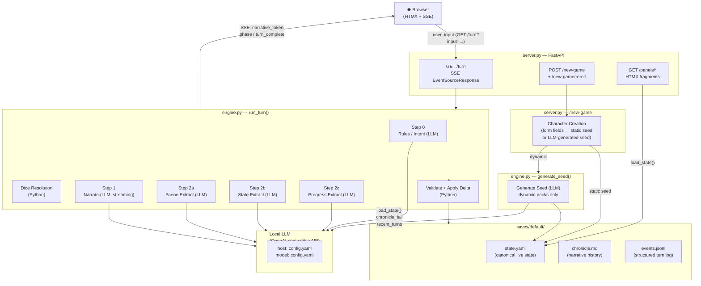

---

## Step 0 — Rules / Intent Classification

Classifies the player's action, determines whether a dice check is needed, and
identifies which state domains will be active — narrowing every downstream extractor.

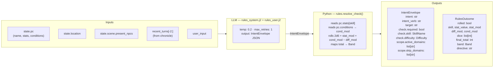

> **Key forward dependency:** `scope.active_domains` / `scope.skip_domains` flow into all
> three extraction streams. `rules_outcome.directive` shapes the narrator's creative latitude.

---

## Step 1 — Narrate (Streaming)

Generates the narrative prose the player reads. Tokens stream live to the browser via SSE.

```mermaid
flowchart LR
    subgraph IN["Inputs"]
        N1["state (full —<br>pc, location, scene,<br>inventory, quests, compendium)"]
        N2["chronicle_tail<br>(compressed history, ≤budget tokens)"]
        N3["recent_turns (last window_turns=6)"]
        N4["rules_outcome<br>(band, directive, dice summary)"]
        N5["pack_style (tone / prose guide)"]
        N6["npc_name_pool (cultural name list)"]
        N7["last_turn_failed<br>(precondition failures from prev turn)"]
        N8["recently_left NPCs"]
        N9["recent_narrative_tail<br>(last turn's narrative for continuity)"]
        N10["user_input"]
    end

    subgraph LLM1["LLM — narrate_system.j2 + narrate_user.j2"]
        NL["temp: 0.9 · streaming: yes<br>output: prose narrative (str)"]
    end

    subgraph OUT["Outputs"]
        NO1["narrative: str<br>(streamed as tokens → SSE<br>then joined + thinking-stripped)"]
        NO2["narr_metrics<br>  first_token_ms<br>  total_ms<br>  tokens_in / tokens_out"]
    end

    IN --> LLM1
    LLM1 --> OUT
```

> **Key forward dependency:** `narrative` is the primary content input for all three
> extraction streams below.

---

## Step 2a — Scene Extract

Extracts location changes, NPC presence, scene tags, and suggested actions from the narrative.

```mermaid
flowchart LR
    subgraph IN["Inputs"]
        S1["narrative (from Step 1)"]
        S2["state.pc (name, tagline, bio, stats)"]
        S3["state.location"]
        S4["state.scene.present_npcs"]
        S5["state.pc.conditions"]
        S6["known_characters<br>(compact: id+name, up to 10 LRU<br>from compendium)"]
        S7["rules_outcome"]
        S8["scope.active_domains<br>(from Step 0)"]
    end

    subgraph LLM2A["LLM — extract_scene_system.j2 + extract_scene_user.j2"]
        SL["temp: 0.4 · max_retries: 1<br>output: SceneExtractResult JSON"]
    end

    subgraph OUT["Outputs — SceneExtractResult"]
        O1["scene_tags: list[str]"]
        O2["scene_tagline: str (3–6 words for UI header)"]
        O3["location_change: LocationRef | None<br>  id, name, description"]
        O4["location_description: str | None"]
        O5["present_npcs: list[NpcRef]<br>  id, name, title, notes, bio"]
        O6["actions: list[str] (suggested next actions)"]
        O7["outcome_summary: str"]
    end

    IN --> LLM2A
    LLM2A --> OUT
```

> **Key forward dependency:** `location_change` and `present_npcs` are passed into
> Steps 2b and 2c.

---

## Step 2b — State Extract

Extracts inventory changes and player condition mutations from the narrative.

```mermaid
flowchart LR
    subgraph IN["Inputs"]
        S1["narrative (from Step 1)"]
        S2["state.pc (name, bio, stats, conditions)"]
        S3["state.location"]
        S4["state.inventory"]
        S5["rules_outcome"]
        S6["scope.active_domains (from Step 0)"]
        S7["engine_expired_conditions<br>(TTL-expired, engine pre-removed)"]
        S8["scene_result.location_change<br>(from Step 2a)"]
        S9["scene_result.present_npcs<br>(from Step 2a)"]
    end

    subgraph LLM2B["LLM — extract_state_system.j2 + extract_state_user.j2"]
        SL["temp: 0.4 · max_retries: 1<br>output: StateExtractResult JSON"]
    end

    subgraph OUT["Outputs — StateExtractResult"]
        O1["inventory_add: list[InventoryItem]<br>  id, name, notes, amount"]
        O2["inventory_remove: list[InventoryRemove]<br>  id, amount (None = full stack)"]
        O3["inventory_update: list[InventoryUpdate]<br>  id, name?, notes?"]
        O4["pc_condition_add: list[ConditionAdd]<br>  id, label, description"]
        O5["pc_condition_remove: list[ConditionRemove]<br>  id"]
        O6["failed: list[str]<br>  (unmet preconditions this turn)"]
    end

    IN --> LLM2B
    LLM2B --> OUT
```

> **Key forward dependency:** `inventory_add` / `inventory_remove` flow into Step 2c
> for quest item linkage.

---

## Step 2c — Progress Extract

Extracts quest updates, recent events, and durable NPC compendium changes.

```mermaid
flowchart LR
    subgraph IN["Inputs"]
        S1["narrative (from Step 1)"]
        S2["state.pc (name, bio, stats)"]
        S3["state.scene.recent_events"]
        S4["state.scene.world_state"]
        S5["active_quests (status=active only)"]
        S6["known_characters<br>(full: id, name, title, bio_preview,<br>up to 10 LRU from compendium)"]
        S7["rules_outcome"]
        S8["scope.active_domains (from Step 0)"]
        S9["scene_result.present_npcs<br>(from Step 2a)"]
        S10["state_result.inventory_add<br>state_result.inventory_remove<br>(from Step 2b — quest item linkage)"]
    end

    subgraph LLM2C["LLM — extract_progress_system.j2 + extract_progress_user.j2"]
        SL["temp: 0.4 · max_retries: 1<br>output: ProgressExtractResult JSON"]
    end

    subgraph OUT["Outputs — ProgressExtractResult"]
        O1["quest_updates: list[QuestUpdate]<br>  id, title, status,<br>  objectives[]: index, description,<br>  done, failed"]
        O2["recent_events_add: list[str]"]
        O3["recent_events_update: list[RecentEventUpdate]<br>  old, new"]
        O4["recent_events_remove: list[str]"]
        O5["compendium_npc_update: list[CompendiumNpcUpdate]<br>  id, name?, title?, bio?"]
    end

    IN --> LLM2C
    LLM2C --> OUT
```

---

## Delta Merge → Validate → Apply

The three extraction results merge into a single `StateDelta`, then validate and apply.

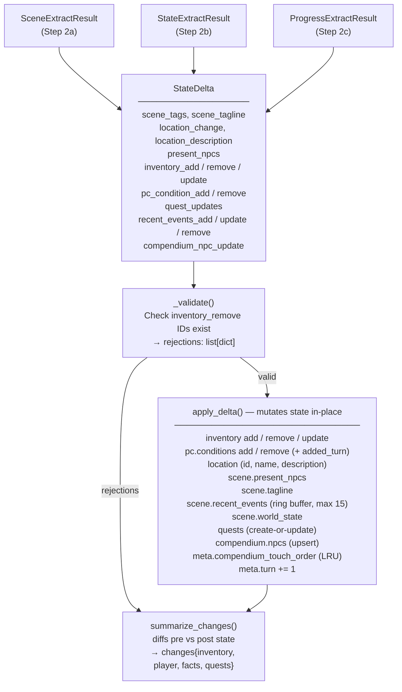

---

## Persist

Atomic writes to disk. No LLM calls.

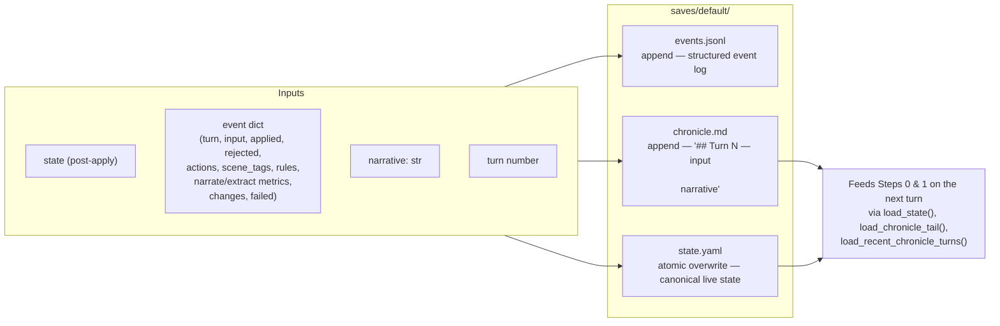

---

## Character Creation Pipeline

Triggered by `POST /new-game`. Behavior differs by pack mode.

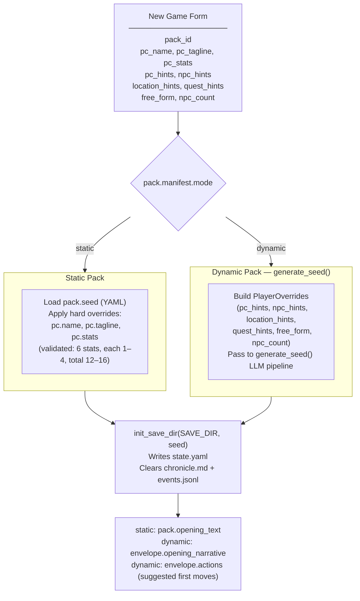

---

## Generate Seed Pipeline (Dynamic Packs Only)

Called by `POST /new-game` and `POST /new-game/reroll`. Generates a complete
starting game state (PC, NPCs, location, quests, opening narrative) from the pack
manifest and optional player overrides.

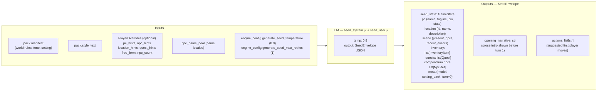

---

## Cross-Pipeline Data Flow

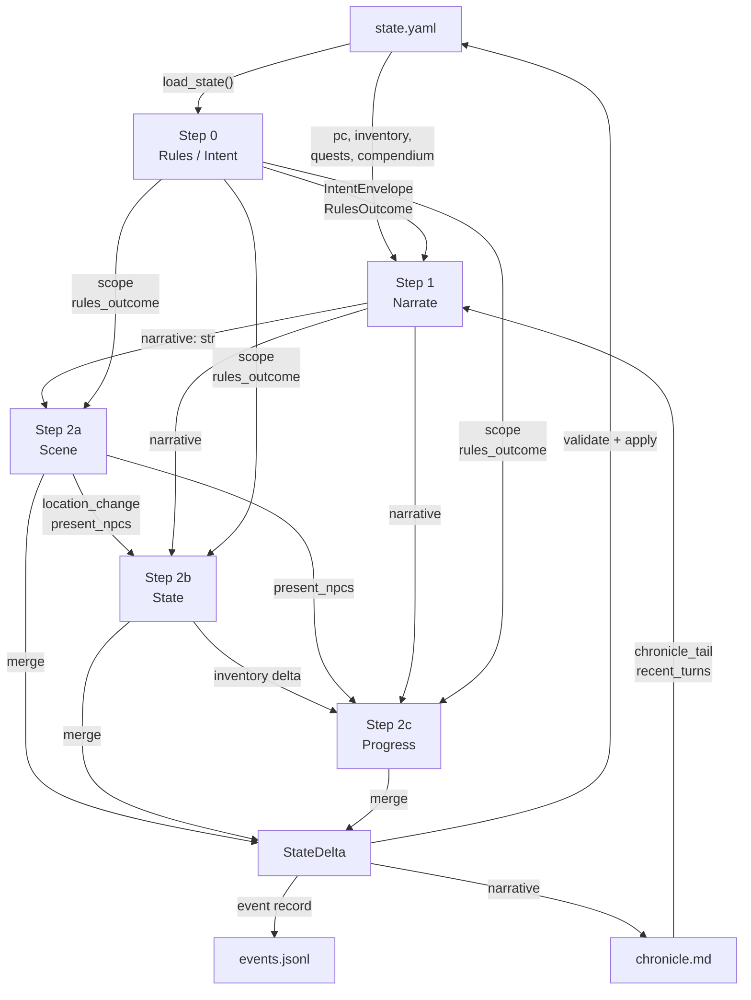
