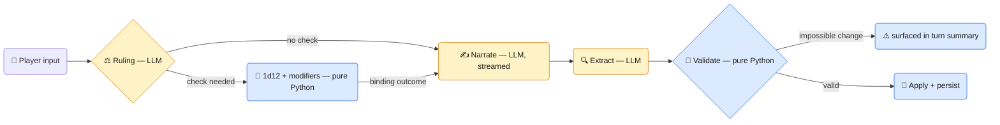
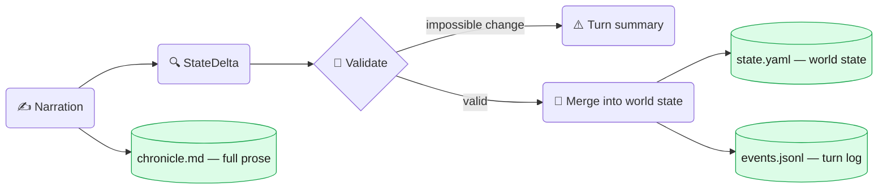

# Getting Started

## LLM Backend

Fablethread works with any OpenAI-compatible API server — local or hosted. Popular options:

**LMStudio** (cross-platform, local):
```bash
pip install lmstudio
lmstudio server --model mlx-community/gemma-4-26b-a4b-it-OptiQ-4bit \
    --host 127.0.0.1 --port 1234
```

**OMLX** (Apple Silicon, MLX, local):
```bash
# Load a model in OMLX, then:
curl http://127.0.0.1:8000/v1/models  # verify model is loaded
```

**Remote server (keyless)** — any OpenAI-compatible endpoint that doesn't require an API key (e.g., your own vLLM/llama.cpp box):
```yaml
# config.yaml
llm:
  host: http://your-server:8000/v1
  model: your-model-id
```

Note: the client sends a placeholder API key (`local`) with no config for real keys yet, so hosted providers that require authentication (OpenAI, Together, etc.) won't work out of the box.

Also: every call includes `num_ctx` via `extra_body` (llama.cpp/Ollama-style extension for server-side context window). Most local servers accept or ignore it; strictly-standard endpoints may reject it.

**Model sizing:** Fablethread is designed around Gemma 4 26B (A4B MoE). At 4-bit quantization it fits in ~16 GiB of memory; higher-precision quants need up to ~32 GiB. A 4B variant works for smaller machines. Any backend serving the model over an OpenAI-compatible API will do.

## Configuration

Copy `config.yaml.example` to `config.yaml` and edit:

- `llm.host` — your LLM backend URL (default `http://127.0.0.1:1234/v1`)
- `llm.model` — model identifier (must match what your backend exposes)
- `llm.num_ctx` — context window size (default 16384)
- `llm.*.temperature` — per-phase temperature knobs
- `server.bind_port` — web server port (default 8765)

All template values in `config.yaml.example` are sensible defaults. The example uses LMStudio on port 1234 as the default backend.

## Testing

Smoke tests run entirely offline (no model server needed):

```bash
make test
```

Test endpoints via curl:

```bash
# Health check
curl http://127.0.0.1:8765/healthz

# New game (resets state from seed)
curl -X POST http://127.0.0.1:8765/new-game

# Opening scene
curl http://127.0.0.1:8765/opening

# Run a turn (returns SSE stream)
curl -X POST http://127.0.0.1:8765/turn -d "input=I look around"

# Panels (HTMX partial renders)
curl http://127.0.0.1:8765/panels/state
curl http://127.0.0.1:8765/panels/state-left
curl http://127.0.0.1:8765/panels/state-right
curl http://127.0.0.1:8765/panels/actions
curl http://127.0.0.1:8765/panels/debug
```

## Commands

| Command | Description |
|---------|-------------|
| `make install` | Install deps with uv |
| `make run` | Start the server |
| `make dev` | Start with auto-reload |
| `make new-game` | Reset save from seed pack |
| `make test` | Run smoke tests (offline) |
| `make lint` | Run ruff checks |
| `make fmt` | Format code |
| `make css` | Rebuild Tailwind CSS |
| `make clean` | Remove build artifacts |

## Debugging

- Tail the JSONL log: `tail -f logs/llm-g.log | jq .`
- Each turn has a `trace_id` surfaced in the Debug panel (click to copy)
- State is hand-editable YAML in `saves/default/state.yaml`
- Full turn history: `saves/default/events.jsonl`
- Narrative chronicle: `saves/default/chronicle.md`
- Debug panel at `http://127.0.0.1:8765/` shows request timing and status
- Panels at `/panels/state`, `/panels/state-left`, `/panels/state-right`, `/panels/actions`, `/panels/debug` (errors are shown inside Debug)

## How it works

### New game flow

When you click **New Game** and select a pack, the server calls `prepare_seed()` (temp 0.4) to generate structured game state, then `narrate_seed()` (temp 0.9) to generate opening prose — a two-step pipeline that resolves the temperature tension where low temp gives reliable JSON but formulaic narration, and high temp gives vivid prose but malformed JSON. The world bible (`world.md`) and scenario constraints (`scenario.yaml`) shape what the model generates.

### Rules engine

Every turn runs a **1d12 + modifier PbtA dice system** before narration.

| Raw die | Band | Result |
|---------|------|--------|
| 1 | **CRITICAL FAIL** | Catastrophic regardless of modifiers |
| ≤ 5 | **FAIL** | Attempt fails; complication arises |
| 6 | **SETBACK** | Set back; resource lost, time wasted |
| 7–8 | **PARTIAL** | Yes, but at a cost |
| ≥ 9 | **SUCCESS** | Clean success |
| 12 | **CRITICAL SUCCESS** | Outstanding regardless of modifiers |

Final roll = 1d12 + (stat − 2) + difficulty_mod + condition_mod. The outcome is displayed in the UI as a roll badge and is passed to the narrator as a **binding constraint**. Checks only fire when the action is active, has real consequences, and is genuinely uncertain.

### Turn flow

Three LLM calls per turn, with deterministic Python between them. Amber = LLM, blue = pure Python:



Each turn fires three LLM calls (OpenAI `/v1/chat/completions`):

1. **Rules / intent** (fast, non-streaming) — classifies what the player is attempting and whether a dice roll is required. Returns an `IntentEnvelope`; the Python engine resolves the dice deterministically. Displays as **"Determining Outcome"** in the UI.
2. **Narrate** — streams narrative text token-by-token via SSE. Chronicle tail + recent turns injected as context. If a roll occurred, a BINDING outcome block constrains the narrator. Displays the roll badge between rules and narrative text.
3. **Extract** — parses the narrative into a structured `StateDelta`. Rules-outcome hint prepended for accuracy on fail/mixed/success. Displays as **"Updating Game State"** in the UI.

The extracted delta is validated against current state (e.g. impossible inventory removals) before applying. Rejected removes surface in the turn summary modal.

### Storage

Every turn writes to three stores. Green = files on disk, hand-editable between turns:



- **`chronicle.md`** — full turn-by-turn prose. Narrator context and browser reload history read from here.
- **`events.jsonl`** — state-change + timing log per turn (narrate/extract ms + tokens in/out, `changes` diff, no raw narrative).
- **`state.yaml`** — current world state (hand-editable between turns).

### State model

- **Facts (deltas):** `established_facts_add` / `established_facts_update` (`old`→`new`, position-preserving) / `established_facts_remove`. Not full-list replacement.
- **PC conditions:** `pc_condition_add` / `pc_condition_remove`.
- **Inventory:** normalized-id merge on add; partial-stack subtract on remove; `inventory_update` for name/notes changes without re-adding.
- **NPCs:** `present_npcs` replaces the full list each turn. Returning NPCs can emit `{id, notes}` only — the engine hydrates name/title/bio from the compendium.
- **Location:** `location_description` nudges description in place; `location_change` moves to a new id/name.

### UI

- **Header:** scene tagline (or `PC @ location`) on the left; **📖 Chronicle** pill (turn log) centered; status/controls on the right.
- **Chronicle overlay:** opens over the narrative column showing per-turn change summaries; closes without affecting the narrative panel layout.
- **Turn summary modal:** appears after each turn with emoji-categorized changes (inventory / player / facts / quests). Dismiss via Enter, Escape, or click.
- **Send → Stop:** while inference runs, the Send button turns red with a spinner; clicking cancels the SSE and restores the previous input and action pills.
- **Action pills:** clicking a choice inserts it into the input with a trailing space (no auto-submit).
- **Debug panel:** recent turn timing (narrate/extract seconds + token in/out), status (model, mock mode), errors.

**Markdown** — Narrative and sidebar snippets rendered with **marked** (GitHub-flavored); narrator/extractor instructed to use light markup.

Historical rows in `events.jsonl` keep whatever JSON shape they were written with; only new rows use the updated schema.
