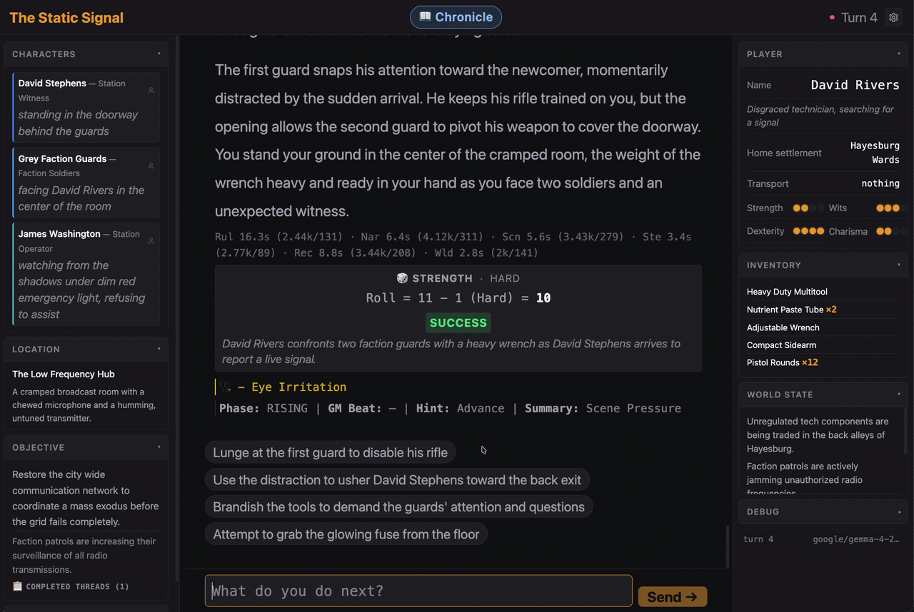

# Fablethread

[](LICENSE)
[](pyproject.toml)
[](#requirements)
[](GETTING_STARTED.md)

A local choose-your-own-adventure engine with an LLM storyteller. Runs entirely on your machine, on any OpenAI-compatible server.

Fablethread generates interactive fiction where a local language model narrates your adventure in real time. Each game starts from a **world pack** — a bundle of setting bible, scenario constraints, and style guides that the LLM uses to seed a fresh character, location, NPCs, quest, and opening scene. Your choices drive the story forward through a full turn pipeline: ruling, narration, state extraction, and application.



## Features

- 🧠 **Living, persistent state** — NPCs, inventory, threads, arcs, conditions, and facts tracked and updated by the LLM across turns. Everything persists in hand-editable YAML, a Markdown chronicle, and a JSONL event log. Restart the server, pick up exactly where you left off
- 🔌 **Model-neutral** — Speaks the OpenAI chat-completions protocol, so any compatible server works: LMStudio, OMLX, llama.cpp, Ollama, vLLM — local or on a remote box. No cloud dependency required. (API-key auth isn't configurable yet, so hosted providers that require keys aren't supported out of the box.)
- 🎲 **PbtA dice engine** — 1d12+modifier system with critical fail/success bands, resolved in pure Python before the LLM sees it
- 📖 **Streaming narration** — Token-by-token SSE with real-time extraction of state changes from the narrative
- 🎬 **Pacing system** — Convergence scoring, scene phases (rising/climax/breather), and GM beat injection to keep the story moving
- 🎭 **Your character, your way** — Point-buy stats (strength, wits, dexterity, charisma), archetype presets, or describe your character in free-form text. Seed the cast and the story goal with hints
- 🌍 **Your world, your genre** — Pick a pre-built pack, build a world from a concept + genre tags, or author a pack by hand

## What makes it different

Most AI storytelling is a chat log. The prose is great, but it quietly forgets: the shopkeeper reappears in a city they never visited, the bandaged wound heals on its own, the villain's lieutenant was never hired. Fablethread runs narration *into and out of* a structured world state, every turn:

- **Nothing is forgotten** — NPCs, inventory, facts, conditions, threads, and arcs live in a typed state model. Returning NPCs are hydrated from a compendium; facts can carry a TTL and expire; threads decay in urgency when ignored
- **Nothing is invented** — every extraction is validated against current state before it applies. You can't lose an item you don't have. When the narrator contradicts state, the change is rejected and surfaced in the turn summary
- **The dice don't lie** — rolls are resolved in pure Python before the LLM sees anything, and the outcome is a binding constraint on the narration
- **The story is paced** — threads gain urgency as they're fed and decay when ignored; convergence scoring drives scene phases (rising → climax → breather); GM beats inject pressure between player actions

## World packs

Five settings ship by default. Every run generates a fresh scenario — characters, NPCs, quest, and opening scene — from the pack's world bible and constraints.

| Pack | Setting |
|------|---------|
| **Allied — 1940–1945** | Allied service member across any theater of WWII. Every rotation is different |
| **The Golden Age — 1715–1725** | Pirate life on the edge of the world. Every port, ship, and mutiny is different |
| **Noir — 1930s** | Detective in a Depression-era city. Every case is different |
| **The Outer Rim** | Space western. A central empire holds the inner worlds; the Rim is dust, debt, and old loyalties |
| **Cordyceps: Year Twenty** | Fungal-apocalypse survival. Nature reclaiming, scattered humanity. Every run is different |

### Build your own

Don't like the defaults? Two paths:

- **World builder** (in-app) — describe a concept, pick up to 4 genre tags (dark fantasy, cyberpunk, cosmic horror, weird west, 15 more), add a mood note and up to 3 world rules. Fablethread generates a full pack from your brief
- **Author a pack by hand** — a pack is just a `world.md` bible, a `scenario.yaml` with constraints, and a `pack.yaml` manifest. Drop it in `packs/` and it shows up in the picker

## Requirements

| Requirement | Details |
|-------------|---------|
| Python | 3.11+ |
| OS | Developed on macOS; no OS-specific dependencies — any platform with Python 3.11+ works |
| Memory | 16–32 GiB for Gemma 4 26B (A4B MoE) — 4-bit quantization fits ~16 GiB, higher-precision quants up to ~32 GiB |
| Small machines | A Gemma 4 4B variant works |
| Backend | Any OpenAI-compatible server — LMStudio, OMLX, llama.cpp, Ollama, vLLM; local or remote. No API-key config yet (hardcoded placeholder), so keyless servers only. Sends a small `num_ctx` extension (llama.cpp/Ollama-style) that most local servers accept or ignore. |

Fablethread is designed around **Gemma 4 26B** (A4B MoE). Any backend serving the model will do — see [GETTING_STARTED.md](GETTING_STARTED.md) for setup.

## Quick Start

```bash
make install
cp config.yaml.example config.yaml   # edit for your LLM backend
make run
```

The server starts at `http://127.0.0.1:8765`.

## Documentation

- **Getting Started** — [GETTING_STARTED.md](GETTING_STARTED.md): full install, configuration, LLM setup
- **Contributing** — [`.github/CONTRIBUTING.md`](.github/CONTRIBUTING.md): how to report bugs, submit PRs, code standards
- **Architecture** — [docs/architecture/OVERVIEW.md](docs/architecture/OVERVIEW.md): pipeline, state models, pacing systems
- **Eval & Debug** — [docs/ev/README.md](docs/ev/README.md): testing, checkers, CLI tools
- **API Reference** — [docs/architecture/cross-module-contracts.md](docs/architecture/cross-module-contracts.md): routes, models, data shapes

## Contributing

Bug reports, world-pack ideas, and PRs are welcome. See [`.github/CONTRIBUTING.md`](.github/CONTRIBUTING.md) for full guidelines.

Note the [PolyForm Noncommercial License](LICENSE): by contributing you agree your contributions are licensed under it and the project stays noncommercial.

## License

Licensed under the [PolyForm Noncommercial License 1.0.0](https://polyformproject.org/licenses/noncommercial/1.0.0). Source-available. See `LICENSE` for full terms.
