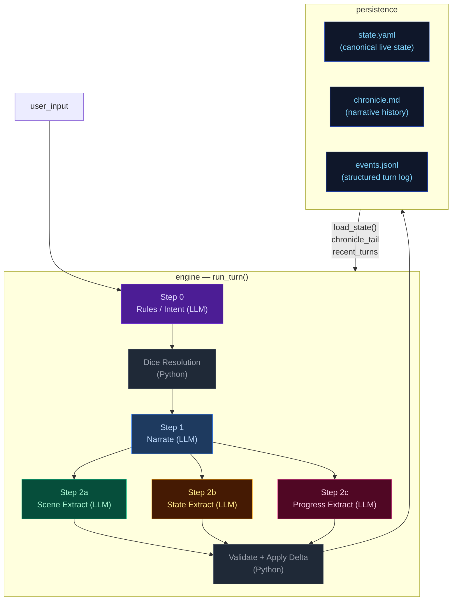

# Eval System Hardening Plan

Companion to the just-completed `E-eval-remediation-cleanup-pass.md`. This plan turns the eval harness into a robust, debuggable, judge-friendly evaluation surface for the ccya engine.

The previous cleanup pass executed cleanly. Two leftovers (duplicate plan files in the open `plans/eval-results-remediation/` folder, and `latest/` missing `REPORT.md` because of a judge timeout) are noted but the user is handling those out-of-band.

---

## TL;DR — what changes

1. `ARCHITECTURE.md` gains a 5-pipeline reference table at the top showing inputs / outputs / mechanics owned (story beats, NPCs, conditions, etc.) and how `progress` hands forward to next-turn `rules`/`narrate`. Two delimiters wrap the engine-design portion the judge needs; everything else (frontend, character creation, turn-viewer, server) goes below.
2. Each eval run dir becomes two files at the top (`<scenario>.trace.md`, `REPORT.md`) plus a sibling `artifacts/` with `<scenario>.events.jsonl` and `<scenario>.run.json`. `state.yaml` is dropped (already embedded in the trace).
3. Judge call gets `timeout=None` (httpx unlimited) with `1800s` fallback if SDK rejects None, and `max_tokens=64000`. Runs through `chat_stream()` so REPORT.md updates live.
4. REPORT.md is written as a skeleton immediately after the runner finishes. Judge tokens stream into a `## Judge (streaming…)` placeholder. After judge completes, the judge summary is hoisted to the top with parsed scores.
5. New file `evals/rubrics/architecture-context.md` is generated at runtime from `docs/ARCHITECTURE.md` (between two markers) and prepended to the rubric system message.
6. New deterministic detectors: prompt-substring-overlap, compaction-feature checklist, plus 4 new universal asserts. The silent-pass `pending_gm_beat.consumed` assert is fixed (was reading from the wrong path).
7. CLI runs ONE scenario by default (`default_scenario` in config.yaml). New `--all` flag runs every scenario serially. New `pack_dirs` config key supports dropping custom packs anywhere.
8. `prompt_token_budget` and `trim_messages` are removed entirely — no more silent narration truncation in extractors. Per the user's direction, prompts are allowed to grow as needed.
9. Rubric refresh frames the judge as a critical reviewer of the engine's mechanical and storytelling design. Cleanly separates qualitative narrative judging from deterministic mechanical signals (which now live in their own trace section).

---

## Out of scope

- The actual compaction implementation fix (the user said it's "basically broken" but only the **measurement** is in scope).
- The two leftover housekeeping items (open-folder duplicate plans + stale `latest/`) — user is handling.
- Re-judging old runs. Old runs become incompatible with the new run-dir layout; that's fine.
- Frontend / SSE / turn-viewer changes.

---

## Firm decisions (no executor ambiguity)

1. **Run-dir layout** is exactly: `evals/runs/<ts>__<scenario>/{REPORT.md, <scenario>.trace.md, <scenario>.judge.md, artifacts/<scenario>.events.jsonl, artifacts/<scenario>.run.json}`. No `state.yaml`, no other top-level files.
2. **Default scenario** is `full_cycle`. Configurable via `default_scenario:` in `evals/config.yaml`.
3. **`--all` flag** runs every discovered scenario serially in its own run dir. There is NO top-level INDEX file for `--all` runs (per discussion: "I will take care of [comparing across scenarios]").
4. **Judge timeout**: try `timeout=None` first (httpx-supported "no timeout"). If the OpenAI SDK rejects `None` at runtime in `_get_client(...).chat.completions.create(...)`, fall back to `1800.0` (30 min). Decision is made once at config-load; no per-call retry logic.
5. **Judge max_tokens** = `64000`. Plumbed as a new kwarg on `chat()` and `chat_stream()`. Other callers default to `None` (server picks).
6. **Architecture-context delimiters** in `docs/ARCHITECTURE.md`: literal HTML comments `<!-- EVAL_CONTEXT_START -->` and `<!-- EVAL_CONTEXT_END -->`. Loader extracts the substring strictly between them.
7. **`prompt_token_budget` is gone.** Field deleted from `EngineConfig`, removed from `config.yaml`, removed from `eval/runner._build_engine_config`, removed from all `trim_messages(...)` callsites. `trim_messages` itself is deleted from `llm_client.py`. Tests that referenced it are updated.
8. **Pack discovery** searches in order: paths in new `pack_dirs:` config list. Default value: `["evals/packs", "packs/default", "packs/custom"]`. First match wins. CLI `--packs-dir <dir>` short-circuits and uses only that one dir (preserving today's behavior).
9. **Streaming REPORT.md**: the file is opened once after runner finishes, written as a complete skeleton, then `f.flush()` called after each judge stream chunk appended to the judge placeholder block. After judge done, REPORT.md is rewritten in full with the judge summary hoisted to the top — atomic write via temp + rename.
10. **`pending_gm_beat` assert path**: writer is `state.meta.pending_gm_beat` (verified at `engine/turn.py:412, 517, 546, 909, 1018, 1048`). Eval readers move from `state.scene.pending_gm_beat` to `state.meta.pending_gm_beat`.

---

## File matrix

| Path | Op | Phases |
|---|---|---|
| `ccya/docs/ARCHITECTURE.md` | rewrite top + reorg | 01 |
| `ccya/docs/REPOMAP/eval.md` | modify | 12 |
| `ccya/evals/config.yaml` | modify | 02, 03 |
| `ccya/ccya/eval/config.py` | modify | 02, 03, 04 |
| `ccya/ccya/eval/cli.py` | modify | 02, 03 |
| `ccya/ccya/eval/runner.py` | modify | 02, 04, 11 |
| `ccya/ccya/eval/judge.py` | modify | 04, 05, 06, 07, 08 |
| `ccya/ccya/eval/report.py` | modify | 05 |
| `ccya/ccya/eval/universal_asserts.py` | modify | 09 |
| `ccya/ccya/eval/architecture_context.py` | NEW | 06 |
| `ccya/ccya/eval/redundancy.py` | NEW | 07 |
| `ccya/ccya/eval/compaction_signals.py` | NEW | 08 |
| `ccya/ccya/llm_client.py` | modify | 04, 11 |
| `ccya/ccya/engine/config.py` | modify | 11 |
| `ccya/ccya/server/app.py` | modify | 11 |
| `ccya/ccya/engine/turn.py` | modify | 11 |
| `ccya/ccya/engine/extraction.py` | modify | 11 |
| `ccya/ccya/engine/seed.py` | modify | 11 |
| `ccya/ccya/engine/pack_gen.py` | modify | 11 |
| `ccya/config.yaml` | modify | 11 |
| `ccya/docs/REPOMAP/config.md` | modify | 11 |
| `ccya/docs/REPOMAP/llm_client.md` | modify | 11 |
| `ccya/tests/test_eval.py` | modify | 11 |
| `ccya/tests/test_compactor.py` | modify | 11 |
| `ccya/evals/rubrics/default.md` | rewrite | 10 |
| `ccya/evals/README.md` | NEW | 02, 12 |
| `ccya/Makefile` | modify | 03 |

---

# Phase 01 — `ARCHITECTURE.md` restructure

**Why:** Today the doc mixes engine internals with frontend/server/turn-viewer details. The judge needs only the engine design. Adding a 5-pipeline reference table at the top gives both humans and the judge a one-page map showing what each pipeline owns and how `progress` hands forward into next-turn `rules`/`narrate`.

**Files:** `ccya/docs/ARCHITECTURE.md`

**Validation gate:** `grep -n 'EVAL_CONTEXT_START' ccya/docs/ARCHITECTURE.md` returns exactly 1 match. `grep -n 'EVAL_CONTEXT_END' ccya/docs/ARCHITECTURE.md` returns exactly 1 match. The text between the two markers is a self-contained engine-design reference (no mentions of FastAPI, SSE, HTMX, browser, turn-viewer, CSS, MLX, llama-swap, server.py, app.py, panels, routes).

## Step 01.1 — Add the 5-pipeline reference table at the top

Insert a new section IMMEDIATELY after the intro paragraph (currently ends at line 12) and BEFORE `## High-Level Overview`. The new section is the first thing inside the EVAL_CONTEXT region.

The table must contain exactly these 5 rows (one per pipeline) with these columns: Pipeline | When it runs | Key inputs | Key outputs | Mechanics it owns | Hand-off to next turn.

Use this exact content:

```markdown
<!-- EVAL_CONTEXT_START -->

## 5-Pipeline Reference (engine design at a glance)

Every player turn drives this 5-step pipeline, executed strictly in order. Step 0 runs once before narration; Step 1 emits the prose the player reads; Steps 2a/2b/2c extract structured changes from that prose. The Python tail validates and applies the merged delta.

| Pipeline | When it runs | Key inputs | Key outputs | Mechanics it owns | Hand-off to next turn |
|---|---|---|---|---|---|
| **Step 0 — Rules / Intent** | Every turn (always) | `state.pc`, `state.location`, `state.scene.present_npcs`, `recent_turns[-1:]`, `user_input` | `IntentEnvelope` (intent, verb, target, stakes, check.required, check.skill, check.difficulty); `RulesOutcome` (rolled, dice, mods, band, directive) | Intent classification, dice roll resolution (2d6 + stat + cond − diff → band), difficulty selection, anti-declare-outcome enforcement | `rules_outcome.directive` shapes narrator latitude |
| **Step 1 — Narrate** | Every turn (always, streamed) | Full `state` (pc, location, scene, inventory, quests, compendium), `chronicle_tail`, `recent_turns`, `RulesOutcome`, `pack_style`, `narrator_rules`, `pending_gm_beat`, `momentum`, `ages`, `recently_left`, name pools, world factions/locations | `narrative` (prose); a trailing `<scope>{"active_domains":[...]}</scope>` line stripped server-side | Prose generation, dice-band binding, GM-beat consumption (clears `state.meta.pending_gm_beat`), de-escalation directives, age-based stalling fixes, scope decision (active_domains) | `narrative` feeds all 3 extractors; `active_domains` gates which extractors run |
| **Step 2a — Scene Extract** | When `scene` or `location_change` in active_domains | `narrative`, `state.pc/location`, `state.scene.present_npcs`, `state.pc.conditions`, `known_characters` (LRU compendium), `RulesOutcome`, `scene_pressure`, `deescalate` flag, `quest_ages`, `recent_turns[-1:]` | `SceneExtractResult`: `scene_tags`, `scene_tagline`, `location_change`, `npc_add/remove/update`, `compendium_npc_update`, `scene_pressure_add/remove/update`, `gm_beat` | NPC presence, location changes, scene tags, scene-pressure lifecycle (background→building→immediate, max-age expiry), durable NPC compendium identity, **GM beat generation** (forward-facing storytelling beat) | `gm_beat` written to `state.meta.pending_gm_beat`, consumed by NEXT turn's narrate |
| **Step 2b — State Extract** | When `inventory` or `pc_condition` in active_domains; auto-activated by transfer-verb scan | `narrative`, `state.pc`, `state.location`, `state.inventory`, `RulesOutcome`, `engine_expired_conditions`, `scene_result.location_change`, `scene_result.present_npcs` | `StateExtractResult`: `inventory_add/remove/update`, `pc_condition_add/remove` | Inventory delta accuracy, condition lifecycle (with `added_turn`), engine-side TTL pre-removal, ID normalization | `items_gained` (names) + `items_lost` (ids) feed Step 2c |
| **Step 2c — Progress Extract** | Every turn (always) | `narrative`, `state.pc`, `state.scene.recent_events`, `state.scene.world_state`, `active_quests`, `RulesOutcome`, `intent`, `recent_turns[-2:]`, `items_gained`/`items_lost` from 2b | `ProgressExtractResult`: `quest_updates`, `recent_events_add/update/remove`, `actions` (4 suggested choices), `outcome_summary` | Quest objective completion (with band-gating), `recent_events` ring buffer (max 15), action suggestions, narrative recap | `recent_events_add` becomes durable history; `quest_updates` advance arcs into next turn's `rules` and `narrate` |

After Step 2c, results merge into a `StateDelta`, the validator checks (e.g. `inventory_remove` IDs exist), `apply_delta()` mutates state in-place, and the turn is persisted. The next turn's Step 0 reads the new `state.yaml` plus `events.jsonl`.

```

## Step 01.2 — Wrap engine-design diagrams in EVAL_CONTEXT region

The EVAL_CONTEXT region begins with the 5-pipeline reference table (Step 01.1) and ends with the `## Cross-Pipeline Data Flow` diagram (currently ending around line 481).

Insert `<!-- EVAL_CONTEXT_END -->` on its own line IMMEDIATELY after the closing ``` ``` ``` of the Cross-Pipeline Data Flow mermaid block (currently line 481) and BEFORE the `---` separator that follows it.

The EVAL_CONTEXT region therefore contains:
- 5-Pipeline Reference table (new)
- High-Level Overview diagram (KEEP, it's engine-centric — but see Step 01.4 to scrub frontend/server nodes)
- Step 0 — Rules / Intent Classification
- Step 1 — Narrate (Streaming)
- Step 2a — Scene Extract
- Step 2b — State Extract
- Step 2c — Progress Extract
- Delta Merge → Validate → Apply
- Persist
- Cross-Pipeline Data Flow

What is NOT in the EVAL_CONTEXT region (must appear AFTER `<!-- EVAL_CONTEXT_END -->`):
- Character Creation Pipeline
- Generate Seed Pipeline
- Turn Viewer status colors
- Anything else added later

## Step 01.3 — Move Character Creation + Generate Seed + Turn Viewer below the delimiter

Find these three sections and move them in the file so they appear AFTER `<!-- EVAL_CONTEXT_END -->`:

1. `## Character Creation Pipeline` (currently lines 385–413)
2. `## Generate Seed Pipeline (Dynamic Packs Only)` (currently lines 417–448)
3. `## Turn Viewer (`/turn_viewer`) — status colors` (currently lines 485–505)

The new order in the file becomes:
1. Title + intro (lines 1–12 unchanged)
2. `<!-- EVAL_CONTEXT_START -->`
3. 5-Pipeline Reference (Step 01.1)
4. High-Level Overview (with frontend nodes scrubbed per Step 01.4)
5. Step 0
6. Step 1
7. Step 2a
8. Step 2b
9. Step 2c
10. Delta Merge → Validate → Apply
11. Persist
12. Cross-Pipeline Data Flow
13. `<!-- EVAL_CONTEXT_END -->`
14. `---`
15. `## Out-of-band Pipelines (not part of the per-turn loop — for human reference)` (NEW heading — explanatory single-line preamble: "These run only at new-game time or are non-engine concerns. They are excluded from the eval-context region above.")
16. Character Creation Pipeline
17. Generate Seed Pipeline
18. Turn Viewer status colors

## Step 01.4 — Scrub the High-Level Overview diagram of non-engine nodes

The current High-Level Overview (lines 14–76) includes BROWSER, SERVER (FastAPI subgraph with TURN/NEWGAME/PANELS), CHAR_CREATION subgraph, SEED_ENGINE subgraph, LLM_HOST, and references to SSE/HTMX. Replace the entire diagram block (the ```mermaid ... ``` between lines 16 and 76) with a leaner engine-only version:



## Step 01.5 — Validate the restructure

```bash
# Markers exist exactly once
grep -c '<!-- EVAL_CONTEXT_START -->' ccya/docs/ARCHITECTURE.md  # → 1
grep -c '<!-- EVAL_CONTEXT_END -->' ccya/docs/ARCHITECTURE.md    # → 1

# Forbidden terms inside the eval-context region
awk '/<!-- EVAL_CONTEXT_START -->/,/<!-- EVAL_CONTEXT_END -->/' ccya/docs/ARCHITECTURE.md | \
  grep -i -E 'fastapi|sse|htmx|browser|turn-viewer|turn_viewer|MLX|llama-swap|server\.py|panels|/new-game'
# → must be empty (no matches)

# 5-pipeline table exists
grep -n '5-Pipeline Reference' ccya/docs/ARCHITECTURE.md  # → exactly 1 hit
```

---

# Phase 02 — Pluggable packs

**Why:** Today the eval is hard-locked to packs in `evals/packs/`. The user wants to drop a pack folder anywhere reasonable (e.g. the same `packs/default/*` the live game uses) and point the eval at it.

**Files:** `ccya/evals/config.yaml`, `ccya/ccya/eval/config.py`, `ccya/ccya/eval/cli.py`, `ccya/evals/README.md` (new).

**Validation gate:** `uv run python -m ccya.eval pack` prints the new `pack_dirs` list. `uv run python -m ccya.eval list` discovers scenarios as before.

## Step 02.1 — Add `pack_dirs` to eval config

Edit `ccya/evals/config.yaml`. Add at the top, just after `default_pack:`:

```yaml
default_pack: eval-pack
default_scenario: full_cycle           # Phase 03 — see below
pack_dirs:                             # Phase 02 — search order; first match wins
  - evals/packs
  - packs/default
  - packs/custom
default_save_root: ~/.cache/ccya-eval
```

## Step 02.2 — Plumb `pack_dirs` through `EvalConfig`

Edit `ccya/ccya/eval/config.py`. In the `EvalConfig` dataclass (around line 46), add:

```python
@dataclass
class EvalConfig:
    default_pack: str = "eval-pack"
    default_scenario: str = "full_cycle"          # Phase 03
    pack_dirs: list[str] = field(default_factory=lambda: ["evals/packs", "packs/default", "packs/custom"])
    default_save_root: str = "~/.cache/ccya-eval"
    runs_dir: str = "evals/runs"
    num_turns: int = 10
    # ...rest unchanged
```

In `load_eval_config()` (around line 78), wire it:

```python
return EvalConfig(
    default_pack=str(raw.get("default_pack", "eval-pack")),
    default_scenario=str(raw.get("default_scenario", "full_cycle")),
    pack_dirs=list(raw.get("pack_dirs") or ["evals/packs", "packs/default", "packs/custom"]),
    default_save_root=str(raw.get("default_save_root", "~/.cache/ccya-eval")),
    # ...rest unchanged
)
```

## Step 02.3 — Pack lookup helper

Edit `ccya/ccya/eval/cli.py`. Replace `_resolve_packs_dir(arg: str | None) -> Path` (around lines 43–46) with a list-returning version, plus a per-pack resolver:

```python
def _resolve_packs_dirs(arg: str | None, eval_cfg: EvalConfig) -> list[Path]:
    """Returns the ordered list of packs-dirs to search. --packs-dir overrides config."""
    if arg:
        return [Path(arg).resolve()]
    return [
        (REPO_ROOT / d).resolve() if not Path(d).is_absolute() else Path(d).resolve()
        for d in eval_cfg.pack_dirs
    ]


def _resolve_pack_path(pack_id: str, packs_dirs: list[Path]) -> Path:
    """Find pack_id as a subdirectory of any of the configured packs-dirs."""
    for pd in packs_dirs:
        candidate = pd / pack_id
        if candidate.is_dir():
            return candidate
    searched = ", ".join(str(p) for p in packs_dirs)
    raise FileNotFoundError(f"pack {pack_id!r} not found in any of: {searched}")
```

Update `_cmd_run()` (line 99) to call `_resolve_packs_dirs` and to pass the resolved per-pack PARENT into `run_scenario` (Phase 02.4). For now, the runner still receives `packs_dir` as a single Path — we update the runner signature in Step 02.4.

## Step 02.4 — Runner accepts a list of pack search dirs

Edit `ccya/ccya/eval/runner.py`. Change `run_scenario()` signature (line 425):

```python
async def run_scenario(
    scenario: Scenario,
    *,
    eval_cfg: EvalConfig,
    packs_dirs: list[Path],            # was: packs_dir: Path
    runs_dir: Path | None = None,
    save_dir: Path | None = None,
) -> RunResult:
```

Inside, replace `pack = load_pack(scenario.pack, packs_dir)` (line 451) with:

```python
    from ccya.eval.cli import _resolve_pack_path  # local import avoids cycles
    pack_path = _resolve_pack_path(scenario.pack, packs_dirs)
    pack = load_pack(scenario.pack, pack_path.parent)
```

Note: `load_pack` already takes the parent dir + id. We just resolved `parent` from the search list.

Update `_cmd_run` in `cli.py` to pass `packs_dirs=_resolve_packs_dirs(args.packs_dir, eval_cfg)`.

## Step 02.5 — Document custom packs

Create new file `ccya/evals/README.md`:

```markdown
# ccya eval harness

## Adding a custom eval pack

The eval harness searches for packs in the directories listed under `pack_dirs:`
in `evals/config.yaml`. Default order:

1. `evals/packs/`
2. `packs/default/`
3. `packs/custom/`

To add a custom pack:

1. Create a folder under any search dir, e.g. `packs/custom/grimdark-noir/`.
2. Populate it with `pack.yaml`, `seed_state.yaml` (REQUIRED — eval only supports
   static packs), `style.md`, `scenario.yaml` (optional — for narrator_rules /
   factions / locations), and `extract_examples.yaml` (optional).
3. Reference it in a scenario: set `pack="grimdark-noir"` on the `Scenario(...)`
   call in `evals/scenarios/<your_scenario>.py`. The harness picks up the first
   match in the search order.

To run only that scenario: `make eval` after setting `default_scenario:` in
`evals/config.yaml`, OR `uv run python -m ccya.eval run <your_scenario>`.

To run every discovered scenario: `make eval-all` (see below).
```

(Phase 12 will add a section to this README about run-dir layout and artifacts.)

## Step 02.6 — Validation

```bash
uv run python -m ccya.eval pack | grep -E '(default_scenario|pack_dirs)'
# → both keys printed

uv run python -c "
from ccya.eval.config import load_eval_config
from ccya.eval.cli import _resolve_packs_dirs, _resolve_pack_path
cfg = load_eval_config('evals/config.yaml')
dirs = _resolve_packs_dirs(None, cfg)
print('search dirs:', [str(d) for d in dirs])
print('eval-pack →', _resolve_pack_path('eval-pack', dirs))
print('expanse →', _resolve_pack_path('expanse', dirs))
"
# → first two lines list dirs; eval-pack resolves under evals/packs/;
#   expanse resolves under packs/default/.
```

Update `ccya/ccya/eval/cli.py` `_cmd_pack` to also print `default_scenario` and `pack_dirs`:

```python
def _cmd_pack(args: argparse.Namespace) -> int:
    cfg = load_eval_config()
    print("Eval config:")
    for k in (
        "default_pack",
        "default_scenario",
        "pack_dirs",
        "default_save_root",
        "runs_dir",
        "num_turns",
    ):
        print(f"  {k}: {getattr(cfg, k)}")
    # ...rest unchanged
```

---

# Phase 03 — Multi-scenario CLI (default = one, `--all` for everything)

**Why:** Today `_resolve_scenario_path()` defaults to `discover_scenarios()[0]`. Other scenarios (`gm_beat_lifecycle`, `momentum_high`, `momentum_low`, `pressure_lifecycle`) exist but are unreachable without typing their name. User wants a one-liner default plus an opt-in batch mode.

**Files:** `ccya/ccya/eval/cli.py`, `ccya/Makefile`.

**Validation gate:** `uv run python -m ccya.eval run` runs the configured `default_scenario` (no positional arg). `uv run python -m ccya.eval run --all` runs every scenario in sequence.

## Step 03.1 — Default scenario from config (positional arg now optional)

Edit `ccya/ccya/eval/cli.py`. Replace `_resolve_scenario_path()` (lines 49–60):

```python
def _resolve_scenario_path(arg: str | None, eval_cfg: EvalConfig) -> Path:
    """Resolve a scenario name to its file path.

    arg=None → use eval_cfg.default_scenario.
    arg=<id> → look up evals/scenarios/<id>.py.
    arg=<path> → resolve as filesystem path.
    """
    name = arg or eval_cfg.default_scenario
    p = Path(name)
    if p.suffix == ".py" and p.exists():
        return p.resolve()
    candidate = REPO_ROOT / "evals" / "scenarios" / f"{name}.py"
    if candidate.exists():
        return candidate
    raise FileNotFoundError(f"scenario {name!r} not found at {candidate}")
```

## Step 03.2 — `--all` flag

In `cli.py`, in the `run` subparser block (around line 234), add:

```python
run.add_argument("--all", action="store_true",
                 help="Run every discovered scenario in serial (default: just default_scenario).")
```

## Step 03.3 — `_cmd_run` branches on `--all`

Refactor the existing `_cmd_run` to extract the per-scenario work into an inner async helper. Pseudocode for the new structure:

```python
async def _cmd_run(args: argparse.Namespace) -> int:
    eval_cfg = load_eval_config()
    # ...logger setup unchanged...
    if args.temp is not None:
        eval_cfg = replace(eval_cfg, inference=InferenceConfig(
            temperature_override=float(args.temp),
            cache=eval_cfg.inference.cache,
        ))

    packs_dirs = _resolve_packs_dirs(args.packs_dir, eval_cfg)

    if args.all:
        scenario_paths = discover_scenarios(REPO_ROOT / "evals" / "scenarios")
        if not scenario_paths:
            print("[eval] no scenarios discovered", file=sys.stderr)
            return 1
    else:
        scenario_paths = [_resolve_scenario_path(args.scenario, eval_cfg)]

    print(f"[eval] running {len(scenario_paths)} scenario(s)", file=sys.stderr)
    last_report: Path | None = None
    for sp in scenario_paths:
        report = await _run_one_scenario(sp, args, eval_cfg, packs_dirs)
        last_report = report
        print(f"[eval] {sp.stem} → {report}", file=sys.stderr)

    if last_report is not None:
        print(str(last_report))      # stdout: path of LAST report (matches existing contract)
    return 0
```

Where `_run_one_scenario(sp, args, eval_cfg, packs_dirs)` contains the body that was previously inline in `_cmd_run` from line 80 onward (load scenario, optionally `--pack` override, optionally truncate turns, build engine config, call `run_scenario`, optionally call judge, generate report). Returns the `Path` to `REPORT.md`.

## Step 03.4 — Makefile target

Edit `ccya/Makefile`. After the existing `eval:` target (line 49), add:

```make
eval-all: llama-swap
	uv run python -m ccya.eval run --all
```

Update the `.PHONY:` line at the top (line 1) to include `eval-all`.

## Step 03.5 — Validation

```bash
# Default-scenario path
uv run python -m ccya.eval run --no-judge --turns 1
# → exits 0; produces evals/runs/<ts>__/REPORT.md for full_cycle (or whatever default_scenario is set to)

# Explicit scenario
uv run python -m ccya.eval run gm_beat_lifecycle --no-judge --turns 1

# All scenarios
uv run python -m ccya.eval run --all --no-judge --turns 1
# → produces one run dir per discovered scenario
```

---

# Phase 04 — Run-dir layout (top-level trace+REPORT, sibling artifacts/)

**Why:** Today there are 5 top-level files per run. User wants 2 visible (input + output), with the rest tucked into a sibling `artifacts/` so they're discoverable but not noisy.

**Files:** `ccya/ccya/eval/runner.py`, `ccya/ccya/eval/judge.py`, `ccya/ccya/eval/report.py`.

**Validation gate:** After a successful run, `ls evals/runs/<ts>__<scenario>/` lists exactly: `REPORT.md`, `<scenario>.trace.md`, `<scenario>.judge.md`, `artifacts/`. Inside `artifacts/`: `<scenario>.events.jsonl`, `<scenario>.run.json`. No `state.yaml` anywhere.

## Step 04.1 — Runner writes events + run.json into `artifacts/`

Edit `ccya/ccya/eval/runner.py`, in `run_scenario()` (around lines 596–630). Replace the persist block:

```python
    finished_at = datetime.now(timezone.utc).isoformat()
    output_dir.mkdir(parents=True, exist_ok=True)
    artifacts_dir = output_dir / "artifacts"
    artifacts_dir.mkdir(parents=True, exist_ok=True)

    dst_events = artifacts_dir / f"{scenario.id}.events.jsonl"
    if src_events.exists():
        enriched = list(turn_events)
        if all_events and all_events[0].get("__metadata__"):
            enriched.insert(0, all_events[0])
        dst_events.write_text("\n".join(json.dumps(e, default=str) for e in enriched) + "\n")
    else:
        dst_events.write_text("")

    # NOTE: state.yaml is intentionally NOT copied — its content is fully
    # reproduced inside <scenario>.trace.md as the last turn's "State After
    # Turn" snapshot. See Phase 04 of eval-system-hardening.

    run_result = RunResult(
        scenario_id=scenario.id,
        pack=scenario.pack,
        model=engine_config.model,
        temperature_override=eval_cfg.inference.temperature_override,
        started_at=started_at,
        finished_at=finished_at,
        save_dir=str(save_dir),
        output_dir=str(output_dir),
        events_jsonl_path=str(dst_events),
        state_yaml_path="",                         # deprecated — kept on the dataclass for back-compat with existing JSON readers; always empty after this change
        turns=turn_records,
        total_errors=total_errors,
    )

    (artifacts_dir / f"{scenario.id}.run.json").write_text(
        json.dumps(asdict(run_result), indent=2, default=str)
    )

    _update_latest_symlink(runs_dir, output_dir)
    _log.debug("run complete: scenario=%s turns=%d errors=%d output_dir=%s", scenario.id, len(turn_records), total_errors, output_dir)
    return run_result
```

Remove the `dst_state` lines (was around 599 and 608–609). Remove the `state.yaml` writes entirely.

## Step 04.2 — Judge writes trace + judge.md at the TOP of the run dir

Edit `ccya/ccya/eval/judge.py` `run_judge()` (around lines 552–583). The `output_dir` passed to `run_judge` is already the top-level run dir. Confirm the writes go there (they do today: `trace_md_path = output_dir / f"{scenario_id}.trace.md"` and `judge_md_path = output_dir / f"{scenario_id}.judge.md"`). No change needed for these two lines, but verify the events_path the judge READS is now under `artifacts/`. Search call site in `cli.py` `_cmd_judge_only` (line 161): it loads `rr` from `*.run.json`, then reads `rr.events_jsonl_path`. Since `events_jsonl_path` is now `artifacts/...`, this works automatically.

For `_cmd_judge_only`, the `run_jsons = sorted(run_dir.glob("*.run.json"))` (line 157) needs to look in `artifacts/` instead. Update:

```python
    run_jsons = sorted((run_dir / "artifacts").glob("*.run.json")) if (run_dir / "artifacts").is_dir() else sorted(run_dir.glob("*.run.json"))
    if not run_jsons:
        print(f"[eval] no *.run.json found in {run_dir}/artifacts/", file=sys.stderr)
        return 1
```

The `or sorted(run_dir.glob(...))` fallback preserves compatibility with old runs from before this restructure.

## Step 04.3 — Report path location

Edit `ccya/ccya/eval/report.py` `generate_report()` (line 588). Confirm `out_path = output_dir / "REPORT.md"` writes to the TOP-LEVEL run dir, not under artifacts. It does today; no change.

## Step 04.4 — `find_previous_run` must look in artifacts/

Edit `ccya/ccya/eval/runner.py` `find_previous_run()` (around lines 646–665). Update the candidate scan:

```python
def find_previous_run(
    runs_dir: Path, scenario_id: str, exclude: Path | None = None
) -> Path | None:
    if not runs_dir.is_dir():
        return None
    candidates: list[Path] = []
    for child in sorted(runs_dir.iterdir(), reverse=True):
        if child.name == "latest":
            continue
        if exclude is not None and child.resolve() == exclude.resolve():
            continue
        # New layout: artifacts/<scenario>.run.json
        run_json = child / "artifacts" / f"{scenario_id}.run.json"
        if not run_json.exists():
            # Back-compat: pre-restructure runs had it at the top level
            run_json = child / f"{scenario_id}.run.json"
        if run_json.exists():
            candidates.append(run_json)
    return candidates[0] if candidates else None
```

## Step 04.5 — Validation

```bash
# Run a single turn so the smoke is fast
uv run python -m ccya.eval run --no-judge --turns 1
# → exits 0

# Verify layout
RUN=$(ls -1d evals/runs/2*__full_cycle | tail -1)
ls "$RUN"
# → REPORT.md  full_cycle.trace.md  artifacts/
ls "$RUN/artifacts"
# → full_cycle.events.jsonl  full_cycle.run.json
test ! -e "$RUN/full_cycle.state.yaml"  # → exit 0 (file does NOT exist)
test ! -e "$RUN/artifacts/full_cycle.state.yaml"  # → exit 0
```

---

# Phase 05 — Streaming judge → REPORT.md

**Why:** Today `generate_report()` is one-shot at the end. With a 10-15min judge call, the user can't read anything until it's done. Skeleton-then-stream solves both the read-early-ness and (combined with Phase 04) the connection-timeout failure mode.

**Files:** `ccya/ccya/eval/report.py`, `ccya/ccya/eval/judge.py`, `ccya/ccya/eval/cli.py`.

**Validation gate:** After kicking off `uv run python -m ccya.eval run`, `tail -f evals/runs/<ts>__/REPORT.md` shows the skeleton instantly, the `## Judge` section grows with tokens as they arrive, and the final REPORT.md has the parsed scores hoisted to the top.

## Step 05.1 — Refactor `generate_report()` into skeleton + stream + finalize

Edit `ccya/ccya/eval/report.py`. Add three new functions (the existing `generate_report()` becomes a thin orchestrator):

```python
def write_report_skeleton(
    run_result: RunResult,
    *,
    eval_cfg: EvalConfig,
    runs_dir: Path | None = None,
) -> Path:
    """Write REPORT.md with everything except the judge body. Returns the path.

    The judge section contains a placeholder: '## Judge (streaming…)' followed by
    a single empty fenced code block. Phase 05.2's appender writes into the
    fence; Phase 05.3's finalizer rewrites the whole file with the judge body
    hoisted into a normal section.
    """
    output_dir = Path(run_result.output_dir)
    runs_dir = runs_dir or output_dir.parent
    cur_events = _read_events(Path(run_result.events_jsonl_path))
    cur_metrics = _summarize_events(cur_events)

    prev_metrics: list[TurnMetrics] = []
    prev_run_path: Path | None = None
    prev_json = find_previous_run(runs_dir, run_result.scenario_id, exclude=output_dir)
    if prev_json is not None:
        prev_run_path = prev_json.parent
        prev_run = load_run_result(prev_json)
        prev_events = _read_events(Path(prev_run.events_jsonl_path))
        prev_metrics = _summarize_events(prev_events)

    regressions = _compute_regressions(
        cur_metrics, prev_metrics,
        warn_pct=eval_cfg.report.token_warn_pct,
        fail_pct=eval_cfg.report.token_fail_pct,
    )
    flags = _collect_flags(cur_metrics, regressions, run_result, judge=None)

    parts: list[str] = []
    parts.append(f"# Eval Report — `{run_result.scenario_id}`\n")
    parts.append(
        f"**Pack:** `{run_result.pack}` · **Model:** `{run_result.model}` · "
        f"**Temp override:** `{run_result.temperature_override}`  "
    )
    parts.append(
        f"**Started:** {run_result.started_at} · **Finished:** {run_result.finished_at}  "
    )
    parts.append(f"**Output dir:** `{run_result.output_dir}`  ")
    parts.append(
        f"**Compared against:** `{prev_run_path}`" if prev_run_path is not None
        else "**Compared against:** _(no prior run found)_"
    )
    parts.append("")
    parts.append("## Judge (streaming…)\n")
    parts.append("_Judge response is streaming live below. This block will be replaced with the parsed verdict once the call completes._\n")
    parts.append("```\n")
    parts.append(_JUDGE_STREAM_SENTINEL_OPEN)
    parts.append(_JUDGE_STREAM_SENTINEL_CLOSE)
    parts.append("```\n")
    parts.append(_render_flag_block(flags, eval_cfg.report.flag_at_top))
    parts.append("")
    auto_block = _render_auto_checker_block(run_result)
    if auto_block:
        parts.append("## Auto-Checker\n")
        parts.append(auto_block)
    parts.append("## Turn Metrics\n")
    parts.append(_render_combined_table(cur_metrics, prev_metrics, run_result))
    if regressions:
        warns = [r for r in regressions if r.severity == "warn"]
        if warns:
            parts.append("\n## Warnings (≥ warn threshold but < fail threshold)\n")
            for r in warns:
                parts.append(
                    f"- `{r.stream}` turn {r.turn}: "
                    f"{r.prev_tokens_in} → {r.cur_tokens_in} (+{r.pct_change:.1f}%)"
                )

    out_path = output_dir / "REPORT.md"
    out_path.write_text("\n".join(parts) + "\n")
    return out_path


_JUDGE_STREAM_SENTINEL_OPEN = "<!-- JUDGE_STREAM_OPEN -->\n"
_JUDGE_STREAM_SENTINEL_CLOSE = "<!-- JUDGE_STREAM_CLOSE -->\n"


def append_judge_chunk(report_path: Path, chunk: str) -> None:
    """Append a streamed-judge token-or-chunk to REPORT.md atomically.

    Reads the file, inserts `chunk` immediately before _SENTINEL_CLOSE, writes
    back. Cheap because the file is small until the judge produces real volume.
    For very long judge outputs this becomes O(n^2) over chunks — acceptable
    because chunks are coarse (full sentences) and total judge output is
    bounded at ~64K tokens.
    """
    text = report_path.read_text()
    if _JUDGE_STREAM_SENTINEL_CLOSE not in text:
        return                          # finalize already ran or skeleton missing
    new_text = text.replace(
        _JUDGE_STREAM_SENTINEL_CLOSE,
        chunk + _JUDGE_STREAM_SENTINEL_CLOSE,
        1,
    )
    report_path.write_text(new_text)


def finalize_report(
    report_path: Path,
    run_result: RunResult,
    *,
    eval_cfg: EvalConfig,
    judge_result: JudgeResult,
    runs_dir: Path | None = None,
) -> None:
    """Rewrite REPORT.md with the judge summary hoisted to the top.

    The streaming sentinel block is removed; a proper judge summary block is
    inserted after the metadata header; the parsed scores update the flag
    computation (judge_score_drop) so the flag block reflects them.
    """
    output_dir = Path(run_result.output_dir)
    runs_dir = runs_dir or output_dir.parent
    cur_events = _read_events(Path(run_result.events_jsonl_path))
    cur_metrics = _summarize_events(cur_events)
    prev_metrics: list[TurnMetrics] = []
    prev_run_path: Path | None = None
    prev_json = find_previous_run(runs_dir, run_result.scenario_id, exclude=output_dir)
    if prev_json is not None:
        prev_run_path = prev_json.parent
        prev_run = load_run_result(prev_json)
        prev_events = _read_events(Path(prev_run.events_jsonl_path))
        prev_metrics = _summarize_events(prev_events)
    regressions = _compute_regressions(
        cur_metrics, prev_metrics,
        warn_pct=eval_cfg.report.token_warn_pct,
        fail_pct=eval_cfg.report.token_fail_pct,
    )
    flags = _collect_flags(cur_metrics, regressions, run_result, judge_result)

    parts: list[str] = []
    parts.append(f"# Eval Report — `{run_result.scenario_id}`\n")
    parts.append(
        f"**Pack:** `{run_result.pack}` · **Model:** `{run_result.model}` · "
        f"**Temp override:** `{run_result.temperature_override}`  "
    )
    parts.append(
        f"**Started:** {run_result.started_at} · **Finished:** {run_result.finished_at}  "
    )
    parts.append(f"**Output dir:** `{run_result.output_dir}`  ")
    parts.append(
        f"**Compared against:** `{prev_run_path}`" if prev_run_path is not None
        else "**Compared against:** _(no prior run found)_"
    )
    parts.append("")
    parts.append("## Judge Summary\n")
    parts.append(_render_judge_summary(judge_result))
    parts.append(_render_flag_block(flags, eval_cfg.report.flag_at_top))
    parts.append("")
    auto_block = _render_auto_checker_block(run_result)
    if auto_block:
        parts.append("## Auto-Checker\n")
        parts.append(auto_block)
    parts.append("## Turn Metrics\n")
    parts.append(_render_combined_table(cur_metrics, prev_metrics, run_result))
    if regressions:
        warns = [r for r in regressions if r.severity == "warn"]
        if warns:
            parts.append("\n## Warnings (≥ warn threshold but < fail threshold)\n")
            for r in warns:
                parts.append(
                    f"- `{r.stream}` turn {r.turn}: "
                    f"{r.prev_tokens_in} → {r.cur_tokens_in} (+{r.pct_change:.1f}%)"
                )
    parts.append("\n## Judge Verdict (full)\n")
    parts.append(judge_result.body_md)

    tmp = report_path.with_suffix(".md.tmp")
    tmp.write_text("\n".join(parts) + "\n")
    tmp.replace(report_path)
```

KEEP the existing `generate_report()` function but turn it into a back-compat shim that calls `write_report_skeleton` + `finalize_report` when `judge_result is not None`, else just `write_report_skeleton`. This keeps `judge-only` and `--no-judge` paths working with one entry point:

```python
def generate_report(
    run_result: RunResult,
    *,
    eval_cfg: EvalConfig,
    judge_result: JudgeResult | None = None,
    runs_dir: Path | None = None,
) -> Path:
    """Back-compat entry point. New code should call write_report_skeleton/finalize_report directly."""
    path = write_report_skeleton(run_result, eval_cfg=eval_cfg, runs_dir=runs_dir)
    if judge_result is not None:
        finalize_report(path, run_result, eval_cfg=eval_cfg, judge_result=judge_result, runs_dir=runs_dir)
    return path
```

## Step 05.2 — Judge becomes streaming

Edit `ccya/ccya/eval/judge.py`. Add a new public function `run_judge_streaming()` that replaces `run_judge()` for the new code path, while keeping `run_judge()` as a back-compat wrapper.

```python
async def run_judge_streaming(
    events_path: Path,
    *,
    eval_cfg: EvalConfig,
    output_dir: Path,
    scenario_id: str,
    on_chunk: Callable[[str], None],            # streamed token callback
    previous_judge_md_path: Path | None = None,
    game_config_path: Path | None = None,
) -> JudgeResult:
    """Same contract as run_judge() but uses chat_stream() and forwards each
    chunk to on_chunk() so callers can append to REPORT.md in flight.
    """
    rubric_path = Path(eval_cfg.judge.rubric_path)
    if not rubric_path.is_absolute():
        rubric_path = REPO_ROOT / rubric_path
    if not rubric_path.exists():
        raise FileNotFoundError(f"rubric not found: {rubric_path}")
    rubric_text = rubric_path.read_text()

    # Phase 06: prepend architecture context to system message
    from ccya.eval.architecture_context import load_architecture_context
    arch_context = load_architecture_context()
    system_text = (rubric_text + "\n\n" + arch_context) if arch_context else rubric_text

    cfg_path = game_config_path or (REPO_ROOT / "config.yaml")
    game_cfg = load_config(cfg_path)
    llm = game_cfg.get("llm", {})
    host = str(llm.get("host", "http://localhost:8080/v1"))
    judge_model = eval_cfg.judge.model or str(llm.get("model", ""))
    if not judge_model:
        raise ValueError("judge model not set")

    events_lines = events_path.read_text().splitlines() if events_path.exists() else []
    events = [json.loads(line) for line in events_lines if line.strip()]
    options = TraceOptions(
        dedup_immutable_sections=eval_cfg.judge.trace.dedup_immutable_sections,
        state_as_diff=eval_cfg.judge.trace.state_as_diff,
    )
    metrics_rows = _build_metrics_rows(events)

    turn_events_for_check = [e for e in events if not e.get("__metadata__")]
    failures: list[dict[str, Any]] = []
    prev_ev: dict[str, Any] | None = None
    for ev in turn_events_for_check:
        for r in run_all_universal_asserts(ev, prev_ev):
            if not r.get("passed"):
                failures.append({
                    "turn": ev.get("turn", "?"),
                    "assertion": r["assertion"],
                    "detail": r.get("detail", ""),
                })
        prev_ev = ev

    # Phase 07: prompt-redundancy signals
    from ccya.eval.redundancy import compute_redundancy_signals
    redundancy = compute_redundancy_signals(events)

    # Phase 08: compaction-feature signals
    from ccya.eval.compaction_signals import compute_compaction_signals
    compaction = compute_compaction_signals(events)

    trace = build_trace(
        events,
        options=options,
        auto_checker_failures=failures,
        metrics_rows=metrics_rows,
        redundancy_signals=redundancy,
        compaction_signals=compaction,
    )

    trace_md_path = output_dir / f"{scenario_id}.trace.md"
    trace_md_path.write_text(trace)
    _log.info("wrote trace: %s", trace_md_path)

    messages = [
        {"role": "system", "content": system_text},
        {"role": "user", "content": trace},
    ]
    _log.info("judge: streaming model=%s trace_chars=%d", judge_model, len(trace))
    t0 = time.monotonic()
    chunks: list[str] = []
    try:
        async for chunk in chat_stream(
            host=host,
            model=judge_model,
            messages=messages,
            temperature=eval_cfg.judge.temperature,
            timeout=eval_cfg.judge.timeout_s,        # Phase 04 — see config
            max_tokens=eval_cfg.judge.max_tokens,    # Phase 04
        ):
            chunks.append(chunk)
            on_chunk(chunk)
        elapsed = time.monotonic() - t0
        _log.info("judge: streaming complete in %.1fs", elapsed)
    except Exception as exc:
        elapsed = time.monotonic() - t0
        _log.warning("judge: streaming failed after %.1fs: %s", elapsed, exc)
        raise

    raw = "".join(chunks)
    judge_md_path = output_dir / f"{scenario_id}.judge.md"
    judge_md_path.write_text(raw)

    scores, body = parse_judge_response(raw)
    previous_scores = parse_previous_judge_md(previous_judge_md_path) if previous_judge_md_path else None

    return JudgeResult(
        raw_response=raw,
        body_md=body,
        scores=scores,
        rubric_path=str(rubric_path),
        model=judge_model,
        trace_md_path=str(trace_md_path),
        judge_md_path=str(judge_md_path),
        previous_scores=previous_scores,
    )
```

Keep `run_judge()` (the old non-streaming function) as a back-compat wrapper:

```python
async def run_judge(events_path, *, eval_cfg, output_dir, scenario_id, previous_judge_md_path=None, game_config_path=None):
    """Back-compat. New code should call run_judge_streaming with an on_chunk callback."""
    return await run_judge_streaming(
        events_path,
        eval_cfg=eval_cfg,
        output_dir=output_dir,
        scenario_id=scenario_id,
        on_chunk=lambda _c: None,
        previous_judge_md_path=previous_judge_md_path,
        game_config_path=game_config_path,
    )
```

Add `from typing import Callable` at top of file if not present.

## Step 05.3 — Wire `_run_one_scenario` to use streaming + skeleton + finalize

Edit `ccya/ccya/eval/cli.py` `_run_one_scenario()` (the helper extracted in Phase 03). Replace the judge call block with:

```python
    rr: RunResult = await run_scenario(scenario, eval_cfg=eval_cfg, packs_dirs=packs_dirs)
    print(f"[eval] runner done: {len(rr.turns)} turns, {rr.total_errors} errors → {rr.output_dir}", file=sys.stderr)

    from ccya.eval.report import write_report_skeleton, finalize_report, append_judge_chunk
    report_path = write_report_skeleton(rr, eval_cfg=eval_cfg)
    print(f"[eval] skeleton written: {report_path}", file=sys.stderr)

    judge_result = None
    if not args.no_judge and eval_cfg.judge.enabled:
        prev_json = find_previous_run(
            (REPO_ROOT / eval_cfg.runs_dir).resolve(),
            scenario.id,
            exclude=Path(rr.output_dir),
        )
        prev_judge_md = None
        if prev_json is not None:
            candidate = prev_json.parent / f"{scenario.id}.judge.md"
            if candidate.exists():
                prev_judge_md = candidate

        from ccya.eval.judge import run_judge_streaming
        print("[eval] judge streaming…", file=sys.stderr)
        judge_result = await run_judge_streaming(
            Path(rr.events_jsonl_path),
            eval_cfg=eval_cfg,
            output_dir=Path(rr.output_dir),
            scenario_id=scenario.id,
            on_chunk=lambda c: append_judge_chunk(report_path, c),
            previous_judge_md_path=prev_judge_md,
        )
        rr.trace_md_path = judge_result.trace_md_path
        rr.judge_md_path = judge_result.judge_md_path
        # Re-write run.json with the trace/judge paths
        artifacts_dir = Path(rr.output_dir) / "artifacts"
        (artifacts_dir / f"{scenario.id}.run.json").write_text(
            json.dumps(asdict(rr), indent=2, default=str)
        )
        finalize_report(report_path, rr, eval_cfg=eval_cfg, judge_result=judge_result)
        print(f"[eval] report finalized: {report_path}", file=sys.stderr)

    return report_path
```

## Step 05.4 — Validation

```bash
# Skeleton-only path (no judge)
uv run python -m ccya.eval run --no-judge --turns 1
RUN=$(ls -1d evals/runs/2*__full_cycle | tail -1)
grep -q "## Judge (streaming…)" "$RUN/REPORT.md"  # → exit 0 (placeholder present in skeleton-only mode is fine)
# (Note: skeleton-only mode leaves the placeholder; that's acceptable since
# the user explicitly said --no-judge.)

# Streaming path — start the run in the background and tail the report
uv run python -m ccya.eval run --turns 1 &
sleep 5
RUN=$(ls -1d evals/runs/2*__full_cycle | tail -1)
test -s "$RUN/REPORT.md"                          # → file exists and is non-empty
grep -q "JUDGE_STREAM_OPEN" "$RUN/REPORT.md"      # → sentinel still open mid-stream
wait
grep -q "## Judge Verdict (full)" "$RUN/REPORT.md"  # → finalized after judge done
```

---

# Phase 06 — Architecture context loader

**Why:** The judge has no codebase access and only weak engine intuition. Pulling the EVAL_CONTEXT slice from `docs/ARCHITECTURE.md` at runtime keeps the context one source of truth.

**Files:** `ccya/ccya/eval/architecture_context.py` (NEW).

**Validation gate:** `uv run python -c "from ccya.eval.architecture_context import load_architecture_context; print(len(load_architecture_context()))"` prints a non-zero integer (length of the extracted region in chars).

## Step 06.1 — Create the loader

Create `ccya/ccya/eval/architecture_context.py`:

```python
"""Load engine-design context from docs/ARCHITECTURE.md for the judge prompt.

Extracts the substring between the literal HTML comment markers
<!-- EVAL_CONTEXT_START --> and <!-- EVAL_CONTEXT_END -->.
"""

from __future__ import annotations

import logging
from pathlib import Path

_log = logging.getLogger("ccya.eval")

REPO_ROOT = Path(__file__).resolve().parent.parent.parent
_ARCH_PATH = REPO_ROOT / "docs" / "ARCHITECTURE.md"
_START = "<!-- EVAL_CONTEXT_START -->"
_END = "<!-- EVAL_CONTEXT_END -->"


def load_architecture_context() -> str:
    """Return the engine-design slice of ARCHITECTURE.md, or empty string on failure.

    Wraps the slice in a clear ## ENGINE DESIGN REFERENCE header so the judge
    knows it's prepended context (not part of the rubric body).
    """
    if not _ARCH_PATH.exists():
        _log.warning("architecture context: %s does not exist", _ARCH_PATH)
        return ""
    text = _ARCH_PATH.read_text()
    s = text.find(_START)
    e = text.find(_END)
    if s < 0 or e < 0 or e <= s:
        _log.warning("architecture context: markers not found or malformed in %s", _ARCH_PATH)
        return ""
    body = text[s + len(_START):e].strip()
    return (
        "---\n\n"
        "# ENGINE DESIGN REFERENCE (read this first — it is what the engine is supposed to do)\n\n"
        "The following is extracted verbatim from the project's ARCHITECTURE.md "
        "between the EVAL_CONTEXT markers. It defines the 5-pipeline engine you are "
        "judging. Use it to understand which pipeline owns which mechanic, where "
        "data flows, and what the design intent is. When you find something the "
        "implementation does that contradicts this design, call it out as a "
        "mechanical failure.\n\n"
        f"{body}\n\n---\n\n"
    )
```

The judge call in Phase 05.2 already imports and prepends this. No further wiring needed.

## Step 06.2 — Validation

```bash
uv run python -c "
from ccya.eval.architecture_context import load_architecture_context
ctx = load_architecture_context()
assert ctx, 'expected non-empty context'
assert '5-Pipeline Reference' in ctx, 'expected reference table'
assert 'Step 0' in ctx and 'Step 2c' in ctx, 'expected all 5 pipelines'
assert 'FastAPI' not in ctx, 'frontend leaked into eval context'
assert 'Turn Viewer' not in ctx, 'frontend leaked into eval context'
print('OK', len(ctx), 'chars')
"
```

---

# Phase 07 — Prompt-redundancy detector

**Why:** Both the engine prompts and the judge trace contain duplicated substrings (PC bio appears in narrate.user AND scene.user AND state.user; world_state appears in multiple places). Mechanical detection lets the judge focus on interpretation.

**Files:** `ccya/ccya/eval/redundancy.py` (NEW), `ccya/ccya/eval/judge.py`.

**Validation gate:** `uv run python -c "from ccya.eval.redundancy import compute_redundancy_signals; import json; print(json.dumps(compute_redundancy_signals([{'turn':1,'narrate_prompt':{'rendered_user':'aaa bbb ccc'},'extraction':{'scene':{'rendered_user':'aaa bbb ddd'}}}]), indent=2)[:500])"` returns a non-error dict with at least the keys `turns` and `top_overlaps`.

## Step 07.1 — Create the detector

Create `ccya/ccya/eval/redundancy.py`:

```python
"""Substring-overlap detector for engine prompts.

For each turn, compares the rendered_user content of the 5 streams (rules,
narrate, scene, state, progress) pairwise. Reports any line-anchored span of
length >= MIN_LINE_CHARS that appears identically in two or more streams.

Runs as a deterministic pre-pass before judge sees the trace. Output is a
plain dict suitable for JSON serialization and inclusion in the
# Deterministic Signals section.
"""

from __future__ import annotations

import hashlib
from collections import defaultdict
from typing import Any

MIN_LINE_CHARS = 60          # ignore short trivially-shared lines
MIN_BLOCK_LINES = 3          # require at least 3 consecutive matching lines


def _stream_text(event: dict[str, Any], stream: str) -> str:
    if stream == "rules":
        return (event.get("rules_prompt") or {}).get("rendered_user") or ""
    if stream == "narrate":
        return (event.get("narrate_prompt") or {}).get("rendered_user") or ""
    ext = event.get("extraction") or {}
    return (ext.get(stream) or {}).get("rendered_user") or ""


def _block_hashes(text: str) -> list[tuple[int, str]]:
    """Slide a window of MIN_BLOCK_LINES over the text. Yield (start_line, sha)
    for each window where every line is >= MIN_LINE_CHARS."""
    lines = text.splitlines()
    out: list[tuple[int, str]] = []
    for i in range(len(lines) - MIN_BLOCK_LINES + 1):
        window = lines[i:i + MIN_BLOCK_LINES]
        if all(len(ln) >= MIN_LINE_CHARS for ln in window):
            sha = hashlib.sha1(("\n".join(window)).encode()).hexdigest()[:16]
            out.append((i, sha))
    return out


def compute_redundancy_signals(events: list[dict[str, Any]]) -> dict[str, Any]:
    """Walk every per-turn event, detect cross-stream block duplication.

    Returns:
        {
          "turns": [
            {
              "turn": int,
              "overlaps": [
                {"streams": ["narrate", "scene"], "block_count": 2,
                 "preview": "first 120 chars of one of the duplicated blocks"},
                ...
              ]
            },
            ...
          ],
          "top_overlaps": [          # aggregated across all turns
            {"streams": ["narrate", "scene"], "total_blocks": 14, "preview": "..."},
            ...
          ]
        }
    """
    streams = ("rules", "narrate", "scene", "state", "progress")
    turn_results: list[dict[str, Any]] = []
    aggregate: dict[tuple[str, ...], dict[str, Any]] = defaultdict(
        lambda: {"total_blocks": 0, "preview": ""}
    )

    for ev in events:
        if ev.get("__metadata__"):
            continue
        per_stream_hashes: dict[str, list[tuple[int, str]]] = {}
        per_stream_lines: dict[str, list[str]] = {}
        for s in streams:
            t = _stream_text(ev, s)
            if not t:
                continue
            per_stream_hashes[s] = _block_hashes(t)
            per_stream_lines[s] = t.splitlines()

        # For each pair of streams, count common hashes
        sha_to_streams: dict[str, set[str]] = defaultdict(set)
        sha_to_preview: dict[str, str] = {}
        for s, hh in per_stream_hashes.items():
            for line_idx, sha in hh:
                sha_to_streams[sha].add(s)
                if sha not in sha_to_preview:
                    block_lines = per_stream_lines[s][line_idx:line_idx + MIN_BLOCK_LINES]
                    preview = " / ".join(ln[:60] for ln in block_lines)
                    sha_to_preview[sha] = preview[:200]

        pair_blocks: dict[tuple[str, ...], int] = defaultdict(int)
        pair_preview: dict[tuple[str, ...], str] = {}
        for sha, sset in sha_to_streams.items():
            if len(sset) < 2:
                continue
            key = tuple(sorted(sset))
            pair_blocks[key] += 1
            if key not in pair_preview:
                pair_preview[key] = sha_to_preview[sha]

        if pair_blocks:
            turn_results.append({
                "turn": ev.get("turn", "?"),
                "overlaps": [
                    {"streams": list(k), "block_count": v, "preview": pair_preview[k]}
                    for k, v in sorted(pair_blocks.items(), key=lambda x: -x[1])
                ],
            })
            for k, v in pair_blocks.items():
                aggregate[k]["total_blocks"] += v
                if not aggregate[k]["preview"]:
                    aggregate[k]["preview"] = pair_preview[k]

    top = sorted(
        ({"streams": list(k), **v} for k, v in aggregate.items()),
        key=lambda x: -x["total_blocks"],
    )[:10]

    return {"turns": turn_results, "top_overlaps": top}


def render_redundancy_section(signals: dict[str, Any]) -> str:
    """Render the redundancy signals as the markdown subsection appended to
    the trace's # Deterministic Signals block."""
    parts: list[str] = ["\n## Prompt Redundancy (cross-stream duplication)\n"]
    top = signals.get("top_overlaps") or []
    if not top:
        parts.append("*(no significant cross-stream block duplication detected — all blocks were either too short or unique to one stream.)*\n")
        return "".join(parts)
    parts.append(f"Detected duplicated content blocks (>= {MIN_BLOCK_LINES} lines, each >= {MIN_LINE_CHARS} chars) appearing in multiple streams. The judge should evaluate whether this duplication is intentional (e.g. the narration is correctly fed to all three extractors) or wasted tokens (e.g. the same PC bio rendered redundantly).\n\n")
    parts.append("### Top overlaps across all turns\n\n")
    parts.append("| Streams | Total duplicated blocks | Preview |\n|---|---:|---|\n")
    for o in top:
        streams = " + ".join(o["streams"])
        parts.append(f"| {streams} | {o['total_blocks']} | `{o['preview']}` |\n")
    return "".join(parts)
```

## Step 07.2 — Wire into `build_trace`

Edit `ccya/ccya/eval/judge.py`. Update `build_trace()` signature (line 149) to accept `redundancy_signals` and `compaction_signals` (Phase 08):

```python
def build_trace(
    events: list[dict[str, Any]],
    *,
    options: TraceOptions | None = None,
    auto_checker_failures: list[dict[str, Any]] | None = None,
    metrics_rows: list[dict[str, Any]] | None = None,
    redundancy_signals: dict[str, Any] | None = None,
    compaction_signals: dict[str, Any] | None = None,
) -> str:
```

In the body, find the `_render_deterministic_signals()` call (line 188) and replace it with a richer renderer that includes the new sections:

```python
    if auto_checker_failures or metrics_rows or redundancy_signals or compaction_signals:
        parts.append(_render_deterministic_signals(
            auto_checker_failures, metrics_rows, redundancy_signals, compaction_signals
        ))
    return "\n".join(parts)
```

Update `_render_deterministic_signals()` (line 373) to accept and render the new args:

```python
def _render_deterministic_signals(
    failures: list[dict[str, Any]] | None,
    metrics: list[dict[str, Any]] | None,
    redundancy_signals: dict[str, Any] | None = None,
    compaction_signals: dict[str, Any] | None = None,
) -> str:
    parts: list[str] = ["\n---\n", "# Deterministic Signals\n"]
    parts.append("\n## Auto-Checker Failures\n")
    if failures:
        parts.append("| Turn | Assertion | Detail |\n|---|---|---|\n")
        for f in failures:
            t = f.get("turn", "?")
            a = f.get("assertion", "?")
            d = f.get("detail", "").replace("|", "&#124;")
            parts.append(f"| {t} | `{a}` | {d} |\n")
    else:
        parts.append("*(no failures)*\n")

    parts.append("\n## Metrics\n")
    if metrics:
        parts.append("| Turn | rules tok_in | narrate tok_in | scene tok_in | state tok_in | progress tok_in | parse_fail | retries |\n")
        parts.append("|---|---:|---:|---:|---:|---:|---:|---:|\n")
        for m in metrics:
            parts.append(
                f"| {m.get('turn','?')} | {m.get('rules_tok_in',0)} | "
                f"{m.get('narrate_tok_in',0)} | {m.get('scene_tok_in',0)} | "
                f"{m.get('state_tok_in',0)} | {m.get('progress_tok_in',0)} | "
                f"{m.get('parse_failures',0)} | {m.get('retries',0)} |\n"
            )
    else:
        parts.append("*(no metrics)*\n")

    if redundancy_signals is not None:
        from ccya.eval.redundancy import render_redundancy_section
        parts.append(render_redundancy_section(redundancy_signals))

    if compaction_signals is not None:
        from ccya.eval.compaction_signals import render_compaction_section
        parts.append(render_compaction_section(compaction_signals))

    return "".join(parts)
```

## Step 07.3 — Validation

```bash
uv run python -c "
import json
from ccya.eval.redundancy import compute_redundancy_signals, render_redundancy_section
events = [
  {'__metadata__': True},
  {'turn': 1,
   'narrate_prompt': {'rendered_user': '\n'.join(['shared block line aaaaaaaaaaaaaaaaaaaaaaaaaaaaaaaaaaaaaaaaaaaaaaaaaaaaa']*5)},
   'extraction': {'scene': {'rendered_user': '\n'.join(['shared block line aaaaaaaaaaaaaaaaaaaaaaaaaaaaaaaaaaaaaaaaaaaaaaaaaaaaa']*5)}}},
]
sig = compute_redundancy_signals(events)
assert sig['turns'], 'expected detected overlap'
assert sig['top_overlaps'], 'expected aggregated overlap'
print(render_redundancy_section(sig))
"
```

---

# Phase 08 — Compaction-feature signals

**Why:** Compaction is "basically broken" per the user, but measuring its key features deterministically lets the judge produce a per-feature report card. Read `ccya/ccya/prompts/compact_system.j2` to enumerate the actual feature surface (already read in research):

- **Part 1 (bullet quality):** preserves named NPCs, locations, quest outcomes, key items, condition changes, irreversible choices, deaths, mechanical consequences; culls atmospherics, dialogue without consequence, blow-by-blow combat, uneventful travel.
- **Part 2 (state sanitization):** `npc_merge`, `inventory_remove`, `quest_close`, `pressure_remove`, `condition_remove`.

**Files:** `ccya/ccya/eval/compaction_signals.py` (NEW).

**Validation gate:** `uv run python -c "from ccya.eval.compaction_signals import compute_compaction_signals; print(compute_compaction_signals([]))"` returns a dict with at least `compaction_observed: False`.

## Step 08.1 — Create the detector

Create `ccya/ccya/eval/compaction_signals.py`:

```python
"""Compaction observability — does compaction fire, and does it perform each of
its 11 documented capabilities?

Compaction is documented in ccya/prompts/compact_system.j2 to:

PART 1 — bullet generation:
  1. preserve named NPCs (first mention, role, title)
  2. preserve location of the turn
  3. preserve quest outcomes (resolved, failed, leads)
  4. preserve key items (gained, lost, consumed)
  5. preserve condition changes
  6. preserve irreversible player choices
  7. preserve deaths/departures of named characters
  8. preserve mechanical consequences (alliances, enmities, oaths)
  9. cull atmospherics, dialogue without consequence, blow-by-blow combat,
     uneventful travel

PART 2 — state sanitization:
  10. npc_merge / inventory_remove / quest_close / pressure_remove / condition_remove

This module deterministically detects whether compaction RAN, and surfaces
signals the judge can use to evaluate each capability. The judge then writes
a per-capability report.

Implementation note: compaction is "basically broken" per project owner; this
module focuses on MEASUREMENT, not on fixing compaction itself.
"""

from __future__ import annotations

from typing import Any

# Capability list — exact strings from the system prompt; do not paraphrase.
CAPABILITIES = [
    ("bullet_named_npcs",      "Preserve named NPCs (first mention, role, title)"),
    ("bullet_location",        "Preserve location of the turn"),
    ("bullet_quest_outcomes",  "Preserve quest outcomes (resolved/failed/leads)"),
    ("bullet_key_items",       "Preserve key items (gained/lost/consumed)"),
    ("bullet_conditions",      "Preserve condition changes"),
    ("bullet_irreversible",    "Preserve irreversible player choices"),
    ("bullet_deaths",          "Preserve deaths/departures of named characters"),
    ("bullet_mech_consequences","Preserve mechanical consequences (alliances, enmities, oaths)"),
    ("bullet_culling",         "Cull atmospherics, dialogue without consequence, blow-by-blow combat, uneventful travel"),
    ("sanitize_npc_merge",     "Sanitize: npc_merge for duplicate compendium NPCs"),
    ("sanitize_inventory",     "Sanitize: inventory_remove for duplicate items"),
    ("sanitize_quest_close",   "Sanitize: quest_close for quests with all objectives done"),
    ("sanitize_pressure",      "Sanitize: pressure_remove for resolved scene pressures"),
    ("sanitize_condition",     "Sanitize: condition_remove for cured conditions"),
]


def _compaction_event(ev: dict[str, Any]) -> bool:
    """Returns True if this event shows compaction having run.

    Heuristics (any one is enough):
      - applied.compaction.* exists (engine logs compaction outcome under this key)
      - state_snapshot.meta.last_compacted_turn changed since prev event
      - state_snapshot.meta.prior_history grew (new bullets appended)
    """
    applied = ev.get("applied") or {}
    if "compaction" in applied:
        return True
    snap = ev.get("state_snapshot") or {}
    meta = (snap.get("meta") or {})
    if isinstance(meta.get("last_compacted_turn"), int) and meta["last_compacted_turn"] > 0:
        return True
    return False


def compute_compaction_signals(events: list[dict[str, Any]]) -> dict[str, Any]:
    """Walk events; identify compaction events; for each, surface signals for
    each capability so the judge can evaluate it.

    Returns:
        {
          "compaction_observed": bool,
          "events": [
            {
              "turn": int,
              "prior_history_size_before": int,
              "prior_history_size_after": int,
              "bullets_added": list[str],
              "applied_sanitization": dict[str, list],   # npc_merge, inventory_remove, etc.
              "capabilities_to_evaluate": list[(id, label)],
            },
            ...
          ],
          "summary": "no compaction observed" | "<n> compaction event(s)",
        }
    """
    out_events: list[dict[str, Any]] = []
    prev_history_size = 0
    prev_recent_events_size = 0
    for ev in events:
        if ev.get("__metadata__"):
            continue
        snap = ev.get("state_snapshot") or {}
        meta = snap.get("meta") or {}
        scene = snap.get("scene") or {}
        prior = list(meta.get("prior_history") or [])
        recent = list(scene.get("recent_events") or [])

        if _compaction_event(ev):
            new_bullets = prior[prev_history_size:]
            applied_san = (ev.get("applied") or {}).get("compaction") or {}
            out_events.append({
                "turn": ev.get("turn", "?"),
                "prior_history_size_before": prev_history_size,
                "prior_history_size_after": len(prior),
                "recent_events_size_before": prev_recent_events_size,
                "recent_events_size_after": len(recent),
                "bullets_added": new_bullets,
                "applied_sanitization": applied_san,
                "capabilities_to_evaluate": list(CAPABILITIES),
            })
        prev_history_size = len(prior)
        prev_recent_events_size = len(recent)

    return {
        "compaction_observed": bool(out_events),
        "events": out_events,
        "summary": (f"{len(out_events)} compaction event(s) observed"
                    if out_events else "no compaction observed during this run"),
    }


def render_compaction_section(signals: dict[str, Any]) -> str:
    """Render compaction signals into the # Deterministic Signals section.

    The judge is instructed (via the rubric) to write a per-capability report.
    This section lists the capabilities, the observed bullets, and the applied
    sanitization actions so the judge has the raw material.
    """
    parts: list[str] = ["\n## Compaction Features\n"]
    if not signals.get("compaction_observed"):
        parts.append("*(compaction did not fire during this run — likely because the run was shorter than `compact_every`. Judge: do not score compaction capabilities for this run; note this in your verdict.)*\n")
        return "".join(parts)

    parts.append(f"**{signals['summary']}.** For each event below, the judge must evaluate every capability and write `[OK] / [FAIL] / [NA]` with a one-line justification per capability. The 14 capabilities the compactor system prompt promises:\n\n")
    for cap_id, cap_label in CAPABILITIES:
        parts.append(f"- `{cap_id}` — {cap_label}\n")
    parts.append("\n")

    for ev in signals["events"]:
        parts.append(f"### Compaction at turn {ev['turn']}\n\n")
        parts.append(f"- prior_history: {ev['prior_history_size_before']} → {ev['prior_history_size_after']} bullets ({len(ev['bullets_added'])} added)\n")
        parts.append(f"- recent_events: {ev['recent_events_size_before']} → {ev['recent_events_size_after']} entries\n\n")
        parts.append("**Bullets added:**\n\n")
        if ev["bullets_added"]:
            for b in ev["bullets_added"]:
                parts.append(f"  > {b}\n")
        else:
            parts.append("  *(none — compaction event detected but no bullets appended; flag this)*\n")
        parts.append("\n**Applied sanitization actions:**\n\n")
        san = ev.get("applied_sanitization") or {}
        if not san:
            parts.append("  *(none recorded)*\n")
        else:
            parts.append("```json\n")
            import json
            parts.append(json.dumps(san, indent=2, default=str))
            parts.append("\n```\n")
        parts.append("\n")
    return "".join(parts)
```

## Step 08.2 — Validation

```bash
uv run python -c "
from ccya.eval.compaction_signals import compute_compaction_signals, render_compaction_section
sig = compute_compaction_signals([])
assert sig['compaction_observed'] is False
print(render_compaction_section(sig))
"
```

---

# Phase 09 — Universal asserts: fix the silent-pass bug + add gap-fillers

**Why:** Today `pending_gm_beat.consumed` always reports passed because it's reading `state.scene.pending_gm_beat` while the engine writes to `state.meta.pending_gm_beat`. Plus the user asked for additional useful deterministic asserts.

**Files:** `ccya/ccya/eval/universal_asserts.py`, `ccya/ccya/eval/runner.py`.

**Validation gate:** `uv run python -m ccya.eval run --no-judge --turns 2` produces auto-checker results that include the new assertions, and `pending_gm_beat.consumed` actually evaluates the `state.meta` path (no more silent passes).

## Step 09.1 — Fix `pending_gm_beat` path

Edit `ccya/ccya/eval/universal_asserts.py`. In `check_pending_gm_beat_consumed()` (lines 50–84), change `(prev_snap.get("scene") or {}).get("pending_gm_beat")` to `(prev_snap.get("meta") or {}).get("pending_gm_beat")` — same for the `cur_snap` lookup. Two replacements.

Also fix `runner.py` `_check_asserts` (lines 366–375). For both `pending_gm_beat.present` and `pending_gm_beat.absent`, change `(state_snap.get("scene") or {})` to `(state_snap.get("meta") or {})`.

## Step 09.2 — Add new universal asserts

Add the following functions to `universal_asserts.py`, BEFORE `run_all_universal_asserts()`:

```python
def check_recent_events_ring_size(event: dict[str, Any]) -> dict[str, Any]:
    """recent_events ring buffer must stay <= recent_events_max (default 15).
    Hardcoded threshold of 20 here as a generous cap; if it exceeds 20, the
    ring buffer is broken regardless of the configured max.
    """
    snap = event.get("state_snapshot") or {}
    recent = (snap.get("scene") or {}).get("recent_events") or []
    n = len(recent) if isinstance(recent, list) else 0
    if n > 20:
        return {
            "assertion": "universal.recent_events.ring_bounded",
            "passed": False,
            "detail": f"recent_events has {n} entries (max should be ~15)",
            "scope": "universal",
        }
    return {
        "assertion": "universal.recent_events.ring_bounded",
        "passed": True,
        "detail": f"{n} entries",
        "scope": "universal",
    }


def check_npc_scene_cap(event: dict[str, Any]) -> dict[str, Any]:
    """state.scene.present_npcs must not exceed 8 (rubric-documented cap)."""
    snap = event.get("state_snapshot") or {}
    npcs = (snap.get("scene") or {}).get("present_npcs") or []
    n = len(npcs) if isinstance(npcs, list) else 0
    if n > 8:
        names = [n2.get("name", n2.get("id", "?")) for n2 in npcs if isinstance(n2, dict)]
        return {
            "assertion": "universal.scene.npc_cap",
            "passed": False,
            "detail": f"{n} NPCs in scene (cap is 8): {names[:10]}",
            "scope": "universal",
        }
    return {
        "assertion": "universal.scene.npc_cap",
        "passed": True,
        "detail": f"{n} NPCs",
        "scope": "universal",
    }


def check_condition_no_dupes(event: dict[str, Any]) -> dict[str, Any]:
    """state.pc.conditions must not contain two entries with the same id."""
    snap = event.get("state_snapshot") or {}
    conds = (snap.get("pc") or {}).get("conditions") or []
    ids = [c.get("id") for c in conds if isinstance(c, dict)]
    seen: dict[str, int] = {}
    for cid in ids:
        if cid:
            seen[cid] = seen.get(cid, 0) + 1
    dupes = [cid for cid, n in seen.items() if n > 1]
    if dupes:
        return {
            "assertion": "universal.pc.condition_no_dupes",
            "passed": False,
            "detail": f"duplicate condition ids: {dupes}",
            "scope": "universal",
        }
    return {
        "assertion": "universal.pc.condition_no_dupes",
        "passed": True,
        "detail": f"{len(ids)} conditions, no dupes",
        "scope": "universal",
    }


def check_actions_count_and_distinct(event: dict[str, Any]) -> dict[str, Any]:
    """progress.actions must contain exactly 4 distinct entries."""
    actions = event.get("actions") or []
    if not isinstance(actions, list):
        return {
            "assertion": "universal.progress.actions_quality",
            "passed": False,
            "detail": "actions is not a list",
            "scope": "universal",
        }
    n = len(actions)
    distinct = len(set(actions))
    if n != 4:
        return {
            "assertion": "universal.progress.actions_quality",
            "passed": False,
            "detail": f"actions has {n} entries (expected 4)",
            "scope": "universal",
        }
    if distinct != n:
        return {
            "assertion": "universal.progress.actions_quality",
            "passed": False,
            "detail": f"actions has {n - distinct} duplicate(s): {actions}",
            "scope": "universal",
        }
    return {
        "assertion": "universal.progress.actions_quality",
        "passed": True,
        "detail": "4 distinct actions",
        "scope": "universal",
    }


def check_momentum_band_delta(
    event: dict[str, Any], prev_event: dict[str, Any] | None
) -> dict[str, Any]:
    """If a roll happened, momentum should change per band: crit_success +2,
    success +1, partial 0, setback/fail -1, crit_fail -2."""
    rules = event.get("rules") or {}
    if not rules.get("rolled"):
        return {
            "assertion": "universal.momentum.band_delta",
            "passed": True,
            "detail": "(no roll)",
            "scope": "universal",
        }
    band = rules.get("band", "")
    expected = {
        "crit_success": 2,
        "success": 1,
        "partial": 0,
        "setback": -1,
        "fail": -1,
        "crit_fail": -2,
    }.get(band)
    if expected is None:
        return {
            "assertion": "universal.momentum.band_delta",
            "passed": True,
            "detail": f"(unknown band {band!r})",
            "scope": "universal",
        }
    cur_snap = event.get("state_snapshot") or {}
    cur_m = (cur_snap.get("meta") or {}).get("momentum")
    if cur_m is None:
        return {
            "assertion": "universal.momentum.band_delta",
            "passed": True,
            "detail": "(no momentum field)",
            "scope": "universal",
        }
    if prev_event is None:
        return {
            "assertion": "universal.momentum.band_delta",
            "passed": True,
            "detail": "(first turn)",
            "scope": "universal",
        }
    prev_snap = prev_event.get("state_snapshot") or {}
    prev_m = (prev_snap.get("meta") or {}).get("momentum") or 0
    actual = (cur_m or 0) - prev_m
    # Engine clamps to [-3, 3] so an "expected +2" can show as +1 or 0 if at edge.
    # We accept actual within [expected - 1, expected] (engine clamp) or exactly expected.
    if actual == expected or (expected > 0 and 0 <= actual <= expected) or (expected < 0 and expected <= actual <= 0):
        return {
            "assertion": "universal.momentum.band_delta",
            "passed": True,
            "detail": f"band={band} delta={actual} (expected {expected:+d}, engine may clamp)",
            "scope": "universal",
        }
    return {
        "assertion": "universal.momentum.band_delta",
        "passed": False,
        "detail": f"band={band} expected delta {expected:+d} but got {actual:+d} (prev={prev_m} cur={cur_m})",
        "scope": "universal",
    }
```

Update `run_all_universal_asserts` (line 225):

```python
def run_all_universal_asserts(
    event: dict[str, Any], prev_event: dict[str, Any] | None
) -> list[dict[str, Any]]:
    return [
        check_recent_events_turn_stamped(event),
        check_pending_gm_beat_consumed(event, prev_event),
        check_location_change_applied(event, prev_event),
        check_rolled_implies_binding(event),
        check_npc_mention_extracted(event),
        check_recent_events_ring_size(event),
        check_npc_scene_cap(event),
        check_condition_no_dupes(event),
        check_actions_count_and_distinct(event),
        check_momentum_band_delta(event, prev_event),
    ]
```

## Step 09.3 — Validation

```bash
uv run python -c "
from ccya.eval.universal_asserts import run_all_universal_asserts
ev = {'turn': 1, 'state_snapshot': {'pc': {'conditions': [{'id':'a'},{'id':'a'}]}, 'scene':{}, 'meta':{}}}
results = run_all_universal_asserts(ev, None)
ids = {r['assertion'] for r in results}
assert 'universal.pc.condition_no_dupes' in ids
assert 'universal.scene.npc_cap' in ids
assert 'universal.recent_events.ring_bounded' in ids
assert 'universal.progress.actions_quality' in ids
assert 'universal.momentum.band_delta' in ids
# verify dupe assertion fires
dupe = [r for r in results if r['assertion']=='universal.pc.condition_no_dupes'][0]
assert dupe['passed'] is False, dupe
print('OK')
"
```

---

# Phase 10 — Rubric refresh

**Why:** Per user direction: "above all the judge's job is to judge the effectiveness and design of the mechanical and storytelling engine. Does it work as it intended? Can it be improved?" Rubric must (a) frame the judge as a critical reviewer of design, (b) cleanly separate qualitative from deterministic concerns (deterministic now lives in its own trace section), (c) instruct the judge to evaluate the new prompt-redundancy and compaction-feature signals, (d) require explicit mechanic-placement remediation calls.

**Files:** `ccya/evals/rubrics/default.md`.

**Validation gate:** `grep -n 'Mechanical Design Critique' ccya/evals/rubrics/default.md` matches. The rubric does NOT instruct the judge to re-derive auto-checker results (that's deterministic). The output schema includes a `prompt_redundancy_analysis` and `compaction_capabilities` section.

## Step 10.1 — Replace the rubric

REWRITE the entire `ccya/evals/rubrics/default.md` (drop the existing content; the new file is the source of truth). The new rubric structure (each `##` heading is a top-level section the judge must produce):

```markdown
# ccya Eval Judge — Default Rubric

You are a critical reviewer of the ccya interactive narrative game engine. Your
job is NOT to summarize what the engine did. Your job is to judge whether the
engine's mechanical design and storytelling design are working as intended,
and to identify concrete remediations when they are not.

You are given:
1. **ENGINE DESIGN REFERENCE** — extracted verbatim from the project's
   `docs/ARCHITECTURE.md`. This is what the engine is *supposed* to do. When
   you see implementation behavior contradicting this design, that is a
   mechanical failure.
2. **The trace** — every prompt sent to and response received from the engine
   for one full run, plus a `# Deterministic Signals` section with auto-checker
   failures, per-turn token metrics, prompt-redundancy detection, and
   compaction-feature observations.

Be **critical and honest**. Most well-functioning runs deserve 3/5. A 5/5 means
the run was genuinely excellent in that dimension. A 1/5 means broken or
absent. Most runs have at least one structural flaw — find it.

Every suggested remediation must be **actionable**. You have no codebase
access, but you can describe what the prompt should say differently, what
context the engine should pass differently, what state the engine should
check differently, what mechanic belongs in a different pipeline.

---

## Trace structure

You will receive the trace as a single markdown document. The first major block
is the **ENGINE DESIGN REFERENCE** (prepended above the rubric). Below that:

### 1. Static Context (immutable across all turns)

- **World Pack Style** — the game's `style.md`
- **Seed State** — full initial JSON
- **Engine Constants** — pressure thresholds, momentum range/deltas, urgency levels
- **System Prompts** — the 5 system prompts (one per pipeline)

### 2. Per-Turn blocks

For each turn: input, the 5 user prompts (some may be `(skipped)`), engine
outputs, applied deltas, rejected deltas, suggested actions, context telemetry,
and full state snapshot (or diff vs prev turn).

### 3. # Deterministic Signals

- **Auto-Checker Failures** — already verified by the harness; do not re-derive.
- **Metrics** — per-turn token counts, parse failures, retries.
- **Prompt Redundancy** — cross-stream block duplication detected by the harness.
- **Compaction Features** — per-event capability observability for the compactor.

---

## Section 1: Mechanical Design Critique (PRIMARY — weighted 2x)

For EACH of the 5 pipelines (rules, narrate, extract_scene, extract_state,
extract_progress) produce all of the following subsections:

### Trace
End-to-end trace of one or two representative turns: system prompt key
instructions → user prompt key inputs → LLM output → state mutation. Quote
specific fields and values.

### What Went Well
At least two paragraphs. Specific to turns and fields.

### What Went Poorly
At least two paragraphs. Specific to turns and fields.

### Prompt Analysis
What was bloated or redundant in the prompts? What was needed but missing?
Cite turns. Reference the **Prompt Redundancy** signals from the Deterministic
Signals section to focus on confirmed cross-stream duplication.

### Mechanic Placement
**Required.** For each mechanic this pipeline emits, ask:
- Is this in the right pipeline per the ENGINE DESIGN REFERENCE? (e.g.
  `gm_beat` is documented to live in scene; if you see it being emitted by
  progress, that's misplacement.)
- Would this mechanic produce better results if surfaced earlier (e.g. before
  narration) or later (e.g. as a delta post-validate)?
- Should this mechanic's input source be different? (e.g. should the state
  extractor receive `recent_events` to dedupe condition IDs against prior
  turns?)

If you find a misplaced mechanic, write a clear remediation: which pipeline it
belongs in, what data flow needs to change.

### Issues
A bulleted list. For each issue:
- **<short description>** (turns: <list>) — Failure mode: `<bad prompt | failed
  to output key information | failed to input key information | messy logic |
  scope/domain mismatch | schema drift | misplaced mechanic | wasted tokens>`.
  Remediation: <what should change>.

### Pipeline Score (1-5)

Major mechanical failures (scope errors, extraction mismatches, dice-narration
contradictions, misplaced mechanics) cap the score at 1 or 2 for that pipeline.

---

## Section 2: Storytelling Design Critique (SECONDARY)

The narrative quality serves as a check on whether the mechanics are producing
good fiction. A 5/5 story built on broken extraction is a false positive.

For each of the 7 narrative criteria below, score 1-5 with two or more
sentences and citations to specific turns:

### quest_arc_quality
Did quests form a compelling long arc? Did completing or failing them feel
earned and create interesting consequences?

### rewards_and_consequences
Did the game give real rewards for success and real consequences for failure?
Were trade-offs meaningful?

### narrative_compellingness
Was the overall story compelling enough to keep playing? Did choices matter?

### genre_and_universe_fit
Did the story respect the established genre, tone, and world-building?

### npc_development
Did NPCs evolve and react meaningfully across turns?

### player_agency
Did the game respect player choice? Did failures create new options rather
than dead-ends?

### pacing_and_pressure
Combined score, internally weighted 60% pressure_mechanics (objective —
escalation, expiry, urgency reflected in narration) + 40% narrative_pacing
(subjective — breathing room, momentum tone, arc satisfaction).

---

## Section 3: Prompt Redundancy Analysis

Reference the `## Prompt Redundancy` block in Deterministic Signals. For each
top overlap pair listed:

1. Is the duplication intentional? (E.g. narration MUST be fed to all 3
   extractors — that's by design, even though it shows as overlap.)
2. If unintentional, which pipeline should own the duplicated block, and how
   should the others access it (e.g. via a smaller summary surface)?
3. Estimate the token waste per turn (block_count × ~lines × ~chars per turn).

Conclude with a "Top 3 dedup opportunities" bulleted list with concrete
remediations.

---

## Section 4: Compaction Capabilities Report

Reference the `## Compaction Features` block in Deterministic Signals. For
each capability listed:

- `[OK]` / `[FAIL]` / `[NA]` (NA only if compaction did not fire this run)
- One-line justification citing the bullet text or the applied sanitization.

If compaction did not fire (run was too short), state that and skip the per-
capability evaluation for this run.

If compaction fired but produced low-quality bullets, score the
`extract_progress` pipeline lower in Section 1.

---

## Section 5: Auto-Checker Failures

For EACH failure shown in the Deterministic Signals `## Auto-Checker Failures`
table:

1. Explain WHY it failed (mechanically — what state or prompt produced this).
2. Provide a remediation. Categorize the failure mode (`bad prompt | failed to
   output key information | failed to input key information | messy logic |
   scope/domain mismatch | schema drift | misplaced mechanic | wasted tokens`).

Do not re-derive whether the assertion passed. The auto-checker is
authoritative. Engage with the WHY and the FIX.

If the auto-checker section is empty, write `None.`

---

## Section 6: Additional Observations

Patterns or bugs that did not fit into the structured sections above. Always
present; may be `None.`.

---

## Section 7: Verdict

2-4 sentences. Concrete, specific, actionable. Reference turn numbers. Justify
why mechanical_score diverges from narrative_score if applicable. End with the
single most important fix the engine needs.

---

## Section 8: Narrative Recap

3-5 sentences summarizing the player's arc, items, quests, NPCs. Qualitative
only. This is for the human reader, not for scoring.

---

## Output format

Return the response as a YAML front matter block followed by the markdown body
in the structure described above. Use this exact front matter shape:

`​`​`
---
mechanical_score: <int 1-5>
narrative_score: <int 1-5>
pipeline_scores:
  rules: <int 1-5>
  narrate: <int 1-5>
  extract_scene: <int 1-5>
  extract_state: <int 1-5>
  extract_progress: <int 1-5>
---

# Mechanical Design Critique

## Pipeline: rules
... <subsections from Section 1> ...

## Pipeline: narrate
...

## Pipeline: extract_scene
...

## Pipeline: extract_state
...

## Pipeline: extract_progress
...

# Storytelling Design Critique

## Criterion: quest_arc_quality
**Score:** <1-5>
<two or more sentences with turn citations>

## Criterion: rewards_and_consequences
... (etc., one per criterion in Section 2) ...

# Prompt Redundancy Analysis
...

# Compaction Capabilities Report
...

# Auto-Checker Failures
...

# Additional Observations
...

# Verdict
...

# Narrative Recap
...
`​`​`
```

(Note: in the actual file, replace the U+200B-bracketed triple-backtick rows with real triple-backticks; the bracketing is only here so this plan markdown doesn't terminate prematurely.)

## Step 10.2 — Validation

```bash
grep -n 'Mechanical Design Critique' ccya/evals/rubrics/default.md            # → 1 match
grep -n 'Prompt Redundancy Analysis' ccya/evals/rubrics/default.md            # → 1 match
grep -n 'Compaction Capabilities Report' ccya/evals/rubrics/default.md        # → 1 match
grep -ic 'do not re-derive' ccya/evals/rubrics/default.md                     # → 1+ (deterministic separation)
```

---

# Phase 11 — Remove `prompt_token_budget` and `trim_messages`

**Why:** User explicitly removed token limits as "too restrictive". The plumbing is still wired all the way through — `EngineConfig.prompt_token_budget`, 8 callsites of `trim_messages(...)`, the function itself in `llm_client.py`, the field in `config.yaml`, the field-pass in eval `_build_engine_config`, plus REPOMAP entries and tests.

**Files:** `ccya/ccya/llm_client.py`, `ccya/ccya/engine/config.py`, `ccya/ccya/engine/turn.py`, `ccya/ccya/engine/extraction.py`, `ccya/ccya/engine/seed.py`, `ccya/ccya/engine/pack_gen.py`, `ccya/ccya/server/app.py`, `ccya/ccya/eval/runner.py`, `ccya/config.yaml`, `ccya/docs/REPOMAP/config.md`, `ccya/docs/REPOMAP/llm_client.md`, `ccya/tests/test_eval.py`, `ccya/tests/test_compactor.py`.

**Validation gate:** `grep -rn 'prompt_token_budget\|trim_messages' ccya/ccya/ ccya/tests/ ccya/config.yaml` returns ZERO matches. `uv run pytest -q` passes (any tests asserting on the field/function are updated, not the engine behavior).

## Step 11.1 — Delete `trim_messages` and the field

`ccya/ccya/llm_client.py` — delete the entire `trim_messages(...)` function (lines 151–205).

`ccya/ccya/engine/config.py` — delete:
- the comment block (lines 44–46)
- the field `prompt_token_budget: int = 32768` (line 47)

## Step 11.2 — Remove the 8 callsites

Delete all 8 lines that call `trim_messages(...)`:

- `ccya/ccya/engine/turn.py:308` — `rules_messages, rules_trimmed, rules_trimmed_chars = trim_messages(...)` — delete the line and replace any usage of `rules_trimmed`/`rules_trimmed_chars` further down with literal `False, 0` (search for `rules_trimmed` to find these usages; they likely only appear in `_context_meta(...)` calls; pass `False, 0` instead).
- `ccya/ccya/engine/turn.py:453` — same pattern for narrate (use `narr_trimmed`/`narr_trimmed_chars`).
- `ccya/ccya/engine/turn.py:955` — same for retry-narrate.
- `ccya/ccya/engine/extraction.py:419` — same for scene.
- `ccya/ccya/engine/extraction.py:470` — same for state.
- `ccya/ccya/engine/extraction.py:513` — same for progress.
- `ccya/ccya/engine/seed.py:103` — `messages, _, _ = trim_messages(...)` — delete the line entirely (no callers use the discarded values).
- `ccya/ccya/engine/pack_gen.py:86` — same as seed.

Also remove the `trim_messages` import in each of those four files:
- `ccya/ccya/engine/turn.py:33`
- `ccya/ccya/engine/extraction.py:19`
- `ccya/ccya/engine/seed.py:12`
- `ccya/ccya/engine/pack_gen.py:17`

## Step 11.3 — Remove `prompt_token_budget` from server + eval

`ccya/ccya/server/app.py:32` — delete the `prompt_token_budget=...` line in the `EngineConfig(...)` constructor call.

`ccya/ccya/eval/runner.py:137` — delete the `prompt_token_budget=int(llm.get(...))` line in `_build_engine_config()`.

`ccya/config.yaml:10` — delete the `prompt_token_budget: 32768` line.

## Step 11.4 — Update REPOMAP + tests

`ccya/docs/REPOMAP/config.md`:
- Line 14 — delete the `prompt_token_budget` bullet.
- Line 53 — delete the `prompt_token_budget: int = 32768` line in the dataclass listing.

`ccya/docs/REPOMAP/llm_client.md`:
- Line 13 — delete the `trim_messages(...)` bullet entirely.

`ccya/tests/test_eval.py`:
- Line 147 — delete `"prompt_token_budget": 16384,` from the dict literal.
- Line 168 — delete `assert ec.prompt_token_budget == 16384`.

`ccya/tests/test_compactor.py`:
- Line 111 — delete `prompt_token_budget=cfg["llm"].get("prompt_token_budget", 28672),` from the `EngineConfig(...)` constructor call in the test fixture.

## Step 11.5 — Validation

```bash
grep -rn 'prompt_token_budget\|trim_messages' ccya/ccya/ ccya/tests/ ccya/config.yaml ccya/docs/REPOMAP/
# → ZERO matches (excluding ccya/docs/plans/, which is historical and not modified)

uv run pytest -q
# → all green
```

---

# Phase 12 — Judge connection (timeout + max_tokens) + chat_stream signature

**Why:** Today `chat()` and `chat_stream()` both default `timeout=180.0` and never send `max_tokens`. Judge call inherits these and dies after 3 minutes with truncated output.

**Files:** `ccya/ccya/llm_client.py`, `ccya/ccya/eval/config.py`, `ccya/evals/config.yaml`.

**Validation gate:** `uv run python -c "from ccya.eval.config import load_eval_config; c = load_eval_config('evals/config.yaml'); print(c.judge.timeout_s, c.judge.max_tokens)"` prints `None 64000` (or `1800.0 64000` if the SDK couldn't accept None at config-load).

## Step 12.1 — Extend `chat()` and `chat_stream()` signatures

Edit `ccya/ccya/llm_client.py`. Update both functions to accept `timeout: float | None = 180.0` (currently `float = 180.0`) and `max_tokens: int | None = None`. The SDK accepts `None` for unlimited timeout via httpx; `max_tokens=None` lets the server decide.

`chat_stream()` (line 208):

```python
async def chat_stream(
    host: str,
    model: str,
    messages: list[dict[str, str]],
    *,
    temperature: float | None = None,
    timeout: float | None = 180.0,
    max_tokens: int | None = None,
    stream_stats: MutableMapping[str, Any] | None = None,
) -> AsyncIterator[str]:
    if _MOCK_MODE:
        async for chunk in _mock_stream():
            yield chunk
        if stream_stats is not None:
            stream_stats["prompt_eval_count"] = 0
            stream_stats["eval_count"] = 0
        return

    client = _get_client(host)
    create_kwargs: dict[str, Any] = dict(
        model=model,
        messages=messages,
        temperature=temperature,
        stream=True,
        stream_options={"include_usage": True},
        timeout=timeout,
    )
    if max_tokens is not None:
        create_kwargs["max_tokens"] = max_tokens
    stream = await client.chat.completions.create(**create_kwargs)
    async for chunk in stream:
        # ...rest unchanged
```

`chat()` (line 246):

```python
async def chat(
    host: str,
    model: str,
    messages: list[dict[str, str]],
    *,
    temperature: float | None = None,
    timeout: float | None = 180.0,
    max_tokens: int | None = None,
) -> dict[str, Any]:
    if _MOCK_MODE:
        return _mock_extract_chat(messages)
    # ...est_tokens log...
    create_kwargs: dict[str, Any] = dict(
        model=model,
        messages=messages,
        temperature=temperature,
        timeout=timeout,
    )
    if max_tokens is not None:
        create_kwargs["max_tokens"] = max_tokens
    resp = await client.chat.completions.create(**create_kwargs)
    # ...rest unchanged
```

## Step 12.2 — Add `timeout_s` and `max_tokens` to `JudgeConfig`

Edit `ccya/ccya/eval/config.py`. Update `JudgeConfig` (lines 24–30):

```python
@dataclass
class JudgeConfig:
    enabled: bool = True
    model: str | None = None
    rubric_path: str = "evals/rubrics/default.md"
    temperature: float = 0.3
    timeout_s: float | None = None             # None = httpx unlimited; falls back to 1800 if SDK rejects None at runtime
    max_tokens: int = 64000
    trace: TraceConfig = field(default_factory=TraceConfig)
```

In `load_eval_config()` (lines 90–95):

```python
        judge=JudgeConfig(
            enabled=bool(jdg_raw.get("enabled", True)),
            model=jdg_raw.get("model"),
            rubric_path=str(jdg_raw.get("rubric_path", "evals/rubrics/default.md")),
            temperature=float(jdg_raw.get("temperature", 0.3)),
            timeout_s=jdg_raw.get("timeout_s"),     # None unless explicitly set in YAML
            max_tokens=int(jdg_raw.get("max_tokens", 64000)),
            trace=trace_cfg,
        ),
```

## Step 12.3 — Document new keys in `evals/config.yaml`

Edit `ccya/evals/config.yaml`. Update the `judge:` block (currently lines 25–33):

```yaml
judge:
  enabled: true
  # null = use the engine's model (config.yaml -> llm.model).
  model: mlx-community/Qwen3.6-35B-A3B-OptiQ-4bit
  rubric_path: evals/rubrics/default.md
  temperature: 0.3
  # null = unlimited timeout (httpx default). Set to a float (e.g. 1800.0) to cap.
  # The judge can take 10-15 min for a 10-turn run; do not set this too low.
  timeout_s: null
  # max_tokens for the judge response. Set high (64K) so the judge is never
  # truncated mid-verdict.
  max_tokens: 64000
  trace:
    dedup_immutable_sections: true
    state_as_diff: true
```

## Step 12.4 — Defensive fallback if SDK rejects `None`

Some OpenAI Python SDK versions reject `timeout=None` at the AsyncOpenAI layer. Probe at module load:

```python
# In ccya/ccya/llm_client.py, near the top after imports
def _supports_none_timeout() -> bool:
    """Probe whether the installed openai SDK accepts timeout=None.

    Cheap inspection: the SDK's create() signature accepts httpx-style timeouts
    including None for "no timeout". Versions older than ~1.30 may not. We do
    a one-time probe by inspecting the type annotation; if uncertain, return
    False so callers fall back to a finite timeout.
    """
    try:
        import openai
        from openai._types import NOT_GIVEN     # exists in modern SDKs
        return True
    except Exception:
        return False


_TIMEOUT_NONE_OK = _supports_none_timeout()


def normalize_timeout(t: float | None) -> float | None:
    """Returns t unchanged if the SDK supports None, else 1800.0 as a fallback."""
    if t is None and not _TIMEOUT_NONE_OK:
        return 1800.0
    return t
```

In both `chat()` and `chat_stream()`, replace the `timeout=timeout` value in `create_kwargs` with `timeout=normalize_timeout(timeout)`.

## Step 12.5 — Validation

```bash
uv run python -c "
from ccya.eval.config import load_eval_config
c = load_eval_config('evals/config.yaml')
print('timeout_s:', c.judge.timeout_s)
print('max_tokens:', c.judge.max_tokens)
"
# → timeout_s: None    max_tokens: 64000

uv run python -c "
from ccya.llm_client import normalize_timeout
print('normalized None:', normalize_timeout(None))
print('normalized 60:', normalize_timeout(60.0))
"
# → normalized None: None      (or 1800.0 on older SDKs)
# → normalized 60: 60.0
```

---

# Cross-cutting validation

After all 12 phases:

1. **Compile/import check:**
   ```bash
   uv run python -c "
   import ccya.eval.cli
   import ccya.eval.runner
   import ccya.eval.judge
   import ccya.eval.report
   import ccya.eval.universal_asserts
   import ccya.eval.architecture_context
   import ccya.eval.redundancy
   import ccya.eval.compaction_signals
   import ccya.engine.turn
   import ccya.engine.extraction
   import ccya.llm_client
   print('OK')
   "
   ```

2. **Test suite:**
   ```bash
   uv run pytest -q
   ```

3. **Smoke run (no judge, 1 turn):**
   ```bash
   uv run python -m ccya.eval run --no-judge --turns 1
   ```
   Verify: `evals/runs/<ts>__full_cycle/` has exactly `REPORT.md`, `full_cycle.trace.md`, and `artifacts/{full_cycle.events.jsonl, full_cycle.run.json}`. No `state.yaml`. REPORT contains the streaming-judge skeleton (placeholder).

4. **Smoke run (with judge, 1 turn) — needs llama-swap up:**
   ```bash
   make eval -- --turns 1
   ```
   While running, in another terminal: `tail -f evals/runs/<latest>/REPORT.md` shows skeleton instantly, judge tokens appearing in the placeholder. After completion, REPORT.md has `## Judge Summary` at top and `## Judge Verdict (full)` at bottom.

5. **Multi-scenario:**
   ```bash
   uv run python -m ccya.eval run --all --no-judge --turns 1
   ```
   Verify: 5 run dirs created, one per scenario, each with the expected layout.

6. **Custom-pack discovery:**
   ```bash
   uv run python -m ccya.eval pack | grep pack_dirs
   uv run python -c "
   from ccya.eval.config import load_eval_config
   from ccya.eval.cli import _resolve_pack_path, _resolve_packs_dirs
   cfg = load_eval_config('evals/config.yaml')
   dirs = _resolve_packs_dirs(None, cfg)
   for pid in ('eval-pack', 'expanse', 'allied-ww2'):
       print(pid, '→', _resolve_pack_path(pid, dirs))
   "
   ```

7. **No leftover token-budget plumbing:**
   ```bash
   grep -rn 'prompt_token_budget\|trim_messages' ccya/ccya/ ccya/tests/ ccya/config.yaml ccya/docs/REPOMAP/
   # → ZERO matches
   ```

8. **Architecture context loads cleanly:**
   ```bash
   uv run python -c "
   from ccya.eval.architecture_context import load_architecture_context
   c = load_architecture_context()
   assert '5-Pipeline Reference' in c
   assert 'FastAPI' not in c
   assert 'Turn Viewer' not in c
   print('OK', len(c), 'chars')
   "
   ```

9. **Universal asserts include all new ones:**
   ```bash
   uv run python -c "
   from ccya.eval.universal_asserts import run_all_universal_asserts
   ev = {'turn': 1, 'state_snapshot': {'pc': {'conditions': []}, 'scene': {}, 'meta': {}}}
   ids = sorted({r['assertion'] for r in run_all_universal_asserts(ev, None)})
   for i in ids:
       print(i)
   "
   # Expected lines (alphabetical):
   # universal.location_change.applied
   # universal.momentum.band_delta
   # universal.narrate.binding_present
   # universal.npc_mention.extracted
   # universal.pc.condition_no_dupes
   # universal.pending_gm_beat.consumed
   # universal.progress.actions_quality
   # universal.recent_events.ring_bounded
   # universal.recent_events_add.turn_stamped
   # universal.scene.npc_cap
   ```

10. **REPOMAP/eval.md** (Phase 12 of `engine.md` was done in the prior cleanup; this plan adds an `eval.md` update too — see Step 12.x in the file matrix). Update `ccya/docs/REPOMAP/eval.md` (read first, then mention: new modules `architecture_context.py`, `redundancy.py`, `compaction_signals.py`; new run-dir layout; new universal asserts; deletion of `trim_messages` and `prompt_token_budget`).

---

# Risk register

1. **OpenAI SDK rejects `timeout=None` at runtime.** Mitigation: `normalize_timeout()` probe + 1800s fallback in Step 12.4. **Severity: low.**

2. **`max_tokens=64000` rejected by mlx_lm.server.** Mitigation: server-side fix is out of scope per user direction; the eval will surface the truncation as the auto-checker reports a parse failure or empty judge body. Doc-only mitigation in `evals/README.md`. **Severity: medium** (would require user-side server tweak).

3. **Streaming append into REPORT.md is O(n²) over chunks.** Mitigation: chunks are coarse (sentence-level for OpenAI compat); judge total ~64K tokens ≈ 256K chars; ~4000 reads/writes total ≈ 1GB of churn at worst, completes in well under a minute even on slow disks. Acceptable.

4. **`run_judge()` back-compat shim for `judge-only` path.** Mitigation: shim exists (Step 05.2 keeps `run_judge()` calling `run_judge_streaming()` with a no-op `on_chunk`). Re-judging old runs writes a non-streaming REPORT.md in finalized form. **Severity: low.**

5. **Old runs in `evals/runs/` are now incompatible** (top-level `events.jsonl` instead of `artifacts/events.jsonl`). Mitigation: `find_previous_run()` falls back to the old layout (Step 04.4). User said "don't worry about old runs" so no migration scripts. **Severity: none** (per user direction).

6. **Substring-overlap detector misses semantic duplication** (e.g. paraphrased PC bio). Acceptable for v1; the rubric still asks the judge to identify semantic duplication beyond the deterministic detector. **Severity: low.**

7. **New universal asserts could be too strict and produce false positives** (e.g. `momentum.band_delta` engine clamping). Mitigation: each assert documents its tolerance in the detail string; first run will surface false positives that we can tune. **Severity: low.**

8. **`<!-- EVAL_CONTEXT_END -->` placement.** If the executor places the END marker in the wrong spot, the loader silently ships a malformed context to the judge. Validation in Step 01.5 catches this via a forbidden-terms grep. **Severity: medium**, mitigated by validation.

---

# Phase ordering note for the executor

You can run the phases in this order:

1. **Phase 11** (delete `prompt_token_budget`) — independent, no downstream dependency.
2. **Phase 01** (ARCHITECTURE.md restructure) — independent.
3. **Phase 06** (architecture context loader) — depends on Phase 01.
4. **Phase 02** (pluggable packs) — independent of others; may go first if preferred.
5. **Phase 03** (multi-scenario CLI) — depends on Phase 02 (`packs_dirs` plumbing).
6. **Phase 12** (chat timeout/max_tokens) — independent.
7. **Phase 04** (run-dir layout) — independent.
8. **Phase 05** (streaming REPORT.md) — depends on Phase 04 (artifacts/) and Phase 12 (chat_stream signature).
9. **Phase 07** (redundancy detector) — independent.
10. **Phase 08** (compaction signals) — independent.
11. **Phase 09** (universal asserts) — independent.
12. **Phase 10** (rubric refresh) — last; references signals from Phases 07, 08, 09.

After every phase: `uv run pytest -q` should still pass (or the phase explicitly updates affected tests).
