# ARCHITECTURE

CCYA is a local-LLM-backed text RPG engine. Every player turn drives a five-step
pipeline (Rules → Narrate → Scene Extract → State Extract → Progress Extract) with
a pure-Python validation+persist tail. Two additional LLM pipelines handle new-game
creation: **Character Creation** (static packs) and **Generate Seed** (dynamic packs).

Scope (which extraction streams to run) is decided **post-narration**: the narrator
emits a `<scope>` tail that the server strips from SSE, parses into `active_domains`,
and feeds into the extraction pipeline.

---

## High-Level Overview

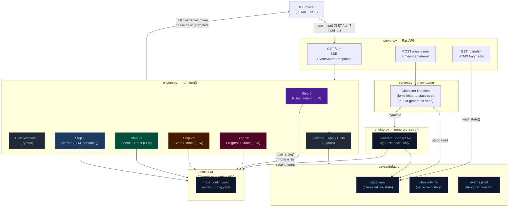

---

## Step 0 — Rules / Intent Classification

Classifies the player's action, determines whether a dice check is needed, and
identifies which state domains will be active — narrowing every downstream extractor.

```mermaid
flowchart LR
    classDef stageRules fill:#4c1d95,color:#ddd6fe,stroke:#7c3aed
    classDef llmNode    fill:#0f172a,color:#94a3b8,stroke:#334155
    classDef pyNode     fill:#1f2937,color:#9ca3af,stroke:#4b5563
    classDef outNode    fill:#3b0764,color:#e9d5ff,stroke:#7c3aed

    subgraph IN["Inputs"]
        I1["state.pc<br>(name, stats, conditions)"]
        I2["state.location"]
        I3["state.scene.present_npcs"]
        I4["recent_turns[-1:]<br>(from chronicle;<br>user prompt: narrative tail)"]
        I5["user_input"]
    end

    subgraph LLM0["LLM — rules_system.j2 + rules_user.j2"]
        L0["temp: 0.2 · max_retries: 1<br>output: IntentEnvelope JSON"]:::llmNode
    end

    subgraph PYRES["Python — rules.resolve_check()"]
        P0["reads pc.stats[skill]<br>reads pc.conditions → cond_mod<br>rolls 2d6 + stat_mod + cond_mod − diff_mod<br>maps total → Band"]:::pyNode
    end

    subgraph OUT["Outputs"]
        O1["IntentEnvelope<br>  intent: str<br>  intent_verb: str<br>  target: str<br>  stakes: str<br>  check.required: bool<br>  check.skill: SkillName<br>  check.difficulty: Difficulty"]:::outNode
        O2["RulesOutcome<br>  rolled: bool<br>  skill, difficulty, stat_value, stat_mod<br>  diff_mod, cond_mod<br>  dice: list[int]<br>  raw_total, final_total: int<br>  band: Band<br>  directive: str<br>  intent, intent_verb: str"]:::outNode
    end

    IN --> LLM0
    LLM0 -- "IntentEnvelope" --> PYRES
    PYRES --> OUT
```

> **Key forward dependency:** `rules_outcome.directive` shapes the narrator's creative
> latitude. `scope.active_domains` is now decided by the narrator (Step 1), not the
> rules call.

---

## Step 1 — Narrate (Streaming)

Generates the narrative prose the player reads. Tokens stream live to the browser via SSE.

```mermaid
flowchart LR
    classDef llmNode   fill:#0f172a,color:#94a3b8,stroke:#334155
    classDef xstream   fill:#4c1d95,color:#ddd6fe,stroke:#7c3aed
    classDef outNode   fill:#1e3a5f,color:#bfdbfe,stroke:#3b82f6

    subgraph IN["Inputs"]
        N1["state (full —<br>pc, location, scene,<br>inventory, quests, compendium)"]
        N2["chronicle_tail<br>(compressed history, ≤budget tokens)"]
        N3["recent_turns (last window_turns=6)"]
        N4["rules_outcome<br>(band, directive, dice summary)"]:::xstream
        N5["pack_style (tone / prose guide)"]
        N6["npc_name_pool (cultural name list)"]
        N7["recently_left NPCs"]
        N8["user_input"]
    end

    subgraph LLM1["LLM — narrate_system.j2 + narrate_user.j2"]
        NL["temp: 0.9 · streaming: yes<br>output: prose narrative (str)"]:::llmNode
    end

    subgraph OUT["Outputs"]
        NO1["narrative: str<br>(streamed as tokens → SSE<br>then joined + thinking-stripped)"]:::outNode
        NO2["narr_metrics<br>  first_token_ms<br>  total_ms<br>  tokens_in / tokens_out"]
    end

    IN --> LLM1
    LLM1 --> OUT
```

> **Key forward dependency:** `narrative` is the primary content input for all three
> extraction streams below.
>
> **Scope tail:** The narrator emits `<scope>{"active_domains":["..."]}</scope>` as the
> last line of output. The server-side stream filter strips it before SSE emission.
> Parsed `active_domains` flows into Steps 2a/2b/2c. Scene runs only when `scene` or
> `location_change` is in active_domains. State runs only when `inventory` or
> `pc_condition` is in active_domains. Progress always runs.

---

## Step 2a — Scene Extract

Extracts location changes, NPC presence, scene tags, and suggested actions from the narrative.

```mermaid
flowchart LR
    classDef llmNode fill:#0f172a,color:#94a3b8,stroke:#334155
    classDef xstream fill:#4c1d95,color:#ddd6fe,stroke:#7c3aed
    classDef outNode fill:#064e3b,color:#a7f3d0,stroke:#10b981

    subgraph IN["Inputs"]
        S1["narrative (from Step 1)"]:::xstream
        S2["state.pc (name, tagline, bio, stats)"]
        S3["state.location"]
        S4["state.scene.present_npcs"]
        S5["state.pc.conditions"]
        S6["known_characters<br>(full roster: id, name, tags, notes<br>up to 10 LRU from compendium)"]
        S7["rules_outcome"]:::xstream
        S8["active_domains<br>(from Step 1 tail)"]:::xstream
        S9["scene_pressure (active threats)"]
        S10["deescalate flag<br>(success on active pressure)"]:::xstream
        S11["quest_ages<br>(stalled-quest signal)"]
        S12["recent_turns[-1:]<br>(T-1 prior narration)"]
    end

    subgraph LLM2A["LLM — extract_scene_system.j2 + extract_scene_user.j2"]
        SL["temp: 0.4 · max_retries: 1<br>output: SceneExtractResult JSON"]:::llmNode
    end

    subgraph OUT["Outputs — SceneExtractResult"]
        O1["scene_tags: list[str]"]:::outNode
        O2["scene_tagline: str (3–6 words for UI header)"]:::outNode
        O3["location_change: LocationRef | None<br>  id, name, description"]:::outNode
        O4["location_description: str | None"]:::outNode
        O5["npc_add / npc_remove / npc_update<br>  delta-form NPC presence changes"]:::outNode
        O6["compendium_npc_update<br>  durable identity changes"]:::outNode
        O7["scene_pressure_add / remove / update<br>  active-threat lifecycle"]:::outNode
        O8["gm_beat: GMBeat | None<br>  forward-facing storytelling beat"]:::outNode
    end

    IN --> LLM2A
    LLM2A --> OUT
```

> **Skippable:** Scene stream is skipped when neither `scene` nor `location_change` is
> in `active_domains`.

> **Key forward dependency:** `location_change` and `present_npcs` are passed into
> Steps 2b and 2c.

---

## Step 2b — State Extract

Extracts inventory changes and player condition mutations from the narrative.

```mermaid
flowchart LR
    classDef llmNode fill:#0f172a,color:#94a3b8,stroke:#334155
    classDef xstream fill:#4c1d95,color:#ddd6fe,stroke:#7c3aed
    classDef outNode fill:#451a03,color:#fde68a,stroke:#f59e0b

    subgraph IN["Inputs"]
        S1["narrative (from Step 1)"]:::xstream
        S2["state.pc (name, bio, stats, conditions)"]
        S3["state.location"]
        S4["state.inventory"]
        S5["rules_outcome"]:::xstream
        S6["active_domains (from Step 1 tail)"]:::xstream
        S7["engine_expired_conditions<br>(TTL-expired, engine pre-removed)"]
        S8["scene_result.location_change<br>(from Step 2a)"]:::xstream
        S9["scene_result.present_npcs<br>(from Step 2a)"]:::xstream
    end

    subgraph LLM2B["LLM — extract_state_system.j2 + extract_state_user.j2"]
        SL["temp: 0.4 · max_retries: 1<br>output: StateExtractResult JSON"]:::llmNode
    end

    subgraph OUT["Outputs — StateExtractResult"]
        O1["inventory_add: list[InventoryItem]<br>  id, name, notes, amount"]:::outNode
        O2["inventory_remove: list[InventoryRemove]<br>  id, amount (None = full stack)"]:::outNode
        O3["inventory_update: list[InventoryUpdate]<br>  id, name?, notes?"]:::outNode
        O4["pc_condition_add: list[ConditionAdd]<br>  id, label, description"]:::outNode
        O5["pc_condition_remove: list[ConditionRemove]<br>  id"]:::outNode
    end

    IN --> LLM2B
    LLM2B --> OUT
```

> **Skippable:** State stream is skipped when neither `inventory` nor `pc_condition` is
> in `active_domains`.
>
> **Key forward dependency:** Step 2c receives a **minimal cross-stream surface** from
> Step 2b: `items_gained` (item **names** from `inventory_add`) and `items_lost` (item
> **ids** from `inventory_remove`) — see `_extract_progress_messages` in `engine.py`.
> This is narrower than the full `StateExtractResult` objects.

---

## Step 2c — Progress Extract

Extracts quest updates, recent events, and durable NPC compendium changes.

```mermaid
flowchart LR
    classDef llmNode fill:#0f172a,color:#94a3b8,stroke:#334155
    classDef xstream fill:#4c1d95,color:#ddd6fe,stroke:#7c3aed
    classDef outNode fill:#500724,color:#fbcfe8,stroke:#ec4899

    subgraph IN["Inputs"]
        S1["narrative (from Step 1)"]:::xstream
        S2["state.pc (name, bio, stats)"]
        S3["state.scene.recent_events"]
        S4["state.scene.world_state"]
        S5["active_quests (status=active only)"]
        S6["rules_outcome"]:::xstream
        S7["intent (from Step 0)"]:::xstream
        S8["active_domains (from Step 1 tail)"]:::xstream
        S9["recent_turns[-2:]<br>(T-1 + T-2 prior narration<br>for outcome_summary context)"]
        S10["items_gained: list[str] (names)<br>items_lost: list[str] (ids)<br>(from Step 2b — minimal cross-stream)"]:::xstream
    end

    subgraph LLM2C["LLM — extract_progress_system.j2 + extract_progress_user.j2"]
        SL["temp: 0.4 · max_retries: 1<br>output: ProgressExtractResult JSON"]:::llmNode
    end

    subgraph OUT["Outputs — ProgressExtractResult"]
        O1["quest_updates: list[QuestUpdate]<br>  id, title, status,<br>  objectives[]: index, description,<br>  done, failed"]:::outNode
        O2["recent_events_add: list[RecentEvent]<br>  id, text, turn"]:::outNode
        O3["recent_events_update: list[RecentEventUpdate]<br>  id, text"]:::outNode
        O4["recent_events_remove: list[str]"]:::outNode
        O5["actions: list[str]<br>  exactly 4 suggested player choices"]:::outNode
        O6["outcome_summary: str<br>  1–2 sentence narrative recap"]:::outNode
    end

    IN --> LLM2C
    LLM2C --> OUT
```

> **Always runs:** Progress is the post-narration storytelling brain. It always executes
> every turn (never skipped) and feeds next turn's rules call via `recent_events_add`
> (durable narrative facts) and `quest_updates` (advancing or closing arcs). Scene-side
> forward signals (`scene_pressure_*`, `pending_gm_beat`) are sourced from the scene
> stream, not progress.

---

## Delta Merge → Validate → Apply

The three extraction results merge into a single `StateDelta`, then validate and apply.

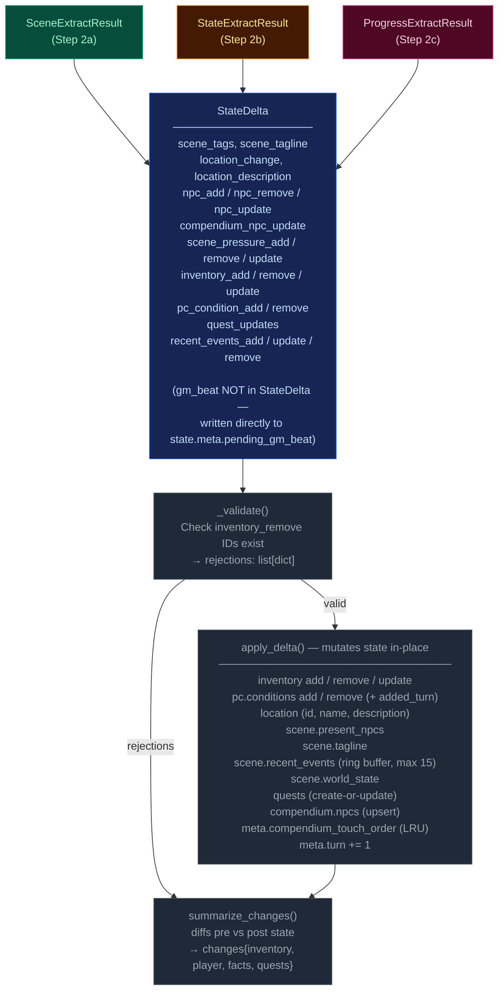

---

## Persist

Atomic writes to disk. No LLM calls.

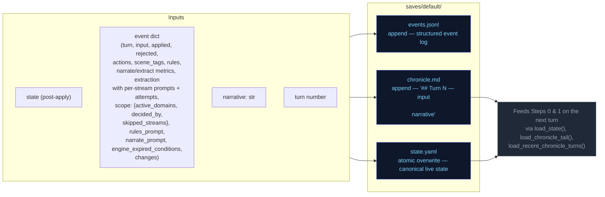

---

## Character Creation Pipeline

Triggered by `POST /new-game`. Behavior differs by pack mode.

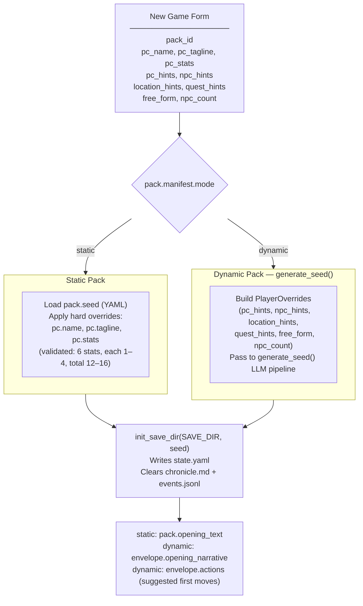

---

## Generate Seed Pipeline (Dynamic Packs Only)

Called by `POST /new-game` and `POST /new-game/reroll`. Generates a complete
starting game state (PC, NPCs, location, quests, opening narrative) from the pack
manifest and optional player overrides.

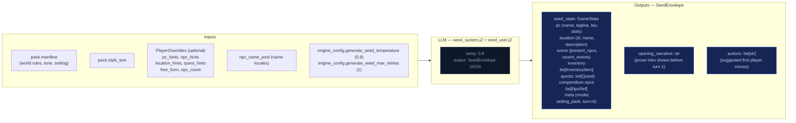

---

## Cross-Pipeline Data Flow

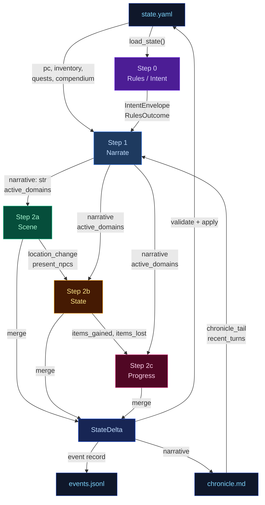

---

## Turn Viewer (`/turn_viewer`) — status colors

The standalone turn viewer uses the same semantic status colors as the CSS custom
properties in `static/app.src.css` (`--status-*`). The stage colors used in the
diagrams above (`stageRules` violet → `stageNarrate` blue → `stageScene` green →
`stageState` amber → `stageProgress` pink) map directly to the `--stage-*` tokens.
Cross-stream inputs into a step are shown in `xstream` (purple outline) and LLM/Python
boxes use neutral dark fills. This table is the canonical turn-viewer status legend.

| Token | Meaning |
|-------|---------|
| `--status-ok` | Stage ran and completed (no extraction error). |
| `--status-skipped` | Stream elided by narrator scope (active_domains did not include required domains). |
| `--status-retried` | LLM output required a parse retry (`attempts` &gt; 1 in event). |
| `--status-rejected` | Post-extract validation rejected part of the delta (e.g. bad `inventory_remove`). |
| `--status-error` | LLM call or parse ultimately failed for that stream. |
| `--status-neutral` | Non-fatal / informational (e.g. rules path with no dice roll). |

Stage accent stripes use `--stage-rules`, `--stage-narrate`, `--stage-scene`,
`--stage-state`, `--stage-progress` for quick scanning; **status** always wins for
the prominent left border.