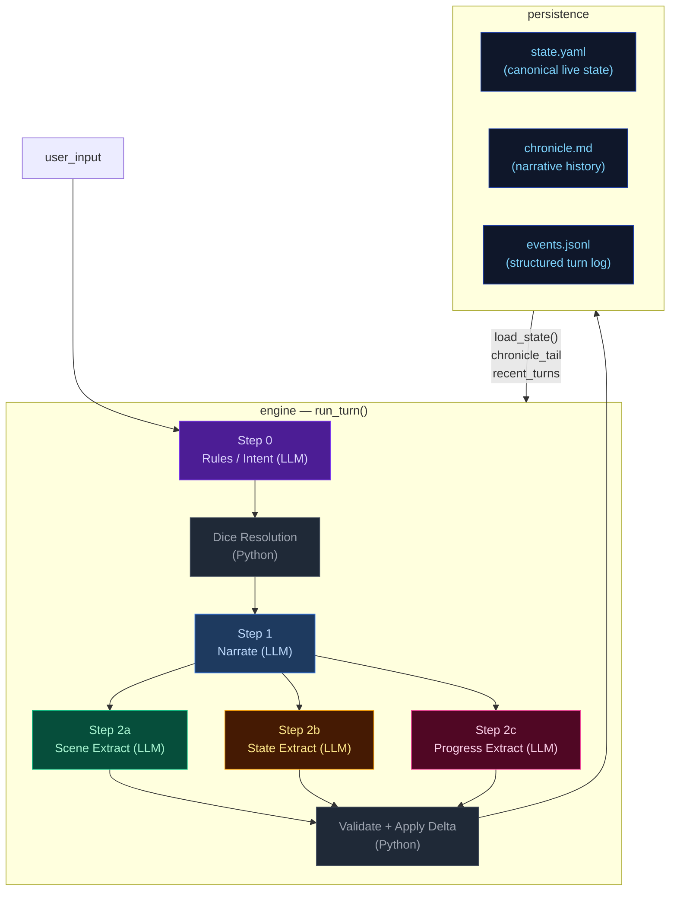
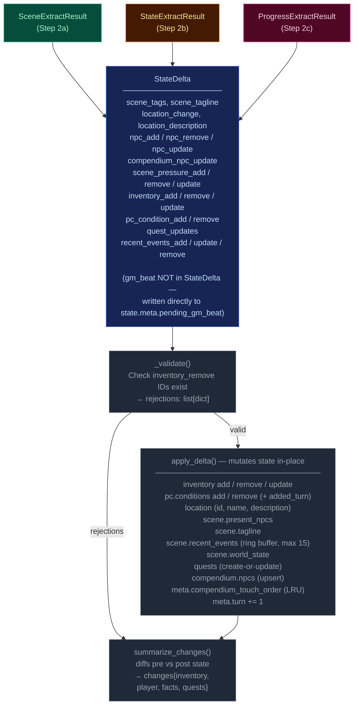
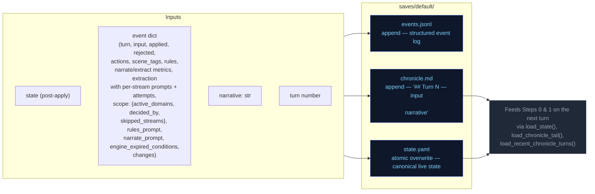
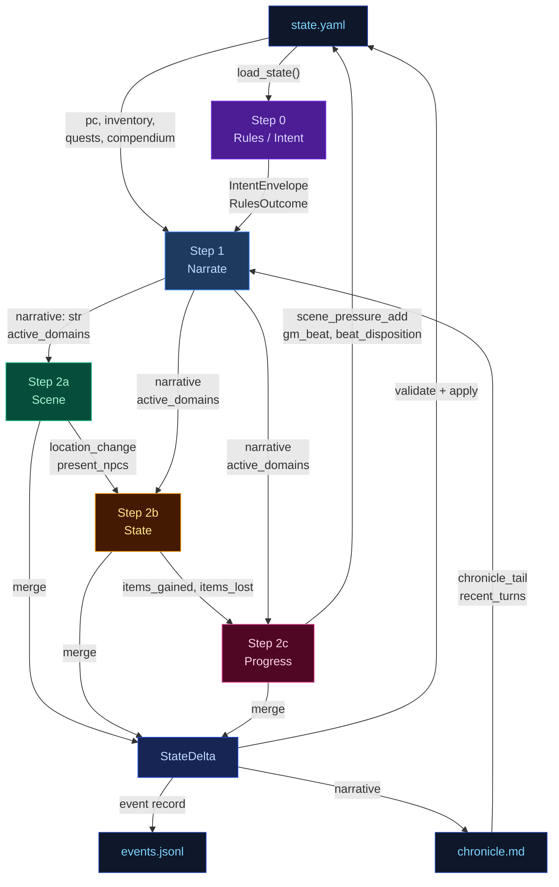
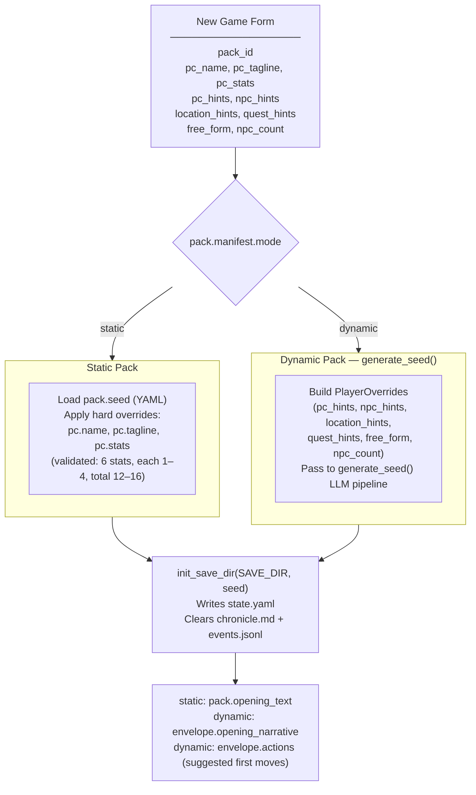
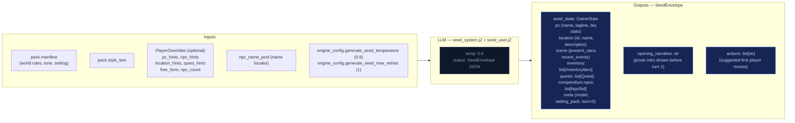

# ARCHITECTURE

CCYA is a local-LLM-backed text RPG engine. Every player turn drives a five-step
pipeline (Rules → Narrate → Scene Extract → State Extract → Progress Extract) with
a pure-Python validation+persist tail. Two additional LLM pipelines handle new-game
creation: **Character Creation** (static packs) and **Generate Seed** (dynamic packs).

Scope (which extraction streams to run) is decided **post-narration**: the narrator
emits a `<scope>` tail that the server strips from SSE, parses into `active_domains`,
and feeds into the extraction pipeline.

<!-- EVAL_CONTEXT_START -->

## 5-Pipeline Reference (engine design at a glance)

Every player turn drives this 5-step pipeline, executed strictly in order. Step 0 runs once before narration; Step 1 emits the prose the player reads; Steps 2a/2b/2c extract structured changes from that prose. The Python tail validates and applies the merged delta.

| Pipeline | When it runs | Key inputs | Key outputs | Mechanics it owns | Hand-off to next turn |
|---|---|---|---|---|---|
| **Step 0 — Rules / Intent** | Every turn (always) | `state.pc`, `state.location`, `state.scene.present_npcs`, `scene_pressure`, `recent_turns[-1:]`, `user_input` | `IntentEnvelope` (intent, verb, target, stakes, check.required, check.skill, check.difficulty); `RulesOutcome` (rolled, dice, mods, band, directive) | Intent classification, dice roll resolution (2d6 + stat + cond − diff → band), difficulty selection, anti-declare-outcome enforcement | `rules_outcome.directive` shapes narrator latitude |
| **Step 1 — Narrate** | Every turn (always, streamed) | Full `state` (pc, location, scene, inventory, quests, compendium), `chronicle_tail`, `recent_turns`, `RulesOutcome`, `pack_style`, `narrator_rules`, `pending_gm_beat`, `momentum`, `ages`, `recently_left`, name pools, world factions/locations | `narrative` (prose); a trailing `<scope>{"active_domains":[...]}</scope>` line stripped server-side | Prose generation, dice-band binding, GM-beat consumption (clears `state.meta.pending_gm_beat`), de-escalation directives, age-based stalling fixes, scope decision (active_domains) | `narrative` feeds all 3 extractors; `active_domains` gates which extractors run |
| **Step 2a — Scene Extract** | When `scene` or `location_change` in active_domains | `narrative`, `state.pc/location`, `state.scene.present_npcs`, `state.pc.conditions`, `known_characters` (LRU compendium), `RulesOutcome`, `recent_turns[-1:]` | `SceneExtractResult`: `scene_tags`, `scene_tagline`, `location_change`, `location_description`, `npc_add/remove/update`, `compendium_npc_update` | NPC presence, location changes, scene tags, scene classification (tags/tagline), durable NPC compendium identity | `location_change` and `present_npcs` passed to Steps 2b and 2c |
| **Step 2b — State Extract** | When `inventory` or `pc_condition` in active_domains; auto-activated by transfer-verb scan | `narrative`, `state.pc`, `state.location`, `state.inventory`, `rules_outcome`, `engine_expired_conditions`, `scene_result.location_change`, `scene_result.present_npcs`, `stakes`, `band` | `StateExtractResult`: `inventory_add/remove/update`, `pc_condition_add/remove` | Inventory delta accuracy, condition lifecycle (with `added_turn`), engine-side TTL pre-removal, ID normalization | `items_gained` (names) + `items_lost` (ids) feed Step 2c |
| **Step 2c — Progress Extract** | Every turn (always) | `narrative`, `state.pc`, `state.scene.recent_events`, `state.scene.world_state`, `active_quests`, `scene_pressure`, `RulesOutcome`, `intent`, `recent_turns[-2:]`, `items_gained`/`items_lost` from 2b, `stakes`, `band`, `deescalate`, `quest_ages`, `pending_beat` | `ProgressExtractResult`: `quest_updates`, `recent_events_add/update/remove`, `actions` (4 suggested choices), `outcome_summary`, `gm_beat`, `beat_disposition`, `scene_pressure_add`, `scene_pressure_remove`, `scene_pressure_update` | Quest objectives, recent_events ring buffer, action suggestions, narrative recap, GM beat generation + disposition, scene pressure lifecycle (all three operations) | `recent_events_add` becomes durable history; `quest_updates` advance arcs; `scene_pressure_add` feeds next turn's rules call; `gm_beat` stored in `state.meta.pending_gm_beat` |

After Step 2c, results merge into a `StateDelta`, the validator checks (e.g. `inventory_remove` IDs exist), `apply_delta()` mutates state in-place, and the turn is persisted. The next turn's Step 0 reads the new `state.yaml` plus `events.jsonl`.

---

## High-Level Overview

---

## Step 0 — Rules / Intent Classification

Classifies the player's action, determines whether a dice check is needed, and
identifies which state domains will be active — narrowing every downstream extractor.

```mermaid
flowchart LR
    classDef stageRules fill:#4c1d95,color:#ddd6fe,stroke:#7c3aed
    classDef llmNode    fill:#0f172a,color:#94a3b8,stroke:#334155
    classDef pyNode     fill:#1f2937,color:#9ca3af,stroke:#4b5563
    classDef outNode    fill:#3b0764,color:#e9d5ff,stroke:#7c3aed

    subgraph IN["Inputs"]
        I1["state.pc<br>(name, stats, conditions)"]
        I2["state.location"]
        I3["state.scene.present_npcs"]
        I4["recent_turns[-1:]<br>(from chronicle;<br>user prompt: narrative tail)"]
        I5["user_input"]
    end

    subgraph LLM0["LLM — rules_system.j2 + rules_user.j2"]
        L0["temp: 0.2 · max_retries: 1<br>output: IntentEnvelope JSON"]:::llmNode
    end

    subgraph PYRES["Python — rules.resolve_check()"]
        P0["reads pc.stats[skill]<br>reads pc.conditions → cond_mod<br>rolls 2d6 + stat_mod + cond_mod − diff_mod<br>maps total → Band"]:::pyNode
    end

    subgraph OUT["Outputs"]
        O1["IntentEnvelope<br>  intent: str<br>  intent_verb: str<br>  target: str<br>  stakes: str<br>  check.required: bool<br>  check.skill: SkillName<br>  check.difficulty: Difficulty"]:::outNode
        O2["RulesOutcome<br>  rolled: bool<br>  skill, difficulty, stat_value, stat_mod<br>  diff_mod, cond_mod<br>  dice: list[int]<br>  raw_total, final_total: int<br>  band: Band<br>  directive: str<br>  intent, intent_verb: str"]:::outNode
    end

    IN --> LLM0
    LLM0 -- "IntentEnvelope" --> PYRES
    PYRES --> OUT
```

> **Key forward dependency:** `rules_outcome.directive` shapes the narrator's creative
> latitude. `scope.active_domains` is now decided by the narrator (Step 1), not the
> rules call.

---

## Step 1 — Narrate (Streaming)

Generates the narrative prose the player reads. Tokens are streamed to the client.

> **Key forward dependency:** `narrative` is the primary content input for all three
> extraction streams below.
>
> **Scope tail:** The narrator emits `<scope>{"active_domains":["..."]}</scope>` as the
> last line of output. The server strips it before sending to the client.
> Parsed `active_domains` flows into Steps 2a/2b/2c. Scene runs only when `scene` or
> `location_change` is in active_domains. State runs only when `inventory` or
> `pc_condition` is in active_domains. Progress always runs.

---

## Step 2a — Scene Extract

Extracts location changes, NPC presence, scene tags, and suggested actions from the narrative.

```mermaid
flowchart LR
    classDef llmNode fill:#0f172a,color:#94a3b8,stroke:#334155
    classDef xstream fill:#4c1d95,color:#ddd6fe,stroke:#7c3aed
    classDef outNode fill:#064e3b,color:#a7f3d0,stroke:#10b981

    subgraph IN["Inputs"]
        S1["narrative (from Step 1)"]:::xstream
        S2["state.pc (name, tagline, bio, stats)"]
        S3["state.location"]
        S4["state.scene.present_npcs"]
        S5["state.pc.conditions"]
        S6["known_characters<br>(full roster: id, name, tags, notes<br>up to 10 LRU from compendium)"]
        S7["rules_outcome"]:::xstream
        S8["active_domains<br>(from Step 1 tail)"]:::xstream
        S9["recent_turns[-1:]<br>(T-1 prior narration)"]
    end

    subgraph LLM2A["LLM — extract_scene_system.j2 + extract_scene_user.j2"]
        SL["temp: 0.4 · max_retries: 1<br>output: SceneExtractResult JSON"]:::llmNode
    end

    subgraph OUT["Outputs — SceneExtractResult"]
        O1["scene_tags: list[str]"]:::outNode
        O2["scene_tagline: str (3–6 words for UI header)"]:::outNode
        O3["location_change: LocationRef | None<br>  id, name, description"]:::outNode
        O4["location_description: str | None"]:::outNode
        O5["npc_add / npc_remove / npc_update<br>  delta-form NPC presence changes"]:::outNode
        O6["compendium_npc_update<br>  durable identity changes"]:::outNode
    end

    IN --> LLM2A
    LLM2A --> OUT
```

> **Skippable:** Scene stream is skipped when neither `scene` nor `location_change` is
> in `active_domains`.

> **Key forward dependency:** `location_change` and `present_npcs` are passed into
> Steps 2b and 2c. No forward-facing mechanics (scene_pressure, gm_beat) are emitted by this stream.

---

## Step 2b — State Extract

Extracts inventory changes and player condition mutations from the narrative.

> **Skippable:** State stream is skipped when neither `inventory` nor `pc_condition` is
> in `active_domains`.
>
> **Key forward dependency:** Step 2c receives a **minimal cross-stream surface** from
> Step 2b: `items_gained` (item **names** from `inventory_add`) and `items_lost` (item
> **ids** from `inventory_remove`) — see `_extract_progress_messages` in `engine.py`.
> This is narrower than the full `StateExtractResult` objects.

---

## Step 2c — Progress Extract

Extracts quest updates, recent events, and durable NPC compendium changes.

> **Always runs:** Progress is the post-narration storytelling brain. It always executes
> every turn (never skipped) and feeds next turn's rules call via `recent_events_add`
> (durable narrative facts), `quest_updates` (advancing or closing arcs), `scene_pressure_add`
> (new threats), and `gm_beat` (forward-facing beats stored in `state.meta.pending_gm_beat`).

---

## Delta Merge → Validate → Apply

The three extraction results merge into a single `StateDelta`, then validate and apply.

---

## Persist

Atomic writes to disk. No LLM calls.

---

## Cross-Pipeline Data Flow

<!-- EVAL_CONTEXT_END -->
---

## Out-of-band Pipelines (not part of the per-turn loop — for human reference)

These run only at new-game time or are non-engine concerns. They are excluded from the eval-context region above.

---

## Character Creation Pipeline

Triggered by `POST /new-game`. Behavior differs by pack mode.

---

## Generate Seed Pipeline (Dynamic Packs Only)

Called by `POST /new-game` and `POST /new-game/reroll`. Generates a complete
starting game state (PC, NPCs, location, quests, opening narrative) from the pack
manifest and optional player overrides.

---

## Turn Viewer (`/turn_viewer`) — status colors

The standalone turn viewer uses the same semantic status colors as the CSS custom
properties in `static/app.src.css` (`--status-*`). The stage colors used in the
diagrams above (`stageRules` violet → `stageNarrate` blue → `stageScene` green →
`stageState` amber → `stageProgress` pink) map directly to the `--stage-*` tokens.
Cross-stream inputs into a step are shown in `xstream` (purple outline) and LLM/Python
boxes use neutral dark fills. This table is the canonical turn-viewer status legend.

| Token | Meaning |
|-------|---------|
| `--status-ok` | Stage ran and completed (no extraction error). |
| `--status-skipped` | Stream elided by narrator scope (active_domains did not include required domains). |
| `--status-retried` | LLM output required a parse retry (`attempts` &gt; 1 in event). |
| `--status-rejected` | Post-extract validation rejected part of the delta (e.g. bad `inventory_remove`). |
| `--status-error` | LLM call or parse ultimately failed for that stream. |
| `--status-neutral` | Non-fatal / informational (e.g. rules path with no dice roll). |

Stage accent stripes use `--stage-rules`, `--stage-narrate`, `--stage-scene`,
`--stage-state`, `--stage-progress` for quick scanning; **status** always wins for
the prominent left border.