# ARCHITECTURE

CCYA is a local-LLM-backed text RPG engine. Every player turn drives a five-step
pipeline (Rules → Narrate → Scene Extract → State Extract → Progress Extract) with
a pure-Python validation+persist tail. Two additional LLM pipelines handle new-game
creation: **Character Creation** (static packs) and **Generate Seed** (dynamic packs).

<!-- EVAL_CONTEXT_START -->

## 5-Pipeline Reference (engine design at a glance)

Every player turn drives this 5-step pipeline, executed strictly in order. Step 0 runs once before narration; Step 1 emits the prose the player reads; Steps 2a/2b/2c extract structured changes from that prose. The Python tail validates and applies the merged delta.

| Pipeline | When it runs | Key inputs | Key outputs | Mechanics it owns | Hand-off to next turn |
|---|---|---|---|---|---|
| **Step 0 — Rules / Intent** | Every turn (always) | `state.pc`, `state.location`, `recent_turns[-1:]`, `user_input` | `IntentEnvelope` (intent, verb, target, check.required, check.skill, check.difficulty); `RulesOutcome` (rolled, dice, mods, band, directive) | Intent classification, dice roll resolution (2d6 + stat + cond − diff → band), difficulty selection, anti-declare-outcome enforcement. `stakes` field removed — failure cost encoded in prose via band. | `rules_outcome.directive` feeds into `_compute_pacing_context()` |
| **Step 1 — Narrate** | Every turn (always, streamed) | Full `state` (pc, location, arc.threads[], inventory, quests, compendium), `chronicle_tail`, `recent_turns`, `pacing_context` (`directive`, `beat_hint`), `pending_gm_beat`, `pack_style`, `narrator_rules`, `npc_roster` (tiered: PRESENT/JUST_LEFT/NEARBY/KNOWN), `world_factions`, `world_locations`, `npc_name_pool`, `user_input` | `narrative` (prose) | Prose generation, dice-band binding, GM-beat consumption (clears `state.meta.pending_gm_beat`), tone shaped by `PacingContext.directive`. Individual pacing signals (`deescalate`, `narrative_velocity`) collapsed into single struct. | `narrative` feeds all 3 extractors |
| **Step 2a — Scene Extract** | Every turn (always) | `narrative`, `state.pc/location`, `npc_roster` (tiered: PRESENT/JUST_LEFT/NEARBY/KNOWN), `state.pc.conditions`, `known_characters` (LRU compendium), `RulesOutcome`, `recent_turns[-1:]` | `SceneExtractResult`: `scene_tags`, `scene_tagline`, `location_change`, `location_description`, `npc_add/remove/update`, `compendium_npc_update` | NPC presence, location changes, scene tags, scene classification (tags/tagline), durable NPC compendium identity. Unchanged from previous architecture. | `location_change` and `npc_roster` passed to Steps 2b and 2c |
| **Step 2b — State Extract** | Every turn (always) | `narrative`, `state.pc`, `state.location`, `state.inventory`, `rules_outcome`, `engine_expired_conditions`, `scene_result.location_change`, `scene_result.npc_roster`, `band_examples` (few-shot extraction examples keyed to dice band) | `StateExtractResult`: `inventory_add/remove/update`, `pc_condition_add/remove` | Inventory delta accuracy, condition lifecycle (with `added_turn`), engine-side TTL pre-removal, ID normalization. `stakes` removed from inputs. | (none — cross-stream items_gained/lost removed; extraction_ctx covers this) |
| **Step 2c — Progress Extract** | Every turn (always) | `narrative`, `_ExtractionContext` (present_npcs, location, inventory, conditions), `pacing_context` (`directive`, `gate`, `beat_hint`, `beat_locked`), `arc.threads[]`, `recent_turns[-2:]`, `band`, `pending_beat`, `npc_roster` (tiered: PRESENT/JUST_LEFT/NEARBY/KNOWN) | `ProgressExtractResult`: `thread_advance`, `thread_resolve`, `thread_add` (gated), `gm_beat`, `recent_events_add/update/remove`, `actions` (4 choices), `outcome_summary` | Unified thread lifecycle (`thread_advance` / `thread_resolve` / gated `thread_add`) replaces separate scene_pressure and arc thread operations. Single authoritative `PacingContext` replaces six competing signals. `beat_disposition` removed — inferred from gm_beat presence + turn expiry. | `recent_events_add` becomes durable history; `thread_*` signals processed by `_apply_thread_signals()` with age-based demotion; `gm_beat` stored in `state.meta.pending_gm_beat` |

After Step 2c, results merge into a `StateDelta`, the validator checks (e.g. `inventory_remove` IDs exist), `apply_delta()` mutates state in-place, and the turn is persisted. The next turn's Step 0 reads the new `state.yaml` plus `events.jsonl`.

---

## High-Level Overview

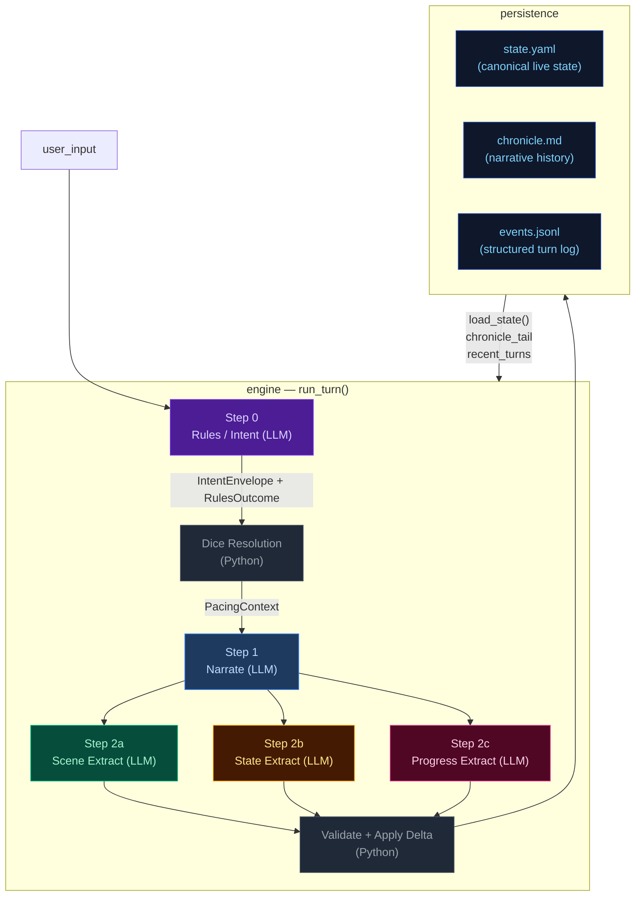

---

## Step 0 — Rules / Intent Classification

Classifies the player's action, determines whether a dice check is needed, and
identifies which state domains will be active — narrowing every downstream extractor.

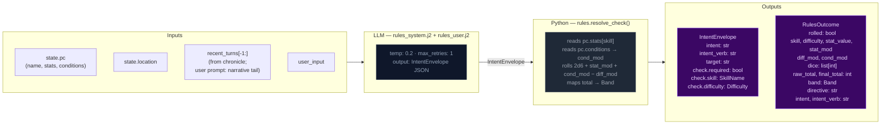

> **Key forward dependency:** `rules_outcome` feeds into `_compute_pacing_context()` which produces the single authoritative `PacingContext` struct passed to both Narrator and Progress.

---

## Step 1 — Narrate (Streaming)

Generates the narrative prose the player reads. Tokens are streamed to the client.

```mermaid
flowchart LR
    classDef llmNode   fill:#0f172a,color:#94a3b8,stroke:#334155
    classDef xstream   fill:#4c1d95,color:#ddd6fe,stroke:#7c3aed
    classDef outNode   fill:#1e3a5f,color:#bfdbfe,stroke:#3b82f6

    subgraph IN["Inputs"]
        N1["state (full —<br>pc, location, scene,<br>inventory, quests, compendium)"]
        N2["chronicle_tail<br>(compressed history, ≤budget tokens)"]
        N3["recent_turns (last window_turns=6)"]
        N4["rules_outcome<br>(band, directive, dice summary)"]:::xstream
        N5["pack_style (tone / prose guide)"]
        N6["npc_name_pool (cultural name list)"]
        N7["recently_left NPCs"]
        N8["known_npcs<br>(last-seen info)"]
        N9["present_npcs<br>(attitudes)"]
        N10["world_factions<br>(immutable trace)"]
        N11["world_locations<br>(nearby, immutable)"]
        N12["pending_gm_beat"]
        N13["pacing_context<br>(directive · beat_hint)<br>from _compute_pacing_context()"]:::xstream
        N14["user_input"]
    end

    subgraph LLM1["LLM — narrate_system.j2 + narrate_user.j2"]
        NL["temp: 0.9 · streaming: yes<br>output: prose narrative (str)"]:::llmNode
    end

    subgraph OUT["Outputs"]
        NO1["narrative: str<br>(streamed as tokens → client<br>then joined + thinking-stripped)"]:::outNode
        NO2["narr_metrics<br>  first_token_ms<br>  total_ms<br>  tokens_in / tokens_out"]
    end

    IN --> LLM1
    LLM1 --> OUT
```

> **Key forward dependency:** `narrative` is the primary content input for all three
> extraction streams below.

---

## Step 2a — Scene Extract

Extracts location changes, NPC presence, scene tags, and suggested actions from the narrative.

```mermaid
flowchart LR
    classDef llmNode fill:#0f172a,color:#94a3b8,stroke:#334155
    classDef xstream fill:#4c1d95,color:#ddd6fe,stroke:#7c3aed
    classDef outNode fill:#064e3b,color:#a7f3d0,stroke:#10b981

    subgraph IN["Inputs"]
        S1["narrative (from Step 1)"]:::xstream
        S2["state.pc (name, tagline, bio, stats)"]
        S3["state.location"]
        S4["state.scene.present_npcs"]
        S5["state.pc.conditions"]
        S6["known_characters<br>(full roster: id, name, tags, notes<br>up to 10 LRU from compendium)"]
        S7["rules_outcome"]:::xstream
        S8["recent_turns[-1:]<br>(T-1 prior narration)"]
    end

    subgraph LLM2A["LLM — extract_scene_system.j2 + extract_scene_user.j2"]
        SL["temp: 0.4 · max_retries: 1<br>output: SceneExtractResult JSON"]:::llmNode
    end

    subgraph OUT["Outputs — SceneExtractResult"]
        O1["scene_tags: list[str]"]:::outNode
        O2["scene_tagline: str (3–6 words for UI header)"]:::outNode
        O3["location_change: LocationRef | None<br>  id, name, description"]:::outNode
        O4["location_description: str | None"]:::outNode
        O5["npc_add / npc_remove / npc_update<br>  delta-form NPC presence changes"]:::outNode
        O6["compendium_npc_update<br>  durable identity changes"]:::outNode
    end

    IN --> LLM2A
    LLM2A --> OUT
```

> **Key forward dependency:** `location_change` and `present_npcs` flow into
> `extraction_ctx` (built by `_build_extraction_context`). Step 2c also receives
> `npc_roster` (tiered: PRESENT/JUST_LEFT/NEARBY/KNOWN) built from extraction_ctx.
> No forward-facing mechanics (`thread_add`, `gm_beat`) are emitted by this stream — they go through the unified thread pipeline via Progress Extract.

---

## Step 2b — State Extract

Extracts inventory changes and player condition mutations from the narrative.

```mermaid
flowchart LR
    classDef llmNode fill:#0f172a,color:#94a3b8,stroke:#334155
    classDef xstream fill:#4c1d95,color:#ddd6fe,stroke:#7c3aed
    classDef outNode fill:#451a03,color:#fde68a,stroke:#f59e0b

    subgraph IN["Inputs"]
        S1["narrative (from Step 1)"]:::xstream
        S2["state.pc (name, bio, stats, conditions)"]
        S3["state.location"]
        S4["state.inventory"]
        S5["rules_outcome"]:::xstream
        S6["intent: str<br>(from Step 0)"]
        S7["band_examples<br>(few-shot examples for current band)"]
    end

    subgraph LLM2B["LLM — extract_state_system.j2 + extract_state_user.j2"]
        SL["temp: 0.4 · max_retries: 1<br>output: StateExtractResult JSON"]:::llmNode
    end

    subgraph OUT["Outputs — StateExtractResult"]
        O1["inventory_add: list[InventoryItem]<br>  id, name, notes, amount"]:::outNode
        O2["inventory_remove: list[InventoryRemove]<br>  id, amount (None = full stack)"]:::outNode
        O3["inventory_update: list[InventoryUpdate]<br>  id, name?, notes?"]:::outNode
        O4["pc_condition_add: list[ConditionAdd]<br>  id, label, description"]:::outNode
        O5["pc_condition_remove: list[ConditionRemove]<br>  id"]:::outNode
    end

    IN --> LLM2B
    LLM2B --> OUT
```

> **Key forward dependency:** Step 2c receives `npc_roster` (tiered: PRESENT/JUST_LEFT/NEARBY/KNOWN)
> and `location_change` from Step 2a. Cross-stream items_gained/lost were removed —
> extraction_ctx now covers all this-turn derived data.

---

## Step 2c — Progress Extract

Extracts quest updates, recent events, and durable NPC compendium changes.


> **Always runs:** Progress is the post-narration storytelling brain. It always executes every turn (never skipped) and feeds next turn's rules call via `recent_events_add` (durable narrative facts), `thread_advance/resolve/add` (unified thread lifecycle with scope-aware age demotion), and `gm_beat` (forward-facing beats stored in `state.meta.pending_gm_beat`).
>
> ### GMBeat schema
>
> ```
> GMBeat
>   type: complication | revelation | opportunity | breathing_room | pressure | twist | setback | escalation | callback
>   surface_as: ambient | event | npc_behavior | environmental | player_discovery | item (default: ambient)
>   instruction: str (must be ≥40 chars, not start with filler prefixes)
>   beat_expires_turn: int | None (turn number at which the beat expires; set to turn_no + 2 when stored)
> ```
>
> ### Beat lifecycle
>
> The beat flows through three phases per turn:
>
> **Phase 1 — Pre-narration expiry check.** At the start of each turn, the engine reads
> `state.meta.pending_gm_beat` from the previous turn. If `beat_expires_turn` is set and the
> current turn number exceeds it, the beat is nullified. Otherwise it proceeds to narration.
>
> **Phase 2 — Narration consumption.** The beat is passed to the narrator via
> `_narrate_messages(pending_gm_beat=...)`. The narrator integrates the beat's instruction into
> prose. After narration completes, the beat is temporarily cleared from state. The beat is then
> restored to state so the progress extractor can see it in its prompt — this is critical because
> the progress extractor needs to know what beat was narrated to make an informed disposition
> decision.
>
> **Phase 3 — Extraction disposition (inferred).** The progress extractor receives the pending beat context and emits an optional new `gm_beat`. Unlike the previous architecture, there is no explicit `beat_disposition` field. Instead:
> - If Progress emits a new `gm_beat`, it replaces the old one (`state.meta.pending_gm_beat = gm_beat` with `beat_expires_turn = turn_no + 2`)
> - If Progress emits nothing and the beat's `expires_at` hasn't passed, the engine preserves the existing beat unchanged (carry)
> - The engine stores beats with `beat_expires_turn = turn_no + 2` as a hard TTL ceiling. Beats past their expiry are discarded automatically on load.

---

## PacingContext

All pacing signals are collapsed into one Python-computed struct (`PacingContext`) passed to both the Narrator and Progress Extractor. This replaces six independent fields (`narration_directive`, `deescalate`, `narrative_velocity`, `pending_beat`, `beat_disposition` output, `quest_threshold_directive`). The narrator receives only `directive` and `beat_hint`; Progress receives the full struct.

```
PacingContext:
  directive: str           # "" | "Breathe" | "Pressure" | "MoveOn" | "Escalate"
  beat_hint: str | None    # suggested gm_beat type, or None
  beat_locked: bool        # True: floor relief fired — Progress MUST emit breathing_room beat and gate is force-closed
  gate: str                # "block_add" | "block_escalate" | "allow" (controls thread_add)
  summary: str             # human-readable log string, never sent to LLM
```

`beat_locked: True` subsumes the old `_check_floor_relief()` side-channel — floor relief logic is computed inside `_compute_pacing_context()`. The `gate` field prevents Progress from adding new threads during de-escalation windows.

### Computation

`_compute_pacing_context()` in `engine/turn.py` consolidates all pacing computation (replacing the former scattered functions: `_compute_narration_directive`, `_compute_narrative_velocity`, `_check_floor_relief`). It takes inputs (`momentum`, `consecutive_floor_turns`, `arc.threads[] scope=scene urgency counts`, combat age, location age) and returns a single struct with directive derived from the same priority stack:

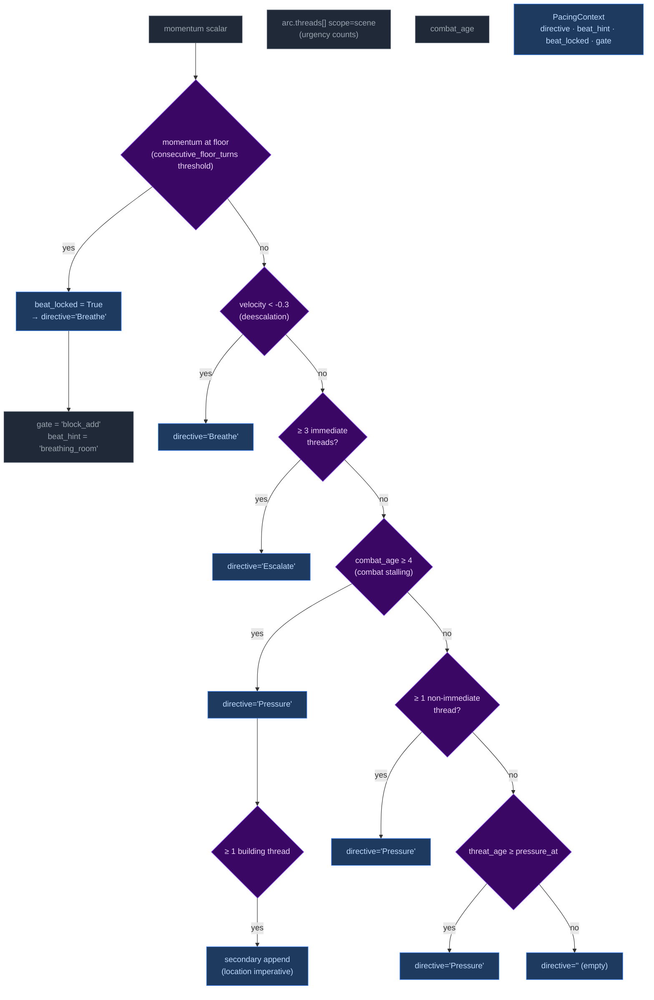

Priority order (highest to lowest): **Breathe > Escalate > Pressure > (empty)**. The `beat_locked` flag takes precedence — when floor relief fires, directive is forced to "Breathe" and gate is force-closed.

### Wiring: how PacingContext reaches the pipelines

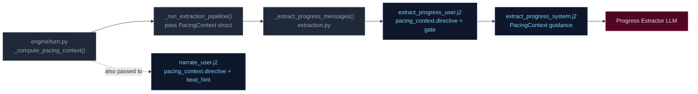

1. **Computed** once in `run_turn()` via `_compute_pacing_context()`.
2. **Passed through** `_run_extraction_pipeline()` → both `_narrate_messages()` and `_extract_progress_messages()`.
3. **Narrator template** (`narrate_user.j2`) renders only `directive` (tone/direction) and `beat_hint` when present. No Jinja2 directive computation remains — all directives computed by Python.
4. **Progress template** (`extract_progress_system.j2` + `user.j2`) receives the full struct; guidance maps each directive to appropriate thread/beat actions:

| Directive | Thread action | Beat hint | Gate |
|-----------|--------------|-----------|------|
| **"Breathe"** (floor relief) | Do NOT add new threads. Allow existing scene threads to persist without escalation. | `breathing_room` | `block_add` + force-closed |
| **"Escalate"** | Add thread if gate allows; advance active threads proactively. | `pressure` / `escalation` | Depends on momentum |
| **"Pressure"** | Advance relevant scene/arc threads. Add new thread only if gate permits. | `complication` / `pressure` | Varies by context |
| **"" (empty)** | No action required beyond normal aging of silent threads. | None | Allow |

---

## Delta Merge → Validate → Apply

The three extraction results merge into a single `StateDelta`, then validate and apply.

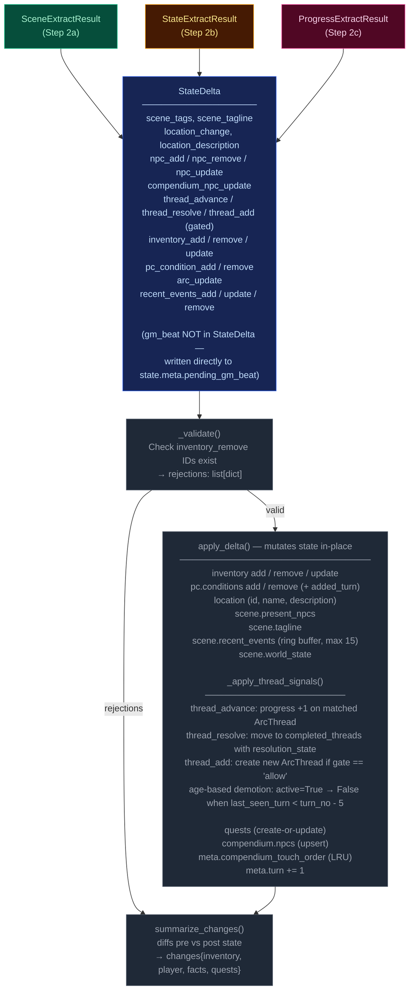

---

## Persist

Atomic writes to disk. No LLM calls.

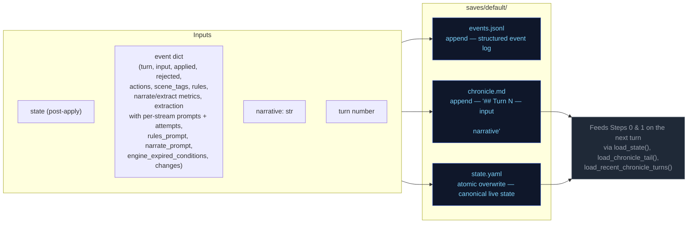

---

## Cross-Pipeline Data Flow

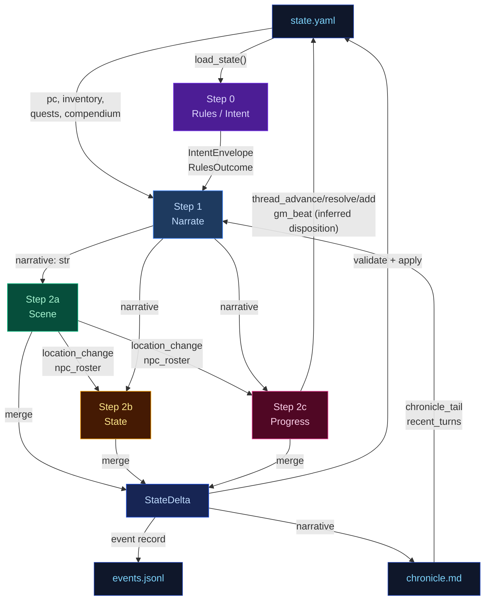

---

## Campaign Arc System

The campaign arc system tracks story threads, phase progression, and truth discovery across turns. It has two execution paths: **engine-driven** (thread lifecycle with 5-turn expiry for silent threads) and **narrator-driven** (phase shifts, truth discovery, goal updates).

### Arc Data Model

```
CampaignArc
  visible_goal: str          — What the PC is trying to achieve
  thematic_question: str     — The moral/thematic tension of the arc
  hidden_truths: list[str]   — Story secrets the narrator knows but must not reveal in prose
  discovered_truths: list[str] — Truths the player has uncovered (subset of hidden_truths)
  threads: list[ArcThread]   — Unified collection replacing active_threads + latent_threads split. Each thread has scope ("scene" or "arc") and active flag set by Python age rules, not LLM.
  completed_threads: list[ArcThread] — Resolved/failed/abandoned threads; resolution_state preserved for narrative context
  pc_drive: str              — Player's expressed motivation/direction

ArcThread (unified)
  id: str                    — Unique identifier
  summary: str               — What this thread is about
  scope: Literal["scene", "arc"]  # scene = short-lived tied to current location; arc = persistent story tension
  active: bool = True        # False = dormant/latent; set by Python age rules (not LLM)
  urgency: Literal["background", "normal", "urgent"] = "normal"
  tags: list[str]            — Keywords for engagement matching
  progress: int              — 0..3 (incremented by thread_advance)
  resolution_state: str | None # Set when thread_resolve processes resolved/failed/abandoned; preserved on completed threads
  last_seen_turn: int | None # For age-based active/dormant demotion in Python
  added_turn: int | None     # Python-managed lifecycle tracking
```

**Key change from previous architecture:** `scene_pressure[]` and the split between `active_threads` / `latent_threads` are merged into a single `arc.threads[]`. The engine manages thread lifecycle via `_apply_thread_signals()`: age-based demotion (`active: True → False`) replaces the old active/latent migration logic, with silent threads (not listed in `thread_advance` for 5+ turns) being demoted to dormant state.

### Engine-Driven Arc: Unified Thread Lifecycle

Thread lifecycle runs in `engine/turn.py` during the extraction phase, after `apply_delta()` but before narration arc_update merge. Two functions handle the unified thread operations:

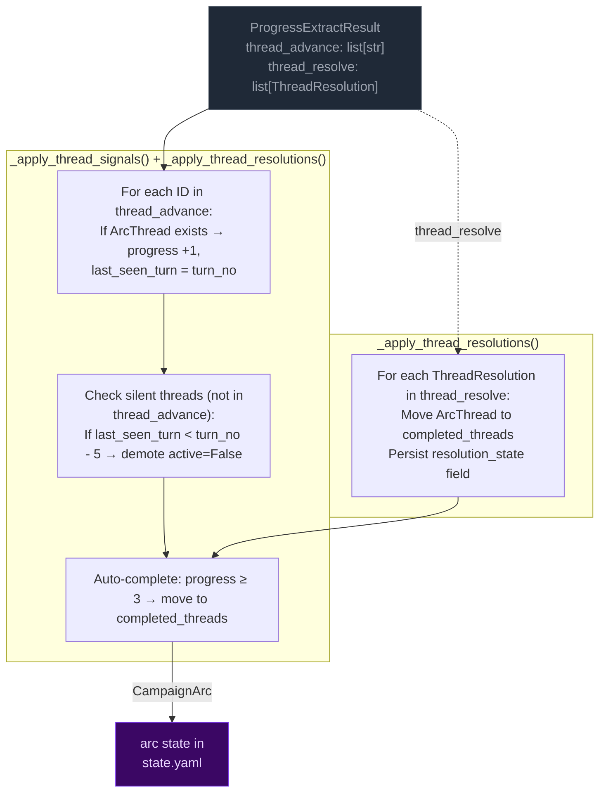

**Key rules:**
- **Unified collection:** `arc.threads[]` replaces the old active_threads/latent_threads split. The engine manages thread lifecycle via age-based demotion (`active: True → False`) instead of LLM-labeled urgency states.
- **Completion threshold:** progress reaches 3 → thread moved to `completed_threads`. Resolution state is preserved on completed threads for narrative context and eval rubrics.
- **5-turn expiry (age-based):** Threads not listed in `thread_advance` for 5+ turns get demoted (`active=False`). This replaces the old active→latent migration with a simpler boolean flag that Python manages directly from thread age, not LLM judgment.

### Narrator-Driven Arc: Phase & Truth Updates

The narrator can update arc metadata through a sentinel-delimited JSON block in its output. The engine parses and merges these updates after narration.

```mermaid
flowchart LR
    classDef llmNode fill:#0f172a,color:#94a3b8,stroke:#334155
    classDef sentinel fill:#3b0764,color:#e9d5ff,stroke:#7c3aed
    classDef mergeNode fill:#172554,color:#bfdbfe,stroke:#1d4ed8
    classDef arcNode fill:#3b0764,color:#e9d5ff,stroke:#7c3aed

    subgraph NARRATOR["Narrator prompt context"]
        NC1["visible_goal"]
        NC2["thematic_question"]
        NC3["phase"]
        NC4["arc.threads[] (summary, scope,<br>urgency, tags)"]
        NC5["pc_drive"]
        NC6["hidden_truths[] — internal only<br>NARRATOR MUST NOT reveal in prose"]
        NC7["discovered_truths[]"]
    end

    subgraph EMISSION["Narrator output"]
        PROSE["narration prose<br>(player sees this)"]:::llmNode
        SENTINEL["<<<ARC_UPDATE_START>>>
{discovered_truths, phase, visible_goal}
<<<ARC_UPDATE_END>>>"]:::sentinel
    end

    subgraph PARSING["_extract_narrator_arc_update()"]
        P1["Regex: <<<ARC_UPDATE_START>>>(.*?)<<<ARC_UPDATE_END>>>"]
        P2["json.loads() → arc_dict"]
        P3["Strip block from narrative"]
    end

    subgraph MERGE["_merge_arc_update()"]
        M1["visible_goal: overwrite if present"]
        M2["thematic_question: overwrite if present"]
        M3["phase: overwrite only if value differs<br>(avoids Pydantic default SETUP overwrite)"]
        M4["pc_drive: overwrite if present"]
        M5["hidden_truths: overwrite if present"]
        M6["discovered_truths: union with existing"]
    end

    NC1 & NC2 & NC3 & NC4 & NC5 & NC6 & NC7 --> PROSE
    PROSE --> SENTINEL
    SENTINEL --> P1 --> P2 --> P3
    P3 -- "clean narrative" --> CLIENT["client"]
    P2 -- "arc_dict" --> MERGE

    MERGE --> ARC[merge into state["arc"]]:::arcNode

    mergeNode
```

**Merge rules:**
- **Engine owns thread lifecycle** (active/dormant/completed via age-based demotion). Narrator arc_update omits thread fields — they are ignored by `_merge_arc_update()`.
- **Narrator owns visible_goal/thematic_question/discovered_truths/hidden_truths.** Engine does not modify these.
- **Discovered truths:** merged as set union (dedup).
- **Merge order:** engine thread signals run first (setting `delta.arc_update`), then narrator arc_update is parsed after narration and merged on top via a second `_merge_arc_update()` call in `run_turn()`.

### Arc Context in Narration

The arc state is passed to the narrator via `current_arc` in the system prompt. The narrator sees all arc metadata including `hidden_truths` but is explicitly instructed not to reveal them in prose.

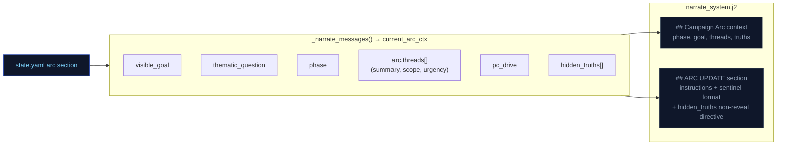

### Arc System Integration Points

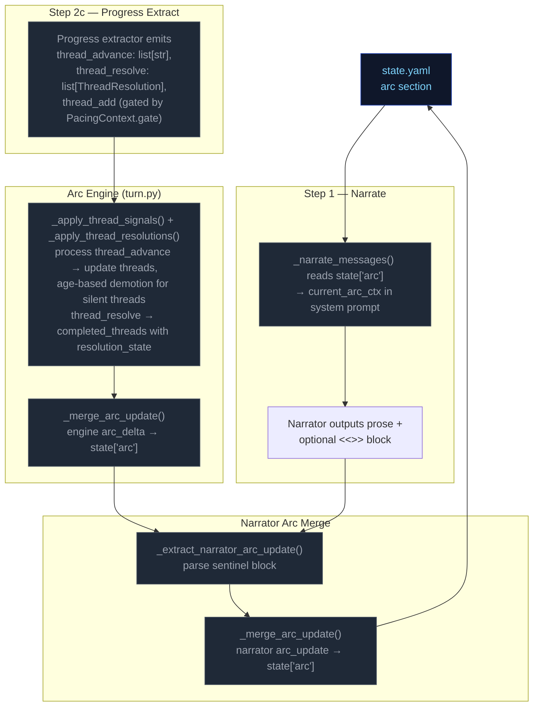

---

## Out-of-band Pipelines (not part of the per-turn loop — for human reference)

<!-- EVAL_CONTEXT_END -->

These run only at new-game time or are non-engine concerns. They are excluded from the eval-context region above.

---

## Character Creation Pipeline

Triggered by `POST /new-game`. Behavior differs by pack mode.

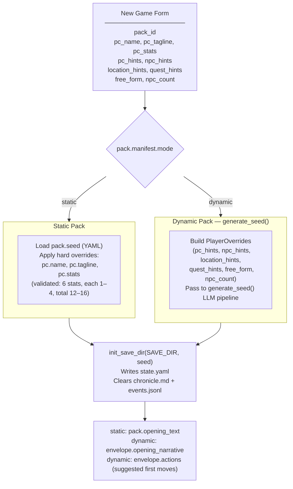

---

## Generate Seed Pipeline (Dynamic Packs Only)

Called by `POST /new-game` and `POST /new-game/reroll`. Generates a complete
starting game state (PC, NPCs, location, quests, opening narrative) from the pack
manifest and optional player overrides.

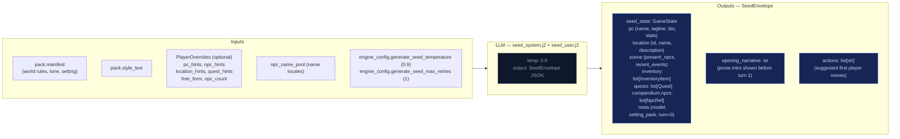

---

## Turn Viewer (`/turn_viewer`) — status colors

The standalone turn viewer uses the same semantic status colors as the CSS custom
properties in `static/app.src.css` (`--status-*`). The stage colors used in the
diagrams above (`stageRules` violet → `stageNarrate` blue → `stageScene` green →
`stageState` amber → `stageProgress` pink) map directly to the `--stage-*` tokens.
Cross-stream inputs into a step are shown in `xstream` (purple outline) and LLM/Python
boxes use neutral dark fills. This table is the canonical turn-viewer status legend.

| Token | Meaning |
|-------|---------|
| `--status-ok` | Stage ran and completed (no extraction error). |
| `--status-skipped` | Stream was skipped (no longer used — all streams always run). |
| `--status-retried` | LLM output required a parse retry (`attempts` &gt; 1 in event). |
| `--status-rejected` | Post-extract validation rejected part of the delta (e.g. bad `inventory_remove`). |
| `--status-error` | LLM call or parse ultimately failed for that stream. |
| `--status-neutral` | Non-fatal / informational (e.g. rules path with no dice roll). |

Stage accent stripes use `--stage-rules`, `--stage-narrate`, `--stage-scene`,
`--stage-state`, `--stage-progress` for quick scanning; **status** always wins for
the prominent left border.