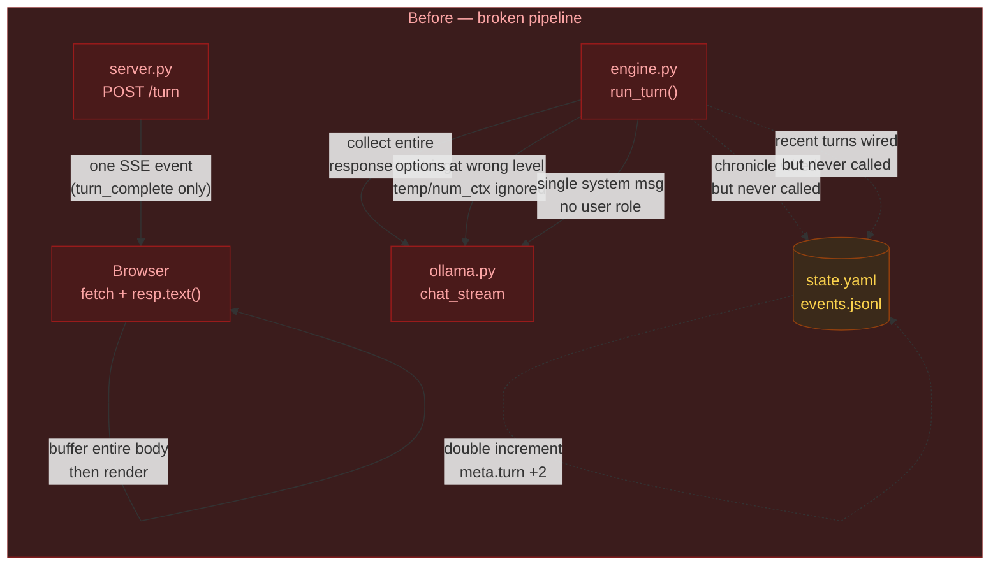
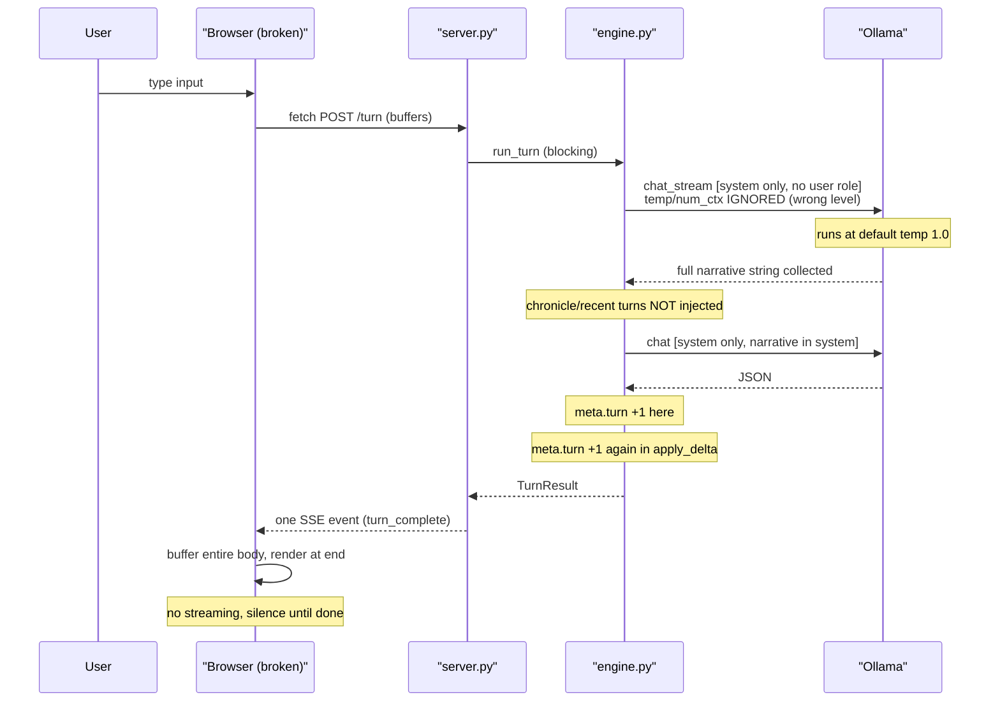
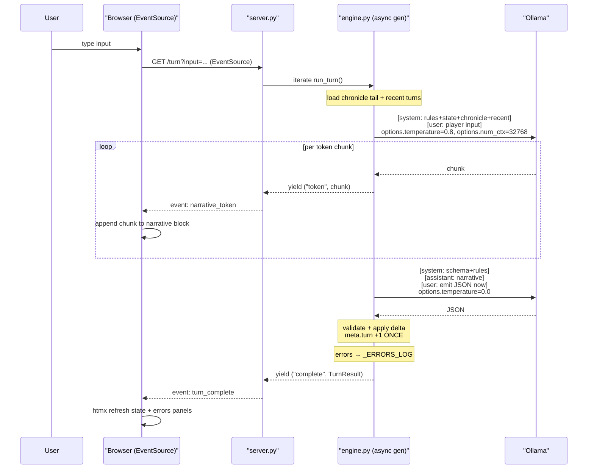

# CHANGELOG — ccya remediation

> **Experiment context**: this file documents a head-to-head comparison between a
> **local agent** (scaffolding pass, one-shot, smollm-class model) and a
> **frontier cloud agent** (remediation pass, Sonnet 4.6) working from the same
> `plan.md` design document. The goal: quantify where local-model one-shot
> scaffolding succeeds and fails, and whether the failure modes are predictable.

---

## Unreleased (2026-04-28)

- **BREAKING — extract schema (`StateDelta`):** Reverted replace-mode `established_facts` / `pc_conditions` (partial lists could wipe prior canon). Facts use **`established_facts_add`**, **`established_facts_update`** (`FactUpdate` with `old`/`new`, position-preserving), **`established_facts_remove`**. PC conditions use **`pc_condition_add`** / **`pc_condition_remove`**. **`location_description`** updates `location.description` in place without moving. **`quest_updates.objectives`** use **`QuestObjectiveUpdate`** with optional **`index`** (1-based, preferred) plus optional `description` / `done` / `failed`. **`inventory_add` / `inventory_remove`** resolve items by **normalized id** (case, hyphens, spaces) to merge near-duplicate stacks.
- **Chronicle / events:** **`chronicle.md`** is the canonical store for full prior-turn narrative. Narrator **`recent_turns`** and server reload history use **`load_recent_chronicle_turns`** (full text; **`_recent.j2`** no longer truncates). **`events.jsonl`** rows **omit `narrative`** — state-change / metrics log only; old rows with `narrative` still parse.
- **Prompts:** `extract_user.j2` injects Player (name, concept, conditions), Location, Present NPCs, numbered objectives, facts, inventory. `extract_system.j2` uses delta fact rules and worked examples (add / update / no-change); stronger **proper NPC naming** in narrate + extract when a character speaks or acts.
- **UI:** Three-column layout — left sidebar (Player, Scene, Location, Quests), narrative center, right sidebar (Established Facts, Inventory, Debug). Player concept block left-aligned (removed duplicate `.stat-concept` override). Inventory scroll cap 660px. Errors merged into Debug with recent-turn timing table from `events.jsonl`, `POST /panels/debug/clear-errors`, new HTMX targets `/panels/state-left` and `/panels/state-right`. Removed `_errors.html` and `/panels/errors` routes.
- **Established facts:** Cap and UI aligned at 25; facts panel lists all facts (newest first) in a fixed-height scroll. Apply order: remove → update (match normalized `old`) → add; unknown `update.old` falls back to append.
- **Quests:** Active / Resolved tabs (persisted `ccya_quests_tab`); `QuestObjective.failed`; `status` may be `failed` (auto-fails unfinished objectives) or `completed` (all objectives done, clears failed). Abandoned does not auto-change objectives. Extract user prompt includes active quests with numbered objectives + inventory for id-matched updates; examples cover credits + `scene_tags`.
- **Ollama:** `scripts/ollama-launch.sh`, `make ollama-launch` / `make ollama-env`, README Apple Silicon section. `/healthz` includes `ollama_version` from `/api/version`; header dot tooltip shows it.
- **CLI:** Startup URL uses OSC 8 hyperlink when stdout is a TTY.
- **Stackable inventory:** `InventoryItem.amount` (default 1), `InventoryRemove` with optional `amount` for partial spend; `inventory_remove` accepts legacy string ids via validator. `apply_delta` merges adds by id, subtracts partial stacks, removes at zero, sorts `id: credits` to the top. Narrate + sidebar show `×amount` when relevant; credits row highlighted in UI.
- **Seed pack:** `expanse-belter` uses `id: credits`, `amount: 1800` instead of a separate credit-chit row.

## 1. What the local agent got right

The structural alignment is impressive for a one-shot pass. Almost every named
file from the plan exists with roughly the right contents.

| Area | Detail |
|---|---|
| File layout | `ccya/`, `prompts/sections/`, `templates/`, `packs/`, `saves/`, `logs/`, `tests/` all correct |
| Pydantic schema | `StateDelta`, `ExtractResult`, `InventoryItem`, `QuestUpdate` with correct field constraints (`max_length=6` on `inventory_add`, `min/max 3–5` on `actions`) |
| `TurnResult` dataclass | `trace_id`, `metrics`, `established_facts`, `errors` all present |
| Atomic state write | `state.yaml.tmp` → `os.replace()` — correct |
| Write ordering | `append_event` → `save_state` → `append_chronicle` — matches plan rule |
| Turn-in-flight guard | Per-save `asyncio.Lock` + 409 response |
| Strict delta validator | Rejects unknown inventory IDs and quest IDs with reason strings |
| Retry with error fed back | Appends parse error as `user` message before retry |
| Established facts dedup + cap | Normalised lowercase match, `[-max:]` eviction slice |
| `_strip_thinking` regex | Correct |
| Mock mode | `MOCK_MODE=true` env var with branched canned responses — not in the plan, added bonus |
| Smoke test breadth | Covers happy path, rejected delta, retry, fact canonisation, chronicle budget, dedup, eviction, metrics, write-order |

---

## 2. What the local agent got wrong

### Critical issues (broken behaviour even in mock mode)



#### C1 — Token streaming not actually streaming
**Files**: `engine.py:145-161`, `index.html:124-127`

The engine consumed the entire `chat_stream` response into a string before
returning (`_collect_narrate`). The client used `fetch('/turn').then(r =>
r.text())` which buffers the full SSE body. Combined: the player waits in
silence for the full narrate+extract round trip, then sees the full paragraph
appear at once. The *entire justification* for the two-call pipeline split was
streaming UX.

#### C2 — Wrong message-role structure
**Files**: `engine.py:199`, `engine.py:211`

Both the narrate and extract calls sent a single `system` message containing
everything (rules, world state, player input, narrative, schema). Chat-tuned
models including Gemma 3 expect the chat template to alternate
`system → user → assistant`. No `user` turn was sent. This directly caused the
hallucination spew visible in `saves/default/chronicle.md` (smollm generating
paragraphs about "a player character with anxiety").

#### C3 — Recent turns missing from prefix
**Files**: `engine.py:run_turn`

`state.py:load_recent_events` was implemented and tested. `config.game.window_turns: 6`
was wired into `EngineConfig`. Neither was ever called from the engine. The model
had zero memory of previous turns beyond `state.yaml` — it was effectively stateless.

#### C4 — Chronicle missing from prefix
**Files**: `engine.py:run_turn`

`state.py:load_chronicle_tail` was implemented and tested. `chronicle_prefix_budget_tokens`
was wired into `EngineConfig`. Neither was ever called. The "compressed memory
layer" existed only as dead code.

#### C5 — Ollama API options at wrong nesting level
**Files**: `ollama.py:198-217`  
**Reference**: [https://docs.ollama.com/api/chat](https://docs.ollama.com/api/chat)

`temperature` and `num_ctx` were placed as top-level body fields. The Ollama
`/api/chat` API requires them under `body["options"]`. Both were silently
ignored — the model ran with default temperature (1.0) on every call regardless
of `config.yaml`. Per-call temperature differentiation between narrate (0.8)
and extract (0.0) was entirely non-functional.

#### C6 — `_build_body` ignored its own arguments
**Files**: `ollama.py:205-210`

`_build_body` accepted `keep_alive` and `num_ctx` as parameters but hardcoded
`"keep_alive": "60m"` and `"num_ctx": 32768` in the body dict, ignoring the
passed values. Config changes to these fields had no effect.

#### C7 — Turn counter double-incremented
**Files**: `state.py:172-173`, `engine.py:271`

Both `apply_delta` and the engine incremented `meta.turn`. After one player
action the counter went from 0 to 2. The smoke tests pinned this bug with
`assert result.turn == 2  # apply_delta + engine both increment` — a classic
case of a test that validates a bug rather than catching it.

---

### Major issues (architectural intent broken)

#### M8 — HTMX and Alpine loaded from CDN
**Files**: `index.html:7-8`

```html
<script src="https://unpkg.com/htmx.org@2.0.4" defer></script>
<script src="https://unpkg.com/alpinejs@3.14.8" defer></script>
```

The plan explicitly required vendored offline-first assets. The app did not run
without a network connection, defeating the core local-first requirement. No
`static/vendor/` directory existed.

#### M9 — Errors panel always empty
**Files**: `server.py:175`

```python
return _render("_errors.html", {"state": _load_current_state(), "errors": []})
```

Hardcoded `errors=[]`. `TurnResult.errors` was populated and returned by the
engine but never stored anywhere server-side. The trace-id copy button in
`_errors.html` was wired and working, but it never had anything to display.

#### M10 — Player input embedded in the system prompt
**Files**: `narrate.j2:11`

`{{ user_input }}` was rendered inside the `narrate.j2` template which became
the `system` message. Embedding freeform player text in the system role bypasses
chat-template safety and confuses prompt-injection mitigations.

#### M11 — Narrative jammed into system for extract
**Files**: `extract.j2:21-22`

The narrative produced by call 1 was placed in the system prompt for the extract
call. The correct pattern (and what the plan specified) is
`system` = rules/schema, `assistant` = the narrative the model produced,
`user` = "emit JSON now". The `assistant` slot signals that this text was
generated by the model — it is one of the strongest signals for "continue from
here coherently."

---

## 3. Architecture: before and after

### Before (broken)



### After (fixed)



---

## 4. What the remediation fixed

| ID | Fix | Files changed |
|---|---|---|
| C1 | `chat_stream` is a true async generator; engine yields `("token", chunk)` per chunk; client uses `EventSource` with `narrative_token` handler | `engine.py`, `server.py`, `index.html` |
| C2 | Narrate: `[system, user]`; Extract: `[system, assistant, user]`; player input always in `user` role | `engine.py`, `narrate_system.j2`, `narrate_user.j2`, `extract_system.j2`, `extract_user.j2` |
| C3 | `load_recent_events(save_dir, window_turns)` called in `run_turn`; result rendered via `_recent.j2` showing last-N turn pairs | `engine.py`, `prompts/sections/_recent.j2` |
| C4 | `load_chronicle_tail(save_dir, budget)` called in `run_turn`; injected via `_chronicle.j2` under `## Earlier` heading | `engine.py`, `prompts/sections/_chronicle.j2` |
| C5 | `_build_body` places `temperature` and `num_ctx` under `body["options"]`; `keep_alive` stays top-level | `ollama.py` |
| C6 | `_build_body` now accepts and forwards `keep_alive` and `num_ctx` as parameters; no hardcoded literals | `ollama.py` |
| C7 | Removed turn increment from `apply_delta`; single increment in `engine.py` only, adjacent to event/state writes | `state.py`, `engine.py` |
| M8 | HTMX 2.0.4 and Alpine 3.14.8 downloaded to `ccya/static/vendor/`; CDN `<script>` tags replaced; `make vendor` target added | `index.html`, `Makefile` |
| M9 | `_ERRORS_LOG: deque[dict, maxlen=50]` in `server.py`; errors pushed after each turn; `/panels/errors` renders from it; clear button via `POST /panels/errors/clear` | `server.py`, `_errors.html` |
| M10 | Player input moved to `narrate_user.j2`; rendered as `user` role message, never in `system` | `narrate_system.j2`, `narrate_user.j2`, `engine.py` |
| M11 | Narrative passed as `assistant` message in extract call; `extract_user.j2` provides the `user` instruction | `engine.py`, `extract_system.j2`, `extract_user.j2` |

Additional fixes included alongside:
- **Chronicle format**: entries now written as `## Turn N — <input>\n\n<narrative>` (was unformatted blob)
- **Test fakes**: split into `fake_stream` (async generator) and `fake_chat` (regular async) — real-call contracts enforced in tests
- **New test classes**: `TestOllamaBodyShape`, `TestPromptComposition`, `TestStreamingEvents`, `TestTurnCounterSingleIncrement`, `TestChronicleFormatted`, `TestRecentTurnsInjected` (17 new assertions)
- **`pytest-asyncio` added** to `[project.optional-dependencies].dev`
- **`[tool.pytest-asyncio]` duplicate table removed** from `pyproject.toml`

---

## 5. Deferred (minor issues, not fixed in this pass)

| ID | Issue | Notes |
|---|---|---|
| m12 | `append_chronicle` leading newline — no turn separator | Fixed as part of chronicle format above |
| m13 | Chronicle budget in words, not tokens | ~1.3× proxy; acceptable for MVP |
| m14 | Model name inconsistency (`smollm:135m` in config, `gemma4:26b` in README, `gemma3:27b` in plan) | Update `config.yaml` to target model before real runs |
| m15 | `@app.on_event("startup")` deprecated in FastAPI | Functional; migrate to `lifespan` context in a future pass |
| m16 | Validator scope narrow (no PC condition remove check, no location registry) | Acceptable for MVP |
| m17 | `_load_seed` path fragile to CWD | Works for standard `make run` invocation |
| m18 | `load_recent_events` was exported but unused | Resolved — now called |
| m19 | Validator doesn't check PC condition remove | Deferred |

---

## 6. Experimental findings

### What local one-shot agents do well
- **Structural completeness**: file layout, dependency lists, data model shapes, and named interfaces match the spec tightly. A good plan document translates into a good skeleton.
- **Intra-module correctness**: within a single function, logic that can be derived from the immediate context (atomic write, dedup loop, cap slice) is usually right.
- **Boilerplate and glue**: Pydantic model definitions, `argparse` wiring, Jinja template inclusion, `pyproject.toml` shape.

### Where local one-shot agents fail predictably
1. **API contracts requiring external knowledge**: `temperature` under `options{}` is not inferable from the plan; it requires knowing the Ollama API spec. Local models hallucinate plausible-looking but wrong API shapes.
2. **End-to-end data flow verification**: the model "knows" that streaming should happen and "knows" that `EventSource` exists, but fails to trace the call chain all the way through: engine → server → client. Each piece looks plausible in isolation; the integration is broken.
3. **Role semantics in chat templates**: the `system/user/assistant` role structure for chat-tuned models is a non-obvious constraint that requires understanding of how RLHF/chat fine-tuning works. A local model correctly copies these names but assigns them to the wrong content.
4. **Tests that pass because fakes hide the truth**: the original smoke tests verified dataclass shapes and file-write ordering — both correct — but never verified what bytes were actually sent to the API, what role structure the messages had, or whether tokens actually streamed. This is the canonical sign that a local agent scaffolded "toward the tests passing" rather than "toward the system working."
5. **Dead code that looks wired**: `load_chronicle_tail`, `load_recent_events`, `window_turns`, `chronicle_prefix_budget_tokens` were all implemented, configurable, and tested — but the wire from the engine to these functions was never connected. The local agent wrote each piece correctly in isolation and missed the integration step.

### Hypothesis for future experiments
> Local one-shot agents on design-heavy tasks produce ~75% structural alignment
> but ~40% behavioural correctness. The gap is concentrated in: (a) external API
> contracts, (b) end-to-end integration, (c) role/protocol semantics. Frontier
> agents catch these in review and remediation passes. A hybrid workflow —
> local agent for scaffolding, frontier agent for integration review + targeted
> fixes — likely outperforms either alone on a cost-adjusted basis.

---

## 7. Verification ledger

| Check | Command | Expected |
|---|---|---|
| All tests pass | `make test` | 40 passed |
| App starts offline | `make run` (wifi off) | No CDN errors in console |
| Token streaming | `make run`, open browser, play turn | Narrative text appears token-by-token |
| Correct API options | `tail -f logs/llm-g.log \| jq .` + real Ollama | `options.temperature` present in request |
| Errors panel populates | Trigger a validation rejection | Trace ID appears in errors panel |
| Chronicle formatted | `cat saves/default/chronicle.md` | `## Turn N —` headers present |
| Recent turns in prompt | Enable debug logging, check system prompt | Prior turn input/narrative visible |

---

*Remediation completed: 2026-04-27 by Sonnet 4.6 (cloud agent).*  
*Scaffolding completed: 2026-04-26 by local agent (model unknown, likely smollm-class based on config.yaml `model: smollm:135m`).*
