# CCYA Roadmap

Plans live in `plans/` organized by milestone. TODOs are in `docs/TODO.md` organized by the same buckets.

## Priorities

1. **P1 — Story Logical Consistency** — stop losing, duplicating, or corrupting game reality
2. **P2 — Interesting Storytelling** — make the world push back and pace the player deliberately
3. **P3 — Inference Speed** — cut token waste, fix prompt overflow, improve local latency
4. **P4 — World Continuity** — make the world feel authored and reusable across turns

Each phase’s exit criteria are listed below. A phase is “done enough” to move on when the critical items are complete — not when every item is closed.

---

## Roadmap Diagram

```mermaid
flowchart TD
    classDef p1 fill:#c0392b,color:#fff,stroke:#922b21
    classDef p2 fill:#1a6b3c,color:#fff,stroke:#145a32
    classDef p3 fill:#1a4f7a,color:#fff,stroke:#154360
    classDef p4 fill:#6c3483,color:#fff,stroke:#512e5f

    START([Start])

    subgraph P1["P1 — Story Logical Consistency"]
        P1A[Fix trim_messages context drop]:::p1
        P1B[Increase prompt token budget]:::p1
        P1C[recent_events ID-keyed overhaul]:::p1
        P1D[Entity deduplication - inventory + NPCs]:::p1
        P1E[Remove condition TTL]:::p1
        P1F[Condition to skill feedback loop]:::p1
        P1G[Quest filter to active only]:::p1
        P1H[Fix present/recently-left contradiction]:::p1
        P1I[Intent expansion]:::p1
        P1J[Reconciliation system]:::p1
    end

    subgraph P2["P2 — Interesting Storytelling"]
    P2A[Band collapse to partial ~~done~~]:::p2
    P2B[Verb-differentiated directives ~~done~~]:::p2
        P2C[Momentum track ~~done~~]:::p2
        P2D[Scene pressure ~~done~~]:::p2
        P2E[Active DM / GM beat ~~done~~]:::p2
        P2F[Scene age anti-stall ~~done~~]:::p2
        P2G[Band-scoped extract examples ~~done~~]:::p2
    end

    subgraph P3["P3 — Inference Speed"]
        P3A[Prompt trimming through pipeline]:::p3
        P3B[Static/dynamic prompt split audit]:::p3
        P3C[Per-call token instrumentation]:::p3
        P3D[KV-cache pinning]:::p3
        P3E[Model-agnostic thinking infra]:::p3
        P3F[Dev mode dual-model setup]:::p3
        P3G["Eval harness — 7 phases<br/>Tier 1: token ceilings + multi-turn invariants<br/>Tier 2: make eval, judge, REPORT.md"]:::p3
    end

    subgraph P4["P4 — World Continuity"]
        P4A[Location-keyed NPC storage]:::p4
        P4B[Typed place pool generation]:::p4
        P4C[Organization/faction name pool]:::p4
        P4D[Rumor pool]:::p4
        P4E[Object epithet pool]:::p4
        P4F[Narrator prop injection rule]:::p4
        P4G[Locale-aware word lists by genre]:::p4
        P4H[Character traits + relationships]:::p4
    end

    START --> P1A & P1B
    P1A & P1B --> P1C & P1D & P1E & P1F & P1G & P1H & P1I
    P1C & P1D & P1E & P1F & P1G & P1H & P1I --> P1J
    P1J --> P2A
    P2A --> P2B --> P2C
    P2A --> P2D & P2E & P2F & P2G
    P1J --> P3A & P3B & P3C & P3G
    P3A & P3B --> P3D & P3E & P3F
    P3C --> P3G
    P1J --> P4A
    P4A --> P4B & P4C & P4D & P4E & P4F & P4G & P4H
```

---

## P1 Exit Criteria

- `recent_events` are ID-keyed; no string-match deduplication
- Inventory items have stable canonical IDs; no duplicate entries from rephrasings
- NPC alias registry prevents duplicate compendium entries on name reveal
- Condition TTL removed; conditions only cleared by extractor
- Condition additions are keyed to the skill that failed, not free-form narration reading
- Active quests only injected into context; completed/failed quests compacted
- `present_npcs` and `recently_left` are mutually exclusive at all times
- Intent envelope carries domain scope; extractor skips inactive domains
- Reconciliation pass catches cross-domain state contradictions before they persist

---

## P2 Exit Criteria

- ~~5-band resolution system (`crit_fail`, `fail`, `setback`, `partial`, `success`, `crit_success`); `mixed`/`boon` removed~~
- ~~`build_directive()` produces verb-category-differentiated instructions for `setback` and `partial`~~
- ~~Momentum track persists on PC; narrator receives directive at |momentum| >= 2~~
- ~~Scene pressure list drives `ACTIVE THREATS` block in narrator; at least one pack using it~~
- ~~GM beat emitted by progress extractor and consumed by narrator on following turn~~
- ~~No scene runs longer than N turns without a scene-change nudge~~
- ~~Band-scoped extract examples conditioned on roll outcome band~~

---

## P3 Exit Criteria

- Per-turn token counts logged and visible in debug UI
- `recent_turns` context replaced with compact outcome summaries
- System prompts verified stable for KV-cache eligibility
- Local and remote model selection controlled by a single config flag
- `make test` includes token-budget ceiling assertions and multi-turn invariant tests (Tier 1 eval harness)
- `make eval` runs the `full_cycle` scenario end-to-end: in-process driver → LLM judge → REPORT.md with per-stream token regression flags (Tier 2 eval harness)

---

## P4 Exit Criteria

- NPCs stored per location; LRU injection heuristic eliminated
- Place pool seeded at game start; narrator uses pool names over invented ones
- NPC traits, relationships, and descriptions persisted across sessions
