# CCYA Roadmap

Plans live in `plans/` organized by milestone. TODOs are in `docs/TODO.md` organized by the same buckets.

## Priorities

1. **P1 — Story Logical Consistency** — stop losing, duplicating, or corrupting game reality
2. **P2 — Interesting Storytelling** — make the world push back and pace the player deliberately
3. **P3 — Inference Speed** — cut token waste, fix prompt overflow, improve local latency
4. **P4 — World Continuity** — make the world feel authored and reusable across turns

Each phase's exit criteria are listed below. A phase is "done enough" to move on when the critical items are complete — not when every item is closed.

---

## Roadmap Diagram

```mermaid
flowchart TD
    classDef p1 fill:#c0392b,color:#fff,stroke:#922b21
    classDef p2 fill:#1a6b3c,color:#fff,stroke:#145a32
    classDef p3 fill:#1a4f7a,color:#fff,stroke:#154360
    classDef p4 fill:#6c3483,color:#fff,stroke:#512e5f

    START([Start])

    subgraph P1["P1 — Story Logical Consistency"]
        P1A[Fix trim_messages context drop]:::p1
        P1B[Increase prompt token budget]:::p1
        P1C[recent_events ID-keyed overhaul]:::p1
        P1D[Canonical inventory IDs]:::p1
        P1E[NPC alias dedup]:::p1
        P1F[Remove condition TTL]:::p1
        P1G[Condition→skill feedback loop]:::p1
        P1H[Quest filter to active only]:::p1
        P1I[Fix present/recently-left contradiction]:::p1
        P1J[New-NPC compendium guarantee]:::p1
        P1K[Reconciliation system]:::p1
    end

    subgraph P2["P2 — Interesting Storytelling"]
        P2A[Momentum track]:::p2
        P2B[Scene pressure]:::p2
        P2C[Active DM / GM beat]:::p2
        P2D[Band collapse → partial]:::p2
        P2E[Verb-differentiated directives]:::p2
        P2F[Scene age anti-stall]:::p2
        P2G[Band-scoped extract examples]:::p2
    end

    subgraph P3["P3 — Inference Speed"]
        P3A[Replace recent_turns prose with outcome_summary]:::p3
        P3B[Move world_state + name_pool to system prompt]:::p3
        P3C[Remove unused Rules outputs: target/stakes/check.tags]:::p3
        P3D[Static/dynamic prompt split audit]:::p3
        P3E[Context block labeling - Plan A]:::p3
        P3F[Compaction redesign - Plan F]:::p3
        P3G[KV-cache pinning]:::p3
        P3H[Model-agnostic thinking infra]:::p3
        P3I[Dev mode dual-model setup]:::p3
        P3J[Per-call token instrumentation]:::p3
    end

    subgraph P4["P4 — World Continuity"]
        P4A[Typed place pool generation]:::p4
        P4B[Organization/faction name pool]:::p4
        P4C[Rumor pool]:::p4
        P4D[Object epithet pool]:::p4
        P4E[Narrator prop injection rule]:::p4
        P4F[Locale-aware word lists by genre]:::p4
        P4G[Character traits + relationships]:::p4
        P4H[Character avatars]:::p4
        P4I[Physical descriptions]:::p4
    end

    START --> P1
    P1 --> P2
    P1 --> P3
    P2 --> P4
    P3 --> P4
```

---

## Phase Exit Criteria

### P1 — Story Logical Consistency
- `trim_messages` truncates content instead of dropping messages
- `recent_events` are ID-keyed with no string-match deduplication
- Inventory items have stable canonical IDs
- NPC aliases prevent clone creation
- Condition TTL removed; conditions only clear via fiction
- Active-quest-only filtering in `_quests.j2`
- No present/recently-left contradictions in state

### P2 — Interesting Storytelling
- Momentum track live and wired to narrate prompt
- `scene_pressure` split from `world_state`
- GM beat emitted by progress extractor and consumed by narrator
- `mixed`/`boon` collapsed to `partial`
- Directives branch by `intent_verb` category

### P3 — Inference Speed
- Full `recent_turns` prose replaced with compact `outcome_summary`
- Static world data moved to system prompts
- Unused Rules output fields removed from schema
- Token counts instrumented per stream
- Context block labels in place (Plan A)

### P4 — World Continuity
- Place, org, rumor, and object pools generated at seed time
- Narrator instructed to use pool names over invented ones
- Character traits and physical descriptions persisted in compendium
