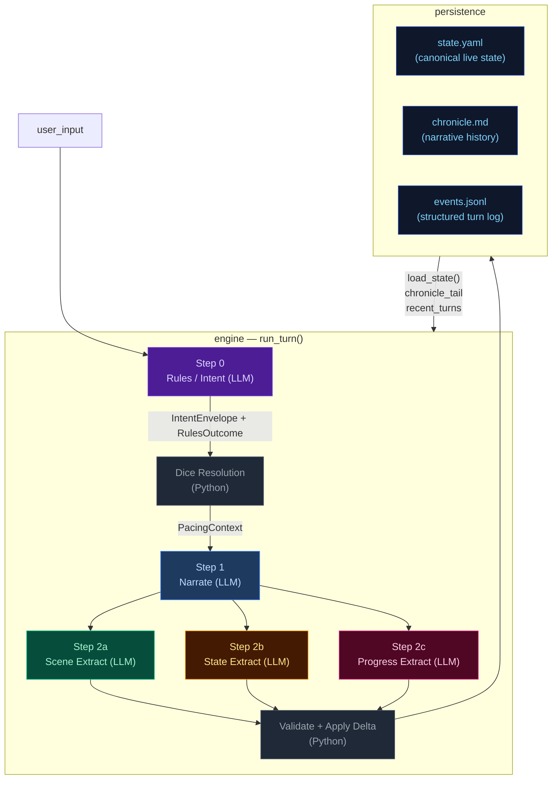

# Architecture Overview — CCYA Engine

CCYA is a local-LLM-backed text RPG engine. Every player turn drives a five-step
pipeline (Rules → Narrate → Scene Extract → State Extract → Progress Extract) with
a pure-Python validation+persist tail. Two additional LLM pipelines handle new-game
creation: **Character Creation** (static packs) and **Generate Seed** (dynamic packs).

## Pipeline Diagram



## Pipeline Quick Reference

| Step | Docs | When it runs | Key inputs | Key outputs | Mechanics it owns |
|---|---|---|---|---|---|
| **Step 0 — Rules / Intent** | [step0-rules](./step0-rules.md) | Every turn (always) | `state.pc`, `state.location`, `recent_turns[-1:]`, `user_input` | `IntentEnvelope`, `RulesOutcome` | Intent classification, dice roll resolution (2d6 + stat + cond − diff → band), difficulty selection, anti-declare-outcome enforcement. |
| **Step 1 — Narrate** | [step1-narrate](./step1-narrate.md) | Every turn (always, streamed) | Full `state`, `chronicle_tail`, `recent_turns`, `pacing_context`, `pending_gm_beat`, `npc_roster` (tiered), `world_factions/locations` | `narrative` (prose) | Prose generation, dice-band binding, GM-beat consumption. Tone shaped by `PacingContext.directive`. |
| **Step 2a — Scene Extract** | [step2a-scene](./step2a-scene.md) | Every turn (always) | `narrative`, `state.pc/location`, `npc_roster` (tiered), conditions, known_characters (LRU compendium), RulesOutcome | `SceneExtractResult`: scene_tags, tagline, location_change, npc_add/remove/update, compendium_npc_update | NPC presence, location changes, scene tags, durable NPC compendium identity. |
| **Step 2b — State Extract** | [step2b-state](./step2b-state.md) | Every turn (always) | `narrative`, `state.pc/location/inventory`, rules_outcome, conditions, band_examples | `StateExtractResult`: inventory_add/remove/update, pc_condition_add/remove | Inventory delta accuracy, condition lifecycle. |
| **Step 2c — Progress Extract** | [step2c-progress](./step2c-progress.md) | Every turn (always) | `narrative`, `_ExtractionContext`, pacing_context, arc.threads[], recent_turns[-2:], band, pending_beat, npc_roster (tiered) | `ProgressExtractResult`: thread_advance/resolve/add, gm_beat, recent_events_add/update/remove, actions, outcome_summary | Unified thread lifecycle, beat disposition inference, durable history events. |

After Step 2c: results merge into a `StateDelta`, the validator checks constraints
(e.g. `inventory_remove` IDs exist), `apply_delta()` mutates state in-place, and the
turn is persisted. The next turn's Step 0 reads the new `state.yaml` plus `events.jsonl`.

## Subsystem Docs

| Subsystem | Doc | What it covers |
|---|---|---|
| **Step 0 — Rules** | [step0-rules](./step0-rules.md) | Intent classification, dice resolution flowchart |
| **Step 1 — Narrate** | [step1-narrate](./step1-narrate.md) | Streaming narration pipeline with all context inputs |
| **Step 2a — Scene Extract** | [step2a-scene](./step2a-scene.md) | Location changes, NPC presence, scene tags |
| **Step 2b — State Extract** | [step2b-state](./step2b-state.md) | Inventory and condition extraction |
| **Step 2c — Progress Extract** | [step2c-progress](./step2c-progress.md) | Thread lifecycle, GMBeat schema, beat lifecycle (3 phases) |
| **PacingContext** | [pacing-context](./pacing-context.md) | Struct definition, computation flowchart, wiring to Narrator/Progress |
| **Delta → Validate → Apply** | [delta-validate](./delta-validate.md) | StateMerge schema, validation rules, apply_delta mutations |
| **Persist** | [persist](./persist.md) | Atomic writes (events.jsonl, state.yaml, chronicle.md), readback |
| **Cross-Pipeline Data Flow** | [cross-pipeline](./cross-pipeline.md) | Full inter-step data flow diagram |
| **Campaign Arcs** | [campaign-arcs](./campaign-arcs.md) | Arc data model (unified threads), engine-driven lifecycle, narrator-driven updates, integration points |
| **Out-of-Band Pipelines** | [out-of-band](./out-of-band.md) | Character Creation pipeline, Generate Seed pipeline, turn viewer status colors |

## Key Models Glossary

### Core Result Types

- **IntentEnvelope**: `intent`, `intent_verb`, `target`, `check.required`, `check.skill`, `check.difficulty`
- **RulesOutcome**: `rolled`, `skill`, `difficulty`, `stat_value`, `stat_mod`, `diff_mod`, `cond_mod`, `dice`, `raw_total`, `final_total`, `band`, `directive`, `intent`, `intent_verb`
- **SceneExtractResult**: `scene_tags`, `scene_tagline`, `location_change`, `npc_add/remove/update`, `compendium_npc_update`
- **StateExtractResult**: `inventory_add/remove/update`, `pc_condition_add/remove`
- **ProgressExtractResult**: `thread_advance`, `thread_resolve`, `thread_add`, `gm_beat`, `recent_events_add/update/remove`, `actions`, `outcome_summary`
- **SeedEnvelope**: `seed_state: GameState`, `opening_narrative`, `actions`

### PacingContext (see [pacing-context](./pacing-context.md))

```
PacingContext:
  directive: str           # "" | "Breathe" | "Pressure" | "MoveOn" | "Escalate"
  beat_hint: str | None    # suggested gm_beat type, or None
  beat_locked: bool        # True: floor relief fired — Progress MUST emit breathing_room beat and gate is force-closed
  gate: str                # "block_add" | "block_escalate" | "allow" (controls thread_add)
  summary: str             # human-readable log string, never sent to LLM
```

### GMBeat (see [step2c-progress](./step2c-progress.md))

```
GMBeat
  type: complication | revelation | opportunity | breathing_room | pressure | twist | setback | escalation | callback
  surface_as: ambient | event | npc_behavior | environmental | player_discovery | item (default: ambient)
  instruction: str (≥40 chars, no filler prefixes)
  beat_expires_turn: int | None (turn number at which the beat expires; set to turn_no + 2 when stored)
```

### ArcThread (see [campaign-arcs](./campaign-arcs.md))

```
ArcThread (unified)
  id, summary, scope ("scene"|"arc"), active: bool = True
  urgency ("background"|"normal"|"urgent")
  tags: list[str], progress: int (0..3)
  resolution_state: str | None
  last_seen_turn: int | None, added_turn: int | None
```

### StateDelta (see [delta-validate](./delta-validate.md))

Merges all three extraction results. Contains `scene_tags`, `location_change`, `npc_add/remove/update`, `thread_advance/resolve/add`, `inventory_add/remove/update`, `pc_condition_add/remove`, `recent_events_add/update/remove`. Note: `gm_beat` is NOT in StateDelta — written directly to `state.meta.pending_gm_beat`.
