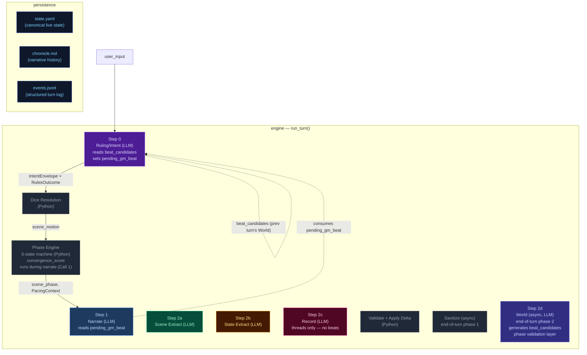

# Architecture Overview — CCYA Engine

CCYA is a local-LLM-backed text RPG engine. Every player turn drives a five-phase
pipeline (Ruling → Phase Engine → Narration → Extraction → Apply → Persist) with
a pure-Python validation+persist tail, followed by an async **Step 2d — World** that
runs after the turn completes. An async **Generate Seed** pipeline handles new-game
creation from scenario.yaml packs.

## Pipeline Diagram

## Pipeline Quick Reference

| Step | Docs | When it runs | Key inputs | Key outputs | Mechanics it owns |
|---|---|---|---|---|---|
| **Step 0 — Ruling/Intent** | [step0-ruling](./step0-ruling.md) | Every turn (always) | `state.pc`, `state.location`, `recent_turns[-1:]`, `user_input`, `arc.threads` (urgent only), `state.meta.beat_candidates` mechanism tags | `IntentEnvelope`, `RulesOutcome`, `selected_beat` mechanism tags → `state.meta.pending_gm_beat` | Intent classification, impossibility check, dice roll resolution (1d12 + stat_mod + diff_mod → band), LLM-driven difficulty adjustment factoring conditions/inventory, anti-declare-outcome enforcement. Roll criteria tightened to major narrative pivots only. Urgent threads context provided to LLM. When `impossible=true`, no roll occurs and Python synthesizes a `fail` outcome. **Beat selection** — reads `state.meta.beat_candidates` mechanism tags (prepared by previous turn's World step) and selects one by index (or null) for the upcoming narration. Always replaces or pops `state.meta.pending_gm_beat`; always pops `state.meta.beat_candidates`. |
| **Phase Engine** | — | Every turn (always, Python, runs during narrate in `_narrate_setup()`) | `state.scene`, `ages`, `EngineConfig`, raw convergence_score | `scene_phase` (SETUP/RISING/CLIMAX/RESOLUTION/BREATHER), `climax_turn_count`, `breather_turn_count` in `state.scene` | 5-state phase machine driven by **raw** convergence score (5-component composite, range 0-6) and scene age. Phase drives directive computation and beat constraints. Convergence enter threshold default is 2. |
| **Step 1 — Narrate** | [step1-narrate](./step1-narrate.md) | Every turn (always, streamed) | Full `state`, `prior_history` (last 10 bullets, all but last rendered), `recent_turns[-1:]`, `pacing_context`, `pending_gm_beat` mechanism tags (set by Ruling same turn), `npc_roster` (from build_npc_roster()), `world_factions/locations` | `narrative` (prose) | Prose generation, dice-band binding, GM-beat mechanism tags as creative guidance (narrator generates prose grounded in actual NPC fields in the roster). Scene motion shaped by `PacingContext.outcome_hint`; impossible actions narrated as natural failures. |
| **Step 2a — Scene Extract** | [step2a-scene](./step2a-scene.md) | Every turn (always) | `narrative`, `state.pc`, `npc_roster` (from build_npc_roster()), conditions, compendium entries | `SceneExtractResult`: compendium_npc_update, candidate_npcs (per-NPC beat candidates: [{id, type, effect}]) | NPC presence, durable NPC compendium identity, per-NPC beat candidate signals with driver assignment. |
| **Step 2b — State Extract** | [step2b-state](./step2b-state.md) | Every turn (always) | `narrative`, `state.pc/location/inventory`, conditions | `StateExtractResult`: inventory_add/remove/update, pc_condition_add/remove, location_change, location_description | Inventory delta accuracy, condition lifecycle, location deltas. |
| **Step 2c — Record** | [step2c-record](./step2c-record.md) | Every turn (always) | `narrative`, `arc.threads[]`, `recent_turns[-10:]`, `band`, `world_state`, `prior_history` | `StorytellerResult` (gm_beat field removed): thread_update/goal_update/arc_resolve/resolve/add, actions, outcome_summary | Record-managed thread lifecycle, arc resolution, durable history events. Backward-looking scribe — does not generate beats. |
| **Step 2d — World (async)** | [step2d-world](./step2d-world.md) | Every turn (after `yield("complete")`, lock still held) | `candidate_npcs`, `arc.threads[]`, `pacing_context`, `recent_beats` (capped at 5), `allowed_beat_types`, `narration` | `state.meta.beat_candidates` (0-3 validated candidates, mechanism tags only — no quote/prose) | Async beat-candidate generation. Phase validation layer: purges candidates with invalid beat types before GMBeat validation. Validates each candidate via `GMBeat(**candidate)`; strips to mechanism tags; drops invalid candidates silently. Returns updated state with `recent_beats` appended. Runs inside the `_inflight` lock; the lock lifts only after World returns. On any failure (LLM timeout, invalid JSON), `beat_candidates = []` and the next turn's Ruling proceeds without a beat. **Event recording:** `extraction.world` added to main turn event with output/tokens/ms; prompts written to `prompts.jsonl` with `stream: "world"`. |

After Step 2c: results merge into a `StateDelta`, the validator checks constraints
(e.g. `inventory_remove` IDs exist), `apply_delta()` mutates state in-place, and the
turn is persisted. After `yield("complete")` the end-of-turn async window runs Sanitize
then World; `extraction.world` is added to the event dict and prompts are written to
`prompts.jsonl`; a single `append_event` + `save_state` persists both the event (with
world data) and state. The next turn's Step 0
reads the new `state.yaml` plus `events.jsonl` (and consumes `state.meta.beat_candidates`
prepared by the previous turn's World).

## Subsystem Docs

| Subsystem | Doc | What it covers |
|---|---|---|
| **Step 0 — Ruling** | [step0-ruling](./step0-ruling.md) | Intent classification, dice resolution flowchart, pacing context computation |
| **Step 1 — Narrate** | [step1-narrate](./step1-narrate.md) | Streaming narration pipeline with all context inputs |
| **Step 2a — Scene Extract** | [step2a-scene](./step2a-scene.md) | Location changes, NPC presence, scene tags |
| **Step 2b — State Extract** | [step2b-state](./step2b-state.md) | Inventory and condition extraction |
| **Step 2c — Record** | [step2c-record](./step2c-record.md) | Pipeline mechanics, campaign arc system, thread lifecycle mechanics (Record replaces Storytell) |
| **Step 2d — World** | [step2d-world](./step2d-world.md) | Async beat-candidate generation, end-of-turn lock window, beat lifecycle (single-turn commitments) |
| **Pacing Systems** | [pacing-systems](./pacing-systems.md) | Phase engine, GM beats, pacing context, thread lifecycle, and their cross-system interactions
| **Delta → Validate → Apply** | [delta-validate](./delta-validate.md) | StateMerge schema, validation rules, apply_delta mutations |
| **Persist** | [persist](./persist.md) | Atomic writes (events.jsonl, state.yaml, chronicle.md), readback |
| **Cross-Pipeline Data Flow** | [cross-pipeline](./cross-pipeline.md) | Full inter-step data flow diagram |
| **Out-of-Band Pipelines** | [out-of-band](./out-of-band.md) | Character Creation pipeline, Generate Seed pipeline, turn viewer status colors |
| **Prompt Eval** | [`../ev/STATE-REFERENCE.md`](../ev/STATE-REFERENCE.md) | Fast prompt testing CLI (`ev.py prompt-eval`): renders prompts with live data, calls LLM, runs checkers. Two subcommands: `dump` (render only), `call` (render + LLM + check). Uses `last_turn_state` (post-turn) as context. Known limitation: inventory/conditions reflect end of turn. |
| **Narration UI** | [narration-ui](./narration-ui.md) | Main game interface: SSE streaming, HTMX sidebar refresh, Alpine.js state machine |
| **Turn Viewer UI** | [turn-viewer-ui](./turn-viewer-ui.md) | Pipeline debug UI: turn cards, stage inspector, diff panel, live updates |
| **State models** | [state-models](./state-models.md) | state.yaml shape, all Pydantic models, field types, lifecycle notes |
| **Cross-module contracts** | [cross-module-contracts](./cross-module-contracts.md) | Thread lifecycle, state machine, extraction routing, error propagation, token budget |
| **Prompts architecture** | [prompts-architecture](./prompts-architecture.md) | Prompt template structure, rendering flow, shared includes |

## State Lifecycle

The pipeline produces several state objects at different points. Understanding when each is captured is critical for writing correct checkers.

| State | When captured | Stored in events? | Purpose |
|---|---|---|---|
| `PacingContext` (dataclass) | Step 0, after phase engine | No (serialized as `pacing_context` dict) | Internal pacing signal for Steps 1 and 2d (World); removed from extraction pipeline (Steps 2a-2c) |
| `_ExtractionContext` (dataclass) | Step 2c, before record LLM call | No | Carries post-delta NPCs/location/candidate_npcs/inventory/conditions into record prompt |
| `last_turn_state` | End of turn (after all processing) | Yes (`event["last_turn_state"]`) | Full persisted state at turn end; used by checkers |
| `changes` | After sanitizer | Yes (`event["changes"]`) | What the sanitizer actually changed |
| `extraction.*.output` | After each extraction stream | Yes (`event["extraction"]`) | LLM extraction results |
| `beat_candidates` | After Step 2d (World) | No (persisted in `state.meta.beat_candidates`) | Consumed by next turn's Ruling for beat selection |
| `extraction.world` | After Step 2d (World) | Yes (`event["extraction"]["world"]`) | World step output with beat candidates, timing, and token metrics |
| `pending_gm_beat` | After Ruling sets it | No (persisted in `state.meta.pending_gm_beat`) | Consumed by same turn's Narrate |
| `sanitizer event` | After sanitizer (every N turns) | Yes (`kind=sanitizer`, `turn=N`) | Separate event on sanitizer turns; must be filtered by UI panels to avoid duplicates |

See [`docs/ev/STATE-REFERENCE.md`](../ev/STATE-REFERENCE.md) for full details on each state type, checker usage, and common pitfalls.

## LLM Backend

The engine uses an OpenAI-compatible chat API (`/v1/chat/completions`). The client (`ccya/llm_client.py`) supports both backends via `LLMResult` wrapper (frozen dataclass with `content`, `usage` normalized dict, `elapsed_ms`). Both backends use the `openai` Python SDK with `api_key="local"`. `num_ctx` is passed via `extra_body`. Default `num_ctx=16384`. Client-side token trimming via `trim_messages()` preserves 2000 head + 500 tail tokens; system messages are never dropped.

| Backend | Host | Model | Hardware | Speed |
|---|---|---|---|---|
| **Primary (preferred)** | `127.0.0.1:1234` (LMStudio, OpenAI compat) | `google/gemma-4-26b-a4b-it` | Fast |
| Fallback | `127.0.0.1:8000` (OpenAI compat) | Gemma 4-26B | MacBook (MLX) | Slower |

Configured in `config.yaml` under `llm.host`, `llm.model`, `llm.num_ctx`, and `llm.context_window`. The client (`ccya/llm_client.py`) uses a single OpenAI-compatible path for both backends. `num_ctx` is passed to control the server-side input context window. `context_window` controls client-side trimming via `trim_messages()` — must be ≤ `num_ctx` to avoid sending more tokens than the server can handle.

## Key Models Glossary

### Core Result Types

- **IntentEnvelope**: `intent`, `intent_verb`, `target`, `check` (RulesCheck), `impossible`, `reason`, `scene_motion: Literal["hold", "advance", "transition"]`
- **RulesOutcome**: `rolled`, `skill`, `difficulty`, `stat_value`, `stat_mod`, `diff_mod`, `dice`, `raw_total`, `final_total`, `band`, `directive`, `intent`, `intent_verb`, `impossible`, `reason`
- **SceneExtractResult**: `compendium_npc_update`, `candidate_npcs: list[dict]` (per-NPC beat candidates: [{id, type, effect}])
- **StateExtractResult**: `inventory_add/remove/update`, `pc_condition_add/remove`, `location_change`, `location_description`, `inventory_change_reason`, `condition_change_reason`
- **StorytellerResult** (Record output, formerly Storyteller): `thread_update` (list[ThreadUpdate]), `goal_update` (dict | None, applied via `goal_update["long_term_objective"]`), `arc_resolve` (ArcResolution | None), `thread_resolve` (list[ThreadResolution] with outcome, resolved_turn, world_state_candidate), `thread_add`, `actions`, `outcome_summary`. **The `gm_beat` field has been removed** — beat generation moved to Step 2d (World), beat selection to Step 0 (Ruling). The Pydantic class name is preserved (`StorytellerResult`); only the field is gone.
- **SeedEnvelope**: `seed_state: SeedState`, `opening_narrative`, `actions`, `long_term_objective: LongTermObjective | None`, `arc_origin: str`, `outcome_summary: str` (includes `arc_origin` — world-level context describing a world-level event/condition that shapes the current situation; unified `threads[]` with `progress: list[ProgressEntry]`, `completed_threads[]`)

  The seed owns first-turn emotional framing, not just world and arc scaffolding. It generates `arc_origin` (world-level context), NPC `relation` fields (narrative job relative to PC), and action text written from the PC's voice and scene pressure — ensuring the opening feels personal and motivated from the start. `goal_context` was deleted and replaced by `arc_origin`.

### State Data Shapes

- **`state.world_state_candidates`**: list of dicts collected from `ThreadResolution.world_state_candidate` in `_apply_thread_resolutions()`. Each entry has `thread_id`, `text`, and `resolved_turn`. Two-step promotion: storyteller flags candidate, sanitizer confirms with full array replacement authority (seed worldbuilding plan).

### PacingContext (see [step0-ruling](./step0-ruling.md#pacing-context))

Computed by `_compute_pacing_context()` in `_pacing.py` after the phase engine runs. Primary pacing signal is `scene_phase` (SETUP/RISING/CLIMAX/RESOLUTION/BREATHER) from the 5-state machine. Fields: `directive` (phase-driven priority stack: Scene Imperative → Scene Pressure → empty), `outcome_hint` (driven by scene_motion from ruling + Scene Imperative override + convergence hard gate), `summary` (human-readable log string), `convergence_score` (int 0-6, raw 5-component score computed by `compute_convergence_score()` in _pacing.py), `convergence_components` (dict of 5 component names to int values: urgent_thread, threat_thread, beat_streak, roll_starvation, threat_density), `convergence_threads` (thread dicts used for convergence computation).

### GMBeat (see [step2d-world](./step2d-world.md#gmbeat-schema-repurposed))

`GMBeat` is used as the validation schema for World candidates only. Ruling selects by index, not by object matching. Fields: `type` (Literal — silently coerced to `None` if not in valid set), `effect` (str). **The `npc_id`, `driver`, and `beat_expires_turn` fields are removed** — beats are single-turn commitments; Ruling's per-turn "always replace or pop" rule keeps state hygienic.

### LongTermObjective (see [step2c-record](./step2c-record.md#campaign-arc-system))

### StateDelta (see [delta-validate](./delta-validate.md))

Merges all three extraction results. Contains `location_change`, `location_description`, `compendium_npc_update` (NPC changes), `arc_update` (LongTermObjective), `inventory_add/remove/update`, `pc_condition_add/remove`, `actions`. **No beat fields anywhere in StateDelta** — beats flow through `state.meta.pending_gm_beat` (set by Ruling) and `state.meta.beat_candidates` (set by World). Thread operations (`thread_update`, `thread_resolve`, `thread_add`, `arc_resolve`) are in `StorytellerResult`, not StateDelta.
