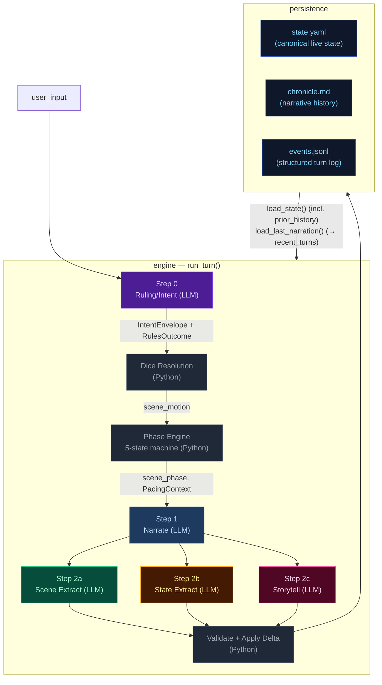

# Architecture Overview — CCYA Engine

CCYA is a local-LLM-backed text RPG engine. Every player turn drives a six-step
pipeline (Rules → Phase Engine → Narrate → Scene Extract → State Extract → Storytell) with
a pure-Python validation+persist tail. Two additional LLM pipelines handle new-game
creation: **Character Creation** (static packs) and **Generate Seed** (dynamic packs).

## Pipeline Diagram

## Pipeline Quick Reference

| Step | Docs | When it runs | Key inputs | Key outputs | Mechanics it owns |
|---|---|---|---|---|---|
| **Step 0 — Ruling/Intent** | [step0-ruling](./step0-ruling.md) | Every turn (always) | `state.pc`, `state.location`, `recent_turns[-1:]`, `user_input`, `arc.threads` (urgent only) | `IntentEnvelope`, `RulesOutcome` | Intent classification, impossibility check, dice roll resolution (1d12 + stat_mod + diff_mod → band), LLM-driven difficulty adjustment factoring conditions/inventory, anti-declare-outcome enforcement. Roll criteria tightened to major narrative pivots only. Urgent threads context provided to LLM. When `impossible=true`, no roll occurs and Python synthesizes a `fail` outcome. |
| **Phase Engine** | — | Every turn (always, Python) | `state["scene"]`, `ages`, `EngineConfig`, `convergence_score` | `scene_phase` (SETUP/RISING/CLIMAX/RESOLUTION/BREATHER), `climax_turn_count`, `breather_turn_count` in `state["scene"]` | 5-state phase machine driven by convergence score (5-component composite) and scene age. Phase drives directive computation and beat constraints. Convergence threshold default is 2. |
| **Step 1 — Narrate** | [step1-narrate](./step1-narrate.md) | Every turn (always, streamed) | Full `state`, `prior_history` (last 20 bullets, all but last rendered), `recent_turns[-1:]`, `pacing_context`, `pending_gm_beat`, `npc_roster` (from build_npc_roster()), `world_factions/locations` | `narrative` (prose) | Prose generation, dice-band binding, GM-beat consumption. Scene motion shaped by `PacingContext.outcome_hint`; impossible actions narrated as natural failures. |
| **Step 2a — Scene Extract** | [step2a-scene](./step2a-scene.md) | Every turn (always) | `narrative`, `state.pc`, `npc_roster` (from build_npc_roster()), conditions, compendium entries | `SceneExtractResult`: compendium_npc_update, candidate_npcs (per-NPC beat candidates: [{id, type, effect}]) | NPC presence, durable NPC compendium identity, per-NPC beat candidate signals with driver assignment. |
| **Step 2b — State Extract** | [step2b-state](./step2b-state.md) | Every turn (always) | `narrative`, `state.pc/location/inventory`, conditions | `StateExtractResult`: inventory_add/remove/update, pc_condition_add/remove, location_change, location_description | Inventory delta accuracy, condition lifecycle, location deltas. |
| **Step 2c — Storytell** | [step2c-storytell](./step2c-storytell.md) | Every turn (always) | `narrative`, `_ExtractionContext` (comp_this_turn, location, candidate_npcs, inventory, conditions), pacing_context, arc.threads[], recent_turns[-10:], band, npc_roster (slimmed), recent_beats | `StorytellerResult`: thread_update/goal_update/arc_resolve/resolve/add, gm_beat, actions, outcome_summary | Storyteller-managed thread lifecycle, arc resolution, scene-driven beat generation (three patterns: deliver as-is, combine, thread-apply), durable history events. |

After Step 2c: results merge into a `StateDelta`, the validator checks constraints
(e.g. `inventory_remove` IDs exist), `apply_delta()` mutates state in-place, and the
turn is persisted. The next turn's Step 0 reads the new `state.yaml` plus `events.jsonl`.

## Subsystem Docs

| Subsystem | Doc | What it covers |
|---|---|---|
| **Step 0 — Ruling** | [step0-ruling](./step0-ruling.md) | Intent classification, dice resolution flowchart, pacing context computation |
| **Step 1 — Narrate** | [step1-narrate](./step1-narrate.md) | Streaming narration pipeline with all context inputs |
| **Step 2a — Scene Extract** | [step2a-scene](./step2a-scene.md) | Location changes, NPC presence, scene tags |
| **Step 2b — State Extract** | [step2b-state](./step2b-state.md) | Inventory and condition extraction |
| **Step 2c — Storytell** | [step2c-storytell](./step2c-storytell.md) | Pipeline mechanics, GM beat lifecycle, campaign arc system, thread lifecycle mechanics |
| **Pacing Systems** | [pacing-systems](./pacing-systems.md) | Phase engine, GM beats, pacing context, thread lifecycle, and their cross-system interactions
| **Delta → Validate → Apply** | [delta-validate](./delta-validate.md) | StateMerge schema, validation rules, apply_delta mutations |
| **Persist** | [persist](./persist.md) | Atomic writes (events.jsonl, state.yaml, chronicle.md), readback |
| **Cross-Pipeline Data Flow** | [cross-pipeline](./cross-pipeline.md) | Full inter-step data flow diagram |
| **Out-of-Band Pipelines** | [out-of-band](./out-of-band.md) | Character Creation pipeline, Generate Seed pipeline, turn viewer status colors |
| **Prompt Eval** | [`../ev/STATE-REFERENCE.md`](../ev/STATE-REFERENCE.md) | Fast prompt testing CLI (`ev.py prompt-eval`): renders prompts with live data, calls LLM, runs checkers. Two subcommands: `dump` (render only), `call` (render + LLM + check). Uses `state_snapshot` (post-turn) as context. Known limitation: inventory/conditions reflect end of turn. |
| **Narration UI** | [narration-ui](./narration-ui.md) | Main game interface: SSE streaming, HTMX sidebar refresh, Alpine.js state machine |
| **Turn Viewer UI** | [turn-viewer-ui](./turn-viewer-ui.md) | Pipeline debug UI: turn cards, stage inspector, diff panel, live updates |
| **State models** | [state-models](./state-models.md) | state.yaml shape, all Pydantic models, field types, lifecycle notes |
| **Cross-module contracts** | [cross-module-contracts](./cross-module-contracts.md) | Thread lifecycle, state machine, extraction routing, error propagation, token budget |
| **Prompts architecture** | [prompts-architecture](./prompts-architecture.md) | Prompt template structure, rendering flow, shared includes |

## State Lifecycle

The pipeline produces several state objects at different points. Understanding when each is captured is critical for writing correct checkers.

| State | When captured | Stored in events? | Purpose |
|---|---|---|---|
| `PacingContext` (dataclass) | Step 0, after phase engine | No (serialized as `pacing_context` dict) | Internal pacing signal for Steps 1–2c |
| `_ExtractionContext` (dataclass) | Step 2c, before storytell LLM call | No | Carries post-delta NPCs/location/candidate_npcs/inventory/conditions into storytell prompt |
| `state_snapshot` | End of turn (after all processing) | Yes (`event["state_snapshot"]`) | Full persisted state at turn end; used by checkers |
| `changes` | After sanitizer | Yes (`event["changes"]`) | What the sanitizer actually changed |
| `extraction.*.output` | After each extraction stream | Yes (`event["extraction"]`) | LLM extraction results |
| `sanitizer event` | After sanitizer (every N turns) | Yes (`kind=sanitizer`, `turn=N`) | Separate event on sanitizer turns; must be filtered by UI panels to avoid duplicates |

See [`docs/ev/STATE-REFERENCE.md`](../ev/STATE-REFERENCE.md) for full details on each state type, checker usage, and common pitfalls.

## Key Models Glossary

### Core Result Types

- **IntentEnvelope**: `intent`, `intent_verb`, `target`, `check` (RulesCheck), `impossible`, `reason`, `scene_motion: Literal["hold", "advance", "transition"]`
- **RulesOutcome**: `rolled`, `skill`, `difficulty`, `stat_value`, `stat_mod`, `diff_mod`, `dice`, `raw_total`, `final_total`, `band`, `directive`, `intent`, `intent_verb`, `impossible`, `reason`
- **SceneExtractResult**: `compendium_npc_update`, `candidate_npcs: list[dict]` (per-NPC beat candidates: [{id, type, effect}])
- **StateExtractResult**: `inventory_add/remove/update`, `pc_condition_add/remove`, `location_change`, `location_description`, `inventory_change_reason`, `condition_change_reason`
- **StorytellerResult**: `thread_update` (list[ThreadUpdate]), `goal_update` (dict | None, applied via `goal_update["long_term_objective"]`), `arc_resolve` (ArcResolution | None), `thread_resolve` (list[ThreadResolution] with outcome, resolved_turn, world_state_candidate), `thread_add`, `gm_beat`, `actions`, `outcome_summary`
- **SeedEnvelope**: `seed_state: SeedState`, `opening_narrative`, `actions`, `arc: CampaignArc | None` (includes `goal_context` — UI-only, not rendered in prompts; unified `threads[]` with `progress: list[ProgressEntry]`, `completed_threads[]`)

  The seed owns first-turn emotional framing, not just world and arc scaffolding. It generates `goal_context` (character-specific stake), NPC `relation` fields (narrative job relative to PC), and action text written from the PC's voice and scene pressure — ensuring the opening feels personal and motivated from the start.

### State Data Shapes

- **`state["world_state_candidates"]`**: list of dicts collected from `ThreadResolution.world_state_candidate` in `_apply_thread_resolutions()`. Each entry has `thread_id`, `text`, and `resolved_turn`. Two-step promotion: storyteller flags candidate, sanitizer confirms with full array replacement authority (seed worldbuilding plan).

### PacingContext (see [step0-ruling](./step0-ruling.md#pacing-context))

Computed by `_compute_pacing_context()` in `_pacing.py` after the phase engine runs. Primary pacing signal is `scene_phase` (SETUP/RISING/CLIMAX/RESOLUTION/BREATHER) from the 5-state machine. Fields: `directive` (phase-driven priority stack: Scene Imperative → Scene Pressure → empty), `outcome_hint` (hold/advance/transition, overridden to "transition" when Scene Imperative fires), `summary` (human-readable log string), `spiral_detected` (bool, set by `detect_spiral()` from recent roll history before narrate setup), `convergence_score` (int 0-5, computed by `compute_convergence_score()` for RISING→CLIMAX transition).

### GMBeat (see [step2c-storytell](./step2c-storytell.md#gm-beat))

### CampaignArc (see [step2c-storytell](./step2c-storytell.md#campaign-arc-system))

### StateDelta (see [delta-validate](./delta-validate.md))

Merges all three extraction results. Contains `location_change`, `location_description`, `compendium_npc_update` (NPC changes), `arc_update` (CampaignArc), `inventory_add/remove/update`, `pc_condition_add/remove`, `actions`. Note: `gm_beat` is NOT in StateDelta — written directly to `state.meta.pending_gm_beat`. Thread operations (`thread_update`, `thread_resolve`, `thread_add`, `arc_resolve`) are in `StorytellerResult`, not StateDelta.
