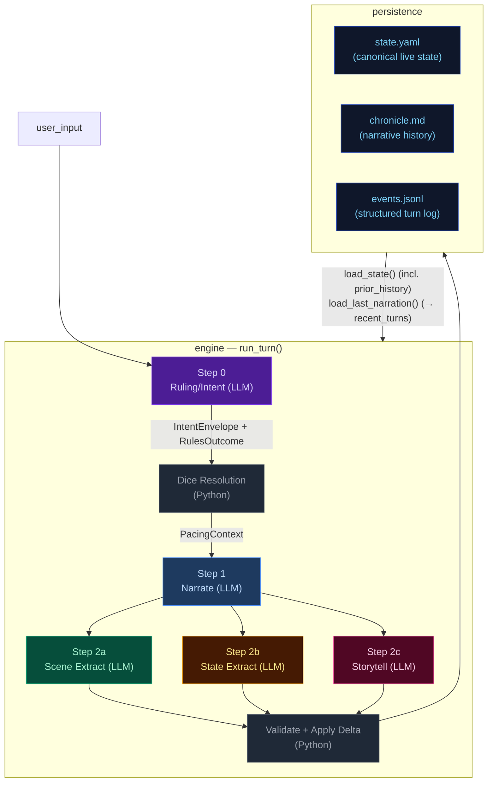

# Architecture Overview — CCYA Engine

CCYA is a local-LLM-backed text RPG engine. Every player turn drives a five-step
pipeline (Rules → Narrate → Scene Extract → State Extract → Storytell) with
a pure-Python validation+persist tail. Two additional LLM pipelines handle new-game
creation: **Character Creation** (static packs) and **Generate Seed** (dynamic packs).

## Pipeline Diagram

## Pipeline Quick Reference

| Step | Docs | When it runs | Key inputs | Key outputs | Mechanics it owns |
|---|---|---|---|---|---|
| **Step 0 — Ruling/Intent** | [step0-ruling](./step0-ruling.md) | Every turn (always) | `state.pc`, `state.location`, `recent_turns[-1:]`, `user_input` | `IntentEnvelope`, `RulesOutcome` | Intent classification, impossibility check, scene motion determination, dice roll resolution (1d12 + stat_mod + diff_mod → band), LLM-driven difficulty adjustment factoring conditions/inventory, anti-declare-outcome enforcement. When `impossible=true`, no roll occurs and Python synthesizes a `fail` outcome. |
| **Step 1 — Narrate** | [step1-narrate](./step1-narrate.md) | Every turn (always, streamed) | Full `state`, `prior_history` (last 20 bullets, all but last rendered), `recent_turns[-1:]`, `pacing_context`, `pending_gm_beat`, `npc_roster` (from build_npc_roster()), `world_factions/locations` | `narrative` (prose) | Prose generation, dice-band binding, GM-beat consumption. Scene motion shaped by `PacingContext.outcome_hint`; impossible actions narrated as natural failures. |
| **Step 2a — Scene Extract** | [step2a-scene](./step2a-scene.md) | Every turn (always) | `narrative`, `state.pc/location`, `npc_roster` (from build_npc_roster()), conditions, compendium entries | `SceneExtractResult`: tagline, location_change, compendium_npc_update | NPC presence, location changes, durable NPC compendium identity. |
| **Step 2b — State Extract** | [step2b-state](./step2b-state.md) | Every turn (always) | `narrative`, `state.pc/location/inventory`, conditions | `StateExtractResult`: inventory_add/remove/update, pc_condition_add/remove | Inventory delta accuracy, condition lifecycle. |
| **Step 2c — Storytell** | [step2c-storytell](./step2c-storytell.md) | Every turn (always) | `narrative`, `_ExtractionContext` (comp_this_turn, location, inventory, conditions), pacing_context, arc.threads[], recent_turns[-10:], band, npc_roster (from build_npc_roster()), recent_beats | `StorytellerResult`: thread_update/goal_update/arc_resolve/resolve/add, gm_beat, actions, outcome_summary | Storyteller-managed thread lifecycle, arc resolution, beat disposition inference, durable history events. |

After Step 2c: results merge into a `StateDelta`, the validator checks constraints
(e.g. `inventory_remove` IDs exist), `apply_delta()` mutates state in-place, and the
turn is persisted. The next turn's Step 0 reads the new `state.yaml` plus `events.jsonl`.

## Subsystem Docs

| Subsystem | Doc | What it covers |
|---|---|---|
| **Step 0 — Ruling** | [step0-ruling](./step0-ruling.md) | Intent classification, dice resolution flowchart, pacing context computation |
| **Step 1 — Narrate** | [step1-narrate](./step1-narrate.md) | Streaming narration pipeline with all context inputs |
| **Step 2a — Scene Extract** | [step2a-scene](./step2a-scene.md) | Location changes, NPC presence, scene tags |
| **Step 2b — State Extract** | [step2b-state](./step2b-state.md) | Inventory and condition extraction |
| **Step 2c — Storytell** | [step2c-storytell](./step2c-storytell.md) | Pipeline mechanics, GM beat lifecycle, campaign arc system, thread lifecycle mechanics |
| **Pacing Systems** | [pacing-systems](./pacing-systems.md) | Interconnected mechanics: momentum, GM beats, pacing context, thread lifecycle, deescalate, and their cross-system interactions
| **Delta → Validate → Apply** | [delta-validate](./delta-validate.md) | StateMerge schema, validation rules, apply_delta mutations |
| **Persist** | [persist](./persist.md) | Atomic writes (events.jsonl, state.yaml, chronicle.md), readback |
| **Cross-Pipeline Data Flow** | [cross-pipeline](./cross-pipeline.md) | Full inter-step data flow diagram |
| **Out-of-Band Pipelines** | [out-of-band](./out-of-band.md) | Character Creation pipeline, Generate Seed pipeline, turn viewer status colors |
| **Narration UI** | [narration-ui](./narration-ui.md) | Main game interface: SSE streaming, HTMX sidebar refresh, Alpine.js state machine |
| **Turn Viewer UI** | [turn-viewer-ui](./turn-viewer-ui.md) | Pipeline debug UI: turn cards, stage inspector, diff panel, live updates |

## Key Models Glossary

### Core Result Types

- **IntentEnvelope**: `intent`, `intent_verb`, `target`, `check.required`, `check.skill`, `check.difficulty`, `impossible`, `reason`, `scene_motion`
- **RulesOutcome**: `rolled`, `skill`, `difficulty`, `stat_value`, `stat_mod`, `diff_mod`, `dice`, `raw_total`, `final_total`, `band`, `directive`, `intent`, `intent_verb`, `impossible`, `reason`
- **SceneExtractResult**: `scene_tagline`, `location_change`, `compendium_npc_update`
- **StateExtractResult**: `inventory_add/remove/update`, `pc_condition_add/remove`
- **StorytellerResult**: `thread_update` (list[ThreadUpdate]), `goal_update` (str | None, applied directly to arc dict), `arc_resolve` (ArcResolution | None), `thread_resolve` (with outcome sentence + promote_to_world_state flag), `thread_add`, `gm_beat`, `actions`, `outcome_summary`
- **SeedEnvelope**: `seed_state: GameState`, `opening_narrative`, `actions`, `arc: CampaignArc` (includes `goal_context` — UI-only, not rendered in prompts; unified `threads[]` with `progress: list[ProgressEntry]`, `completed_threads[]`)

  The seed owns first-turn emotional framing, not just world and arc scaffolding. It generates `goal_context` (character-specific stake), NPC `relation` fields (narrative job relative to PC), and action text written from the PC's voice and scene pressure — ensuring the opening feels personal and motivated from the start.

### PacingContext (see [step0-ruling](./step0-ruling.md#pacing-context))

### GMBeat (see [step2c-storytell](./step2c-storytell.md#gm-beat))

### CampaignArc (see [step2c-storytell](./step2c-storytell.md#campaign-arc-system))

### StateDelta (see [delta-validate](./delta-validate.md))

Merges all three extraction results. Contains `scene_tagline`, `location_change`, `compendium_npc_update` (NPC changes), `thread_update/arc_resolve/thread_resolve/thread_add`, `inventory_add/remove/update`, `pc_condition_add/remove`. Note: `gm_beat` is NOT in StateDelta — written directly to `state.meta.pending_gm_beat`.
