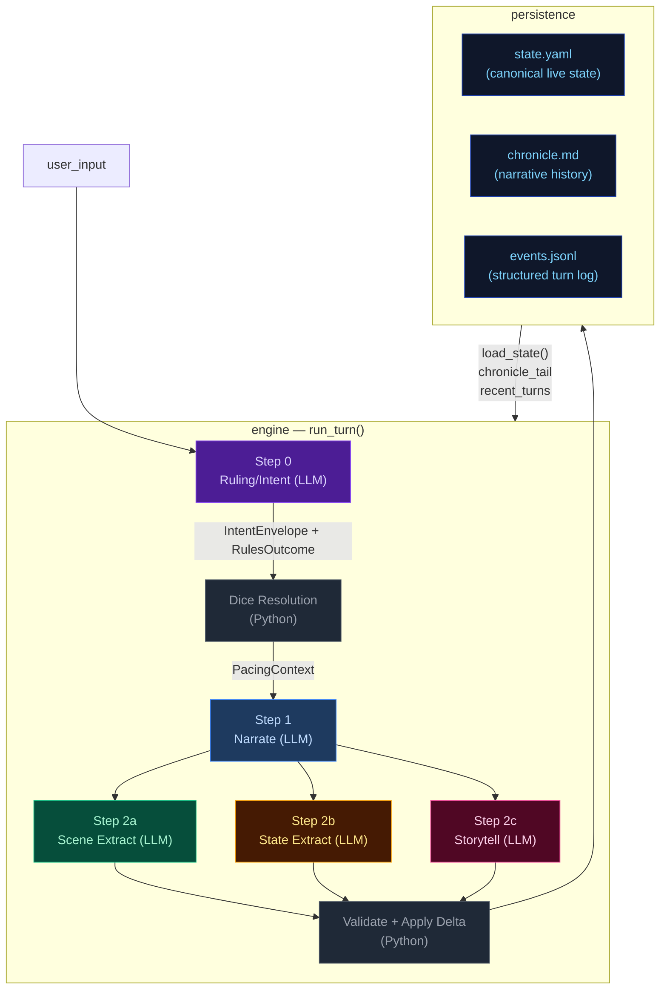

# Architecture Overview — CCYA Engine

CCYA is a local-LLM-backed text RPG engine. Every player turn drives a five-step
pipeline (Rules → Narrate → Scene Extract → State Extract → Progress Extract) with
a pure-Python validation+persist tail. Two additional LLM pipelines handle new-game
creation: **Character Creation** (static packs) and **Generate Seed** (dynamic packs).

## Pipeline Diagram



## Pipeline Quick Reference

| Step | Docs | When it runs | Key inputs | Key outputs | Mechanics it owns |
|---|---|---|---|---|---|
| **Step 0 — Ruling/Intent** | [step0-ruling](./step0-ruling.md) | Every turn (always) | `state.pc`, `state.location`, `recent_turns[-1:]`, `user_input` | `IntentEnvelope`, `RulesOutcome` | Intent classification, dice roll resolution (1d12 + stat + cond − diff → band), difficulty selection, anti-declare-outcome enforcement. |
| **Step 1 — Narrate** | [step1-narrate](./step1-narrate.md) | Every turn (always, streamed) | Full `state`, `chronicle_tail`, `recent_turns`, `pacing_context`, `pending_gm_beat`, `npc_roster` (from build_npc_roster()), `world_factions/locations` | `narrative` (prose) | Prose generation, dice-band binding, GM-beat consumption. Tone shaped by `PacingContext.directive`. |
| **Step 2a — Scene Extract** | [step2a-scene](./step2a-scene.md) | Every turn (always) | `narrative`, `state.pc/location`, `npc_roster` (from build_npc_roster()), conditions, compendium entries | `SceneExtractResult`: scene_tags, tagline, location_change, compendium_npc_update | NPC presence, location changes, scene tags, durable NPC compendium identity. |
| **Step 2b — State Extract** | [step2b-state](./step2b-state.md) | Every turn (always) | `narrative`, `state.pc/location/inventory`, conditions | `StateExtractResult`: inventory_add/remove/update, pc_condition_add/remove | Inventory delta accuracy, condition lifecycle. |
| **Step 2c — Storytell** | [step2c-progress](./step2c-progress.md) | Every turn (always) | `narrative`, `_ExtractionContext` (comp_this_turn, location, inventory, conditions), pacing_context, arc.threads[], recent_turns[-2:], band, npc_roster (from build_npc_roster()) | `StorytellerResult`: thread_advance/resolve/add, gm_beat, world_state_add/remove, actions, outcome_summary | Unified thread lifecycle, beat disposition inference, durable history events. |

After Step 2c: results merge into a `StateDelta`, the validator checks constraints
(e.g. `inventory_remove` IDs exist), `apply_delta()` mutates state in-place, and the
turn is persisted. The next turn's Step 0 reads the new `state.yaml` plus `events.jsonl`.

## Subsystem Docs

| Subsystem | Doc | What it covers |
|---|---|---|
| **Step 0 — Ruling** | [step0-ruling](./step0-ruling.md) | Intent classification, dice resolution flowchart |
| **Step 1 — Narrate** | [step1-narrate](./step1-narrate.md) | Streaming narration pipeline with all context inputs |
| **Step 2a — Scene Extract** | [step2a-scene](./step2a-scene.md) | Location changes, NPC presence, scene tags |
| **Step 2b — State Extract** | [step2b-state](./step2b-state.md) | Inventory and condition extraction |
| **Step 2c — Storytell** | [step2c-progress](./step2c-progress.md) | Thread lifecycle, GMBeat schema, beat lifecycle (3 phases) |
| **PacingContext** | [pacing-context](./pacing-context.md) | Struct definition, computation flowchart, wiring to Narrator/Progress |
| **Delta → Validate → Apply** | [delta-validate](./delta-validate.md) | StateMerge schema, validation rules, apply_delta mutations |
| **Persist** | [persist](./persist.md) | Atomic writes (events.jsonl, state.yaml, chronicle.md), readback |
| **Cross-Pipeline Data Flow** | [cross-pipeline](./cross-pipeline.md) | Full inter-step data flow diagram |
| **Campaign Arcs** | [campaign-arcs](./campaign-arcs.md) | Arc data model (unified threads), engine-driven lifecycle, narrator-driven updates, integration points |
| **Out-of-Band Pipelines** | [out-of-band](./out-of-band.md) | Character Creation pipeline, Generate Seed pipeline, turn viewer status colors |
| **Narration UI** | [narration-ui](./narration-ui.md) | Main game interface: SSE streaming, HTMX sidebar refresh, Alpine.js state machine |
| **Turn Viewer UI** | [turn-viewer-ui](./turn-viewer-ui.md) | Pipeline debug UI: turn cards, stage inspector, diff panel, live updates |
| **Eval Harness** | [eval-harness](./eval-harness.md) | Scenario runner, LLM judges, auto-checkers, REPORT.md generation |

## Key Models Glossary

### Core Result Types

- **IntentEnvelope**: `intent`, `intent_verb`, `target`, `check.required`, `check.skill`, `check.difficulty`
- **RulesOutcome**: `rolled`, `skill`, `difficulty`, `stat_value`, `stat_mod`, `diff_mod`, `cond_mod`, `dice`, `raw_total`, `final_total`, `band`, `directive`, `intent`, `intent_verb`
- **SceneExtractResult**: `scene_tags`, `scene_tagline`, `location_change`, `compendium_npc_update`
- **StateExtractResult**: `inventory_add/remove/update`, `pc_condition_add/remove`
- **StorytellerResult**: `thread_advance`, `thread_resolve` (with outcome sentence), `thread_add`, `gm_beat`, `world_state_add`, `world_state_remove`, `actions`, `outcome_summary`
- **SeedEnvelope**: `seed_state: GameState`, `opening_narrative`, `actions`, `arc: CampaignArc` (includes `goal_context`, unified `threads[]`, `completed_threads[]`), `pc_drive`

  The seed owns first-turn emotional framing, not just world and arc scaffolding. It generates `goal_context` (character-specific stake), NPC `relation` fields (narrative job relative to PC), and action text written from the PC's voice and scene pressure — ensuring the opening feels personal and motivated from the start.

### PacingContext (see [pacing-context](./pacing-context.md))

```
PacingContext:
  directive: str           # "" | "Breathe" | "Scene Imperative" | "Overwhelm" | "Resolve a Threat" | "Pressure" | "Tension" | "Scene Pressure" | "Threat Pressure" (may include "; Resolve a Threat" secondary when beat_locked)
  beat_locked: bool        # True: dual-trigger relief fired (consecutive_pressure_turns >= threshold OR momentum <= floor) — Progress MUST emit breathing_room beat and gate is force-closed
  gate: str                # "block_escalate" | "allow" (controls thread_add)
  summary: str             # human-readable log string, never sent to LLM
```

### GMBeat (see [step2c-progress](./step2c-progress.md))

```
GMBeat
  type: complication | revelation | opportunity | breathing_room | pressure | twist | setback | escalation | callback
  surface_as: ambient | event | npc_behavior | environmental | player_discovery | item (default: ambient)
  beat_expires_turn: int | None (turn number at which the beat expires; set to turn_no + 2 when stored)
```

### CampaignArc (see [campaign-arcs](./campaign-arcs.md))

```
CampaignArc
  visible_goal: str           — What the PC is trying to achieve
  goal_context: str           — 2–3 sentences explaining why visible_goal matters to this character specifically
  thematic_question: str      — The moral/thematic tension of the arc
  pc_drive: str               — The PC's personal motive/reason for being in this situation
  hidden_truths: list[str]    — Story secrets the narrator knows but must not reveal in prose
  discovered_truths: list[str] — Truths the player has uncovered
  threads: list[ArcThread]    — Unified collection with active flag; replaces old active/latent split
  completed_threads: list[ArcThread] — Resolved/failed/abandoned threads

ArcThread (unified)
  id, summary, scope ("scene"|"arc"), active: bool = True
  urgency ("background"|"normal"|"urgent"), urgency_set_turn: int | None
  tags: list[str], progress: int (0..3)
  resolution_state: str | None, outcome: str | None
  last_seen_turn: int | None, added_turn: int | None
  unlock_if: str | None — condition string; thread is only promotable when empty/falsy
  promotes: list[str] — threads this one can promote to when completed
```

### StateDelta (see [delta-validate](./delta-validate.md))

Merges all three extraction results. Contains `scene_tags`, `location_change`, `compendium_npc_update` (NPC changes), `thread_advance/resolve/add`, `inventory_add/remove/update`, `pc_condition_add/remove`, `world_state_add/remove`. Note: `gm_beat` is NOT in StateDelta — written directly to `state.meta.pending_gm_beat`.
