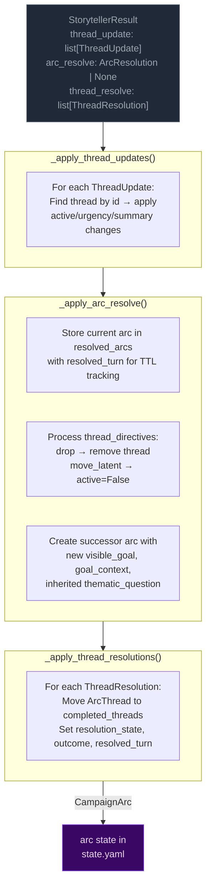
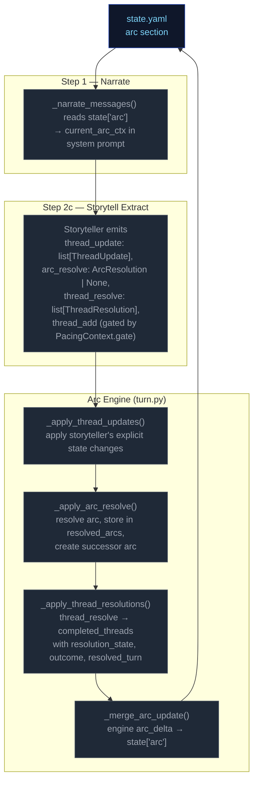

# Campaign Arc System

The campaign arc system tracks story threads across turns. Thread state is **storyteller-managed** — the LLM explicitly controls urgency and active/dormant state via `thread_update` directives. The engine applies these without enforcement of caps, cooldowns, or silent timers.

## Arc Data Model

```
CampaignArc
  visible_goal: str          — What the PC is trying to achieve
  goal_context: str          — 2–3 sentences explaining why visible_goal matters to this character specifically
  thematic_question: str     — The moral/thematic tension of the arc
  threads: list[ArcThread]   — Unified collection with active flag; storyteller controls state via thread_update
  completed_threads: list[ArcThread] — Resolved/failed/abandoned threads
  resolution: str | None     — Set when arc is resolved via arc_resolve
  last_thread_created_turn: int — Tracks when a thread was last created for pacing

ArcThread
  id: str                    — Unique identifier
  summary: str               — What this thread is about
  scope: Literal["scene", "arc"]  # scene = short-lived tied to current location; arc = persistent story tension
  active: bool = True        # Storyteller-controlled via thread_update
  urgency: Literal["background", "normal", "urgent"] = "normal"  # Storyteller-controlled
  tags: list[str]            — Keywords for engagement matching
  resolution_state: str | None # Set when thread_resolve processes resolved/failed/abandoned
  outcome: str | None        # Set from ThreadResolution.outcome when moved to completed_threads
  resolved_turn: int | None  — Turn when thread was resolved; used for TTL filtering in prompts
  key: str | None            — Optional canonical concept label; enables engine-side dedup auto-merge
```

## Engine-Driven Arc: Thread Updates + Arc Resolution

Thread lifecycle runs in `engine/turn.py` during the extraction phase. Three functions handle thread operations in order:



**Pipeline order:** thread updates → arc resolution → thread resolutions.

**Key rules:**
- **Storyteller-controlled:** No caps, cooldowns, or silent timers. The storyteller decides which threads to update via `thread_update` and when to resolve the arc via `arc_resolve`.
- **Arc resolution:** When `arc_resolve` is emitted, the current arc is stored in `state["resolved_arcs"]` with `resolved_turn` for TTL tracking. A successor arc is created with the new `visible_goal`, `goal_context`, and inherited `thematic_question`. Threads not mentioned in `thread_directives` carry over.
- **TTL-based cleanup:** Completed threads and resolved arcs are pruned from prompt context after `completed_thread_ttl` / `resolved_arc_ttl` turns (default 3).

## Arc Context in Narration

The arc state is passed to the narrator via `current_arc` in both system and user prompts. The narrator sees all arc metadata including resolved arcs (TTL-filtered) and completed threads.

### Early-turn narrative mode

When `goal_context` is present on the arc, the narrator treats it as narrative guidance for early turns: ground the player in personal stakes before broad exposition.

### Resolved arc continuity

When resolved arcs are present in the context, the narrator uses them to inform how the new arc relates narratively to what was resolved before — creating continuity across arc transitions.

## Arc System Integration Points


