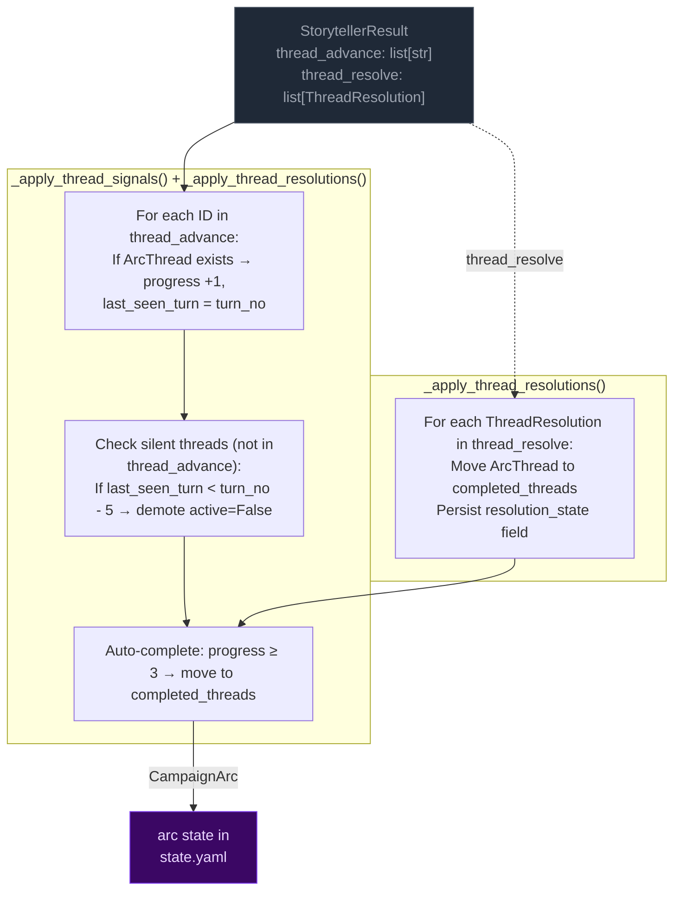
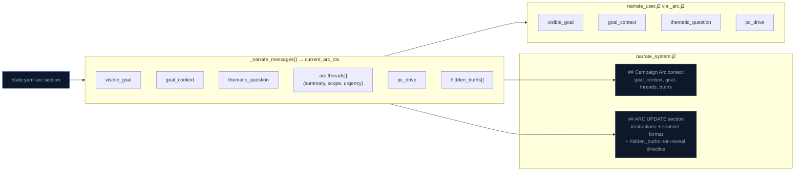
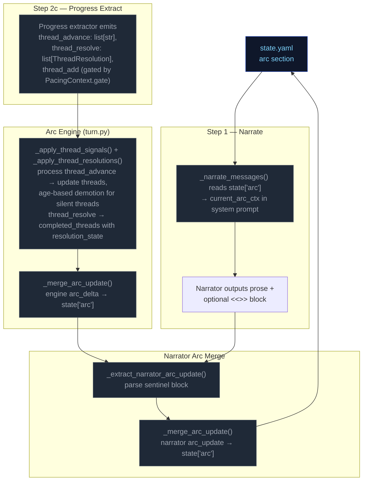

# Campaign Arc System

The campaign arc system tracks story threads and truth discovery across turns. It has two execution paths: **engine-driven** (thread lifecycle with 5-turn expiry for silent threads) and **narrator-driven** (truth discovery, goal updates).

## Arc Data Model

```
CampaignArc
  visible_goal: str          — What the PC is trying to achieve
  goal_context: str          — 2–3 sentences explaining why visible_goal matters to this character specifically; inner cost or pressure that makes it emotionally loaded
  thematic_question: str     — The moral/thematic tension of the arc
  pc_drive: str              — The PC's personal motive/reason for being in this situation; expressed indirectly
  hidden_truths: list[str]   — Story secrets the narrator knows but must not reveal in prose
  discovered_truths: list[str] — Truths the player has uncovered (subset of hidden_truths)
  threads: list[ArcThread]   — Unified collection replacing active_threads + latent_threads split. Each thread has scope ("scene" or "arc") and active flag set by Python age rules, not LLM.
  completed_threads: list[ArcThread] — Resolved/failed/abandoned threads; resolution_state preserved for narrative context

ArcThread (unified)
  id: str                    — Unique identifier
  summary: str               — What this thread is about
  scope: Literal["scene", "arc"]  # scene = short-lived tied to current location; arc = persistent story tension
  active: bool = True        # False = dormant/latent; set by Python age rules (not LLM)
  urgency: Literal["background", "normal", "urgent"] = "normal"
  tags: list[str]            — Keywords for engagement matching
  progress: int              — 0..3 (incremented by thread_advance)
  resolution_state: str | None # Set when thread_resolve processes resolved/failed/abandoned; preserved on completed threads
  last_seen_turn: int | None # For age-based active/dormant demotion in Python
  added_turn: int | None     # Python-managed lifecycle tracking
  unlock_if: str | None      # Condition string; thread is only promotable when empty/falsy
  promotes: list[str]        # Threads this one can promote to when completed
  key: str | None            # Optional canonical concept label (2-4 token snake_case); enables engine-side dedup auto-merge at thread_add time via ≥70% token-overlap scoring on matching keys
```

**Key change from previous architecture:** `scene_pressure[]` and the split between `active_threads` / `latent_threads` are merged into a single `arc.threads[]`. The engine manages thread lifecycle via `_apply_thread_signals()`: age-based demotion (`active: True → False`) replaces the old active/latent migration logic, with silent threads (not listed in `thread_advance` for 5+ turns) being demoted to dormant state.

## Engine-Driven Arc: Unified Thread Lifecycle

Thread lifecycle runs in `engine/turn.py` during the extraction phase, after `apply_delta()` but before narration arc_update merge. Two functions handle the unified thread operations:



**Key rules:**
- **Unified collection:** `arc.threads[]` replaces the old active_threads/latent_threads split. The engine manages thread lifecycle via age-based demotion (`active: True → False`) instead of LLM-labeled urgency states.
- **Completion threshold:** progress reaches 3 → thread moved to `completed_threads`. Resolution state is preserved on completed threads for narrative context and eval rubrics.
- **5-turn expiry (age-based):** Threads not listed in `thread_advance` for 5+ turns get demoted (`active=False`). This replaces the old active→latent migration with a simpler boolean flag that Python manages directly from thread age, not LLM judgment.

## Narrator-Driven Arc: Phase & Truth Updates

The narrator can update arc metadata through a sentinel-delimited JSON block in its output. The engine parses and merges these updates after narration.

```mermaid
flowchart LR
    classDef llmNode fill:#0f172a,color:#94a3b8,stroke:#334155
    classDef sentinel fill:#3b0764,color:#e9d5ff,stroke:#7c3aed
    classDef mergeNode fill:#172554,color:#bfdbfe,stroke:#1d4ed8
    classDef arcNode fill:#3b0764,color:#e9d5ff,stroke:#7c3aed

    subgraph NARRATOR["Narrator prompt context"]
        NC1["visible_goal"]
        NC2["goal_context (early-turn narrative guidance)"]
        NC3["thematic_question"]
        NC5["arc.threads[] (summary, scope,<br>urgency, tags)"]
        NC6["pc_drive"]
        NC7["hidden_truths[] — internal only<br>NARRATOR MUST NOT reveal in prose"]
        NC8["discovered_truths[]"]
    end

    subgraph EMISSION["Narrator output"]
        PROSE["narration prose<br>(player sees this)"]:::llmNode
        SENTINEL["<<<ARC_UPDATE_START>>>
{discovered_truths, visible_goal}
<<<ARC_UPDATE_END>>>"]:::sentinel
    end

    subgraph PARSING["_extract_narrator_arc_update()"]
        P1["Regex: <<<ARC_UPDATE_START>>>(.*?)<<<ARC_UPDATE_END>>>"]
        P2["json.loads() → arc_dict"]
        P3["Strip block from narrative"]
    end

    subgraph MERGE["_merge_arc_update()"]
        M1["visible_goal: overwrite if present"]
        M2["thematic_question: overwrite if present"]
        M3["hidden_truths: overwrite if present"]
        M4["pc_drive: overwrite if present"]
        M5["hidden_truths: overwrite if present"]
        M6["discovered_truths: union with existing"]
        M7["goal_context: NOT merged — seed-only field, unchanged during play"]
    end

    NC1 & NC2 & NC3 & NC5 & NC6 & NC7 & NC8 --> PROSE
    PROSE --> SENTINEL
    SENTINEL --> P1 --> P2 --> P3
    P3 -- "clean narrative" --> CLIENT["client"]
    P2 -- "arc_dict" --> MERGE

    MERGE --> ARC[merge into state["arc"]]:::arcNode
```

**Merge rules:**
- **Engine owns thread lifecycle** (active/dormant/completed via age-based demotion). Narrator arc_update omits thread fields — they are ignored by `_merge_arc_update()`.
- **Narrator owns visible_goal/thematic_question/discovered_truths/hidden_truths.** Engine does not modify these.
- **`goal_context` is seed-only** — set once at game start, never overwritten by narrator or engine during play.
- **Discovered truths:** merged as set union (dedup).
- **Merge order:** engine thread signals run first (setting `delta.arc_update`), then narrator arc_update is parsed after narration and merged on top via a second `_merge_arc_update()` call in `run_turn()`.

## Arc Context in Narration

The arc state is passed to the narrator via `current_arc` in both system and user prompts. The narrator sees all arc metadata including `hidden_truths` but is explicitly instructed not to reveal them in prose.

### Early-turn narrative mode

When `goal_context` is present on the arc, the narrator treats it as narrative guidance for early turns: ground the player in personal stakes before broad exposition. The `goal_context` shapes what detail feels loaded, which NPC moment carries emotional charge, and what pressure matters immediately — without restating or summarizing it explicitly. This signal is provided via `_arc.j2` in the narrate user prompt.

The `goal_context` appears alongside other arc context values in the user prompt for this turn.

### Narrator prompt context



## Arc System Integration Points


