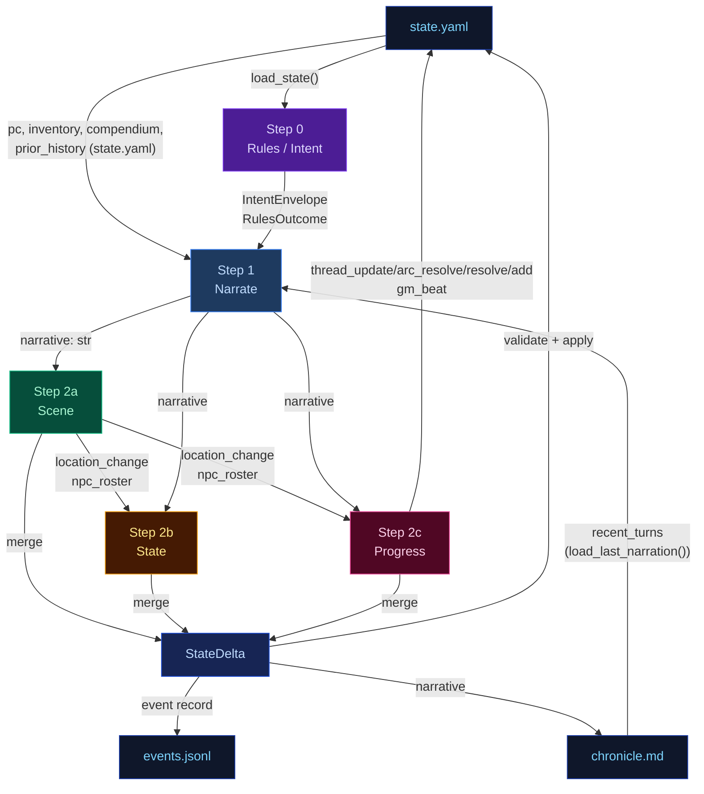

# Cross-Pipeline Data Flow

```mermaid
flowchart TD
    classDef stageRules    fill:#4c1d95,color:#ddd6fe,stroke:#7c3aed
    classDef stageNarrate  fill:#1e3a5f,color:#bfdbfe,stroke:#3b82f6
    classDef stageScene    fill:#064e3b,color:#a7f3d0,stroke:#10b981
    classDef stageState    fill:#451a03,color:#fde68a,stroke:#f59e0b
    classDef stageProgress fill:#500724,color:#fbcfe8,stroke:#ec4899
    classDef storageNode   fill:#0f172a,color:#7dd3fc,stroke:#1e40af
    classDef mergeNode     fill:#172554,color:#bfdbfe,stroke:#1d4ed8

    STATE["state.yaml"]:::storageNode
    CHRONICLE["chronicle.md"]:::storageNode
    EVENTS["events.jsonl"]:::storageNode

    STATE -- "load_state()" --> STEP0["Step 0<br>Rules / Intent"]:::stageRules
    CHRONICLE -- "recent_turns<br>(load_last_narration())" --> STEP1["Step 1<br>Narrate"]:::stageNarrate
    STATE -- "pc, inventory, compendium,<br>prior_history (state.yaml)" --> STEP1
    STEP0 -- "IntentEnvelope<br>RulesOutcome" --> STEP1
    STEP1 -- "narrative: str" --> STEP2A["Step 2a<br>Scene"]:::stageScene
    STEP2A -- "location_change<br>npc_roster" --> STEP2B["Step 2b<br>State"]:::stageState
    STEP1 -- "narrative" --> STEP2B
    STEP2A -- "location_change<br>npc_roster" --> STEP2C["Step 2c<br>Progress"]:::stageProgress
    STEP1 -- "narrative" --> STEP2C
    STEP2A & STEP2B & STEP2C -- "merge" --> DELTA["StateDelta"]:::mergeNode
    DELTA -- "validate + apply" --> STATE
    DELTA -- "event record" --> EVENTS
    DELTA -- "narrative" --> CHRONICLE
    STEP2C -- "thread_update/arc_resolve/resolve/add<br>gm_beat" --> STATE
```
