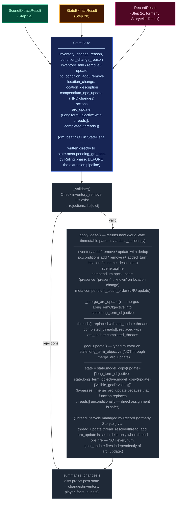

# Delta Merge → Validate → Apply

The three extraction results merge into a single `StateDelta`, then validate and apply.

## Flowchart

```mermaid
flowchart TD
    classDef stageScene    fill:#064e3b,color:#a7f3d0,stroke:#10b981
    classDef stageState    fill:#451a03,color:#fde68a,stroke:#f59e0b
    classDef stageProgress fill:#500724,color:#fbcfe8,stroke:#ec4899
    classDef pyNode        fill:#1f2937,color:#9ca3af,stroke:#4b5563
    classDef mergeNode     fill:#172554,color:#bfdbfe,stroke:#1d4ed8

    SR1["SceneExtractResult<br>(Step 2a)"]:::stageScene
    SR2["StateExtractResult<br>(Step 2b)"]:::stageState
    SR3["RecordResult<br>(Step 2c, formerly StorytellerResult)"]:::stageProgress

    MERGE["StateDelta<br>──────────────────<br>inventory_change_reason, condition_change_reason<br>inventory_add / remove / update<br>pc_condition_add / remove<br>location_change, location_description<br>compendium_npc_update (NPC changes)<br>actions<br>arc_update (LongTermObjective with threads[], completed_threads[])<br><br>(gm_beat NOT in StateDelta —<br>written directly to state.meta.pending_gm_beat<br>by Ruling phase, BEFORE the extraction pipeline)"]:::mergeNode

    VALIDATE["_validate()<br>Check inventory_remove IDs exist<br>→ rejections: list[dict]"]:::pyNode

    APPLY["apply_delta() — returns new WorldState (immutable pattern, via delta_builder.py)<br>──────────────────────────────<br>inventory add / remove / update with dedup<br>pc.conditions add / remove (+ added_turn)<br>location (id, name, description)<br>scene.tagline<br>compendium.npcs upsert (presence='present'→'known' on location change)<br>meta.compendium_touch_order (LRU update)<br><br>_merge_arc_update() — merges LongTermObjective into state.long_term_objective<br>──────────────────────<br>threads[]: replaced with arc_update.threads<br>completed_threads[]: replaced with arc_update.completed_threads<br><br>goal_update() — typed mutator on state.long_term_objective (NOT through _merge_arc_update)<br>──────────────────────<br>state = state.model_copy(update={'long_term_objective': state.long_term_objective.model_copy(update={'visible_goal': value})})<br>(bypasses _merge_arc_update because that function replaces<br> threads[] unconditionally — direct assignment is safer)<br><br>(Thread lifecycle managed by Record (formerly Storytell) via thread_update/thread_resolve/thread_add;<br> arc_update is set in delta only when thread ops fire — NOT every turn.<br> goal_update fires independently of arc_update.)"]:::pyNode

    DIFF["summarize_changes()<br>diffs pre vs post state<br>→ changes{inventory, player, facts, quests}"]:::pyNode

    SR1 --> MERGE
    SR2 --> MERGE
    SR3 --> MERGE
    MERGE --> VALIDATE
    VALIDATE -- "valid" --> APPLY
    VALIDATE -- "rejections" --> DIFF
    APPLY --> DIFF
```
