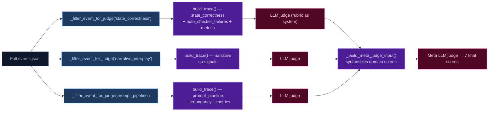

# Eval Harness — Architecture

The eval harness is a standalone CLI (`python -m ccya.eval`) that drives a scenario end-to-end through the engine, evaluates outputs via LLM judges, and produces a structured report. It is Tier 2 of the testing infrastructure — live-LLM, in-process, no FastAPI.

## Three-Phase Pipeline

```mermaid
flowchart LR
    classDef runner fill:#1e3a5f,color:#bfdbfe,stroke:#3b82f6
    classDef judge fill:#4c1d95,color:#ddd6fe,stroke:#7c3aed
    classDef report fill:#064e3b,color:#a7f3d0,stroke:#10b981
    classDef store fill:#0f172a,color:#7dd3fc,stroke:#1e40af

    SCENARIO["Scenario (.py)"]:::store
    CONFIG["evals/config.yaml"]:::store
    EVENTS["events.jsonl"]:::store
    REPORT["REPORT.md"]:::store

    subgraph RUNNER["Phase 01 — Runner"]
        R1["load_scenario()"]:::runner
        R2["load_pack()"]:::runner
        R3["init_save_dir()"]:::runner
        R4["for each turn: run_turn()"]:::runner
        R5["_check_asserts()"]:::runner
        R6["run_universal_asserts()"]:::runner
    end

    subgraph JUDGE["Phase 02 — Judge"]
        J1["build_trace()<br>(per judge filter)"]:::judge
        J2["LLM call: rubric + trace"]:::judge
        J3["parse_judge_response()<br>YAML front matter"]:::judge
        J4["meta judge synthesis"]:::judge
    end

    subgraph REPORT_PHASE["Phase 03 — Report"]
        RP1["flags: regressions, retries,<br>failures, score drops"]:::report
        RP2["judge summary + verdicts"]:::report
        RP3["auto-checker table"]:::report
        RP4["pacing metrics"]:::report
    end

    SCENARIO --> R1
    CONFIG --> R1
    R1 --> R2 --> R3 --> R4
    R4 --> R5 --> R6 --> EVENTS
    EVENTS --> J1 --> J2 --> J3 --> J4
    J4 --> RP1 --> RP2 --> RP3 --> RP4 --> REPORT
```



## Phase 01 — Runner (`runner.py`, `scenario.py`)

The runner is an in-process driver that calls `run_turn()` directly — no HTTP, no SSE.

### Data Structures

```
Scenario:
  id: str                       # unique name
  pack: str                     # which static pack to use
  description: str
  turns: list[Turn]
  seed_overrides: dict          # dotpath overrides to seed state
  track: str                    # "adversarial" (default) or "baseline"

Turn:
  input: str                    # player command
  phase: str                    # free-text tag ("dialogue", "combat", etc.)
  expects: list[str]            # soft annotations (report only)
  asserts: list[TurnAssert]     # structured auto-checker assertions

TurnAssert:
  stream: str                   # "ruling" | "extract.state" | "extract.scene" | "storytell.extract" | "extract" | "state_yaml"
  field: str                    # e.g. "rolled", "inventory_remove", "scene_tags"
  expected: str | None          # None = "must exist"
  min_amount: int | None        # for inventory_remove
  stream_id: str                # for keyed lookups

EvalConfig:
  default_pack, default_scenario
  pack_dirs: list[Path]
  default_save_root: ~/.cache/ccya-eval
  runs_dir: evals/runs
  num_turns: int
  logging: LoggingConfig
  inference: InferenceConfig     # temperature_override, cache
  judges: JudgesConfig           # enabled, specs[], trace options
  report: ReportConfig           # token_warn_pct, token_fail_pct, flag_at_top
```

### Execution Flow

1. **`load_eval_config()`** — reads `evals/config.yaml` into `EvalConfig` dataclass, supports both legacy `judge:` and new `judges.specs:[]` format
2. **`load_scenario(path)`** — imports the Python module, extracts module-level `scenario: Scenario`
3. **`resolve_pack_path()`** — finds pack directory across `pack_dirs`
4. **`init_save_dir()`** — creates isolated save dir under `~/.cache/ccya-eval/<ts>_<rand>/save/`
5. **`_patch_eval_pack_starting_state()`** — injects runtime conditions + `seed_overrides` dotpaths
6. **Turn loop**: for each turn in scenario:
   - Calls `run_turn()` — the same 5-call pipeline (Rules→Narrate→Scene→State→Storytell)
   - Captures `TurnRecord` (duration, errors, narrative chars, parse failures)
   - Runs structured `_check_asserts()` against the turn's event from `events.jsonl`
   - Runs all 22 universal asserts on the event
7. **Writes artifacts**: `events.jsonl`, `run.json`, `<scenario>.state.yaml` (copy of final state) to `evals/runs/<ts>_<rand>/artifacts/`
8. **Updates `latest` symlink**

### Auto-Checker System

Two layers:

**1. Structured asserts** (`_check_asserts` in `runner.py:186`): per-turn `TurnAssert` objects verified deterministically against the turn's event dict. Supports streams:
- `ruling`: `rolled`, `skill`, `difficulty`, `band`, `intent_verb`
- `extract.state`: `inventory_remove`, `inventory_add`, `pc_condition_add`, `pc_condition_remove`
- `extract.scene`: `scene_tags`
- `storytell.extract`: `thread_update`, `thread_resolve`, `thread_add`, `goal_update`, `arc_resolve`
- `extract`: `attempts:<stream>`, `skipped:<stream>`
- `state_yaml`: `pending_gm_beat.present`, `pending_gm_beat.absent`

**2. Universal asserts** (`universal_asserts.py`): 24 deterministic checkers run on every event. Severity: `red` (must fix) or `yellow` (advisory). Cover: turn stamping, GM beat lifecycle, location changes, pacing directive rendering ("directive:" prefix + known value match against Breathe/Scene Imperative/Overwhelm/Pressure/Tension), NPC extraction, ring buffer bounds, scene NPC cap, condition dedup, action count/distinctness, momentum deltas, inventory overdraw, floor relief injection verification, goal_update application verification, ArcThread key deduplication, consecutive pressure tracking (beat-type-based), beat-locked dual trigger validation, removed directive/state detection.

## Phase 02 — Judge (`judge.py`)

Domain-specialized LLM judges evaluate different facets of the pipeline output. The meta judge synthesizes domain results.

### Judge Specs (from `evals/config.yaml`)

| Judge ID | Rubric | Scores Produced |
|---|---|---|---|
| `state_correctness` | `evals/rubrics/state_correctness.md` | state_fidelity_rate, extraction_accuracy_score, mechanic_lifecycle_score |
| `narrative_interplay` | `evals/rubrics/narrative_interplay.md` | narrative_score, system_cohesion_score |
| `prompt_pipeline` | `evals/rubrics/prompt_pipeline.md` | prompt_quality_score, prompt_adherence_rate, pipeline_scores |
| `meta` | `evals/rubrics/meta.md` | 7 final scores (synthesis) |

### Trace Construction

Each judge receives a filtered view of the event data via per-judge field masks (`_JUDGE_EVENT_FIELDS` in `judge.py:82`):



Each trace contains:
1. **Static Context** (once): Engine Design Reference (if available), narrator rules, world rules, factions, seed state, engine constants, all 5 system prompts
2. **Per-Turn Blocks**: user prompts (with dedup of immutable seed sections), engine outputs (ruling parsed+raw, narration, extractor JSON), applied/rejected deltas, suggested actions, context telemetry (token estimates, trimming), state snapshot (diff vs previous, full on first/last turn)
3. **Deterministic Signals**: auto-checker failures table, per-stream metrics (token counts, parse failures, retries, momentum), scope fallback rate, redundancy signals

### Response Parsing (`parse_judge_response`)

Parses LLM output in three formats:
1. ````yaml` code fence
2. `---` delimited YAML front matter
3. Raw YAML at top of response (no delimiters)

Scores normalized via `_normalize_scores`: integer scores clamped to [1,5], rate scores to [0.0, 1.0]. Falls back to regex extraction when YAML parsing fails.

### Parallelism

Domain judges run sequentially (not parallel — likely to change). Meta judge always runs last.

### Track Propagation

The `track` field on `Scenario` controls which scoring rubric sections judges apply:

1. `cli.py` reads `scenario.track` and passes it to `run_judges(track=...)`
2. `run_judges()` injects track into `arch_context` as `**Track:** {track}` (omitted for `"adversarial"` to minimize diff)
3. `arch_context` is appended to each domain judge's system prompt after the rubric
4. Judges receive track context: `state_correctness`, `narrative_interplay`. Judges that don't: `prompt_pipeline`, `meta`

Track is a scenario property, not a CLI flag — `python -m ccya.eval run scenario_name` automatically uses the scenario's declared track.

Rubrics use `## Baseline Track Scoring` sections for per-track thresholds. The default `"adversarial"` track uses existing scoring.

## Phase 03 — Report (`report.py`)

The report is written in a single pass after judges complete:

1. **`write_full_report(run_result, eval_cfg, judge_results=None)`**: writes `REPORT.md` with metadata header, optional judge summary + verdicts (when `judge_results` provided), flags, auto-checker table, pacing metrics, and turn metrics. Uses atomic write (`tmp.replace()`). If no judges are provided, skips all judge-related sections but still renders the full report for `--no-judge` runs.

### Report Structure

```
# Eval Report — <scenario_id>
Metadata (pack, model, temp, track, time, previous run, scoring philosophy)

## Judge Summary
  - Merged scores (all 7 final scores)
  - Domain judge breakdown table
  - Full 7-score comparison vs previous run (with arrows)
  - Links to trace + verdict files

## Flags
  - tokens_regression (worst offender)
  - extraction_retries / extraction_failures
  - rejected_deltas
  - runner_errors
  - rules_parse_failures / extract_parse_failures
  - judge_score_drop (mechanical drop ≥1)
  - score_regression (any domain score decreased vs previous run)
  - judge_output_suspicious (judge returned no analysis text or scores)

## Meta Judge Verdict

## Domain Judge Verdicts

## Auto-Checker (structured assert results)

## Universal Assert Results (summary table)

## State Comparison (diff vs previous run — inventory, thread, condition, quest, NPC ID sets)

## Pacing Metrics
  - Thread duration table
  - Location dwell
  - Momentum floor runs
  - Condition duration

## Turn Metrics (combined table with deltas vs previous run)

## Warnings (token regressions < fail threshold)
```

### Regression Detection

Per-turn, per-stream token-in comparison against the prior run's same turn index. Two thresholds from config:
- `warn_pct` (default 10%): appears in warnings section
- `fail_pct` (default 25%): appears as top flag

Prior run discovered via `find_previous_run()` — looks for the most recent `run.json` in `evals/runs/` with matching `scenario_id`, excluding current run directory.

### Stream Metric Extraction

Five stream keys tracked: `ruling`, `narrate`, `extraction.scene`, `extraction.state`, `extraction.storytell`. Per-stream: `tokens_in`, `tokens_out`, `ms`, `attempts`, `skipped`. Accumulated into totals row at bottom of table.

## CLI (`cli.py`)

```
python -m ccya.eval run [scenario]    # Run end-to-end
  --pack <id>   --temp <float>        # Override pack or temperature
  --no-judge                          # Skip judge phase
  --packs-dir   --turns               # Override packs location or turn count
  --all                               # Run all discovered scenarios
  --gate                              # Exit 1 on red assert failure
  --resume                            # Skip completed judges
  --judge <id>                        # Run specific judge(s) only

python -m ccya.eval judge-only <run>  # Re-run judge against prior run
  --resume  --judge <id>

python -m ccya.eval pack              # Print effective config
python -m ccya.eval list              # List discovered scenarios
```

## Key Design Decisions

1. **Python-based scenarios** (not YAML): get type-checking, IDE autocomplete, refactor support
2. **No server dependency**: calls `run_turn()` directly in-process, no FastAPI/SSE
3. **Isolated save dir per run**: fresh `~/.cache/ccya-eval/<ts>/save/` each time, cleaned up after
4. **Deterministic signals before LLM judge**: auto-checker failures, token metrics, and redundancy signals are computed in Python and injected into the trace. The judge evaluates the same trace every time for the same events.
5. **Per-judge field filtering**: each judge sees only the fields relevant to its rubric, reducing token costs and scoring contamination
6. **Diff state snapshots**: middle turns show only changed state fields (diff vs previous); first and last turns show full state
7. **Immutable section dedup**: seed state sections in user prompts are replaced with a placeholder after the first turn
8. **Meta judge is last**: synthesizes all domain judge scores into final 7-score verdict
9. **Three-tier score normalization**: integer scores clamped [1,5], rate scores [0.0,1.0], fallback regex extraction when YAML parsing fails
10. **Regressions against prior run only**: no multi-run trend tracking, no thresholds from static baselines
