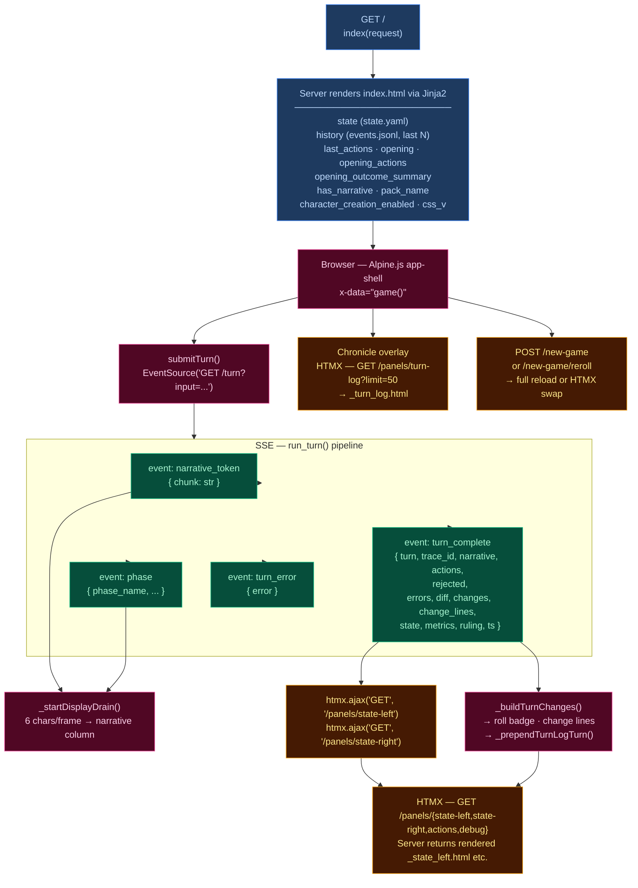

# Narration UI (`/`) — Main Game Interface

The primary player-facing UI. Renders game state, streams narrative tokens live, and refreshes sidebars via HTMX partial swaps. Single-page app driven by Alpine.js + SSE + HTMX.

## Interaction Model

## Layout

| Region | Element | Content |
|--------|---------|---------|
| **Header** | `.header-bar` | Logo/tagline, Chronicle toggle, turn counter, retry button, new game button, reroll button (dynamic packs), mock-mode dot |
| **Left sidebar** | `.sidebar-left` | Player card, scene NPCs, location, arc, compendium — loaded via `/panels/state-left` |
| **Narrative column** | `.narrative-column` | Scrollable narrative blocks, action pills, input textarea, send/stop button |
| **Right sidebar** | `.sidebar` (right) | Inventory, recent events, world state, debug panel — loaded via `/panels/state-right` |
| **Chronicle overlay** | `.turn-log-shell` | Floating overlay over narrative column, populated by `/panels/turn-log?limit=50` |
| **New Game modal** | (Alpine `x-show`) | Pack picker → char creation / world builder steps |

## Data Flow

### Turn submission (Alpine.js + SSE)

1. User types input, presses Enter → `game().submitTurn()`
2. Opens `EventSource` to `GET /turn?input=<text>` — SSE endpoint in `routes.py:238`
3. Server streams events as the 5-stage pipeline (`run_turn()`) executes:
   - `narrative_token` — token chunks streamed as they arrive from LLM
    - `phase` — pipeline phase progress (ruling_start, narrate_start, narrate_first_token, narrate_done, extract_stream_start, extract_stream_done, extract_start, extract_done, sanitize_start, sanitize_done, persist); ruling_start includes `expected_ms` and `pre_stream_expected_ms` (sum of avg ruling + avg first_token_ms); narrate_start includes `expected_ms`; extract_stream_done includes `expected_ms` and `stream`
   - `turn_complete` — final result
   - `turn_error` — error payload
4. Client `_startDisplayDrain()`: reveals 6 characters per animation frame for smooth streaming
5. On `turn_complete`:
   - Calls `htmx.ajax('GET', '/panels/state-left', ...)` and `htmx.ajax('GET', '/panels/state-right', ...)` to refresh sidebars
   - Renders change lines (`_buildTurnChanges`), roll badge
   - Prepends turn to Chronicle overlay via `_prependTurnLogTurn`
   - Re-renders markdown via `marked.parse()`

### HTMX partial endpoints (routes.py)

| Route | Template | Purpose |
|-------|----------|---------|
| `GET /panels/state-left` | `_state_left.html` | Left sidebar — player, NPCs, location, arc, compendium |
| `GET /panels/state-right` | `_state_right.html` | Right sidebar — inventory, events, world state, debug |
| `GET /panels/actions` | `_actions.html` | Action pills (fallback) |
| `GET /panels/turn-log?limit=N` | `_turn_log.html` | Chronicle — turn history with change lines |
| `GET /panels/pack-picker` | `_pack_picker.html` | New Game — pack selection cards |
| `GET /panels/char-creation` | `_char_creation.html` | New Game — character stats builder |
| `GET /panels/world-builder` | `_world_builder.html` | New Game — world creation form |
| `GET /panels/debug` | `_debug.html` | Debug panel — recent turn timings, errors |
| `GET /panels/state` | `_state.html` | Combined left+right |

### Client state machine (`game()` in `fablethread/static/game.js`)

Alpine.js `x-data="game()"` manages:
- `input` — textarea value
- `submitting` — turn-in-progress flag
- `gameStarted` — derived from `has_narrative`
- `turnNum` — current turn counter
- `leftWidth` / `rightWidth` — resizable sidebar widths (persisted to `localStorage`)
- Card collapse state — read/written directly from/to `localStorage` via `CCYA_CARD_KEY(name)` helper, using DOM `data-card` attributes; no Alpine data property

## UI Features

### Resizable sidebars
- Drag gutters with mousedown/mousemove handlers
- Widths saved to `localStorage` (`fablethread_sidebar_left`, `fablethread_sidebar_right`)
- Minimum width enforcement (240px left, 220px right)
- **Reset button** in sidebar footer: restores viewport-aware defaults (left 320px, right 280px) on click
- **Ultrawide override** (≥2561px viewport): `--sidebar-w: min(512px, 38vw)` — sidebar defaults to 2x standard width. Sidebar text scaled ~25% smaller via explicit `.sidebar-card-header`, `.stat-row`, `.npc-notes-inline`, `.inventory-item`, etc. overrides in the ultrawide media query.

### Collapsible cards
Each sidebar section has a collapse toggle; open/closed state persisted per-card to `localStorage` via `fablethread_card_<name>` key.

### Action pills
Suggested next actions rendered as buttons that populate the input on click. Updated from `turn_complete.actions` or via HTMX panel refresh.

### Roll badge
Server-rendered for history, JS-built for new turns. Shows dice math, band label, outcome summary. Band colors: `crit_fail` (red) → `fail` → `setback` → `partial` → `success` → `crit_success`.

### Change lines
Grouped by category via emoji prefix:
| Emoji | Category | Class |
|-------|----------|-------|
| 🎒 + | Inventory gain | `.tc-inv-gain` |
| 🎒 − | Inventory loss | `.tc-inv-loss` |
| 🩺 | Player condition | `.tc-pl` |
| 📍 | Location | `.tc-loc` |
| 📜 | Faction/arc | `.tc-fa` |

### Cancel
`POST /turn/cancel` sets a cancel flag on the running turn, waits for it to finish, then returns `{"ok": true, "cancelled": true}`. Does NOT remove events or revert state — the in-flight turn's events remain in the history.

### Retry
`POST /turn/delete` removes all events for the last turn from `events.jsonl` (including sanitizer events on turns divisible by `sanitize_every`) and `chronicle.md`, restores `last_turn_state` from the deleted turn's event, and returns previous actions for re-submission.

### New Game
`POST /new-game` with optional `pack_id`, `pc_name`, `pc_stats`, `hints`. Triggers two-step `prepare_seed()` (temp 0.4) → `narrate_seed()` (temp 0.9) LLM pipeline with player overrides injected if hints are provided. Full page reload on success. Reroll (`POST /new-game/reroll`) HTMX-swaps the opening narrative + actions.

## CSS File Layout

| File | Lines | Domain |
|------|-------|--------|
| `fablethread/static/tokens.css` | 76 | Tailwind directives, design tokens, base reset, fluid typography |
| `fablethread/static/app-shell.css` | 2781 | Main game UI — app shell layout, header, narrative column, action pills, input bar, sidebars, sidebar cards (player/NPCs/inventory/arc/facts/errors/debug), pack picker modal, responsive/mobile drawer, game over modal, character creation, settings panel, entity highlighting, landing page, gutter hints |
| `fablethread/static/chronicle.css` | 312 | Chronicle overlay — turn log shell, panel, blocks, scrollbar styling |
| `fablethread/static/turn-viewer.css` | 1319 | Standalone full-page debug view — pipeline status cards, stage identity, event tables, no-save state |
- **`app.src.css`** is the monolithic Tailwind entry point — unchanged during the split, all 4 files extracted alongside it for human readability
- **Fluid typography**: 3-tier `@media` breakpoints set `html { font-size: clamp(...) }`:
  | Viewport | Font size clamp | Applicable to |
  |---|---|---|
  | 769–1400px | `clamp(15px, 1vw, 17px)` | Tablet/small desktop |
  | 1401–2560px | `clamp(22px, 1.56vw, 26px)` | Standard desktop |
  | ≥2561px | `clamp(24px, 1.5vw, 27px)` | Ultrawide (also sets `--sidebar-w: min(512px, 38vw)`) |
  - Font sizes throughout are in `rem` units, scaling proportionally with the base.
- **Location panel fix**: Hardcoded `px` font sizes replaced with `rem` units to respect fluid base.
- Compiled to **`app.css`** with cache-busting via `css_v` query param

## JS File Layout

| File | Lines | Domain |
|------|-------|--------|
| `fablethread/static/game-utils.js` | 781 | Pure utility functions — card key helper, markdown rendering, entity highlighting, tooltip portal, display drain, progress strip, turn log UI, outcome badge builder, change line grouping |
| `fablethread/static/game.js` | 1161 | Alpine components — `charCreation()`, `worldBuilder()`, `game()` (panel state, drawers, pack picker, turn submission/streaming/SSE handlers, retry/cancel, settings) |
| `fablethread/static/app-init.js` | 163 | DOM initialization — first `DOMContentLoaded` (settings panel wiring, save picker, landing page), second `DOMContentLoaded` (markdown rendering, entity highlighting on history, card persistence, HTMX handlers, pills layout, gutter setup, collapsed hints) |

## Server Entry Point

`routes.py:195` — `GET /` handler assembles template context from `state.yaml`, `events.jsonl`, pack manifest, and engine config, then renders `fablethread/templates/index.html`.
