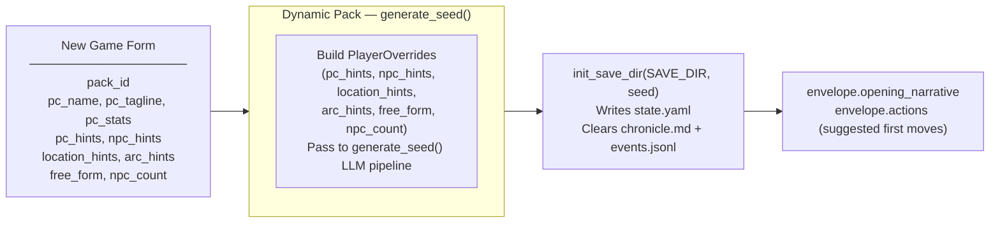
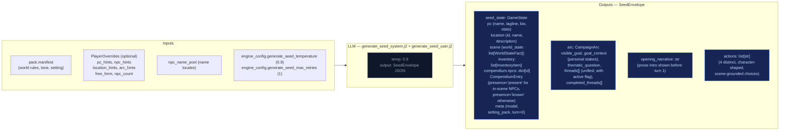

# Out-of-Band Pipelines

These run only at new-game time or are non-engine concerns. They are excluded from the eval-context region of the main architecture doc.

## Character Creation Pipeline

Triggered by `POST /new-game`. All packs use the Generate Seed pipeline (dynamic). Static packs with pre-built seed_state.yaml exist but are not used by new_game.

## Generate Seed Pipeline (Dynamic Packs Only)

Called by `POST /new-game` and `POST /new-game/reroll`. Generates a complete starting game state (PC, NPCs, location, arc, opening narrative, actions) from the pack manifest and optional player overrides.

The seed owns **first-turn emotional framing** — not just world and arc scaffolding. Every seed element must produce an emotionally legible opening that answers: why this moment matters now, what the character stands to lose, and why at least one person in the scene matters to them personally.

### Seed emotional framing contract

The seed prompt (`generate_seed_system.j2`) enforces these requirements:

- **`goal_context`**: 2–3 sentences explaining why `visible_goal` matters to this character specifically — inner cost or pressure that makes it emotionally loaded. No hidden-truth spoilers, no restating `visible_goal`, no direct statement of the thematic question. Must connect character motive, story stakes, and emotional cost.
- **NPC `relation` field**: Each opening NPC has a defined narrative job. One NPC is personally tied to the PC's motive or vulnerability; the other carries immediate external pressure from the world or conflict. The `relation` field encodes PC-facing relevance (e.g. "owes them a favor", "is their only contact here", "represents the institution pressing on them").
- **Compendium NPCs**: The seed also generates 2–3 NPCs in `compendium.npcs` (name, title, bio) who exist in the world but are not present in the opening scene. Their bios tie them to factions, locations, or world pressures, not to the immediate situation. These become discoverable characters during play.
- **Action guidance**: Each of the 4 choices is written from the PC's point of view, grounded in a present NPC, immediate risk, active thread, or character motive. They differ in emotional posture (confront, deflect, investigate, protect, exploit, withdraw, etc.) and avoid generic verbs.
- **`threads[]`**: Unified list (not split active/latent) where each thread has `{id, summary, urgency, scope}` and an `active` boolean flag managed by the storyteller via `thread_update`, not Python age rules. Threads also have a `progress` free-text field set via `thread_update[].progress`.

## Turn Viewer — status colors

The standalone turn viewer ([turn-viewer-ui](./turn-viewer-ui.md)) uses the same semantic status colors as the CSS custom properties in `static/app.src.css` (`--status-*`). The stage colors used in the diagrams above (`stageRules` violet → `stageNarrate` blue → `stageScene` green → `stageState` amber → `stageProgress` pink) map directly to the `--stage-*` tokens. Cross-stream inputs into a step are shown in `xstream` (purple outline) and LLM/Python boxes use neutral dark fills. This table is the canonical turn-viewer status legend.

| Token | Meaning |
|-------|---------|
| `--status-ok` | Stage ran and completed (no extraction error). |
| `--status-skipped` | Stream was skipped (no longer used — all streams always run). |
| `--status-retried` | LLM output required a parse retry (`attempts` > 1 in event). |
| `--status-rejected` | Post-extract validation rejected part of the delta (e.g. bad `inventory_remove`). |
| `--status-error` | LLM call or parse ultimately failed for that stream. |
| `--status-neutral` | Non-fatal / informational (e.g. rules path with no dice roll). |

Stage accent stripes use `--stage-rules`, `--stage-narrate`, `--stage-scene`, `--stage-state`, `--stage-progress` for quick scanning; **status** always wins for the prominent left border.
