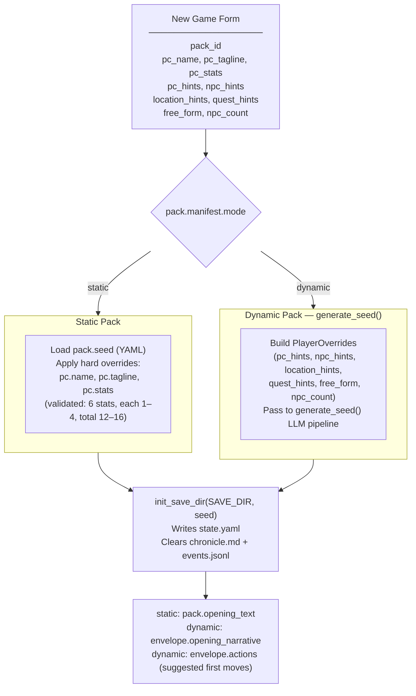
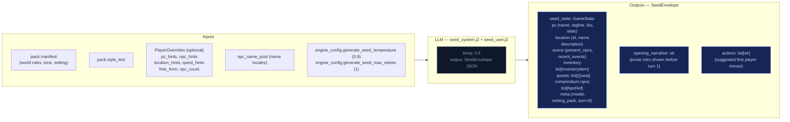

# Out-of-Band Pipelines

These run only at new-game time or are non-engine concerns. They are excluded from the eval-context region of the main architecture doc.

## Character Creation Pipeline

Triggered by `POST /new-game`. Behavior differs by pack mode.

## Generate Seed Pipeline (Dynamic Packs Only)

Called by `POST /new-game` and `POST /new-game/reroll`. Generates a complete starting game state (PC, NPCs, location, quests, opening narrative) from the pack manifest and optional player overrides.

## Turn Viewer (`/turn_viewer`) — status colors

The standalone turn viewer uses the same semantic status colors as the CSS custom properties in `static/app.src.css` (`--status-*`). The stage colors used in the diagrams above (`stageRules` violet → `stageNarrate` blue → `stageScene` green → `stageState` amber → `stageProgress` pink) map directly to the `--stage-*` tokens. Cross-stream inputs into a step are shown in `xstream` (purple outline) and LLM/Python boxes use neutral dark fills. This table is the canonical turn-viewer status legend.

| Token | Meaning |
|-------|---------|
| `--status-ok` | Stage ran and completed (no extraction error). |
| `--status-skipped` | Stream was skipped (no longer used — all streams always run). |
| `--status-retried` | LLM output required a parse retry (`attempts` > 1 in event). |
| `--status-rejected` | Post-extract validation rejected part of the delta (e.g. bad `inventory_remove`). |
| `--status-error` | LLM call or parse ultimately failed for that stream. |
| `--status-neutral` | Non-fatal / informational (e.g. rules path with no dice roll). |

Stage accent stripes use `--stage-rules`, `--stage-narrate`, `--stage-scene`, `--stage-state`, `--stage-progress` for quick scanning; **status** always wins for the prominent left border.
