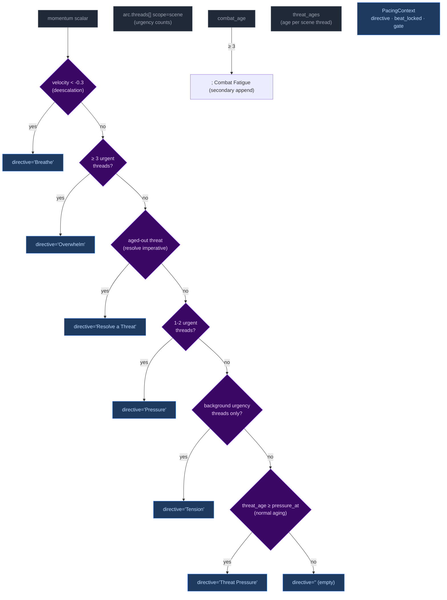
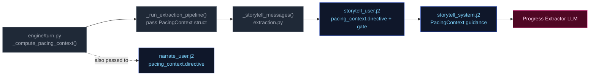

# PacingContext

All pacing signals are collapsed into one Python-computed struct (`PacingContext`) passed to both the Narrator and Progress Extractor. This replaces six independent fields (`narration_directive`, `deescalate`, `narrative_velocity`, `beat_disposition` output, `quest_threshold_directive`, and stale momentum-derived signals). The narrator receives `directive`; Progress receives the full struct.

## Struct definition

```
PacingContext:
  directive: str           # "" | "Breathe" | "Pressure" | "Overwhelm" | "Tension" | "Resolve a Threat" | "Threat Pressure"
  beat_locked: bool        # True: floor relief fired — Progress MUST emit breathing_room beat and gate is force-closed
  gate: str                # "block_add" | "block_escalate" | "allow" (controls thread_add)
  summary: str             # human-readable log string, never sent to LLM
```

`beat_locked: True` subsumes the old `_check_floor_relief()` side-channel — floor relief logic is computed inside `_compute_pacing_context()`. The `gate` field prevents Progress from adding new threads during de-escalation windows. Secondary modifiers like "Combat Fatigue" may be appended via semicolons (e.g., "Pressure; Combat Fatigue").

## Computation

`_compute_pacing_context()` in `engine/turn.py` consolidates pacing computation (replacing the former scattered functions: `_compute_narration_directive`, `_compute_narrative_velocity`, `_check_floor_relief`). It takes inputs (`momentum`, `consecutive_floor_turns`, `arc.threads[] scope=scene urgency counts`, combat age, location age) and returns a single struct with directive derived from the same priority stack:



Priority order (highest to lowest): **Breathe > Overwhelm > Resolve a Threat > Pressure > Tension > Threat Pressure > (empty)**. The `beat_locked` flag takes precedence — when at momentum floor, directive is forced to include "Resolve a Threat" and gate is force-closed when directive is "Breathe".

## Wiring: how PacingContext reaches the pipelines



1. **Computed** once in `run_turn()` via `_compute_pacing_context()`.
2. **Passed through** `_run_extraction_pipeline()` → both `_narrate_messages()` and `_storytell_messages()`.
3. **Narrator template** (`narrate_user.j2`) renders only `directive` (tone/direction). No Jinja2 directive computation remains — all directives computed by Python.
4. **Storytell template** ((`storytell_system.j2` + `user.j2`)) receives the full struct; guidance maps each directive to appropriate thread/beat actions:

| Directive | Thread action | Gate |
|-----------|---------------|-------|
| **"Breathe"** (de-escalation, velocity < -0.3) | Do NOT add new threads. Allow existing scene threads to persist without escalation. | `block_add` + force-closed when at momentum floor |
| **"Overwhelm"** (3+ urgent threads) | May add scene-scoped threads if gate allows; emit pressure/escalation beat | `allow` |
| **"Resolve a Threat"** (aged-out threat imperative) | Advance the aged thread toward resolution; avoid adding new complications | `allow` |
| **"Pressure"** (1-2 urgent or aging threats) | Advance relevant scene/arc threads. Add new thread only if gate permits. | Varies by context |
| **"Tension"** (background urgency only) | Do NOT add pressures unless concrete threat emerges; prefer advancing existing threads | Allow |
| **"Threat Pressure"** (normal urgency aging) | Escalate urgency of the aging thread; consider advancing | Allow |
| **"" (empty)** | No action required beyond normal aging of silent threads. | Allow |

**Note:** Directives may include secondary modifiers joined by semicolons (e.g., "Pressure; Combat Fatigue"). The primary directive drives thread/beat logic; the secondary acts as a thematic modifier on beat type.
