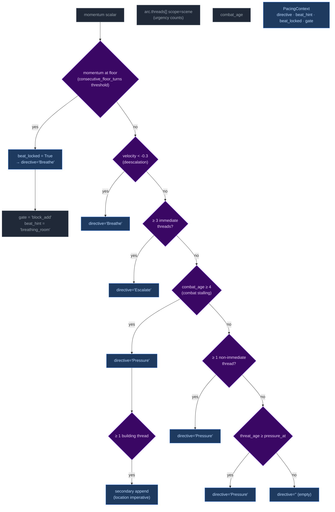
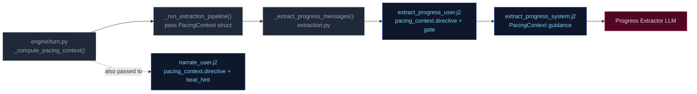

# PacingContext

All pacing signals are collapsed into one Python-computed struct (`PacingContext`) passed to both the Narrator and Progress Extractor. This replaces six independent fields (`narration_directive`, `deescalate`, `narrative_velocity`, `pending_beat`, `beat_disposition` output, `quest_threshold_directive`). The narrator receives only `directive` and `beat_hint`; Progress receives the full struct.

## Struct definition

```
PacingContext:
  directive: str           # "" | "Breathe" | "Pressure" | "MoveOn" | "Escalate"
  beat_hint: str | None    # suggested gm_beat type, or None
  beat_locked: bool        # True: floor relief fired — Progress MUST emit breathing_room beat and gate is force-closed
  gate: str                # "block_add" | "block_escalate" | "allow" (controls thread_add)
  summary: str             # human-readable log string, never sent to LLM
```

`beat_locked: True` subsumes the old `_check_floor_relief()` side-channel — floor relief logic is computed inside `_compute_pacing_context()`. The `gate` field prevents Progress from adding new threads during de-escalation windows.

## Computation

`_compute_pacing_context()` in `engine/turn.py` consolidates all pacing computation (replacing the former scattered functions: `_compute_narration_directive`, `_compute_narrative_velocity`, `_check_floor_relief`). It takes inputs (`momentum`, `consecutive_floor_turns`, `arc.threads[] scope=scene urgency counts`, combat age, location age) and returns a single struct with directive derived from the same priority stack:



Priority order (highest to lowest): **Breathe > Escalate > Pressure > (empty)**. The `beat_locked` flag takes precedence — when floor relief fires, directive is forced to "Breathe" and gate is force-closed.

## Wiring: how PacingContext reaches the pipelines



1. **Computed** once in `run_turn()` via `_compute_pacing_context()`.
2. **Passed through** `_run_extraction_pipeline()` → both `_narrate_messages()` and `_extract_progress_messages()`.
3. **Narrator template** (`narrate_user.j2`) renders only `directive` (tone/direction) and `beat_hint` when present. No Jinja2 directive computation remains — all directives computed by Python.
4. **Progress template** (`extract_progress_system.j2` + `user.j2`) receives the full struct; guidance maps each directive to appropriate thread/beat actions:

| Directive | Thread action | Beat hint | Gate |
|-----------|--------------|-----------|------|
| **"Breathe"** (floor relief) | Do NOT add new threads. Allow existing scene threads to persist without escalation. | `breathing_room` | `block_add` + force-closed |
| **"Escalate"** | Add thread if gate allows; advance active threads proactively. | `pressure` / `escalation` | Depends on momentum |
| **"Pressure"** | Advance relevant scene/arc threads. Add new thread only if gate permits. | `complication` / `pressure` | Varies by context |
| **"" (empty)** | No action required beyond normal aging of silent threads. | None | Allow |
