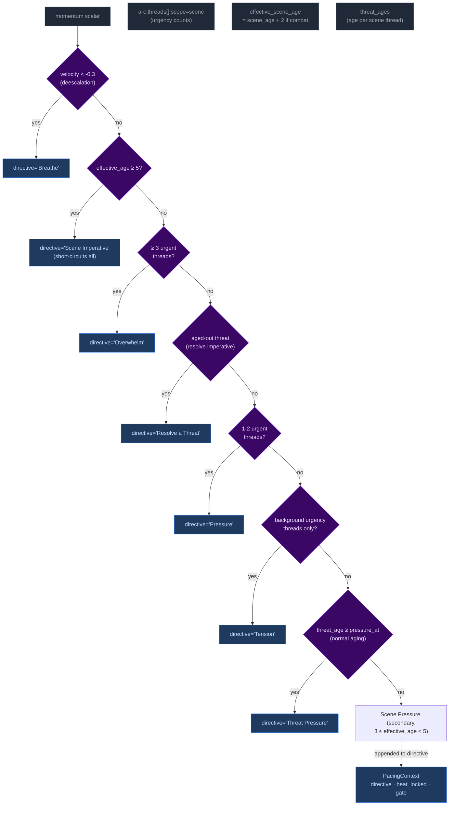
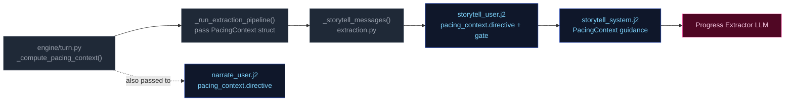

# PacingContext

All pacing signals are collapsed into one Python-computed struct (`PacingContext`) passed to both the Narrator and Progress Extractor. This replaces six independent fields (`narration_directive`, `deescalate`, `narrative_velocity`, `beat_disposition` output, `quest_threshold_directive`, and stale momentum-derived signals). The narrator receives `directive`; Progress receives the full struct.

## Struct definition

```
PacingContext:
  directive: str           # "" | "Breathe" | "Scene Imperative" | "Overwhelm" | "Resolve a Threat" | "Pressure" | "Tension" | "Scene Pressure" | "Threat Pressure" (may include "; Resolve a Threat" secondary when beat_locked)
  beat_locked: bool        # True: relief fired — Progress MUST emit breathing_room beat and gate is force-closed
  gate: str                # "block_escalate" | "allow" (controls thread_add)
  summary: str             # human-readable log string, never sent to LLM
```

`beat_locked: True` fires when either `consecutive_pressure_turns >= config.consecutive_pressure_threshold` OR `momentum <= config.momentum_floor`. When locked, `"Resolve a Threat"` is appended to the directive via semicolon. The `gate` field prevents Progress from adding new threads during de-escalation windows.

## Computation

`_compute_pacing_context()` in `engine/turn.py` consolidates pacing computation (replacing the former scattered functions: `_compute_narration_directive`, `_compute_narrative_velocity`, `_check_floor_relief`). It takes inputs (`momentum`, `consecutive_pressure_turns` from state meta, `arc.threads[] scope=scene urgency counts`, threat ages) and returns a single struct with directive derived from the same priority stack:



Priority order (highest to lowest): **Breathe > Scene Imperative > Overwhelm > Resolve a Threat > Pressure > Tension > Scene Pressure > Threat Pressure**. The `beat_locked` flag takes precedence — when either consecutive pressure threshold or momentum floor is reached, directive gets `"Resolve a Threat"` appended and gate may be force-closed.

### Age computation (Phase 03 collapse)

`_compute_ages(state)` returns only `{"scene_age": scene_age}` — location_age and combat_age removed in Phase 03 pacing overhaul. The ruling phase pre-computes `effective_scene_age = scene_age + 2` when `"combat"` is in scene tags, stored in `ctx._ages["effective_scene_age"]`. This single-age signal drives all directive thresholds:
- Scene Imperative (≥5 effective age): high-priority directive forcing story advancement
- Scene Pressure (3 ≤ effective_age < 5): secondary append to wind down or shift focus

## Wiring: how PacingContext reaches the pipelines



1. **Computed** once in `run_turn()` via `_compute_pacing_context()`.
2. **Passed through** `_run_extraction_pipeline()` → both `_narrate_messages()` and `_storytell_messages()`.
3. **Narrator template** (`narrate_user.j2`) renders only `directive` (tone/direction). No Jinja2 directive computation remains — all directives computed by Python.
4. **Storytell template** ((`storytell_system.j2` + `user.j2`)) receives the full struct; guidance maps each directive to appropriate thread/beat actions:

| Directive | Thread action | Gate |
|-----------|---------------|-------|
| **"Breathe"** (de-escalation, velocity < -0.3) | Do NOT add new threads. Allow existing scene threads to persist without escalation. | `block_escalate` + force-closed when at momentum floor |
| **"Scene Imperative"** (effective_age ≥ 5) | Story must advance — introduce new development forcing resolution or movement; do not linger | Varies by context |
| **"Overwhelm"** (3+ urgent threads) | May add scene-scoped threads if gate allows; emit pressure/escalation beat | `allow` |
| **"Resolve a Threat"** (aged-out threat imperative, or beat_locked secondary) | Advance the aged thread toward resolution; avoid adding new complications | `allow` |
| **"Pressure"** (1-2 urgent or aging threats) | Advance relevant scene/arc threads. Add new thread only if gate permits. | Varies by context |
| **"Tension"** (background urgency only) | Do NOT add pressures unless concrete threat emerges; prefer advancing existing threads | Allow |
| **"Scene Pressure"** (3 ≤ effective_age < 5, secondary append) | Begin winding down or introduce reason to shift focus: development elsewhere, closing window | Varies by context |
| **"Threat Pressure"** (normal urgency aging) | Escalate urgency of the aging thread; consider advancing | Allow |
| **"" (empty)** | No action required beyond normal aging of silent threads. | Allow |

**Note:** Directives may include secondary modifiers joined by semicolons (e.g., "Pressure; Resolve a Threat" when beat_locked). The primary directive drives thread/beat logic; the secondary acts as thematic guidance for beat type selection.

## Consecutive pressure counter

`state["meta"]["consecutive_pressure_turns"]` tracks how many consecutive turns have had Pressure or Overwhelm directives without any threads being advanced by the storyteller. Updated via two-pass logic at turn end (~turn.py ~1450): increments when directive was Pressure/Overwhelm AND `thread_advance` is empty; resets to 0 otherwise (directive not Pressure/Overwhelm OR any threads were advanced). When this counter reaches `config.consecutive_pressure_threshold` (default 3), it triggers the dual-trigger beat_locked condition alongside momentum floor relief.

## GM Beat lifecycle (Phase 03 carryover fix)

`pending_gm_beat` is written to state after storytelling if non-null gm_beat emitted, with `beat_expires_turn = turn_no + 2`. Consumed read-gated at turn_no <= beat_expires_turn in _narrate_setup. Cleared only on replacement or expiry — both unconditional clears were removed from turn.py (post-narration clear and else block re-clear). Beat write logic in Progress step only writes if `beat_locked` AND no existing pending_gm_beat exists, preventing overwrites during locked windows.
