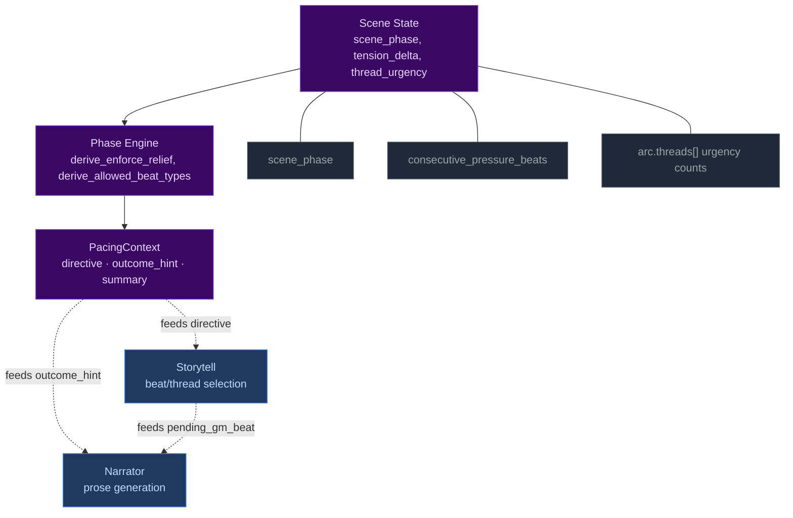
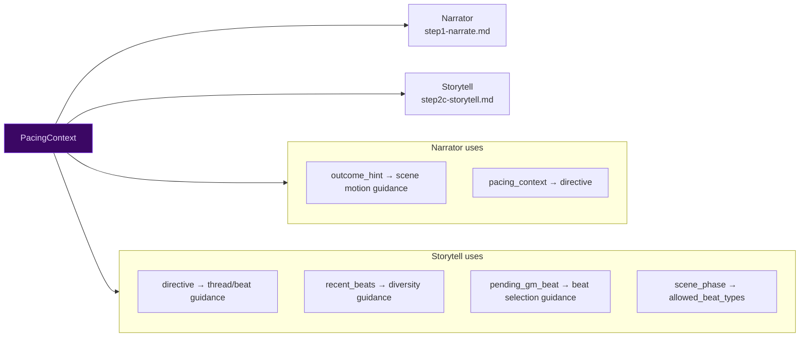
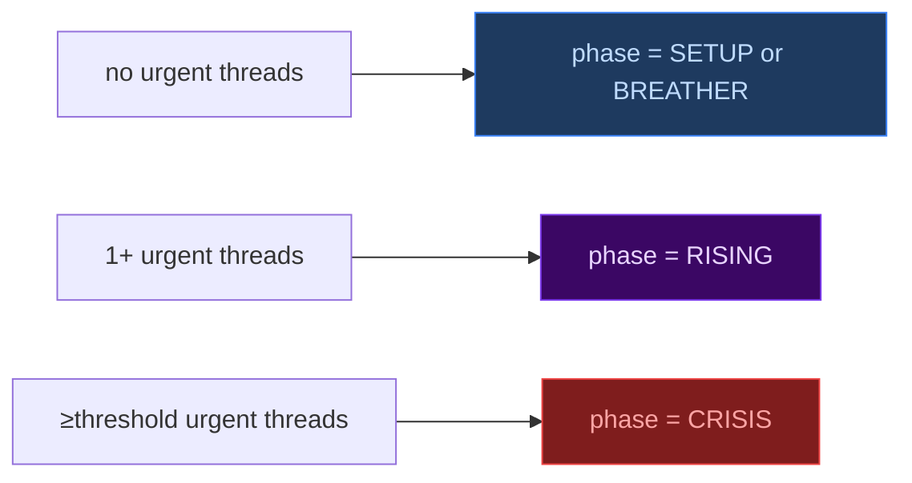
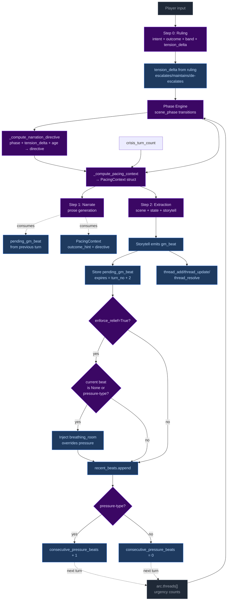

# Pacing Systems — Phase Engine

> **NOTE:** The old momentum-based pacing system was removed in Plan 4. This document describes the current phase engine system only.

CCYA's pacing is driven by a phase engine that computes scene rhythm from thread urgency, tension_delta, and scene age.

## 1. The Phase Engine



## 2. Phase Engine

### Definition

The phase engine tracks `state["scene"]["scene_phase"]` through five states: SETUP, RISING, CRISIS, RESOLUTION, BREATHER. Transitions are driven by thread urgency, scene age, and tension_delta.

### Phase transitions

| From | To | Condition |
|------|-----|-----------|
| SETUP | RISING | Urgent thread appears |
| RISING | CRISIS | ≥threshold urgent threads OR escalates+urgent OR age≥pressure_threshold |
| CRISIS | RESOLUTION | crisis_turn_count≥limit |
| Any (non-RESOLUTION) | SETUP | Location change (scene_entered == current_turn) |
| RESOLUTION | BREATHER | Always (location change doesn't redirect RESOLUTION) |
| BREATHER | RISING | Urgent thread appears OR breather_max_turns elapsed |

### Consecutive pressure counter

`state["meta"]["consecutive_pressure_beats"]` tracks how many consecutive turns have had pressure-type storyteller beats.

- **Increments** when `storyteller_result.gm_beat.type` is `"pressure"`, `"escalation"`, or `"complication"`.
- **Resets to 0** on any other beat type, null beat, or missing storyteller output.

When this counter reaches `config.consecutive_pressure_threshold` (default 3), it contributes to `enforce_relief=True` which forces breathing_room beats during CRISIS phase.

### Floor relief

When `enforce_relief=True` (derived from scene phase and consecutive_pressure_beats), the system injects `breathing_room` beats to prevent pressure fatigue.

## 3. GM Beats

### Definition

Forward-facing storytelling beats emitted by the storyteller, consumed by the narrator, managed via `state.meta.pending_gm_beat`. Each beat has a `type`, `surface_as`, and TTL of 2 turns.

### Beat types

| Type | Category | Typical use |
|------|----------|-------------|
| `complication` | Pressure | New problem emerges |
| `escalation` | Pressure | Existing tension intensifies |
| `pressure` | Pressure | General scene pressure |
| `revelation` | Neutral | Discovery, info-drop |
| `opportunity` | Positive | Chance, opening |
| `breathing_room` | Recovery | Respite, moment to breathe |
| `twist` | Neutral | Plot twist, unexpected |
| `setback` | Pressure | PC loses ground |
| `callback` | Neutral | Reference to past events |

### Beat lifecycle


### How beats feed into other systems

```mermaid
flowchart LR
    BEAT["gm_beat.type"] --> COUNTER{"pressure types?"}<br>pressure, escalation, complication
    COUNTER -- yes --> PRESS["consecutive_pressure_beats + 1"]
    COUNTER -- no --> RESET["consecutive_pressure_beats = 0"]

    PRESS --> RELIEF{"≥ threshold?"}
    RELIEF -- yes --> ENFORCE["enforce_relief=True → breathing_room"]

    BEAT -. "narrative guidance" .-> NARR["Narrator<br>weaves beat into prose"]
    BEAT -. "diversity guidance" .-> ST["Storytell<br>avoid repeat types"]

    style BEAT fill:#3b0764,color:#e9d5ff,stroke:#7c3aed
    style ENFORCE fill:#1e3a5f,color:#bfdbfe,stroke:#3b82f6
```

### Code locations

| File | Line(s) | What |
|------|---------|------|
| `turn.py` | 68 | `PRESSURE_BEAT_TYPES` definition |
| `turn.py` | 762-767 | Pre-narration expiry check |
| `turn.py` | 1012-1019 | New beat replacement / null-clear |
| `turn.py` | 1021-1034 | Floor relief injection |
| `turn.py` | 1036-1044 | Consecutive pressure counter |
| `turn.py` | 1139-1150 | Beat history snapshot |
| `changes.py` | 333-373 | General change summarization (conditions, facts, threads, inventory) |

## 4. Pacing Context

### Definition

`PacingContext` is a Python-computed struct that collapses all pacing signals into one authoritative value, passed to both Narrator and Storytell pipelines.

### Struct fields

```
PacingContext:
  directive: str           # "Breathe" | "Scene Imperative" | "Scene Pressure" | ""
  outcome_hint: str | None # "hold" | "transition"
  summary: str             # Human-readable log, never sent to LLM
```

### How each field is computed

```mermaid
flowchart TD
    classDeci fill:#3b0764,color:#e9d5ff,stroke:#7c3aed
    classOut fill:#1e3a5f,color:#bfdbfe,stroke:#3b82f6
    classIn fill:#1f2937,color:#9ca3af,stroke:#4b5563

    TD["tension_delta<br>escalates/maintains/de-escalates"]:::In
    T["arc.threads[] urgency counts"]:::In
    SA["effective_scene_age = scene_age"]:::In
    PH["scene_phase"]:::In
    CTC["crisis_turn_count"]:::In

    TD --> D1{"== 'de-escalates'<br>AND urgency==0?"}:::Deci
    D1 -- yes --> B1["directive = 'Breathe'"]:::Out
    D1 -- no --> D2{"phase==CRISIS<br>AND crisis_turns≥limit?"}:::Deci
    D2 -- yes --> B2["directive = 'Scene Imperative'"]:::Out
    D2 -- no --> D3{"effective_age ≥ imperative_threshold?"}:::Deci
    D3 -- yes --> B3["directive = 'Scene Imperative'"]:::Out
    D3 -- no --> D4{"effective_age ≥ pressure_threshold?"}:::Deci
    D4 -- yes --> B4["directive = 'Scene Pressure'"]:::Out
    D4 -- no --> B5["directive = ''"]:::Out

    SM["scene_phase == CRISIS AND crisis_turn_count ≥ limit?"]:::In --> OH["outcome_hint = 'transition' if crisis limit met, else 'hold'"]:::Out

    style Deci fill:#3b0764,color:#e9d5ff,stroke:#7c3aed
    style Out fill:#1e3a5f,color:#bfdbfe,stroke:#3b82f6
    style In fill:#1f2937,color:#9ca3af,stroke:#4b5563
```

### How PacingContext is consumed



### Code locations

| File | Line(s) | What |
|------|---------|------|
| `turn.py` | 98-108 | `PacingContext` dataclass definition |
| `turn.py` | 447-486 | `_compute_pacing_context()` |
| `turn.py` | 408-444 | `_compute_narration_directive()` |
| `turn.py` | 776 | `tension_delta` extraction from ruling |
| `turn.py` | 804-813 | `_narrate_setup()` calls `_compute_pacing_context` |
| `narrate_user.j2` | 100-103 | `outcome_hint`, `pacing_context` |
| `storytell_user.j2` | 27-28 | `directive`, `outcome_hint` |
| `storytell_user.j2` | 30-31 | `scene_phase`, `allowed_beat_types` |
| `storytell_user.j2` | 32-41 | `pending_gm_beat` |
| `storytell_user.j2` | 42-46 | `recent_beats` |
| `storytell_user.j2` | 13-17 | `threads` |

## 5. Thread Lifecycle

### Definition

`arc.threads[]` tracks story threads across turns. Thread state is storyteller-managed via `thread_update`, `thread_add`, `thread_resolve`, and `arc_resolve`. The engine enforces structural constraints (caps, staleness, urgency decay).

### Thread urgency and phase transitions



### Engine-enforced constraints (not storyteller-managed)

| Constraint | Condition | Effect |
|------------|-----------|--------|
| Auto-latent demotion | Thread untouched for 3 turns | `active: false` |
| Urgency decay | Thread at same urgency for 8 turns | `urgent→normal→background` |
| Thread cap eviction | Active threads > 5 on `thread_add` | Evict oldest active |
| Progress dedup | ≥50% overlap with last progress entry | Reject new entry |

### Code locations

| File | Line(s) | What |
|------|---------|------|
| `turn.py` | 113-238 | `_apply_thread_updates()` |
| `turn.py` | 316-405 | `_apply_thread_resolutions()` |
| `turn.py` | 243-313 | `_apply_arc_resolve()` |
| `turn.py` | 1235-1272 | Thread add gate + cap eviction |
| `ccya/state/io.py` | 138 | `save_state()` |
| `thread_sanitizer.py` | 20-133 | Urgency escalation + cap |
| `thread_sanitizer.py` | 20-34 | Wrapper for exception safety |
| `turn.py` | 1387 | Invocation in `run_turn()` |

## 6. Complete Interaction Map

### How all systems interact in a single turn



### Cross-system variable map

| Variable | Set by | Consumed by | Effect |
|----------|--------|-------------|--------|
| `tension_delta` | Ruling phase (band + intent) | Phase transitions, directive computation | Accelerant for phase transitions |
| `scene_phase` | Phase engine | Directive, beat constraints, outcome_hint | Primary pacing signal |
| `consecutive_pressure_beats` | Beat type check (post-extraction) | enforce_relief, phase relief injection | Tracks pressure streaks |
| `pending_gm_beat` | Storytell (or floor relief) | Narrator, beat history, pressure counter | Forward-facing storytelling beat |
| `arc.threads[].urgency` | Storytell (thread_update) + Python decay | Phase transitions, directive computation | Scene tension level |
| `PacingContext.directive` | `_compute_pacing_context()` | Narrator, Storytell, prompt rendering | Primary scene instruction |
| `PacingContext.outcome_hint` | `_compute_pacing_context()` (phase + crisis turns) | Narrator scene motion | How the scene should progress |

## 7. Typical Rhythm Patterns

### Pattern 1: Pressure cycle

```
T1:  phase=SETUP, no pressure beat → directive=""
T2:  storyteller emits pressure beat → consecutive_pressure_beats=1
T3:  urgent thread appears → phase=RISING, consecutive_pressure_beats=2
T4:  phase=CRISIS, consecutive_pressure_beats=3 → enforce_relief=True
T5:  breathing_room injected, consecutive_pressure_beats resets
T6:  phase transitions to RESOLUTION → BREATHER
```

### Pattern 2: Crisis resolution

```
T1:  phase=CRISIS, crisis_turn_count=1, tension_delta=escalates
T2:  phase=CRISIS, crisis_turn_count=2, tension_delta=maintains
T3:  phase=CRISIS, crisis_turn_count=3, tension_delta=de-escalates
T4:  crisis_turn_count≥limit → phase=RESOLUTION, outcome_hint=transition
T5:  phase=BREATHER (RESOLUTION always transitions to BREATHER)
T6:  normal rhythm continues
```

### Pattern 3: BREATHER recovery

```
T1:  phase=BREATHER, tension_delta=de-escalates, no urgent threads
T2:  phase=BREATHER, storyteller surfaces opportunity beat
T3:  latent thread becomes urgent → phase=RISING
T4:  phase=RISING, tension_delta=escalates → phase=CRISIS
T5:  phase=CRISIS, crisis_turn_count=1
T6:  normal crisis rhythm continues
```

## 8. Configuration Reference

| Config key | Default | System | Effect |
|------------|---------|--------|--------|
| `crisis_urgency_threshold` | 2 | Phase Engine | Urgent threads needed for CRISIS transition |
| `crisis_turn_limit` | 4 | Phase Engine | Max turns in CRISIS before RESOLUTION |
| `breather_max_turns` | 3 | Phase Engine | Max turns in BREATHER before forced RISING |
| `scene_pressure_threshold` | 3 | Pacing Context | Scene Pressure secondary directive threshold |
| `scene_imperative_threshold` | 4 | Pacing Context | Scene Imperative directive threshold |
| `consecutive_pressure_threshold` | 3 | GM Beats | Triggers enforce_relief when reached during CRISIS |
| `recent_beats_max` | 5 | GM Beats | Max entries in recent_beats history |
| `thread_stale_threshold` | 3 | Thread Lifecycle | Auto-latent demotion after N turns |
| `thread_max_active` | 5 | Thread Lifecycle | Thread cap, oldest evicted on overflow |
| `thread_urgency_max_age` | 8 | Thread Lifecycle | Urgency decay after N turns at same level |

## 9. Code Locations Summary

### Core computation functions

| Function | File | Line(s) | Computes |
|----------|------|---------|----------|
| `_compute_scene_phase()` | `turn.py` | 505-584 | Phase transitions from thread urgency, tension_delta, scene age |
| `_compute_narration_directive()` | `turn.py` | 408-444 | Phase + tension_delta + age → directive |
| `_compute_pacing_context()` | `turn.py` | 447-486 | All signals → PacingContext |
| `_compute_ages()` | `turn.py` | 491-502 | Scene age computation |
| `derive_enforce_relief()` | `_pacing.py` | 32-34 | Phase + consecutive beats → enforce_relief flag |
| `derive_allowed_beat_types()` | `_pacing.py` | 22-29 | Phase → allowed beat types |
| `sanitize_threads()` | `thread_sanitizer.py` | 20-133 | Urgency escalation + cap |

### Beat lifecycle functions

| Function | File | Line(s) | What |
|----------|------|---------|------|
| Pre-narration expiry | `turn.py` | 762-767 | Expire stale beats |
| New beat replacement | `turn.py` | 1012-1019 | Store storyteller beat |
| Floor relief injection | `turn.py` | 1021-1034 | Inject breathing_room |
| Pressure counter | `turn.py` | 1036-1044 | Track pressure streaks |
| Beat history snapshot | `turn.py` | 1139-1150 | Append to recent_beats |

### Thread lifecycle functions

| Function | File | Line(s) | What |
|----------|------|---------|------|
| `_apply_thread_updates()` | `turn.py` | 113-238 | Apply storyteller updates |
| `_apply_thread_resolutions()` | `turn.py` | 316-405 | Move threads to completed |
| `_apply_arc_resolve()` | `turn.py` | 243-313 | Resolve arc, create successor |
| Thread add gate | `turn.py` | 1235-1272 | Gate check + cap eviction |

### EV checkers

| Checker | File | What it validates |
|---------|------|-------------------|
| `phase_transition` | `ccya/ev/checkers/phase_transition.py` | Phase engine transitions follow the state machine, outcome_hint consistency |
| `tension_delta` | `ccya/ev/checkers/tension_delta.py` | tension_delta field presence, valid values, directive consistency |
| `recent_beats` | `ccya/ev/checkers/recent_beats.py` | recent_beats list structure, cap, monotonic turn numbers |
| `pacing_directives` | `ccya/ev/checkers/pacing.py` | Pressure tracking, outcome hint, directive render, removed directives, beat variety, phase constraints |
| `gm_beat_lifecycle` | `ccya/ev/checkers/gm_beat.py` | Beat consumption, lifecycle, floor relief, binding |
| `phase_persistence` | `ccya/ev/checkers/phase_persistence.py` | scene_phase field present and valid on every turn (regression guard) |
| `scene_age_tracking` | `ccya/ev/checkers/scene_age_tracking.py` | scene_age increments by 1 each turn, resets on location change |
| `crisis_turn_counting` | `ccya/ev/checkers/crisis_turn_counting.py` | crisis_turn_count increments in CRISIS, resets on phase exit |
| `tension_monotonicity` | `ccya/ev/checkers/tension_monotonicity.py` | tension_delta field presence, valid values, phase consistency |
| `breather_enforcement` | `ccya/ev/checkers/breather_enforcement.py` | breather auto-transitions to RISING after breather_max_turns |
| `roll_band_consistency` | `ccya/ev/checkers/roll_band_consistency.py` | band matches dice roll using rules engine, skill/difficulty valid |
| `beat_phase_validity` | `ccya/ev/checkers/beat_phase_validity.py` | gm_beat.type is allowed for the current phase |

### Prompt rendering

| Template | What it renders |
|----------|----------------|
| `narrate_user.j2` | `outcome_hint`, `pacing_context` |
| `narrate_system.j2` | Beat integration guidance (includes `pending_gm_beat`), priority ordering |
| `storytell_user.j2` | `directive`, `outcome_hint`, `scene_phase`, `allowed_beat_types`, `pending_gm_beat`, `recent_beats`, `threads` |
| `storytell_system.j2` | Thread operations, beat schema, directive-beat alignment, phase constraints |
