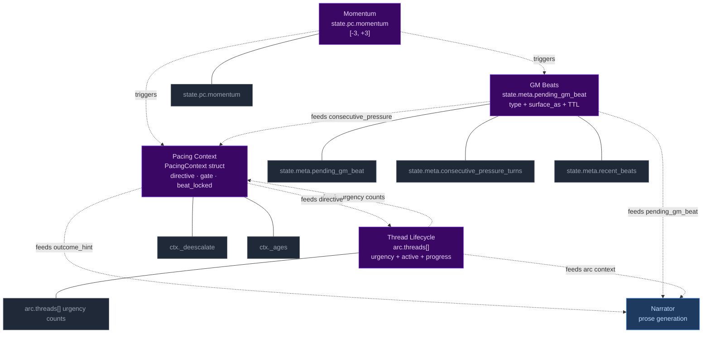
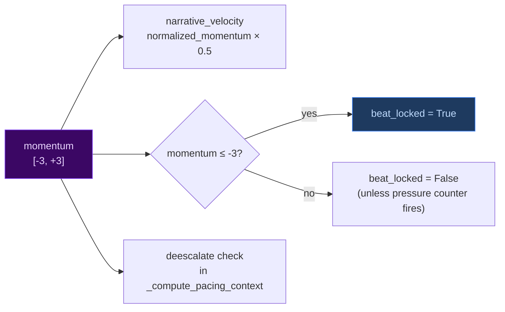
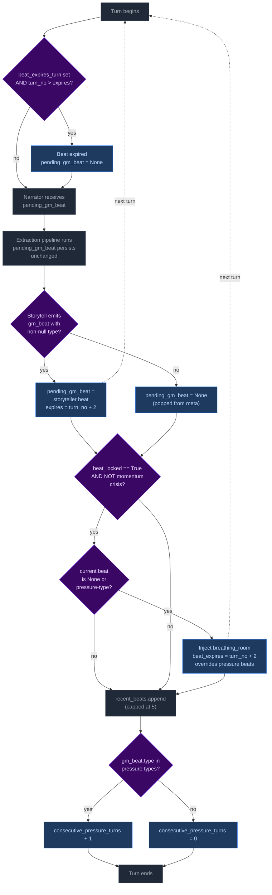
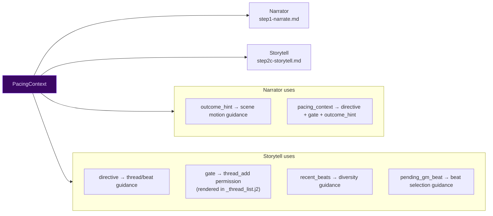
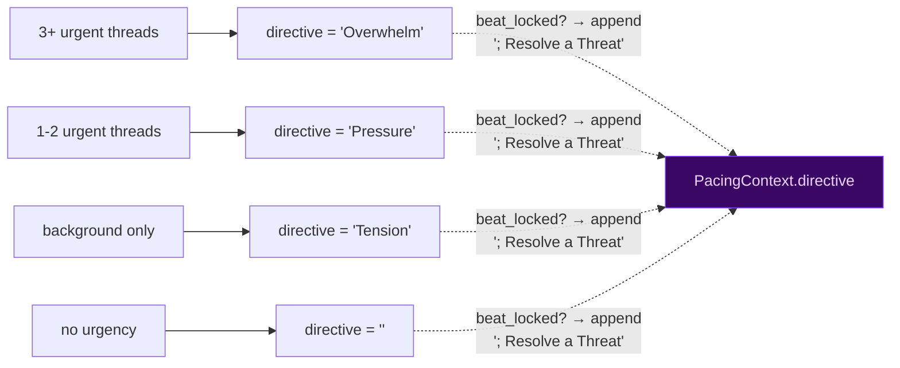
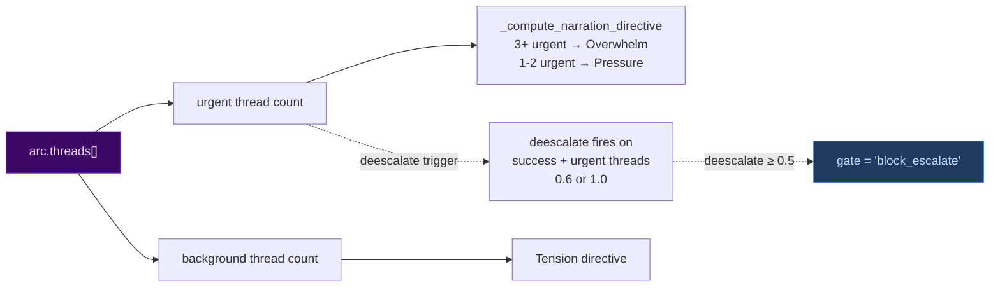
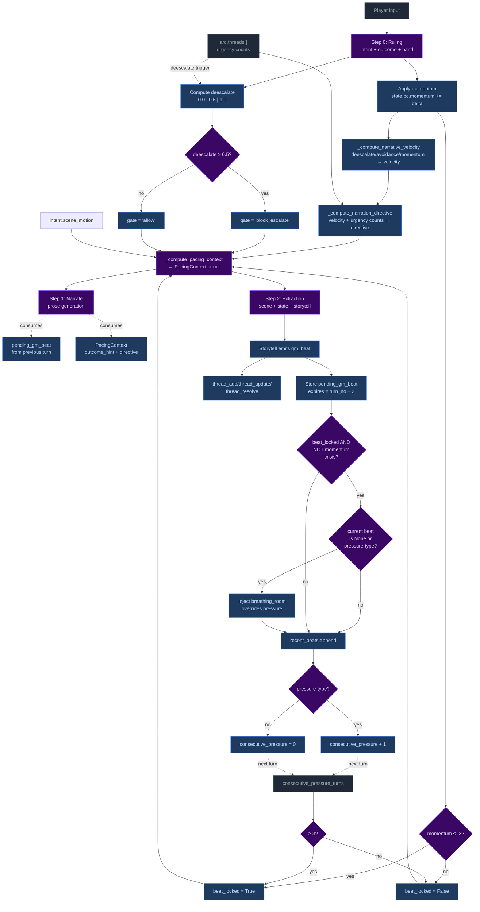

# Pacing Systems — Interconnected Mechanics

CCYA's pacing is not a single mechanism but four interlocking systems that share state, trigger each other, and produce emergent scene rhythm. This document maps every connection, variable, and code path.

## 1. The Four Systems



## 2. Momentum

### Definition

`state.pc.momentum` is an integer in `[-3, +3]` representing narrative fortune. It shifts based on dice roll outcomes and drives urgency, beat injection, and floor relief.

### How it changes

| Source | Condition | Effect |
|--------|-----------|--------|
| Ruling phase (turn.py) | `band == "crit_success"` | `+2` |
| Ruling phase | `band == "success"` | `+1` |
| Ruling phase | `band == "partial"` | `0` (no change) |
| Ruling phase | `band == "setback"` | `-1` |
| Ruling phase | `band == "fail"` | `-1` |
| Ruling phase | `band == "crit_fail"` | `-2` |
| Ruling phase | `impossible=true` | `-1` (forced fail, no roll) |
| Ruling phase | `avoidance` detected | `-1` |

Momentum is clamped to `[-3, +3]` after each modification.

### How momentum is consumed

Momentum feeds into three downstream systems:



- **Narrative velocity** (for directive computation): if `deescalate > 0`, returns `-deescalate`; if `avoidance`, returns `-0.4`; otherwise normalizes momentum to `[-1.0, 1.0]` range and scales by `pacing_factor` (default 0.5)
- **Beat locking**: `momentum <= -3` is one of two triggers for `beat_locked`
- **Deescalate**: momentum itself doesn't directly set deescalate, but low momentum makes failure more likely, which prevents deescalate from firing (deescalate requires success)

### Code locations

| File | Line(s) | What |
|------|---------|------|
| `ccya/state/momentum.py` | 16-37 | `apply_momentum()` — applies momentum deltas from ruling |
| `turn.py` | 410-433 | `_compute_narrative_velocity()` — momentum/deescalate → velocity |
| `turn.py` | 533-536 | `_compute_pacing_context()` — momentum → `beat_locked` |
| `turn.py` | 1358-1360 | Event logging — `momentum_before`, `momentum_after`, `momentum_delta` |

## 3. GM Beats

### Definition

Forward-facing storytelling beats emitted by the storyteller, consumed by the narrator, managed via `state.meta.pending_gm_beat`. Each beat has a `type`, `surface_as`, and TTL of 2 turns.

### Beat types

| Type | Category | Typical use |
|------|----------|-------------|
| `complication` | Pressure | New problem emerges |
| `escalation` | Pressure | Existing tension intensifies |
| `pressure` | Pressure | General scene pressure |
| `revelation` | Neutral | Discovery, info-drop |
| `opportunity` | Positive | Chance, opening |
| `breathing_room` | Recovery | Respite, moment to breathe |
| `twist` | Neutral | Plot twist, unexpected |
| `setback` | Pressure | PC loses ground |
| `callback` | Neutral | Reference to past events |

### Beat lifecycle



### How beats feed into other systems

```mermaid
flowchart LR
    BEAT["gm_beat.type"] --> COUNTER{"pressure types?"}<br>pressure, escalation, complication
    COUNTER -- yes --> PRESS["consecutive_pressure_turns + 1"]
    COUNTER -- no --> RESET["consecutive_pressure_turns = 0"]

    PRESS --> BL{"≥ 3?"}
    BL -- yes --> BL2["beat_locked = True"]

    BEAT -. "narrative guidance" .-> NARR["Narrator<br>weaves beat into prose"]
    BEAT -. "diversity guidance" .-> ST["Storytell<br>avoid repeat types"]

    style BEAT fill:#3b0764,color:#e9d5ff,stroke:#7c3aed
    style BL2 fill:#1e3a5f,color:#bfdbfe,stroke:#3b82f6
```

### Code locations

| File | Line(s) | What |
|------|---------|------|
| `turn.py` | 68 | `PRESSURE_BEAT_TYPES` definition |
| `turn.py` | 773-779 | Pre-narration expiry check |
| `turn.py` | 1024-1033 | New beat replacement / null-clear |
| `turn.py` | 1036-1051 | Floor relief injection |
| `turn.py` | 1053-1061 | Consecutive pressure counter |
| `turn.py` | 1156-1167 | Beat history snapshot |
| `changes.py` | 333-373 | General change summarization (conditions, facts, threads, inventory) |

## 4. Pacing Context

### Definition

`PacingContext` is a Python-computed struct that collapses all pacing signals into one authoritative value, passed to both Narrator and Storytell pipelines.

### Struct fields

```
PacingContext:
  directive: str           # "Breathe" | "Scene Imperative" | "Overwhelm" | "Pressure" | "Tension" | "Scene Pressure" | ""
  outcome_hint: str | None # "hold" | "advance" | "transition"
  beat_locked: bool        # True when pressure threshold or momentum floor reached
  gate: str                # "block_escalate" | "allow"
  summary: str             # Human-readable log, never sent to LLM
```

### How each field is computed

```mermaid
flowchart TD
    classDeci fill:#3b0764,color:#e9d5ff,stroke:#7c3aed
    classOut fill:#1e3a5f,color:#bfdbfe,stroke:#3b82f6
    classIn fill:#1f2937,color:#9ca3af,stroke:#4b5563

    V["narrative_velocity<br>deescalate/avoidance/momentum"]:::In
    T["arc.threads[] urgency counts"]:::In
    SA["effective_scene_age<br>= scene_age + 2 if combat"]:::In
    CP["consecutive_pressure_turns"]:::In
    MF["momentum ≤ -3?"]:::In
    DE["deescalate from ruling<br>0.0 | 0.6 | 1.0"]:::In
    SM["intent.scene_motion<br>hold | advance | transition"]:::In

    V --> D1{"velocity < -0.3?"}:::Deci
    D1 -- yes --> B1["directive = 'Breathe'"]:::Out
    D1 -- no --> D2{"effective_age ≥ 4?"}:::Deci
    D2 -- yes --> B2["directive = 'Scene Imperative'"]:::Out
    D2 -- no --> D3{"≥ 3 urgent threads?"}:::Deci
    D3 -- yes --> B3["directive = 'Overwhelm'"]:::Out
    D3 -- no --> D4{"1-2 urgent threads?"}:::Deci
    D4 -- yes --> B4["directive = 'Pressure'"]:::Out
    D4 -- no --> D5{"background only?"}:::Deci
    D5 -- yes --> B5["directive = 'Tension'"]:::Out
    D5 -- no --> B6["directive = ''"]:::Out

    D6{"scene_pressure<br>3 ≤ age < 4?"}:::Deci
    D6 -- yes --> SEC["append 'Scene Pressure'"]:::Out

    CP --> BL1{"≥ 3?"}:::Deci
    MF --> BL2{"≤ -3?"}:::Deci
    BL1 -- yes --> BL3["beat_locked = True"]:::Out
    BL2 -- yes --> BL3
    BL1 -- no --> BL4["beat_locked = False"]:::Out
    BL2 -- no --> BL4

    BL3 -. "appends '; Resolve a Threat'" .-> FINAL["PacingContext"]:::Out

    DE --> G1{"≥ 0.5?"}:::Deci
    G1 -- yes --> G2["gate = 'block_escalate'"]:::Out
    G1 -- no --> G3["gate = 'allow'"]:::Out

    SM --> OH["outcome_hint = scene_motion<br>(None if impossible)"]:::Out

    style Deci fill:#3b0764,color:#e9d5ff,stroke:#7c3aed
    style Out fill:#1e3a5f,color:#bfdbfe,stroke:#3b82f6
    style In fill:#1f2937,color:#9ca3af,stroke:#4b5563
```

### How PacingContext is consumed



### Code locations

| File | Line(s) | What |
|------|---------|------|
| `turn.py` | 98-110 | `PacingContext` dataclass definition |
| `turn.py` | 410-433 | `_compute_narrative_velocity()` |
| `turn.py` | 445-508 | `_compute_narration_directive()` |
| `turn.py` | 511-584 | `_compute_pacing_context()` — main aggregator |
| `turn.py` | 711-717 | `deescalate` computation in ruling phase |
| `turn.py` | 819-826 | `_narrate_setup()` calls `_compute_pacing_context` |
| `turn.py` | 1236-1241 | Gate check on storyteller `thread_add` |
| `narrate_user.j2` | 98-101 | `outcome_hint`, `pacing_context` |
| `storytell_user.j2` | 25-29 | `directive`, `gate`, `outcome_hint` |
| `storytell_user.j2` | 33-39 | `pending_gm_beat` |
| `storytell_user.j2` | 40-43 | `recent_beats` |
| `storytell_user.j2` | 13-17 | `threads` |
| `_thread_list.j2` | 2 | Gate status rendered in thread list |

## 5. Thread Lifecycle

### Definition

`arc.threads[]` tracks story threads across turns. Thread state is storyteller-managed via `thread_update`, `thread_add`, `thread_resolve`, and `arc_resolve`. The engine enforces structural constraints (caps, staleness, urgency decay).

### Thread urgency and directives



### How threads feed into other systems



### Engine-enforced constraints (not storyteller-managed)

| Constraint | Condition | Effect |
|------------|-----------|--------|
| Auto-latent demotion | Thread untouched for 3 turns | `active: false` |
| Urgency decay | Thread at same urgency for 8 turns | `urgent→normal→background` |
| Thread cap eviction | Active threads > 5 on `thread_add` | Evict oldest active |
| Progress dedup | ≥50% overlap with last progress entry | Reject new entry |

### Code locations

| File | Line(s) | What |
|------|---------|------|
| `turn.py` | 115-179 | `_apply_thread_updates()` |
| `turn.py` | 318-373 | `_apply_thread_resolutions()` |
| `turn.py` | 243-407 | `_apply_arc_resolve()` |
| `turn.py` | 1235-1272 | Thread add gate + cap eviction |
| `ccya/state/io.py` | 139 | `save_state()` |
| `thread_sanitizer.py` | 33-133 | Urgency escalation + cap enforcement |
| `thread_sanitizer.py` | 33 | Invocation in `run_turn()` |

## 6. Complete Interaction Map

### How all four systems interact in a single turn



### Cross-system variable map

| Variable | Set by | Consumed by | Effect |
|----------|--------|-------------|--------|
| `state.pc.momentum` | Ruling phase (band → delta) | Narrative velocity, beat_locked | Drives urgency, floor relief, scene rhythm |
| `ctx._deescalate` | Ruling phase (success + urgent threads) | Narrative velocity, gate, pacing_context | Controls escalation window after success |
| `consecutive_pressure_turns` | Beat type check (post-extraction) | beat_locked, floor relief | Tracks pressure streaks |
| `pending_gm_beat` | Storytell (or floor relief) | Narrator, beat history, pressure counter | Forward-facing storytelling beat |
| `arc.threads[].urgency` | Storytell (thread_update) + Python decay | Directive computation, deescalate trigger | Scene tension level |
| `PacingContext.directive` | `_compute_pacing_context()` | Narrator, Storytell, prompt rendering | Primary scene instruction |
| `PacingContext.gate` | `_compute_pacing_context()` (from deescalate) | Storytell thread_add, prompt rendering | Thread creation permission |
| `PacingContext.beat_locked` | `_compute_pacing_context()` (from momentum/pressure) | Floor relief, directive secondary, prompt rendering | Pressure threshold indicator |
| `PacingContext.outcome_hint` | Ruling phase (intent.scene_motion) | Narrator scene motion | How the scene should progress |

### Deescalate — the critical junction

Deescalate is the variable where momentum, threads, and the gate intersect:

```mermaid
flowchart TD
    classDeci fill:#3b0764,color:#e9d5ff,stroke:#7c3aed
    classOut fill:#1e3a5f,color:#bfdbfe,stroke:#3b82f6
    classIn fill:#1f2937,color:#9ca3af,stroke:#4b5563

    ROLL["Dice roll occurred?"]:::In --> R1{"band?"}:::Deci
    R1 -- fail/setback --> DEE1["deescalate = 0.0"]:::Out
    R1 -- success/crit_success --> THREATS{"urgent threads exist?"}:::Deci
    THREATS -- no --> DEE1
    THREATS -- yes --> R2{"crit_success?"}:::Deci
    R2 -- yes --> DEE2["deescalate = 1.0"]:::Out
    R2 -- no --> DEE3["deescalate = 0.6"]:::Out

    DEE2 --> VEL1["narrative_velocity = -1.0<br>→ directive = 'Breathe'"]:::Out
    DEE3 --> VEL2["narrative_velocity = -0.6<br>→ directive = 'Breathe'"]:::Out

    DEE2 -. "≥ 0.5" .-> G1["gate = 'block_escalate'"]:::Out
    DEE3 -. "≥ 0.5" .-> G1

    style Deci fill:#3b0764,color:#e9d5ff,stroke:#7c3aed
    style Out fill:#1e3a5f,color:#bfdbfe,stroke:#3b82f6
    style In fill:#1f2937,color:#9ca3af,stroke:#4b5563
```

**Key insight:** Deescalate fires when the player **succeeds** against urgent threads, producing `narrative_velocity < -0.3` which triggers `directive = "Breathe"`, AND simultaneously sets `gate = "block_escalate"` which blocks storyteller from adding new threads. This is the root tension in the system — success triggers de-escalation, which blocks thread creation, which prevents the storyteller from recording what the success narratively created.

## 7. Typical Rhythm Patterns

### Pattern 1: Pressure cycle

```
T1:  momentum=0, no pressure beat → directive="Tension", gate="allow"
T2:  storyteller emits pressure beat → consecutive_pressure=1
T3:  momentum drops to -1, consecutive_pressure=2 → directive="Pressure", gate="allow"
T4:  momentum drops to -2, consecutive_pressure=3 → beat_locked=True, directive="Pressure; Resolve a Threat"
T5:  momentum at -3, beat_locked from both sources → floor relief injects breathing_room
T6:  consecutive_pressure resets, momentum recovers → directive="Tension", gate="allow"
```

### Pattern 2: Success de-escalation

```
T1:  3 urgent threads, momentum=0 → directive="Overwhelm", gate="allow"
T2:  player rolls crit_success → deescalate=1.0, momentum=+2
T3:  narrative_velocity=-1.0 → directive="Breathe", gate="block_escalate"
T4:  storyteller cannot thread_add (gate blocked)
T5:  deescalate decays (no more success against urgent threads) → gate="allow"
T6:  normal directive computation resumes
```

### Pattern 3: Momentum crisis

```
T1:  momentum=0, consecutive_pressure=3 → beat_locked=True
T2:  player fails → momentum=-1, consecutive_pressure resets
T3:  momentum=-3 → beat_locked=True (from momentum), floor relief injects breathing_room
T4:  player succeeds → momentum=-2, beat_locked clears, deescalate fires
T5:  gate="block_escalate" from deescalate, but no urgent threads → deescalate=0.0 next turn
T6:  gate="allow", normal rhythm resumes
```

## 8. Configuration Reference

| Config key | Default | System | Effect |
|------------|---------|--------|--------|
| `momentum_floor` | -3 | Momentum | Floor for momentum clamping, triggers beat_locked |
| `momentum_ceiling` | 3 | Momentum | Ceiling for momentum clamping |
| `consecutive_pressure_threshold` | 3 | GM Beats | Triggers beat_locked when reached |
| `thread_deescalate_on_success` | True | Pacing Context | Whether deescalate fires on success |
| `narrative_velocity_pacing_factor` | 0.5 | Pacing Context | Momentum → velocity scaling |
| `scene_pressure_threshold` | 3 | Pacing Context | Scene Pressure secondary directive threshold |
| `scene_imperative_threshold` | 4 | Pacing Context | Scene Imperative directive threshold |
| `thread_stale_threshold` | 3 | Thread Lifecycle | Auto-latent demotion after N turns |
| `thread_max_active` | 5 | Thread Lifecycle | Thread cap, oldest evicted on overflow |
| `thread_urgency_max_age` | 8 | Thread Lifecycle | Urgency decay after N turns at same level |

## 9. Code Locations Summary

### Core computation functions

| Function | File | Line(s) | Computes |
|----------|------|---------|----------|
| `apply_momentum()` | `ccya/state/momentum.py` | 16-37 | Momentum delta from ruling |
| `_compute_narrative_velocity()` | `turn.py` | 410-433 | Deescalate/avoidance/momentum → velocity |
| `_compute_narration_directive()` | `turn.py` | 445-508 | Velocity + urgency → directive |
| `_compute_pacing_context()` | `turn.py` | 511-584 | All signals → PacingContext |
| `_compute_ages()` | `turn.py` | 587 | Scene age computation |
| `sanitize_threads()` | `thread_sanitizer.py` | 33-133 | Urgency escalation + cap |

### Beat lifecycle functions

| Function | File | Line(s) | What |
|----------|------|---------|------|
| Pre-narration expiry | `turn.py` | 773-779 | Expire stale beats |
| New beat replacement | `turn.py` | 1024-1033 | Store storyteller beat |
| Floor relief injection | `turn.py` | 1036-1051 | Inject breathing_room |
| Pressure counter | `turn.py` | 1053-1061 | Track pressure streaks |
| Beat history snapshot | `turn.py` | 1156-1167 | Append to recent_beats |

### Thread lifecycle functions

| Function | File | Line(s) | What |
|----------|------|---------|------|
| `_apply_thread_updates()` | `turn.py` | 115-179 | Apply storyteller updates |
| `_apply_thread_resolutions()` | `turn.py` | 318-373 | Move threads to completed |
| `_apply_arc_resolve()` | `turn.py` | 243-407 | Resolve arc, create successor |
| Thread add gate | `turn.py` | 1235-1272 | Gate check + cap eviction |

### Prompt rendering

| Template | What it renders |
|----------|----------------|
| `narrate_user.j2` | `outcome_hint`, `pacing_context` |
| `narrate_system.j2` | Beat integration guidance (includes `pending_gm_beat`), priority ordering |
| `storytell_user.j2` | `directive`, `gate`, `outcome_hint`, `pending_gm_beat`, `recent_beats`, `threads` |
| `_thread_list.j2` | Thread list with gate status indicator |
| `storytell_system.j2` | Thread operations, beat schema, directive-beat alignment |
