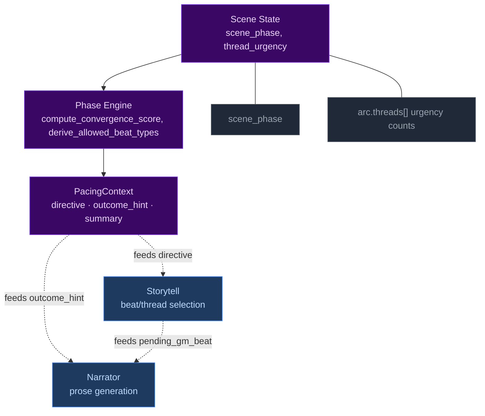
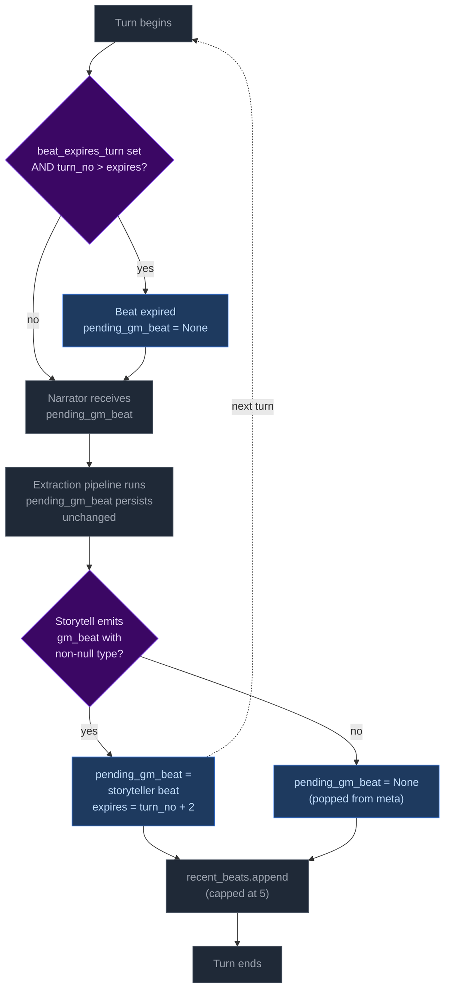
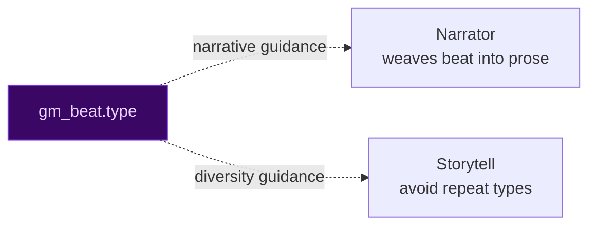
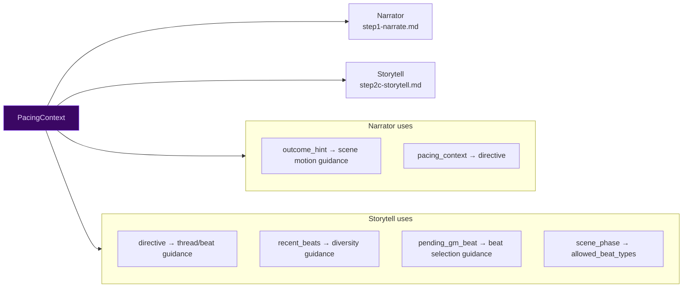
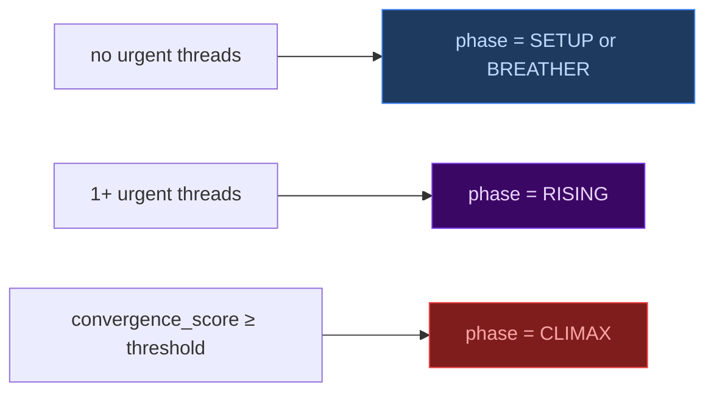
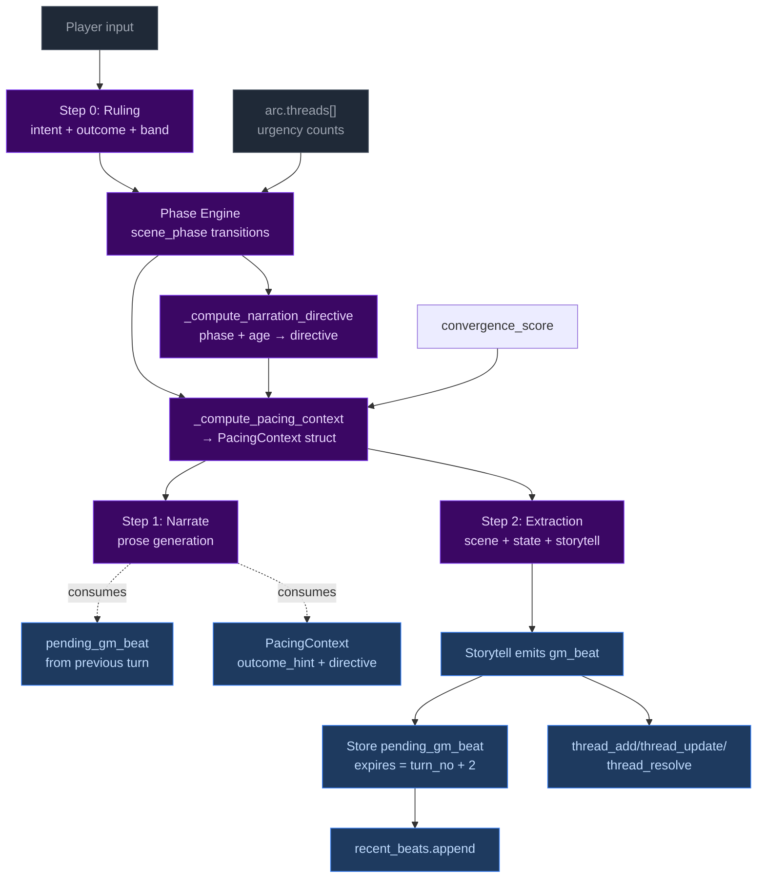

# Pacing Systems — Phase Engine

> **NOTE:** The old momentum-based pacing system was removed in Plan 4. This document describes the current phase engine system only.

CCYA's pacing is driven by a phase engine that computes scene rhythm from thread urgency and scene age.

## 1. The Phase Engine



## 2. Phase Engine

### Definition

The phase engine tracks `state["scene"]["scene_phase"]` through five states: SETUP, RISING, CLIMAX, RESOLUTION, BREATHER. Transitions are driven by convergence score (5-component composite) and scene age.

### Phase transitions

| From | To | Condition |
|------|-----|-----------|
| SETUP | RISING | Urgent thread appears OR turns_in_phase ≥ 3 (3-turn TTL prevents stagnation) |
| RISING | CLIMAX | convergence_score ≥ threshold (default 3) |
| CLIMAX | RESOLUTION | climax_turn_count ≥ limit |
| RESOLUTION | BREATHER | Always (1-turn transition) |
| BREATHER | RISING | Urgent thread appears OR breather_max_turns elapsed |

### Convergence score

`compute_convergence_score()` computes a 5-component score (0-5) each turn to drive RISING→CLIMAX transition. Components: (1) any urgent thread (dormant-aware, urgent threads with dormant=False) (+1), (2) any threat thread (dormant-aware, threads with type="threat" and dormant=False) (+1), (3) scene age ≥ threshold (+1), (4) beat streak: ≥60% pressure beats in recent window (+1), (5) dice weight: fail/crit_fail roll with urgent thread (+1). Threshold is `config.convergence_threshold` (default 3).

## 2.5. Curtain Call — CLIMAX phase soft close

Two-tier soft close guides the storyteller toward thread resolution in CLIMAX:

| Tier | Trigger | User prompt signal | System prompt guidance |
|------|---------|--------------------|------------------------|
| Active | Turn 1 of CLIMAX | `curtain_call: "active"` | "MUST resolve the active thread this scene. Include at least one `thread_resolve` entry." |
| Forced | Turn ≥ climax_turn_limit - 1 | `curtain_call: "forced"` | "This thread MUST resolve now. The engine will force a transition if you don't." |

Hard cutoff at `climax_turn_limit` unchanged (phase machine handles it). For default limit=4: turn 1→active, turn 2→none, turn 3→forced, turn 4→forced.

## 3. GM Beats

### Definition

Forward-facing storytelling beats emitted by the storyteller, consumed by the narrator, managed via `state.meta.pending_gm_beat`. Each beat has a `type`, `effect`, `npc_id`, `driver`, and TTL of 2 turns.

### Beat types

| Type | Category | Typical use |
|------|----------|-------------|
| `complication` | Pressure | New problem emerges |
| `escalation` | Pressure | Existing tension intensifies |
| `pressure` | Pressure | General scene pressure |
| `revelation` | Neutral | Discovery, info-drop |
| `opportunity` | Positive | Chance, opening |
| `breathing_room` | Recovery | Respite, moment to breathe |
| `twist` | Neutral | Plot twist, unexpected |
| `setback` | Pressure | PC loses ground |
| `callback` | Neutral | Reference to past events |

### Beat lifecycle



### How beats feed into other systems



### Code locations

| File | Line(s) | What |
|------|---------|------|
| `turn.py` | 68 | `PRESSURE_BEAT_TYPES` definition |
| `turn.py` | 762-767 | Pre-narration expiry check |
| `turn.py` | 1012-1019 | New beat replacement / null-clear |
| `turn.py` | 1139-1150 | Beat history snapshot |
| `changes.py` | 333-373 | General change summarization (conditions, facts, threads, inventory) |

## 4. Pacing Context

### Definition

`PacingContext` is a Python-computed struct that collapses all pacing signals into one authoritative value, passed to both Narrator and Storytell pipelines.

### Struct fields

```
PacingContext:
  directive: str           # "Scene Imperative" | "Scene Pressure" | ""
  outcome_hint: str | None # "hold" | "transition"
  summary: str             # Human-readable log, never sent to LLM
  spiral_detected: bool    # Death spiral flag from recent rolls
  convergence_score: int   # 0-5 score for RISING→CLIMAX transition
```

### How each field is computed

```mermaid
flowchart TD
    classDeci fill:#3b0764,color:#e9d5ff,stroke:#7c3aed
    classOut fill:#1e3a5f,color:#bfdbfe,stroke:#3b82f6
    classIn fill:#1f2937,color:#9ca3af,stroke:#4b5563

    T["arc.threads[] urgency counts"]:::In
    SA["effective_scene_age = scene_age"]:::In
    PH["scene_phase"]:::In

    SA --> D1{"≥ imperative<br>threshold?"}:::Deci
    D1 -- yes --> B1["directive = 'Scene Imperative'"]:::Out
    D1 -- no --> D2{"≥ pressure<br>threshold?"}:::Deci
    D2 -- yes --> B2["directive = 'Scene Pressure'"]:::Out
    D2 -- no --> B3["directive = ''"]:::Out

    SM["scene_age ≥ imperative_threshold?"]:::In --> OH["outcome_hint = 'transition' if age ≥ imperative_threshold, else from ruling"]:::Out

    style Deci fill:#3b0764,color:#e9d5ff,stroke:#7c3aed
    style Out fill:#1e3a5f,color:#bfdbfe,stroke:#3b82f6
    style In fill:#1f2937,color:#9ca3af,stroke:#4b5563
```

### How PacingContext is consumed



### Code locations

| File | Line(s) | What |
|------|---------|------|
| `turn.py` | 98-108 | `PacingContext` dataclass definition |
| `turn.py` | 447-486 | `_compute_pacing_context()` |
| `turn.py` | 408-444 | `_compute_narration_directive()` |

| `turn.py` | 804-813 | `_narrate_setup()` calls `_compute_pacing_context` |
| `narrate_user.j2` | 100-103 | `outcome_hint`, `pacing_context` |
| `storytell_user.j2` | 27-28 | `directive`, `outcome_hint` |
| `storytell_user.j2` | 30-31 | `scene_phase`, `allowed_beat_types` |
| `storytell_user.j2` | 32-41 | `pending_gm_beat` |
| `storytell_user.j2` | 42-46 | `recent_beats` |
| `storytell_user.j2` | 13-17 | `threads` |

## 5. Thread Lifecycle

### Definition

`arc.threads[]` tracks story threads across turns. Thread state is storyteller-managed via `thread_update`, `thread_add`, `thread_resolve`, and `arc_resolve`. The engine enforces structural constraints (caps, staleness, urgency decay).

### Thread urgency and phase transitions



### Engine-enforced constraints (not storyteller-managed)

| Constraint | Condition | Effect |
|------------|-----------|--------|
| Auto-dormant | Thread untouched for 4 turns (urgent threads excluded) | `dormant: True`, `urgency: background` |
| Urgency decay | Thread at same urgency for 8 turns | `urgent→normal→background` |
| Thread cap eviction | Active threads > 5 on `thread_add` | Evict oldest active |
| Engine culling | ≥3 dormant threads | Oldest (by last_updated_turn) → completed_threads with resolution_state: "abandoned" |
| Progress dedup | ≥50% overlap with last progress entry | Reject new entry |

### Code locations

| File | Line(s) | What |
|------|---------|------|
| `turn.py` | 113-238 | `_apply_thread_updates()` |
| `turn.py` | 316-405 | `_apply_thread_resolutions()` |
| `turn.py` | 243-313 | `_apply_arc_resolve()` |
| `turn.py` | 1235-1272 | Thread add gate + cap eviction |
| `ccya/state/io.py` | 138 | `save_state()` |
| `thread_sanitizer.py` | 20-133 | Urgency escalation + cap |
| `thread_sanitizer.py` | 20-34 | Wrapper for exception safety |
| `turn.py` | 1387 | Invocation in `run_turn()` |

## 6. Complete Interaction Map

### How all systems interact in a single turn



### Cross-system variable map

| Variable | Set by | Consumed by | Effect |
|----------|--------|-------------|--------|
| `convergence_score` | Narrate setup (thread urgency, age, beats, dice) | RISING→CLIMAX transition | 5-component composite score |
| `scene_phase` | Phase engine | Directive, beat constraints, outcome_hint | Primary pacing signal |
| `pending_gm_beat` | Storytell | Narrator, beat history | Forward-facing storytelling beat |
| `arc.threads[].urgency` | Storytell (thread_update) + Python decay | Phase transitions, directive computation | Scene tension level |
| `PacingContext.directive` | `_compute_pacing_context()` | Narrator, Storytell, prompt rendering | Primary scene instruction |
| `PacingContext.outcome_hint` | `_compute_pacing_context()` (scene_age ≥ imperative_threshold) | Narrator scene motion | How the scene should progress |

## 7. Typical Rhythm Patterns

### Pattern 1: Pressure cycle

```
T1:  phase=SETUP, no pressure beat → directive=""
T2:  storyteller emits pressure beat
T3:  urgent thread appears → phase=RISING
T4:  convergence_score=3 (1 urgent + age 3 + beat streak) → CLIMAX
T5:  phase transitions to RESOLUTION → BREATHER
T6:  normal rhythm continues
```

### Pattern 2: Climax resolution

```
T1:  phase=CLIMAX, climax_turn_count=1, curtain_call=active
T2:  phase=CLIMAX, climax_turn_count=2
T3:  phase=CLIMAX, climax_turn_count=3, curtain_call=forced
T4:  climax_turn_count≥limit → phase=RESOLUTION, outcome_hint=transition
T5:  phase=BREATHER (RESOLUTION always transitions to BREATHER)
T6:  normal rhythm continues
```

### Pattern 3: BREATHER recovery

```
T1:  phase=BREATHER, convergence_score=0, no urgent threads
T2:  phase=BREATHER, storyteller surfaces opportunity beat
T3:  latent thread becomes urgent → phase=RISING
T4:  phase=RISING, convergence_score=3 → phase=CLIMAX
T5:  phase=CLIMAX, climax_turn_count=1
T6:  normal climax rhythm continues
```

## 8. Configuration Reference

| Config key | Default | System | Effect |
|------------|---------|--------|--------|
| `convergence_threshold` | 2 | Phase Engine | Convergence score needed for CLIMAX transition |
| `climax_turn_limit` | 4 | Phase Engine | Max turns in CLIMAX before RESOLUTION |
| `breather_max_turns` | 3 | Phase Engine | Max turns in BREATHER before forced RISING |
| `scene_pressure_threshold` | 3 | Pacing Context | Scene Pressure secondary directive threshold |
| `scene_imperative_threshold` | 5 | Pacing Context | Scene Imperative directive threshold |
| `recent_beats_max` | 5 | GM Beats | Max entries in recent_beats history |
| `thread_max_active` | 5 | Thread Lifecycle | Thread cap, oldest evicted on overflow |
| `thread_urgency_max_age` | 8 | Thread Lifecycle | Urgency decay after N turns at same level |
| `sanitize_every` | 5 | Sanitizer | Run sanitizer every N turns (0=disabled) |

## 9. Code Locations Summary

### Core computation functions

| Function | File | Line(s) | Computes |
|----------|------|---------|----------|
| `_compute_scene_phase()` | `turn.py` | 497-569 | Phase transitions from convergence_score, scene age |
| `_compute_narration_directive()` | `turn.py` | 403-433 | scene_age → directive (Scene Imperative purely age-based) |
| `_compute_pacing_context()` | `turn.py` | 437-474 | scene_phase + urgency + age → PacingContext |
| `_compute_ages()` | `turn.py` | 491-502 | Scene age computation |
| `compute_convergence_score()` | `_pacing.py` | 83-126 | 5-component score (any_urgent from dormant-aware urgent threads, any_threat from dormant-aware threat threads, age, beat streak, dice) → int |
| `derive_allowed_beat_types()` | `_pacing.py` | 30-55 | Phase + directive + spiral → allowed beat types |
| `detect_spiral()` | `_pacing.py` | 25-46 | Recent roll bands → spiral flag (consecutive/ratio thresholds) |
| `sanitize_threads()` | `thread_sanitizer.py` | 20-133 | Urgency escalation + cap |

### Beat lifecycle functions

| Function | File | Line(s) | What |
|----------|------|---------|------|
| Pre-narration expiry | `turn.py` | 762-767 | Expire stale beats |
| New beat replacement | `turn.py` | 1012-1019 | Store storyteller beat |
| Floor relief injection | `turn.py` | 1021-1034 | Inject breathing_room |
| Pressure counter | `turn.py` | 1036-1044 | Track pressure streaks |
| Beat history snapshot | `turn.py` | 1139-1150 | Append to recent_beats |

### Thread lifecycle functions

| Function | File | Line(s) | What |
|----------|------|---------|------|
| `_apply_thread_updates()` | `turn.py` | 113-238 | Apply storyteller updates |
| `_apply_thread_resolutions()` | `turn.py` | 316-405 | Move threads to completed |
| `_apply_arc_resolve()` | `turn.py` | 243-313 | Resolve arc, create successor |
| Thread add gate | `turn.py` | 1235-1272 | Gate check + cap eviction |

### EV checkers

| Checker | File | What it validates |
|---------|------|-------------------|
| `phase_transition` | `ccya/ev/checkers/phase_transition.py` | Phase engine transitions follow the state machine, outcome_hint consistency |

| `recent_beats` | `ccya/ev/checkers/recent_beats.py` | recent_beats list structure, cap, monotonic turn numbers |
| `pacing_directives` | `ccya/ev/checkers/pacing.py` | Outcome hint, directive render, removed directives, beat variety, phase constraints |
| `gm_beat_lifecycle` | `ccya/ev/checkers/gm_beat.py` | Beat consumption, lifecycle, binding |
| `phase_persistence` | `ccya/ev/checkers/phase_persistence.py` | scene_phase field present and valid on every turn (regression guard) |
| `scene_age_tracking` | `ccya/ev/checkers/scene_age_tracking.py` | scene_age increments by 1 each turn, resets on location change |
| `climax_turn_counting` | `ccya/ev/checkers/climax_turn_counting.py` | climax_turn_count increments in CLIMAX, resets on phase exit |

| `breather_enforcement` | `ccya/ev/checkers/breather_enforcement.py` | breather auto-transitions to RISING after breather_max_turns |
| `roll_band_consistency` | `ccya/ev/checkers/roll_band_consistency.py` | band matches dice roll using rules engine, skill/difficulty valid |
| `beat_phase_validity` | `ccya/ev/checkers/beat_phase_validity.py` | gm_beat.type is allowed for the current phase |

### Prompt rendering

| Template | What it renders |
|----------|----------------|
| `narrate_user.j2` | `outcome_hint`, `pacing_context` |
| `narrate_system.j2` | Beat integration guidance (includes `pending_gm_beat`), priority ordering |
| `storytell_user.j2` | `directive`, `outcome_hint`, `scene_phase`, `allowed_beat_types`, `pending_gm_beat`, `recent_beats`, `threads` |
| `storytell_system.j2` | Thread operations, beat schema, directive-beat alignment, phase constraints |
