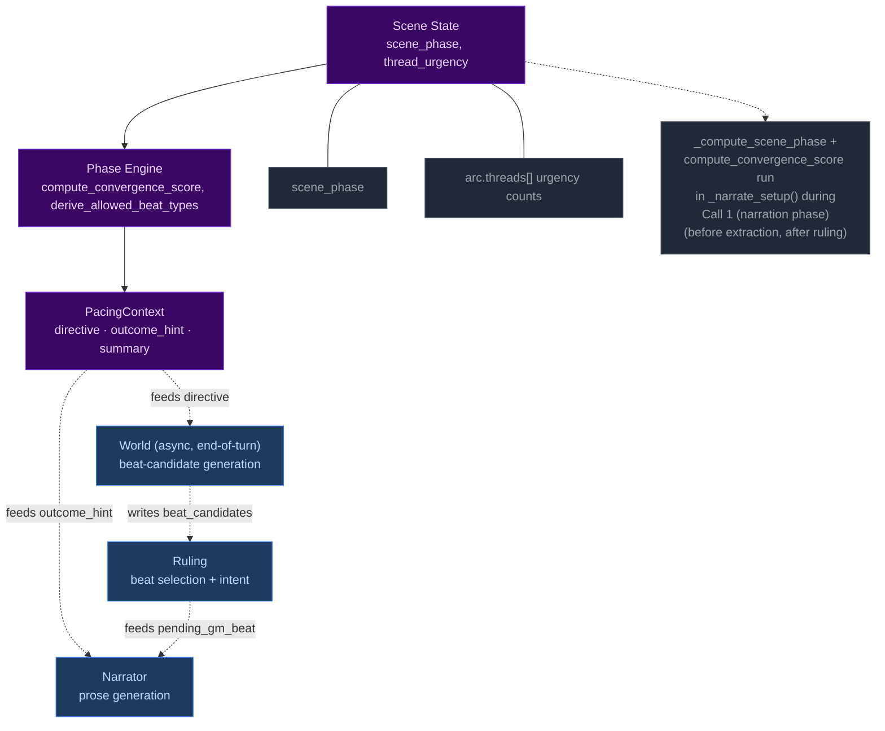
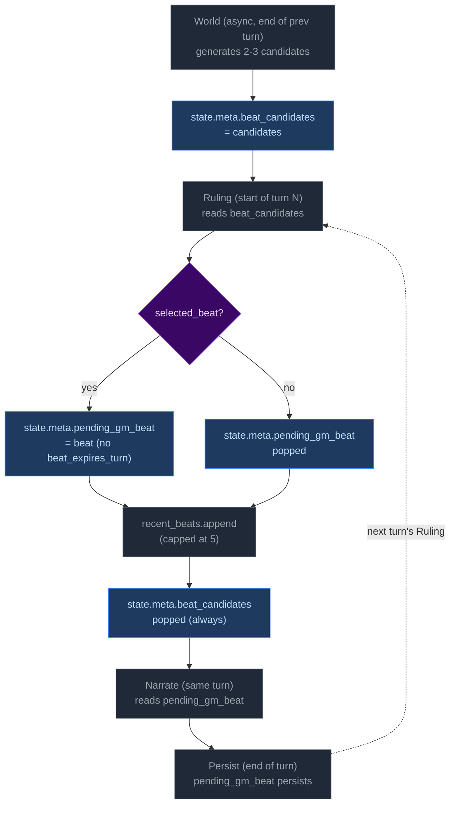
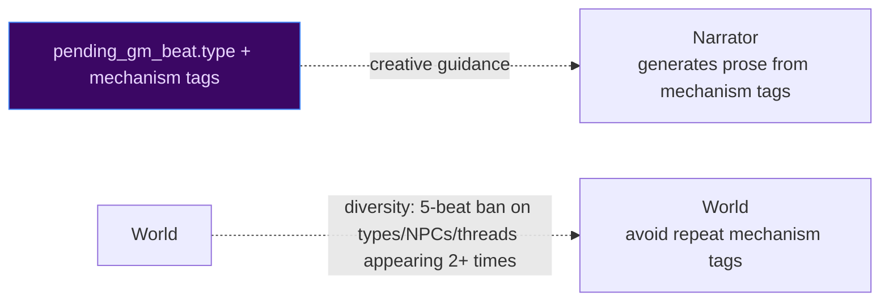
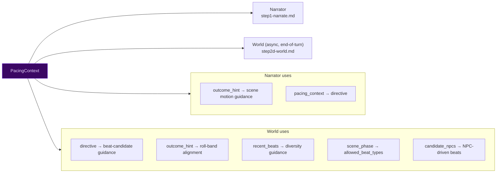
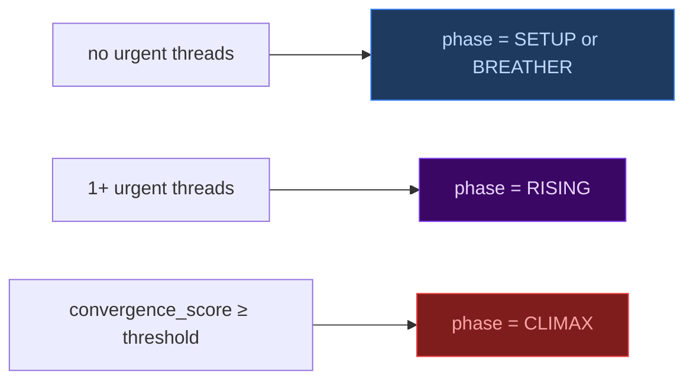
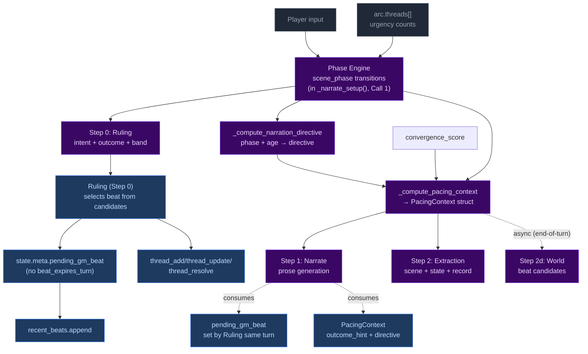

# Pacing Systems — Phase Engine

> **NOTE:** The old momentum-based pacing system was removed in Plan 4. This document describes the current phase engine system only.

CCYA's pacing is driven by a phase engine that computes scene rhythm from thread urgency and scene age.

## 1. The Phase Engine



## 2. Phase Engine

### Definition

The phase engine tracks `state.scene.scene_phase` through five states: SETUP, RISING, CLIMAX, RESOLUTION, BREATHER. Transitions are driven by **raw** convergence score (5 components, urgent_thread 0-2, max score 6) and scene age. The EMA-smoothed value is used for the outcome_hint convergence hard gate.

**BREATHER uses smoothed convergence for a clean break.** Design intent: smoothed convergence prevents the LLM from immediately re-engaging threads/NPCs that were just dumped. Raw would be too jumpy. Clean break is intentional for dumping threads/NPCs pursuing the player.

### Phase transitions

| From | To | Condition |
|------|-----|-----------|
| SETUP | RISING | Urgent thread appears OR turns_in_phase ≥ 3 OR `total_convergence_score >= 2 AND turns_in_phase >= 2` (2-turn TTL prevents stagnation) |
| RISING | CLIMAX | raw_convergence ≥ enter_threshold (default **2**) AND turns_in_phase ≥ RISING_min (default 3) |
| CLIMAX | RESOLUTION | Signal-gated exit: (a) early exit on **thread resolved on previous turn** + low convergence (< exit_threshold, default 1) AND min_turns (CLIMAX_min, default 3), (b) extension on sustained pressure (raw_convergence ≥ 3 + urgent active thread, hard cap at limit + extension_max), (c) default timeout at limit |
| RESOLUTION | BREATHER | Always (1-turn transition) |
| BREATHER | RISING | (Urgent thread appears OR breather_max_turns elapsed) AND turns_in_phase ≥ BREATHER_min (default 2) |

### Convergence score

`compute_convergence_score()` computes a 5-component score (0-6) each turn to drive RISING→CLIMAX transition. Components: (1) urgent thread count (dormant-aware, capped at 2, contributes 0-2), (2) any threat thread (dormant-aware) (+1), (3) beat streak: ≥60% pressure beats in recent window with carry-over for null types (+1), (4) roll_starvation: turns since last roll ≥ threshold (+1), (5) threat_density: active threat threads ≥ threshold (+1). Returns `(score, components_dict)`.

Note: `scene_age` was removed from convergence — it is now used only by the narration directive, not the convergence score.

The raw score is smoothed using exponential moving average (EMA) each turn: `smoothed = alpha * raw + (1 - alpha) * prev_smoothed`. **Phase transitions use the raw score.** The smoothed score is used for the outcome_hint convergence hard gate in `_compute_pacing_context()`. First turn uses `prev_smoothed=0`, so smoothed = 0.4 * raw.

## 3. GM Beats

### Definition

Forward-facing storytelling beats emitted by **World** (Step 2d, async) as candidates, selected by **Ruling** (Step 0) for the upcoming turn, consumed by the narrator the same turn. Lifecycle state lives in `state.meta.pending_gm_beat` (the selected beat) and `state.meta.beat_candidates` (the world-prepared candidates). Each beat has mechanism tags only in `effect` (e.g., `[highlight: fear]`) — no quote, no prose, no directional hint. The `npcs` field is separate. The narrator reads mechanism tags as creative guidance and generates prose itself, grounded in the actual NPC fields in the roster. **No TTL** — beats are single-turn commitments. Ruling's per-turn "always replace or pop" rule keeps state hygienic.

### Beat types

| Type | Category | Typical use |
|------|----------|-------------|
| `complication` | Pressure | New problem emerges |
| `escalation` | Pressure | Existing tension intensifies |
| `pressure` | Pressure | General scene pressure |
| `revelation` | Neutral | Discovery, info-drop |
| `opportunity` | Positive | Chance, opening |
| `breathing_room` | Recovery | Respite, moment to breathe |
| `twist` | Neutral | Plot twist, unexpected |
| `setback` | Pressure | PC loses ground |
| `callback` | Neutral | Reference to past events |

### Beat lifecycle



### How beats feed into other systems



### Code locations

| File | Line(s) | What |
|------|---------|------|
| `narrate.py` | 168-170 | Narrate reads `pending_gm_beat` mechanism tags as creative guidance, generates prose grounded in NPC roster |
| `ruling.py` | `_ruling_phase` | Ruling sets/pops `pending_gm_beat`, pops `beat_candidates` |
| `world.py` | `_run_world_step` | World generates mechanism-tag-only beat candidates, validates via `GMBeat`, returns updated state with `recent_beats` appended |
| `changes.py` | 333-373 | General change summarization (conditions, facts, threads, inventory) |

## 4. Pacing Context

### Definition

`PacingContext` is a Python-computed struct that collapses all pacing signals into one authoritative value, passed to Narrator (Step 1) and World (Step 2d, async via the same live `state` reference). Record (Step 2c) does not receive PacingContext — its scope is backward-looking.

### Struct fields

Defined in `fablethread/engine/turn_context.py`.

```
PacingContext:
  directive: str                    # "Scene Imperative" | "Scene Pressure" | ""
  outcome_hint: str | None          # "hold" | "transition" (driven by scene_motion + Scene Imperative override + convergence hard gate)
  summary: str                      # Human-readable log, never sent to LLM
  convergence_score: int            # Raw 5-component score (0-6), set in narrate.py
  convergence_components: dict[str, int]  # {urgent_thread, threat_thread, beat_streak, roll_starvation, threat_density}
  convergence_threads: list[dict]   # Thread dicts used for convergence computation
```

### How each field is computed

```mermaid
flowchart TD
    classDeci fill:#3b0764,color:#e9d5ff,stroke:#7c3aed
    classOut fill:#1e3a5f,color:#bfdbfe,stroke:#3b82f6
    classIn fill:#1f2937,color:#9ca3af,stroke:#4b5563

    T["arc.threads[] urgency counts"]:::In
    SA["effective_scene_age = scene_age"]:::In
    PH["scene_phase"]:::In

    SA --> D1{"≥ imperative<br>threshold?"}:::Deci
    D1 -- yes --> B1["directive = 'Scene Imperative'"]:::Out
    D1 -- no --> D2{"≥ pressure<br>threshold?"}:::Deci
    D2 -- yes --> B2["directive = 'Scene Pressure'"]:::Out
    D2 -- no --> B3["directive = ''"]:::Out

    SM["scene_age ≥ imperative_threshold?"]:::In --> OH["outcome_hint = 'transition' if age ≥ imperative_threshold, else from ruling"]:::Out

    style Deci fill:#3b0764,color:#e9d5ff,stroke:#7c3aed
    style Out fill:#1e3a5f,color:#bfdbfe,stroke:#3b82f6
    style In fill:#1f2937,color:#9ca3af,stroke:#4b5563
```

### How PacingContext is consumed



**Note:** Record (Step 2c, replaces Storytell) does not receive PacingContext. Its scope is backward-looking: it reads narration + threads + arc and emits thread_update/resolve/add + actions + outcome_summary. Beat-related concerns moved to World.

### Code locations

| File | Line(s) | What |
|------|---------|------|
| `turn_context.py` | 41-48 | `PacingContext` dataclass definition |
| `_pacing.py` | 171-205 | `_compute_pacing_context()` |
| `_pacing.py` | 145-168 | `_compute_narration_directive()` |
| `turn.py` | 317 | `_apply_state_updates()` calls thread operations (via turn_state.py) |
| `turn.py` | ~100-150 | Phase machine: calls `_compute_ages`, `compute_convergence_score`, `_compute_scene_phase`; sets convergence_score on PacingContext |
| `narrate.py` | 198-236 | `_narrate_setup()` computes raw convergence score, EMA-smoothed value; sets convergence_score, convergence_components, convergence_threads on PacingContext |
| `narrate_user.j2` | 100-103 | `outcome_hint`, `pacing_context` |
| `world_user.j2` | — | `directive`, `outcome_hint`, `recent_beats`, `allowed_beat_types` |
| `record_user.j2` | — | (no PacingContext — Record is backward-looking) |
| `record_user.j2` | 13-17 | `threads` |

## 5. Thread Lifecycle

### Definition

`arc.threads[]` tracks story threads across turns. Thread state is record-managed (formerly storyteller-managed — the rename is from Storytell → Record, same ownership) via `thread_update`, `thread_add`, `thread_resolve`, and `arc_resolve`. The engine enforces structural constraints (caps, staleness, urgency decay).

### Thread urgency and phase transitions



### Engine-enforced constraints (not record-managed)

| Constraint | Condition | Effect |
|------------|-----------|--------|
| Auto-dormant | Thread untouched for 8 turns (`urgency != "urgent"` excluded) | `dormant: True`, `urgency: background` |
| Urgency decay | Thread at same urgency for 8 turns | `urgent→normal→background` (stepwise demotion) |
| Thread cap eviction | Non-dormant threads > 5 on `thread_add` | Set oldest non-dormant → `dormant: True` (not evicted) |
| Engine culling | ≥3 dormant threads | Oldest (by last_updated_turn) → completed_threads with resolution_state: "abandoned" |
| Progress dedup | ≥70% overlap with last progress entry | Reject new entry |

### Sanitizer: two-way urgency adjustment

The thread sanitizer (`thread_sanitizer.py`) performs **two-way urgency adjustment** — it can both escalate and demote thread urgency to match the tone of the current scene. It pulls from background/dormant threads when necessary to maintain scene tension. Seeds are exempt from sanitizer escalation — seeded threads are pre-loaded premise and most are meant to remain dormant.

### Code locations

| File | Line(s) | What |
|------|---------|------|
| `turn_state.py` | 17-188 | `_apply_thread_updates()` |
| `turn_state.py` | 278-367 | `_apply_thread_resolutions()` |
| `turn_state.py` | 192-275 | `_apply_arc_resolve()` |
| `turn_state.py` | 575-649 | Thread add gate + cap eviction (inside _apply_state_updates) |
| `fablethread/state/io.py` | 138 | `save_state()` |
| `thread_sanitizer.py` | 20-133 | Urgency escalation + cap |
| `turn_state.py` | 425 | Invocation in `_apply_state_updates()` |

## 6. Complete Interaction Map

### How all systems interact in a single turn



### Cross-system variable map

| Variable | Set by | Consumed by | Effect |
|----------|--------|-------------|--------|
| `convergence_score` | narrate.py (urgent_thread 0-2, threat, beats, roll_starvation, threat_density) | RISING→CLIMAX transition | Raw 5-component score (0-6), EMA smoothed value stored in state.meta.smoothed_convergence |
| `scene_phase` | Phase engine | Directive, beat constraints, outcome_hint | Primary pacing signal |
| `pending_gm_beat` | Ruling (selects from `state.meta.beat_candidates`) | Narrator (same turn), beat history | Forward-facing storytelling beat |
| `arc.threads[].urgency` | Record (thread_update) + Python decay | Phase transitions, directive computation | Scene tension level |
| `PacingContext.directive` | `_compute_pacing_context()` | Narrator, Record, prompt rendering | Primary scene instruction |
| `PacingContext.outcome_hint` | `_compute_pacing_context()` (scene_age ≥ imperative_threshold) | Narrator scene motion | How the scene should progress |

## 7. Typical Rhythm Patterns

### Pattern 1: Pressure cycle

```
T1:  phase=SETUP, no pressure beat → directive=""
T2:  World generates pressure beat candidate; Ruling selects it
T3:  urgent thread appears → phase=RISING
T4:  convergence_score=3 (1 urgent + age 3 + beat streak) → CLIMAX
T5:  phase transitions to RESOLUTION → BREATHER
T6:  normal rhythm continues
```

### Pattern 2: Climax resolution

```
T1:  phase=CLIMAX, climax_turn_count=1
T2:  phase=CLIMAX, climax_turn_count=2
T3:  phase=CLIMAX, climax_turn_count=3
T4:  climax_turn_count≥limit → phase=RESOLUTION, outcome_hint=transition
T5:  phase=BREATHER (RESOLUTION always transitions to BREATHER)
T6:  normal rhythm continues
```

### Pattern 3: BREATHER recovery

```
T1:  phase=BREATHER, convergence_score=0, no urgent threads
T2:  phase=BREATHER, World surfaces opportunity beat; Ruling selects it
T3:  latent thread becomes urgent → phase=RISING
T4:  phase=RISING, convergence_score=3 → phase=CLIMAX
T5:  phase=CLIMAX, climax_turn_count=1
T6:  normal climax rhythm continues
```

## 8. Configuration Reference

| Config key | Default | System | Effect |
|------------|---------|--------|--------|
| `convergence_alpha` | 0.4 | Convergence | EMA smoothing factor for convergence score |
| `convergence_enter_threshold` | **2** | Phase Engine | Convergence score needed for RISING→CLIMAX transition |
| `convergence_exit_threshold` | 1 | Phase Engine | Convergence score for CLIMAX early exit |
| `RISING_min` | 3 | Phase Engine | Minimum turns in RISING phase before transition |
| `CLIMAX_min` | 3 | Phase Engine | Minimum turns in CLIMAX phase before early exit |
| `BREATHER_min` | 2 | Phase Engine | Minimum turns in BREATHER phase before transition |
| `climax_turn_limit` | 4 | Phase Engine | Base turns in CLIMAX before RESOLUTION (signal-gated exit) |
| `extension_max` | 2 | Phase Engine | Additional CLIMAX turns beyond limit on sustained pressure |
| `roll_starvation_threshold` | 3 | Convergence | Turns without a roll before +1 convergence |
| `threat_density_threshold` | 3 | Convergence | Active threat threads before +1 convergence |
| `breather_max_turns` | 3 | Phase Engine | Max turns in BREATHER before forced RISING |
| `scene_pressure_threshold` | 3 | Pacing Context | Scene Pressure secondary directive threshold |
| `scene_imperative_threshold` | 5 | Pacing Context | Scene Imperative directive threshold |
| `recent_beats_max` | 5 | GM Beats | Max entries in recent_beats history |
| `thread_max_active` | 5 | Thread Lifecycle | Thread cap, oldest set dormant on overflow |
| `thread_urgency_max_age` | 8 | Thread Lifecycle | Urgency decay after N turns at same level |
| `thread_dormant_threshold` | **8** | Thread Lifecycle | Turns without activity before auto-dormant |
| `thread_creation_cooldown` | 3 | Thread Lifecycle | Minimum turns between new thread additions |
| `sanitize_every` | 5 | Sanitizer | Run sanitizer every N turns (0=disabled) |

## 9. Code Locations Summary

### Core computation functions

| Function | File | Line(s) | Computes |
|----------|------|---------|----------|
| `_compute_scene_phase()` | `_pacing.py` | 222-310 | Phase transitions from total_convergence_score, scene age, turn_no (signal-gated CLIMAX→RESOLUTION) |
| `_compute_narration_directive()` | `_pacing.py` | 145-168 | scene_age → directive (Scene Imperative purely age-based) |
| `_compute_pacing_context()` | `_pacing.py` | 171-205 | scene_phase + urgency + age → PacingContext |
| `_compute_ages()` | `_pacing.py` | 208-219 | Scene age computation |
| `compute_convergence_score(scene_phase, active_threads, recent_beats, config, turn_no, recent_rolls)` | `_pacing.py` | 55-122 | **5-component** score (urgent_thread 0-2 count-capped, any_threat, **no scene_age**, beat_streak with carry-over using tension bucket, roll_starvation, threat_density) → tuple[int, dict[str, int]] |
| `_compute_scene_phase(state, ages, config, total_convergence_score, turn_no)` | `_pacing.py` | 218-318 | Phase transitions with hysteresis (enter/exit thresholds) and min_turns gates. Uses raw convergence score. |
| `derive_allowed_beat_types()` | `_pacing.py` | 61-73 | Phase + directive → allowed beat types |
| `sanitize_threads()` | `thread_sanitizer.py` | 20-133 | Urgency escalation + cap |

### Beat lifecycle functions

| Function | File | Line(s) | What |
|----------|------|---------|------|
| World step | `world.py` | `_run_world_step` | Phase validation (purge invalid types) → Generate 2-3 beat candidates → `state.meta.beat_candidates`; **does NOT return purged list** (purged logged only) |
| Ruling beat selection | `ruling.py` | `_ruling_phase` | Validate `selected_beat` via `GMBeat`; set/pop `pending_gm_beat`; append `recent_beats`; pop `beat_candidates` |
| Narrate beat read | `narrate.py` | 168-170 | Pure reader of `pending_gm_beat` (no mutation, no expiry) |

### Thread lifecycle functions

| Function | File | Line(s) | What |
|----------|------|---------|------|
| `_apply_thread_updates()` | `turn_state.py` | 17-188 | Apply record updates (Record replaces the old Storytell — same ownership) |
| `_apply_thread_resolutions()` | `turn_state.py` | 278-367 | Move threads to completed |
| `_apply_arc_resolve()` | `turn_state.py` | 192-275 | Resolve arc, create successor |
| Thread add gate | `turn_state.py` | 575-649 | Gate check + cap eviction (inside _apply_state_updates) |

### EV checkers

| Checker | File | What it validates |
|---------|------|-------------------|
| `phase_transition_signals` | `fablethread/ev/checkers/pacing_convergence.py` | Phase transition triggers match engine logic |
| `convergence_recompute` | `fablethread/ev/checkers/pacing_convergence.py` | Independently recompute convergence score from raw state |
| `directive_beat_alignment` | `fablethread/ev/checkers/pacing_convergence.py` | Selected beat aligns with directive and phase constraints |
| `phase_transition` | `fablethread/ev/checkers/phase_transition.py` | Phase engine transitions follow the state machine, outcome_hint consistency |

| `recent_beats` | `fablethread/ev/checkers/recent_beats.py` | recent_beats list structure, cap, monotonic turn numbers |
| `pacing_directives` | `fablethread/ev/checkers/pacing.py` | Outcome hint, directive render, removed directives, beat variety, phase constraints |
| `phase_persistence` | `fablethread/ev/checkers/phase_persistence.py` | scene_phase field present and valid on every turn (regression guard) |
| `scene_age_tracking` | `fablethread/ev/checkers/scene_age_tracking.py` | scene_age increments by 1 each turn, resets on location change |
| `climax_turn_counting` | `fablethread/ev/checkers/climax_turn_counting.py` | climax_turn_count increments in CLIMAX, resets on phase exit |

| `breather_enforcement` | `fablethread/ev/checkers/breather_enforcement.py` | breather auto-transitions to RISING after breather_max_turns |
| `roll_band_consistency` | `fablethread/ev/checkers/roll_band_consistency.py` | band matches dice roll using rules engine, skill/difficulty valid |

> **EV checker `gm_beat_lifecycle` is deferred cleanup** — it reads `extraction.record.gm_beat` which no longer exists (beat generation moved to World). Tracked in `roadmap/bugs/ev-side-cleanup-storytell-gm-beat-rename.md`. Until that's done, this checker produces vacuous output but does not crash. `beat_phase_validity` has been fixed and reads from `state.meta.beat_candidates` correctly.

### Prompt rendering

| Template | What it renders |
|----------|----------------|
| `narrate_user.j2` | `outcome_hint`, `pacing_context` |
| `narrate_system.j2` | Beat integration guidance (reads `pending_gm_beat`), priority ordering |
| `record_user.j2` | (no PacingContext — Record is backward-looking) `threads`, `narration` |
| `world_user.j2` | `directive`, `outcome_hint`, `scene_phase`, `allowed_beat_types`, `recent_beats`, `candidate_npcs` |
| `ruling_user.j2` | `beat_candidates` (for ruling's beat selection) |
| `record_system.j2` | Thread operations, directive-beat alignment, phase constraints |
