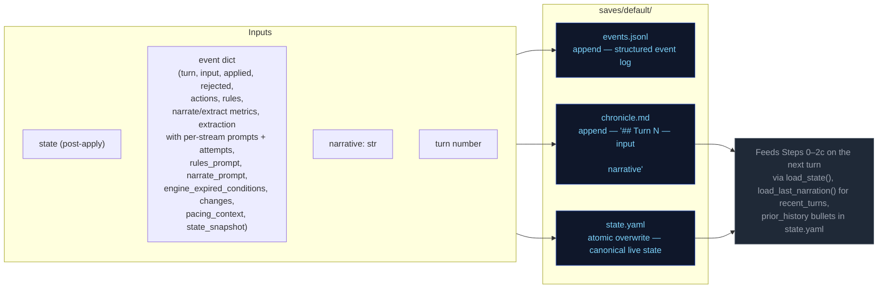

# Persist

Atomic writes to disk. No LLM calls.

## Event field notes

- `narrate_prompt` is saved at the event level (with `rendered_system`, `rendered_user`, `output`, `context_meta`)
- `ruling_prompt` is saved at the event level (with `rendered_system`, `rendered_user`, `output`, `parse_error`, `context_meta`)
- `storytell_prompt` is NOT saved at the event level — it's available in `extraction.storytell.rendered_user` and `extraction.storytell.rendered_system`
- `pacing_context` is saved at the event level (serialized dict with `directive`, `outcome_hint`, `summary`, `scene_phase`, etc.)
- `state_snapshot` is saved at the event level (full state at end of turn, used by checkers for state-at-turn verification)
- `changes` is saved at the event level (sanitizer output: inventory, player, facts, threads)
- `extraction_context` is NOT saved at the event level — it's an internal dataclass used only during extraction to build the storyteller prompt. Checkers that need this data must parse `extraction.storytell.rendered_user` or use `applied.*`/`state_snapshot`.

### state_snapshot timing

`state_snapshot` is captured at `engine/turn.py:1423`, AFTER all turn processing (ruling, narrate, extract, sanitizer, apply_delta). This means:

- Thread resolutions are already reflected (resolved threads moved to `completed_threads`)
- Arc resolutions are already reflected (arc may be resolved with successor)
- Inventory/condition changes are already applied
- Location changes are already applied

**Checker implication:** When validating `arc_resolve.drop_threads` or `thread_resolve` IDs, compare against the **previous** turn's `state_snapshot` (pre-resolution state), not the current turn's. See [`docs/ev/STATE-REFERENCE.md`](../ev/STATE-REFERENCE.md) for the tracking pattern.

## Flowchart

