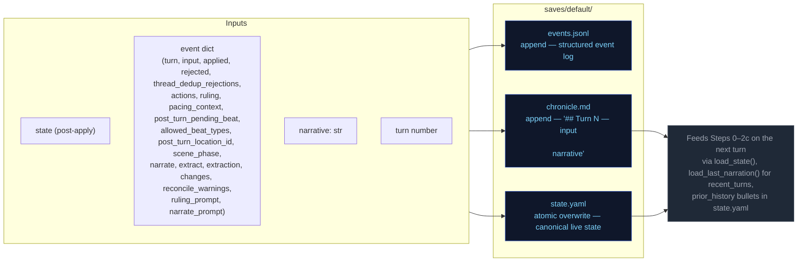

# Persist

Atomic writes to disk. No LLM calls.

## Event field notes

- `narrate_prompt` is saved at the event level (with `output` + `context_meta` only; `rendered_system`/`rendered_user` go to `prompts.jsonl`)
- `ruling_prompt` is saved at the event level (with `output`, `parse_error`, `context_meta` only; `rendered_system`/`rendered_user` go to `prompts.jsonl`)
- `record_prompt` is NOT saved at the event level — it's available in `extraction.record.rendered_user` and `extraction.record.rendered_system` (record replaces the old storytell stream; see [step2c-record](./step2c-record.md))
- `pacing_context` is saved at the event level (serialized dict with `directive`, `outcome_hint`, `summary`, `scene_phase`, `climax_turn_count`, `breather_turn_count`, `convergence_score`, `convergence_components`, `convergence_threads`)
- `last_turn_state` is saved at the event level (full state at end of turn, used by checkers for state-at-turn verification)
- `changes` is saved at the event level (sanitizer output: inventory, player, facts, threads)
- `extraction_context` is NOT saved at the event level — it's an internal dataclass used only during extraction to build the record prompt. Checkers that need this data must parse `extraction.record.rendered_user` or use `applied.*`/`last_turn_state`.

### last_turn_state timing

`last_turn_state` is captured at `engine/turn.py` **after the async window** (sanitize + world). The turn order is: ruling → narrate → extract → **apply_delta** → async(sanitize → world → save). This means:

- Thread resolutions are already reflected (resolved threads moved to `completed_threads`)
- Arc resolutions are already reflected (arc may be resolved with successor)
- Inventory/condition changes are already applied
- Location changes are already applied
- Prior history bullet is already appended
- Sanitizer changes are already applied (async window runs after apply)

**Checker implication:** When validating `arc_resolve.drop_threads` or `thread_resolve` IDs, compare against the **previous** turn's `last_turn_state` (pre-resolution state), not the current turn's. See [`docs/ev/STATE-REFERENCE.md`](../ev/STATE-REFERENCE.md) for the tracking pattern.

### Sanitizer events

When `config.sanitize_every > 0`, the sanitizer runs on turns divisible by `sanitize_every` (default 5). It appends a separate event to `events.jsonl` with `kind=sanitizer` and `turn=N` matching the turn it ran on. This event is written **after** the turn event, so the last event on a sanitizer turn is always the sanitizer event.

**Important for UI panels:** `_recent_turn_metrics()` and `_turn_log_entries()` in `ccya/server/metrics.py` must filter out `kind=sanitizer` events to avoid duplicate turn entries. `_list_saves()` in `ccya/server/routes.py` must also skip sanitizer events when counting turns.

**Important for cancel/delete:** `remove_last_event()` in `ccya/state/chronicle.py` parses the last event's `turn` number and removes **all** events matching that turn number (both turn event and sanitizer event). This prevents orphaned sanitizer events after cancel/delete.

### Cancel and delete workflow

**Cancel** (`/turn/cancel`):
1. Request cancel flag on the running turn
2. Wait for turn to finish (`await_turn_done`, 30s timeout)
3. Return `{"ok": true, "cancelled": true}` — **no events removed on cancel** (events remain in events.jsonl; player can delete the turn afterward if desired)

**Delete** (`/turn/delete`):
1. Load last turn's event to get `last_turn_state`
2. Remove all events for the last turn via `remove_last_event()`
3. Remove the last turn section from `chronicle.md` via `remove_last_chronicle_turn()`
4. Restore `last_turn_state` to `state.yaml`

**Atomicity note:** With deferred atomic write, no disk writes occur during the in-flight turn. Cancel is O(1) — just return a flag. Delete still reverts state from `last_turn_state` which now includes sanitizer changes (more correct than the old pre-sanitizer snapshot).

## Flowchart

