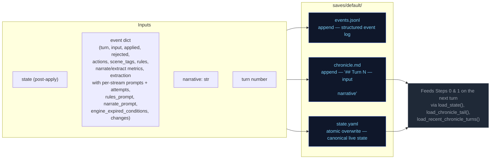

# Persist

Atomic writes to disk. No LLM calls.

## Flowchart

```mermaid
flowchart LR
    classDef storageNode fill:#0f172a,color:#7dd3fc,stroke:#1e40af
    classDef pyNode      fill:#1f2937,color:#9ca3af,stroke:#4b5563

    subgraph IN["Inputs"]
        P1["state (post-apply)"]
        P2["event dict<br>(turn, input, applied, rejected,<br>actions, scene_tags, rules,<br>narrate/extract metrics, extraction<br>with per-stream prompts + attempts,<br>rules_prompt, narrate_prompt,<br>engine_expired_conditions, changes)"]
        P3["narrative: str"]
        P4["turn number"]
    end

    subgraph WRITES["saves/default/"]
        W1["events.jsonl<br>append — structured event log"]:::storageNode
        W2["state.yaml<br>atomic overwrite — canonical live state"]:::storageNode
        W3["chronicle.md<br>append — '## Turn N — input\n\nnarrative'"]:::storageNode
    end

    READBACK["Feeds Steps 0 & 1 on the next turn<br>via load_state(), load_chronicle_tail(),<br>load_recent_chronicle_turns()"]:::pyNode

    IN --> W1
    IN --> W2
    IN --> W3
    W3 --> READBACK
    W2 --> READBACK
```
