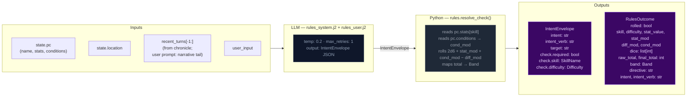

# Step 0 — Rules / Intent Classification

Classifies the player's action, determines whether a dice check is needed, and
identifies which state domains will be active — narrowing every downstream extractor.

## Flowchart

## Key forward dependency

`rules_outcome` feeds into `_compute_pacing_context()` which produces the single authoritative `PacingContext` struct passed to both Narrator and Progress Extractor.
