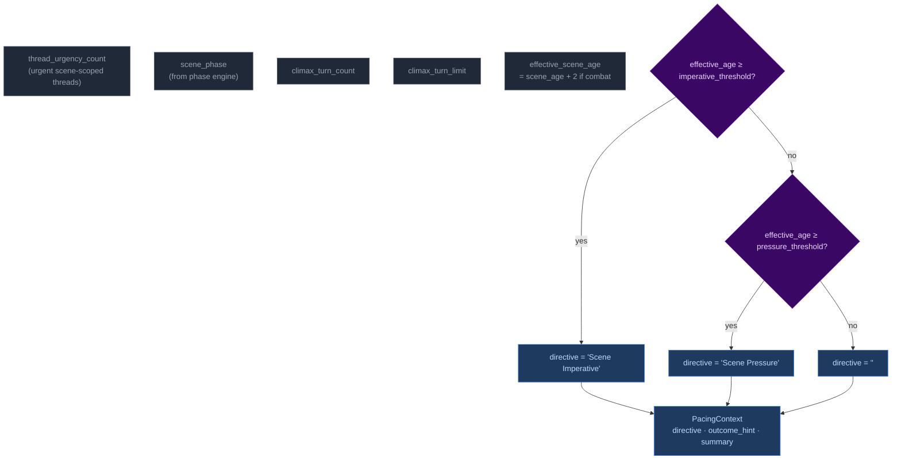
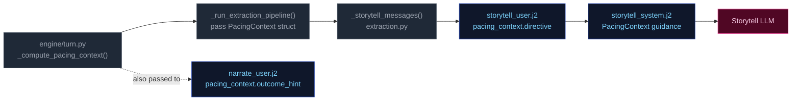

# Step 0 — Ruling / Intent Classification

Classifies the player's action, determines whether a dice check is needed, and
identifies which state domains will be active — narrowing every downstream extractor.

## Flowchart

```mermaid
flowchart LR
    classDef stageRules fill:#4c1d95,color:#ddd6fe,stroke:#7c3aed
    classDef llmNode    fill:#0f172a,color:#94a3b8,stroke:#334155
    classDef pyNode     fill:#1f2937,color:#9ca3af,stroke:#4b5563
    classDef outNode    fill:#3b0764,color:#e9d5ff,stroke:#7c3aed

    subgraph IN["Inputs"]
        I1["state.pc<br>(name, stats, conditions)"]
        I2["state.location"]
        I3["recent_turns[-1:]<br>(last turn's full narrative from chronicle.md<br>via load_last_narration();<br>ruling user prompt)"]
        I4["user_input"]
        I5["arc.threads<br>(urgent threads only)"]
    end

    subgraph LLM0["LLM — ruling_system.j2 + ruling_user.j2"]
        L0["temp: 0.2 · max_retries: 1<br>output: IntentEnvelope JSON<br>(intent, impossible, check)"]:::llmNode
    end

    subgraph PYRES["Python — impossible check + rules.resolve_check()"]
        P0["if impossible=true:<br>  synthesize fail outcome<br>  skip roll<br>else:<br>  roll 1d12 + stat_mod − diff_mod<br>  map total → Band"]:::pyNode
    end

    subgraph OUT["Outputs"]
        O1["IntentEnvelope<br>  intent: str<br>  intent_verb: str<br>  target: str<br>  impossible: bool<br>  reason: str<br>  check.required: bool<br>  check.skill: SkillName<br>  check.difficulty: Difficulty"]:::outNode
        O2["RulesOutcome<br>  rolled: bool<br>  skill, difficulty, stat_value, stat_mod<br>  diff_mod<br>  dice: list[int]<br>  raw_total, final_total: int<br>  band: Band<br>  directive: str<br>  intent, intent_verb: str<br>  impossible: bool<br>  reason: str"]:::outNode
    end

    IN --> LLM0
    LLM0 -- "IntentEnvelope" --> PYRES
    PYRES --> OUT
```



## Decision rule

Roll criteria tightened to reduce roll rate from ~69% to ~35-45%. Set `check.required=true` only when ALL THREE hold:
- (a) Occurs at a major narrative pivot — scene transition, decisive confrontation, gamble that alters the story. Actions in scenes with urgent threads are more likely to qualify.
- (b) Failure has a real, irreversible consequence
- (c) The outcome is genuinely uncertain

No-roll actions include: idle observation, unimpeded movement, item inspection, casual conversation, passing time, routine commerce, information gathering, actions already attempted in this scene without new stakes, taking cover, reloading, healing, using a prepared item as intended.

## Urgent threads context

When `arc.threads` contains threads with `urgency == "urgent"`, the ruling user prompt includes an "Urgent Threads" section showing each urgent thread's id, summary, and last 3 progress entries. This helps the ruling LLM assess criterion (a) — whether the action relates to a major narrative pivot.

## Impossibility check

The ruling LLM evaluates whether the described action is impossible given the character's state, inventory, and scene. An action is impossible when:

- It requires an item the character does not have (firing a gun with no ammo, using a key never acquired)
- It requires a capability contradicted by active conditions (climbing with a broken leg, sneaking while armored and noisy)
- It acts on something not present in the scene (targeting an NPC who is not here, opening a door that doesn't exist)

When `impossible=true`: Python sets `check.required=False`, synthesizes a `RulesOutcome` with `band="fail"` and `rolled=False`, and skips the dice roll entirely. The narrator renders the impossible fact and narrates the natural failure.

## Scene motion

The ruling LLM also determines how the scene should progress: `"hold"` (scene continues at current pace), `"advance"` (something significant happens/resolves), or `"transition"` (player is leaving, write the arrival). This feeds into `_compute_pacing_context()` which produces `outcome_hint` for the narrator.

## Key forward dependency

`rules_outcome` feeds into `_compute_pacing_context()` which produces the single authoritative `PacingContext` struct passed to both Narrator and Storytell pipeline.

## Pacing Context

All pacing signals are collapsed into one Python-computed struct (`PacingContext`) passed to both the Narrator and Storytell pipeline. The narrator receives `outcome_hint` (scene motion); Storytell receives the full struct including `directive`.

### Struct definition

```
PacingContext:
  directive: str           # "" | "Scene Imperative" | "Scene Pressure"; used by Storytell pipeline (Scene Imperative now purely age-based, CLIMAX turn-limit removed)
  outcome_hint: str | None # "hold" | "advance" | "transition" — narrator's primary scene motion instruction
  summary: str             # human-readable log string, never sent to LLM
```

### Computation

`_compute_pacing_context()` in `engine/turn.py` consolidates pacing computation. It takes inputs (`scene_phase`, `thread_urgency_count`, `effective_scene_age`) and returns a single struct with directive derived from a priority stack. It also computes `outcome_hint` from the ruling LLM's `scene_motion` and PacingContext escalation signals: ruling `scene_motion` takes priority (`transition` > `advance` > fallback), then `impossible=true` forces `advance`, then Python escalation signals produce `advance`, defaulting to `hold`.



Priority order (highest to lowest): **Scene Imperative → Scene Pressure → (empty)**. `Overwhelm`, `Pressure`, `Tension`, and `Breathe` directives were removed — their jobs are handled by phase. Scene Imperative is now purely age-based (CLIMAX turn-limit trigger removed — CLIMAX hard cutoff handled by phase machine).

#### Age computation

`_compute_ages(state)` returns only `{"scene_age": scene_age}` — location_age and combat_age removed in Phase 03 pacing overhaul. The ruling phase pre-computes `effective_scene_age = scene_age + 2` when `"combat"` is in scene tags, stored in `ctx._ages["effective_scene_age"]`. This single-age signal drives all directive thresholds:
- Scene Imperative (≥4 effective age, configurable via `scene_imperative_threshold`): high-priority directive forcing story advancement
- Scene Pressure (3 ≤ effective_age < 4, configurable): secondary append to wind down or shift focus

### Wiring



1. **Computed** once in `run_turn()` via `_compute_pacing_context()`.
2. **Passed through** `_run_extraction_pipeline()` → both `_narrate_messages()` and `_storytell_messages()`.
3. **Narrator template** (`narrate_user.j2`) renders `outcome_hint` (scene motion: hold/advance/transition) with value-specific guidance. No Jinja2 pacing computation remains — all pacing computed by Python.
4. **Storytell template** ((`storytell_system.j2` + `user.j2`)) receives the full struct; guidance maps each directive to appropriate thread/beat actions:

| Directive | Trigger | Thread action |
|-----------|---------|---------------|
| **"Scene Imperative"** | `effective_age >= scene_imperative_threshold` (purely age-based, CLIMAX turn-limit removed — handled by phase machine) | Story must advance — introduce new development forcing resolution or movement; do not linger. Allowed beat types: revelation, hazard, callback, opportunity, setback, breathing_room. |
| **"Scene Pressure"** | `effective_age >= scene_pressure_threshold` (3 ≤ effective_age < imperative_threshold) | Begin winding down or introduce reason to shift focus: development elsewhere, closing window |
| **"" (empty)** | Default — no higher directive triggered | No action required beyond normal aging of silent threads. |


