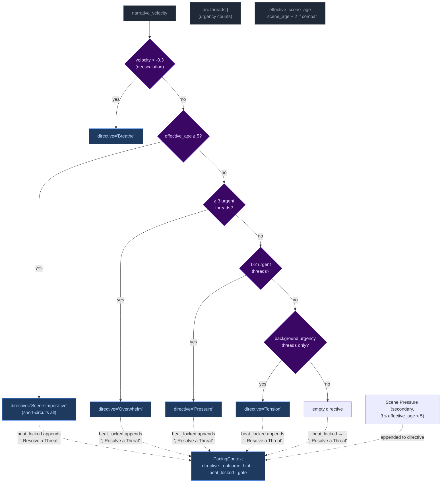
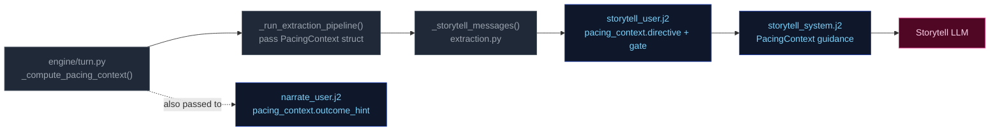

# Step 0 — Ruling / Intent Classification

Classifies the player's action, determines whether a dice check is needed, and
identifies which state domains will be active — narrowing every downstream extractor.

## Flowchart

```mermaid
flowchart LR
    classDef stageRules fill:#4c1d95,color:#ddd6fe,stroke:#7c3aed
    classDef llmNode    fill:#0f172a,color:#94a3b8,stroke:#334155
    classDef pyNode     fill:#1f2937,color:#9ca3af,stroke:#4b5563
    classDef outNode    fill:#3b0764,color:#e9d5ff,stroke:#7c3aed

    subgraph IN["Inputs"]
        I1["state.pc<br>(name, stats, conditions)"]
        I2["state.location"]
        I3["recent_turns[-1:]<br>(last turn's full narrative from chronicle.md<br>via load_last_narration();<br>ruling user prompt)"]
        I4["user_input"]
    end

    subgraph LLM0["LLM — ruling_system.j2 + ruling_user.j2"]
        L0["temp: 0.2 · max_retries: 1<br>output: IntentEnvelope JSON<br>(intent, impossible, scene_motion, check)"]:::llmNode
    end

    subgraph PYRES["Python — impossible check + rules.resolve_check()"]
        P0["if impossible=true:<br>  synthesize fail outcome<br>  skip roll, apply momentum<br>else:<br>  roll 1d12 + stat_mod − diff_mod<br>  map total → Band"]:::pyNode
    end

    subgraph OUT["Outputs"]
        O1["IntentEnvelope<br>  intent: str<br>  intent_verb: str<br>  target: str<br>  impossible: bool<br>  reason: str<br>  scene_motion: hold|advance|transition<br>  check.required: bool<br>  check.skill: SkillName<br>  check.difficulty: Difficulty"]:::outNode
        O2["RulesOutcome<br>  rolled: bool<br>  skill, difficulty, stat_value, stat_mod<br>  diff_mod<br>  dice: list[int]<br>  raw_total, final_total: int<br>  band: Band<br>  directive: str<br>  intent, intent_verb: str<br>  impossible: bool<br>  reason: str"]:::outNode
    end

    IN --> LLM0
    LLM0 -- "IntentEnvelope" --> PYRES
    PYRES --> OUT
```



## Impossibility check

The ruling LLM evaluates whether the described action is impossible given the character's state, inventory, and scene. An action is impossible when:

- It requires an item the character does not have (firing a gun with no ammo, using a key never acquired)
- It requires a capability contradicted by active conditions (climbing with a broken leg, sneaking while armored and noisy)
- It acts on something not present in the scene (targeting an NPC who is not here, opening a door that doesn't exist)

When `impossible=true`: Python sets `check.required=False`, synthesizes a `RulesOutcome` with `band="fail"` and `rolled=False`, applies momentum, and skips the dice roll entirely. The narrator renders the impossible fact and narrates the natural failure.

## Scene motion

The ruling LLM also determines how the scene should progress: `"hold"` (scene continues at current pace), `"advance"` (something significant happens/resolves), or `"transition"` (player is leaving, write the arrival). This feeds into `_compute_pacing_context()` which produces `outcome_hint` for the narrator.

## Key forward dependency

`rules_outcome` feeds into `_compute_pacing_context()` which produces the single authoritative `PacingContext` struct passed to both Narrator and Storytell pipeline.

## Pacing Context

All pacing signals are collapsed into one Python-computed struct (`PacingContext`) passed to both the Narrator and Storytell pipeline. This replaces six independent fields (`narration_directive`, `deescalate`, `narrative_velocity`, `beat_disposition` output, `quest_threshold_directive`, and stale momentum-derived signals). The narrator receives `outcome_hint` (scene motion); Storytell receives the full struct including `directive`.

### Struct definition

```
PacingContext:
  directive: str           # "" | "Breathe" | "Scene Imperative" | "Overwhelm" | "Pressure" | "Tension" | "Scene Pressure" (may include "; Resolve a Threat" secondary when beat_locked); used by Storytell pipeline
  outcome_hint: str | None # "hold" | "advance" | "transition" — narrator's primary scene motion instruction
  beat_locked: bool        # True: consecutive pressure threshold reached or momentum at floor — enables floor relief injection (when not from momentum) and may append "; Resolve a Threat" to directive (except when directive="Breathe")
  gate: str                # "block_escalate" | "allow" (controls thread_add); set independently from beat_locked via deescalate >= 0.5
  summary: str             # human-readable log string, never sent to LLM
```

`beat_locked: True` fires when either `consecutive_pressure_turns >= config.consecutive_pressure_threshold` OR `momentum <= config.momentum_floor`. When locked, `"Resolve a Threat"` is appended to the directive via semicolon (except when directive="Breathe"). The `gate` field prevents Progress from adding new threads during de-escalation windows.

### Computation

`_compute_pacing_context()` in `engine/turn.py` consolidates pacing computation (replacing the former scattered functions: `_compute_narration_directive`, `_compute_narrative_velocity`, `_check_floor_relief`). It takes inputs (`momentum`, `consecutive_pressure_turns` from state meta, `arc.threads[] urgency counts`) and returns a single struct with directive derived from a priority stack. It also computes `outcome_hint` from the ruling LLM's `scene_motion` and PacingContext escalation signals: ruling `scene_motion` takes priority (`transition` > `advance` > fallback), then `impossible=true` forces `advance`, then Python escalation signals (`beat_locked`, Overwhelm/Pressure with urgent threads) produce `advance`, defaulting to `hold`.



Priority order (highest to lowest): **Breathe > Scene Imperative > Overwhelm > Pressure > Tension > Scene Pressure**. The `beat_locked` flag fires when either consecutive pressure threshold or momentum floor is reached — `"Resolve a Threat"` is appended to the directive (except when directive="Breathe") and `outcome_hint` is set to `"advance"`. Floor relief injection only fires when beat_locked stems from consecutive_pressure, not from momentum_floor. The gate is NOT affected by beat_locked (set independently by deescalate ≥ 0.5).

**Breathe secondary guard:** The Breathe directive has an additional check beyond velocity: if urgent threads exist, Breathe is NOT emitted even if `narrative_velocity < -0.3`. Low velocity during unresolved tension (tactical avoidance, stealth) does not trigger de-escalation. Once urgent threads resolve, Breathe fires on the next low-velocity turn.

#### Age computation

`_compute_ages(state)` returns only `{"scene_age": scene_age}` — location_age and combat_age removed in Phase 03 pacing overhaul. The ruling phase pre-computes `effective_scene_age = scene_age + 2` when `"combat"` is in scene tags, stored in `ctx._ages["effective_scene_age"]`. This single-age signal drives all directive thresholds:
- Scene Imperative (≥5 effective age): high-priority directive forcing story advancement
- Scene Pressure (3 ≤ effective_age < 5): secondary append to wind down or shift focus

### Wiring



1. **Computed** once in `run_turn()` via `_compute_pacing_context()`.
2. **Passed through** `_run_extraction_pipeline()` → both `_narrate_messages()` and `_storytell_messages()`.
3. **Narrator template** (`narrate_user.j2`) renders `outcome_hint` (scene motion: hold/advance/transition) with value-specific guidance. No Jinja2 pacing computation remains — all pacing computed by Python.
4. **Storytell template** ((`storytell_system.j2` + `user.j2`)) receives the full struct; guidance maps each directive to appropriate thread/beat actions:

| Directive | Thread action | Gate |
|-----------|---------------|-------|
| **"Breathe"** (de-escalation, velocity < -0.3) | Do NOT add new threads. Allow existing scene threads to persist without escalation. | `block_escalate` (set by deescalate ≥ 0.5; beat_locked does NOT force-close gate) |
| **"Scene Imperative"** (effective_age ≥ 5) | Story must advance — introduce new development forcing resolution or movement; do not linger | Varies by context |
| **"Overwhelm"** (3+ urgent threads) | May add threads if gate allows; emit pressure/escalation beat | `allow` |
| **"Pressure"** (1-2 urgent threads) | Advance relevant scene/arc threads. Add new thread only if gate permits. | Varies by context |
| **"Tension"** (background urgency only) | Do NOT add pressures unless concrete threat emerges; prefer advancing existing threads | Allow |
| **"Scene Pressure"** (3 ≤ effective_age < 5, secondary append) | Begin winding down or introduce reason to shift focus: development elsewhere, closing window | Varies by context |
| **"" (empty)** | No action required beyond normal aging of silent threads. | Allow |

**Note:** Directives may include secondary modifiers joined by semicolons (e.g., "Pressure; Resolve a Threat" when beat_locked). The primary directive drives thread/beat logic; the secondary (`; Resolve a Threat`) acts as thematic guidance for beat type selection. "Resolve a Threat" never appears as a standalone primary directive — it is only appended by the `beat_locked` mechanism (except Breathe, which never receives this append regardless of beat_locked state).

### Consecutive pressure counter

`state["meta"]["consecutive_pressure_turns"]` tracks how many consecutive turns have had pressure-type storyteller beats. Re-keyed from directive tracking (which never fired — Pressure/Overwhelm directives were unreachable) to beat-type tracking:

- **Increments** when `storyteller_result.gm_beat.type` is `"pressure"`, `"escalation"`, or `"complication"`.
- **Resets to 0** on any other beat type, null beat, or missing storyteller output.

When this counter reaches `config.consecutive_pressure_threshold` (default 3), it triggers `beat_locked` alongside the momentum floor fallback (`momentum <= -3`). `beat_locked` appends `"; Resolve a Threat"` to the directive (except when directive="Breathe") and enables floor relief injection (when not from momentum).
