# Step 0 — Ruling / Intent Classification

Classifies the player's action, determines whether a dice check is needed, and
identifies which state domains will be active — narrowing every downstream extractor.

## Flowchart

```mermaid
flowchart LR
    classDef stageRules fill:#4c1d95,color:#ddd6fe,stroke:#7c3aed
    classDef llmNode    fill:#0f172a,color:#94a3b8,stroke:#334155
    classDef pyNode     fill:#1f2937,color:#9ca3af,stroke:#4b5563
    classDef outNode    fill:#3b0764,color:#e9d5ff,stroke:#7c3aed

    subgraph IN["Inputs"]
        I1["state.pc<br>(name, stats, conditions)"]
        I2["state.location"]
        I3["recent_turns[-1:]<br>(from chronicle;<br>user prompt: narrative tail)"]
        I4["user_input"]
    end

    subgraph LLM0["LLM — ruling_system.j2 + ruling_user.j2"]
        L0["temp: 0.2 · max_retries: 1<br>output: IntentEnvelope JSON<br>(intent, impossible, scene_motion, check)"]:::llmNode
    end

    subgraph PYRES["Python — impossible check + rules.resolve_check()"]
        P0["if impossible=true:<br>  synthesize fail outcome<br>  skip roll, apply momentum<br>else:<br>  roll 1d12 + stat_mod + cond_mod − diff_mod<br>  map total → Band"]:::pyNode
    end

    subgraph OUT["Outputs"]
        O1["IntentEnvelope<br>  intent: str<br>  intent_verb: str<br>  target: str<br>  impossible: bool<br>  impossible_reason: str<br>  scene_motion: hold|advance|transition<br>  check.required: bool<br>  check.skill: SkillName<br>  check.difficulty: Difficulty"]:::outNode
        O2["RulesOutcome<br>  rolled: bool<br>  skill, difficulty, stat_value, stat_mod<br>  diff_mod, cond_mod<br>  dice: list[int]<br>  raw_total, final_total: int<br>  band: Band<br>  directive: str<br>  intent, intent_verb: str<br>  impossible: bool<br>  impossible_reason: str"]:::outNode
    end

    IN --> LLM0
    LLM0 -- "IntentEnvelope" --> PYRES
    PYRES --> OUT
```

## Impossibility check

The ruling LLM evaluates whether the described action is impossible given the character's state, inventory, and scene. An action is impossible when:

- It requires an item the character does not have (firing a gun with no ammo, using a key never acquired)
- It requires a capability contradicted by active conditions (climbing with a broken leg, sneaking while armored and noisy)
- It acts on something not present in the scene (targeting an NPC who is not here, opening a door that doesn't exist)

When `impossible=true`: Python sets `check.required=False`, synthesizes a `RulesOutcome` with `band="fail"` and `rolled=False`, applies momentum, and skips the dice roll entirely. The narrator renders the impossible fact and narrates the natural failure.

## Scene motion

The ruling LLM also determines how the scene should progress: `"hold"` (scene continues at current pace), `"advance"` (something significant happens/resolves), or `"transition"` (player is leaving, write the arrival). This feeds into `_compute_pacing_context()` which produces `outcome_hint` for the narrator.

## Key forward dependency

`rules_outcome` feeds into `_compute_pacing_context()` which produces the single authoritative `PacingContext` struct passed to both Narrator and Progress Extractor.
