# Step 1 — Narrate (Streaming)

Generates the narrative prose the player reads. Tokens are streamed to the client.

## Flowchart

```mermaid
flowchart LR
    classDef llmNode   fill:#0f172a,color:#94a3b8,stroke:#334155
    classDef xstream   fill:#4c1d95,color:#ddd6fe,stroke:#7c3aed
    classDef outNode   fill:#1e3a5f,color:#bfdbfe,stroke:#3b82f6

    subgraph IN["Inputs"]
        N1["state (full —<br>pc, location, scene,<br>inventory, quests, compendium)"]
        N2["chronicle_tail<br>(compressed history, ≤budget tokens)"]
        N3["recent_turns (last window_turns, default 3)"]
        N4["rules_outcome<br>(band, directive, dice summary)"]:::xstream
        N5["pack_style (tone / prose guide)"]
        N6["npc_name_pool (cultural name list)"]
        N7["recently_left NPCs"]
        N8["known_npcs<br>(last-seen info)"]
        N9["present_npcs<br>(attitudes)"]
        N10["world_factions<br>(immutable trace)"]
        N11["world_locations<br>(nearby, immutable)"]
        N12["pending_gm_beat<br>(type · surface_as metadata)"]
        N13["pacing_context<br>(directive)<br>from _compute_pacing_context()"]:::xstream
        N14["compendium_bios<br>(upserted bio entries for<br>present + recently_left NPCs)"]
        N15["user_input"]
    end

    subgraph LLM1["LLM — narrate_system.j2 + narrate_user.j2"]
        NL["temp: 0.9 · streaming: yes<br>output: prose narrative (str)"]:::llmNode
    end

    subgraph OUT["Outputs"]
        NO1["narrative: str<br>(streamed as tokens → client<br>then joined + thinking-stripped)"]:::outNode
        NO2["narr_metrics<br>  first_token_ms<br>  total_ms<br>  tokens_in / tokens_out"]
    end

    IN --> LLM1
    LLM1 --> OUT
```

## Arc context in narration

The narrator receives `current_arc` in both system and user prompts. Key fields:

- **`goal_context`**: A seed-time field (2–3 sentences) explaining why `visible_goal` matters to the character specifically — inner cost or pressure that makes it emotionally loaded. When present, `_arc.j2` presents it alongside other arc context in the user prompt for early-turn narrative guidance: ground the player in personal stakes before broad exposition.
- **`visible_goal`**: The player-facing objective.
- **`thematic_question`**: The moral tension — never stated directly in prose. Used as a lens for emphasis: what detail feels loaded, what silence matters.
- **`pc_drive`**: The character's personal motive. Expressed indirectly through goal_context, NPC relations, and action language rather than displayed as a labeled UI fact.
- **`hidden_truths[]`**: Internal-only story secrets the narrator must never reveal in prose.
- **`threads[]`**: Unified thread collection filtered by `active` flag. Scene-scope threads provide immediate pressure; arc-scope threads provide medium-term tension.

### Opening-turn narrative mode

When `goal_context` is present (always true after seed), the narrator treats early turns as a distinct onboarding mode:
1. Personal stakes before broad exposition
2. One NPC moment with emotional charge (driven by `relation` fields on seed NPCs)
3. One immediately actionable pressure

The presence of `goal_context` itself is the signal — no turn-counting dependency needed. The guidance is most impactful in the first few turns and persists as background context throughout the campaign.

## Key forward dependency

`narrative` is the primary content input for all three extraction streams below.
