# Step 1 — Narrate (Streaming)

Generates the narrative prose the player reads. Tokens are streamed to the client.

## Flowchart

```mermaid
flowchart LR
    classDef llmNode   fill:#0f172a,color:#94a3b8,stroke:#334155
    classDef xstream   fill:#4c1d95,color:#ddd6fe,stroke:#7c3aed
    classDef outNode   fill:#1e3a5f,color:#bfdbfe,stroke:#3b82f6

    subgraph IN["Inputs"]
        N1["state (full —<br>pc, location, scene,<br>inventory, compendium)"]
        N2["prior_history<br>(last 10 incremental history bullets, all but last rendered as bullets)"]
        N3["recent_turns[-1:]<br>(single most recent turn as full text)"]
        N4["rules_outcome<br>(band, directive, impossible, dice summary)"]:::xstream
        N5["conditions<br>(top-level list from pc.conditions)"]
        N6["npc_name_pool (cultural name list)"]
        N7["npc_roster<br>(from build_npc_roster(comp),<br>  filtered to presence == 'present' only)"]
        N9["world_factions<br>(immutable trace)"]:::xstream
        N10["pending_gm_beat<br>(type · effect metadata)"]
        N11["pacing_context<br>(outcome_hint)<br>from _compute_pacing_context()"]:::xstream
        N15["user_input"]
    end

    subgraph LLM1["LLM — narrate_system.j2 + narrate_user.j2"]
        NL["temp: 0.9 · top_p: 0.95 · freq_penalty: 0.5 · streaming: yes<br>output: prose narrative (str)"]:::llmNode
    end

    subgraph OUT["Outputs"]
        NO1["narrative: str<br>(streamed as tokens → client<br>then joined + thinking-stripped)"]:::outNode
        NO2["narr_metrics<br>  first_token_ms<br>  total_ms<br>  tokens_in / tokens_out"]
    end

    IN --> LLM1
    LLM1 --> OUT
```

## Arc context in narration

The narrator receives `current_objective` in both system and user prompts. Key fields:

- **`long_term_objective`**: The player-facing objective. An `arc_origin` (seed-time field, 2–3 sentences past tense) is surfaced in the sidebar UI but NOT rendered in prompt context — the narrator works from general early-turn behavioral guidance, not the raw origin text.
- **`threads[]`**: Unified thread collection with `dormant` flag. Scene-scope threads provide immediate pressure; arc-scope threads provide medium-term tension.
- **`resolved_arc`**: TTL-filtered list of previously resolved arcs, providing narrative continuity across arc transitions.

### Opening-turn narrative mode

The seed embeds emotional stakes in the initial state — NPC `relation` fields, `motivation/fear/leverage`, and an `arc_origin` sidebar entry. The narrator does NOT receive special early-turn prompt guidance or `arc_origin` in its context. Instead, the initial scene's NPCs (with rich behavioral drivers), the opening narrative's tone, and the player-facing sidebar create the onboarding experience. The narrator works from its standard behavioral guidance and the richness of seed-generated state.

## Key forward dependency

`narrative` is the primary content input for all three extraction streams below.

### GM Beat consumption

The narrator receives a pending GM beat from `state.meta.pending_gm_beat` (set by Ruling **the same turn**, moments before Narrate runs — selected from `state.meta.beat_candidates` that were prepared by the previous turn's World step). The beat's `type` and `effect` metadata are passed alongside the outcome hint as creative guidance for the narrative. The beat is NOT cleared after narration — it persists into the next turn, where Ruling's per-turn "always replace or pop" rule resolves it (selects a new beat from fresh candidates, or null-clears). Narrate is a pure reader of `pending_gm_beat` and does not mutate it. Full beat lifecycle is documented in [step2d-world](./step2d-world.md).

**Beats are creative guidance, not binding instructions.** The LLM is not given explicit instructions on how to interpret beats — it relies on general behavioral guidance. This means beats often get ignored by the LLM because it doesn't understand how to interpret them. Beat engagement is tied to scene pressure: when pressure is high, beats are more likely to be honored. The beat structure (currently 4-entry window with 60% pressure threshold) was found to be too strict; consider 6-entry/50% or 8-entry windows.

### Scene pressure

Scene pressure (`scene_pressure_threshold`) and scene imperative (`scene_imperative_threshold`) are the engine's mechanism for forcing scene transitions. Scene pressure's purpose is to prevent the LLM from staying in one location for 20 turns — the LLM naturally wants to linger. When `effective_age >= scene_pressure_threshold`, the narration directive begins winding down. When `effective_age >= scene_imperative_threshold`, the engine forces a "transition" outcome hint. This is heavy-handed but necessary because the LLM will naturally resist scene transitions. The directive is NOT "guards closing in" — it's a narrative mechanism to prevent stagnation.
