# Step 1 — Narrate (Streaming)

Generates the narrative prose the player reads. Tokens are streamed to the client.

## Flowchart

```mermaid
flowchart LR
    classDef llmNode   fill:#0f172a,color:#94a3b8,stroke:#334155
    classDef xstream   fill:#4c1d95,color:#ddd6fe,stroke:#7c3aed
    classDef outNode   fill:#1e3a5f,color:#bfdbfe,stroke:#3b82f6

    subgraph IN["Inputs"]
        N1["state (full —<br>pc, location, scene,<br>inventory, quests, compendium)"]
        N2["chronicle_tail<br>(compressed history, ≤budget tokens)"]
        N3["recent_turns (last window_turns=6)"]
        N4["rules_outcome<br>(band, directive, dice summary)"]:::xstream
        N5["pack_style (tone / prose guide)"]
        N6["npc_name_pool (cultural name list)"]
        N7["recently_left NPCs"]
        N8["known_npcs<br>(last-seen info)"]
        N9["present_npcs<br>(attitudes)"]
        N10["world_factions<br>(immutable trace)"]
        N11["world_locations<br>(nearby, immutable)"]
        N12["pending_gm_beat"]
        N13["pacing_context<br>(directive · beat_hint)<br>from _compute_pacing_context()"]:::xstream
        N14["user_input"]
    end

    subgraph LLM1["LLM — narrate_system.j2 + narrate_user.j2"]
        NL["temp: 0.9 · streaming: yes<br>output: prose narrative (str)"]:::llmNode
    end

    subgraph OUT["Outputs"]
        NO1["narrative: str<br>(streamed as tokens → client<br>then joined + thinking-stripped)"]:::outNode
        NO2["narr_metrics<br>  first_token_ms<br>  total_ms<br>  tokens_in / tokens_out"]
    end

    IN --> LLM1
    LLM1 --> OUT
```

## Key forward dependency

`narrative` is the primary content input for all three extraction streams below.
