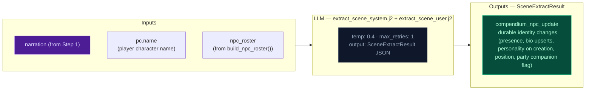

# Step 2a — Scene Extract

Extracts NPC presence and durable identity changes from the narrative.

## Flowchart

## Extraction prompt (`extract_scene_system.j2`) — NPC quality rules

Four additions prevent common NPC compendium quality issues:

1. **NPC field requirements by tier**: Named NPCs (proper name: at least two words with first and last capitalized) must have `bio` + `personality` + at least 2 of `motivation`/`fear`/`leverage`/`tie` (= 4 fields minimum). Unnamed NPCs (name doesn't look like a proper name) need only `bio` — no personality fields. The engine blocks motivation/fear/leverage/tie/personality assignment on unnamed NPCs via a guard in `apply_npc_scene_management()` (npcs.py) — if the LLM emits these fields for an unnamed NPC, they are nullified before storage. This ensures named NPCs get personality depth while reducing output bloat for transient characters.

2. **Passive NPC extraction**: When a named character enters the scene as the recipient of a major action (rescue, capture, healing, transport, medical aid), the LLM must create a compendium entry for them even if they don't perform visible actions.

3. **Party assignment**: The scene extractor assigns `party: true` to companion NPCs — characters who consistently accompany the PC. Criteria: "Is this character likely to follow the PC, or have they been following them?" Set `party: true` when narration shows the NPC is traveling with, accompanying, or staying near the PC by choice. Keep it until narration clearly shows parting ways (departure, betrayal, death, different destination). Do NOT set for oppositional, temporary scene characters, or neutral parties. Only emit when the value changes (omit unchanged). This runs in stream 1 (scene extractor) because it must be available before delta builder's auto-demotion loop runs after state extraction.

## Key forward dependency

Step 2c receives `npc_roster` (from `build_npc_roster()`) built from comp_this_turn. World generates beat candidates from full NPC profiles (motivation, fear, leverage, tie) directly from the compendium. No forward-facing mechanics (`thread_add`, `gm_beat`) are emitted by this stream — they go through the unified thread lifecycle via Record (Step 2c).
