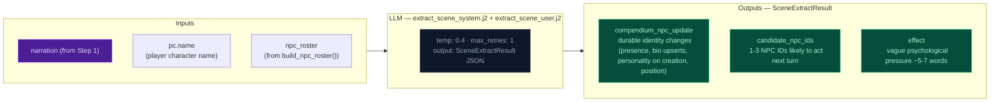

# Step 2a — Scene Extract

Extracts NPC presence and durable identity changes from the narrative.

## Flowchart

## Beat candidate selection

Scene identifies 1-3 NPCs who are narratively relevant for the next beat and writes a vague psychological pressure effect. This is NOT a full beat — it's a signal to storytell about who matters narratively. Storytell maps these to specific NPCs and threads.

## Extraction prompt (`extract_scene_system.j2`) — NPC quality rules

Four additions prevent common NPC compendium quality issues:

1. **Alias-first naming**: Descriptive labels ("Scarred Soldier", "Unknown Visitor") go in `aliases`, not `name`. Proper names ("Leo Vance") go in `name`. When narration later reveals a proper name for an alias NPC, the LLM updates `name` and preserves the descriptive label in `aliases` — preventing duplicate entries. The existing `_dedup_compendium_update()` in Python handles name-matching dedup.

2. **NPC field requirements by tier**: Named NPCs (proper name in `name`) must have `bio` + `personality` + at least 2 of `motivation`/`fear`/`leverage`/`bond` (= 4 fields minimum). Unnamed NPCs (descriptive label) need only `bio` — no personality fields. Promotion to named adds `personality` + 2 extra fields. Group NPCs must state exact count in `name`. This ensures named NPCs get personality depth while reducing output bloat for transient characters.

3. **Group NPC identity**: Group NPCs (e.g., "Two sailors") have short names with quantity + type only. Distinguishing features for each individual in the group go in the `bio` field (appearance, demeanor, visible trait). The scene extractor pulls these from narration into the bio. The narrator references bio details when reintroducing groups rather than collapsing to the generic type. This makes reuse feel like the same people, not any two sailors.

4. **Passive NPC extraction**: When a named character enters the scene as the recipient of a major action (rescue, capture, healing, transport, medical aid), the LLM must create a compendium entry for them even if they don't perform visible actions. Belt-and-suspenders coverage — the primary alias-first naming naturally captures passive NPCs through descriptive aliases.

## Key forward dependency

Step 2c receives `candidate_npc_ids` and `scene_effect` from scene, plus `npc_roster` (from build_npc_roster()) built from comp_this_turn. Scene writes vague effect; storytell maps to specific NPCs/threads. No forward-facing mechanics (`thread_add`, `gm_beat`) are emitted by this stream — they go through the unified thread lifecycle via Storytell (Step 2c).
