# Step 2a — Scene Extract

Extracts location changes, NPC presence, scene tags, and suggested actions from the narrative.

## Flowchart

```mermaid
flowchart LR
    classDef llmNode fill:#0f172a,color:#94a3b8,stroke:#334155
    classDef xstream fill:#4c1d95,color:#ddd6fe,stroke:#7c3aed
    classDef outNode fill:#064e3b,color:#a7f3d0,stroke:#10b981

    subgraph IN["Inputs"]
        S1["narrative (from Step 1)"]:::xstream
        S2["state.pc (name, tagline, bio, stats)"]
        S3["state.location"]
        S4["compendium.npcs[presence='present']"]
        S5["state.pc.conditions"]
        S6["npc_roster<br>(from build_npc_roster(), filtered by presence field)"]
        S7["recent_turns[-1:]<br>(T-1 prior narration)"]
    end

    subgraph LLM2A["LLM — extract_scene_system.j2 + extract_scene_user.j2"]
        SL["temp: 0.4 · max_retries: 1<br>output: SceneExtractResult JSON"]:::llmNode
    end

    subgraph OUT["Outputs — SceneExtractResult"]
        O1["scene_tags: list[str]"]:::outNode
        O2["scene_tagline: str (3–6 words describing location/situation, NOT event summary)"]:::outNode
        O3["location_change: LocationRef | None<br>  id, name, description"]:::outNode
        O4["location_description: str | None"]:::outNode
        O5["compendium_npc_update<br>  durable identity changes (presence, notes, bio upserts, personality on creation)"]:::outNode
    end

    IN --> LLM2A
    LLM2A --> OUT
```

## Key forward dependency

`location_change` flows into `extraction_ctx` (built by `_build_extraction_context`). Step 2c also receives `npc_roster` (from build_npc_roster()) built from comp_this_turn. No forward-facing mechanics (`thread_add`, `gm_beat`) are emitted by this stream — they go through the unified thread lifecycle via Storytell (Step 2c).
