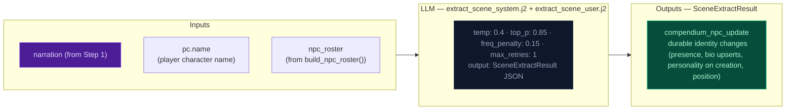

# Step 2a — Scene Extract

Extracts NPC presence and durable identity changes from the narrative.

## Flowchart

## Extraction prompt (`extract_scene_system.j2`) — NPC quality rules

Four additions prevent common NPC compendium quality issues:

1. **NPC field requirements by tier**: Named NPCs (proper name: at least two words with first and last capitalized) must have `bio` + `motivation` + 2 of {`fear`, `leverage`, `tie`} = 4 fields minimum. Motivation is mandatory for every character. Unnamed NPCs need `bio` + `motivation` — motivation is required, not generic filler. The engine blocks motivation/fear/leverage/tie assignment on unnamed NPCs via a guard in `apply_npc_scene_management()` (npcs.py:80-88) — if the LLM emits these fields for an unnamed NPC, they are nullified before storage. Note: `personality` is NOT a field in the extraction schema or NPCEntry model.

2. **Passive NPC extraction**: When a named character enters the scene as the recipient of a major action (rescue, capture, healing, transport, medical aid), the LLM must create a compendium entry for them even if they don't perform visible actions.

## Key forward dependency

Step 2c does NOT receive `npc_roster`. Record receives `narration`, `arc.threads[]`, `recent_turns[-10:]`, `band`, `world_state`, `prior_history`. World generates beat candidates from full NPC profiles (motivation, fear, leverage, tie) directly from the compendium. No forward-facing mechanics (`thread_add`, `gm_beat`) are emitted by this stream — they go through the unified thread lifecycle via Record (Step 2c).

## Failure mode

Scene stream is `fatal=True` in the pipeline — parse failures propagate up and abort the turn. State and Record streams are non-fatal (failures are caught, turn continues with defaults).
