# Step 2b — State Extract

Extracts inventory changes and player condition mutations from the narrative.

## Flowchart

```mermaid
flowchart LR
    classDef llmNode fill:#0f172a,color:#94a3b8,stroke:#334155
    classDef xstream fill:#4c1d95,color:#ddd6fe,stroke:#7c3aed
    classDef outNode fill:#451a03,color:#fde68a,stroke:#f59e0b

    subgraph IN["Inputs"]
        S1["narration (from Step 1)"]:::xstream
        S2["pc.conditions"]
        S3["state.inventory"]
        S4["intent<br>(from Step 0)"]
    end

    subgraph LLM2B["LLM — extract_state_system.j2 + extract_state_user.j2"]
        SL["temp: 0.4 · max_retries: 1<br>output: StateExtractResult JSON"]:::llmNode
    end

    subgraph OUT["Outputs — StateExtractResult"]
        O1["inventory_add: list[InventoryItem]<br>  id, name, notes, amount"]:::outNode
        O2["inventory_remove: list[InventoryRemove]<br>  id, amount (None = full stack)"]:::outNode
        O3["inventory_update: list[InventoryUpdate]<br>  id, name?, notes?"]:::outNode
        O4["pc_condition_add: list[ConditionAdd]<br>  id, label, description"]:::outNode
        O5["pc_condition_remove: list[ConditionRemove]<br>  id"]:::outNode
    end

    IN --> LLM2B
    LLM2B --> OUT
```

## Key forward dependency

Step 2c receives `npc_roster` (from build_npc_roster()) and `location_change` from Step 2a. Cross-stream items_gained/lost were removed — extraction_ctx now covers all this-turn derived data.
