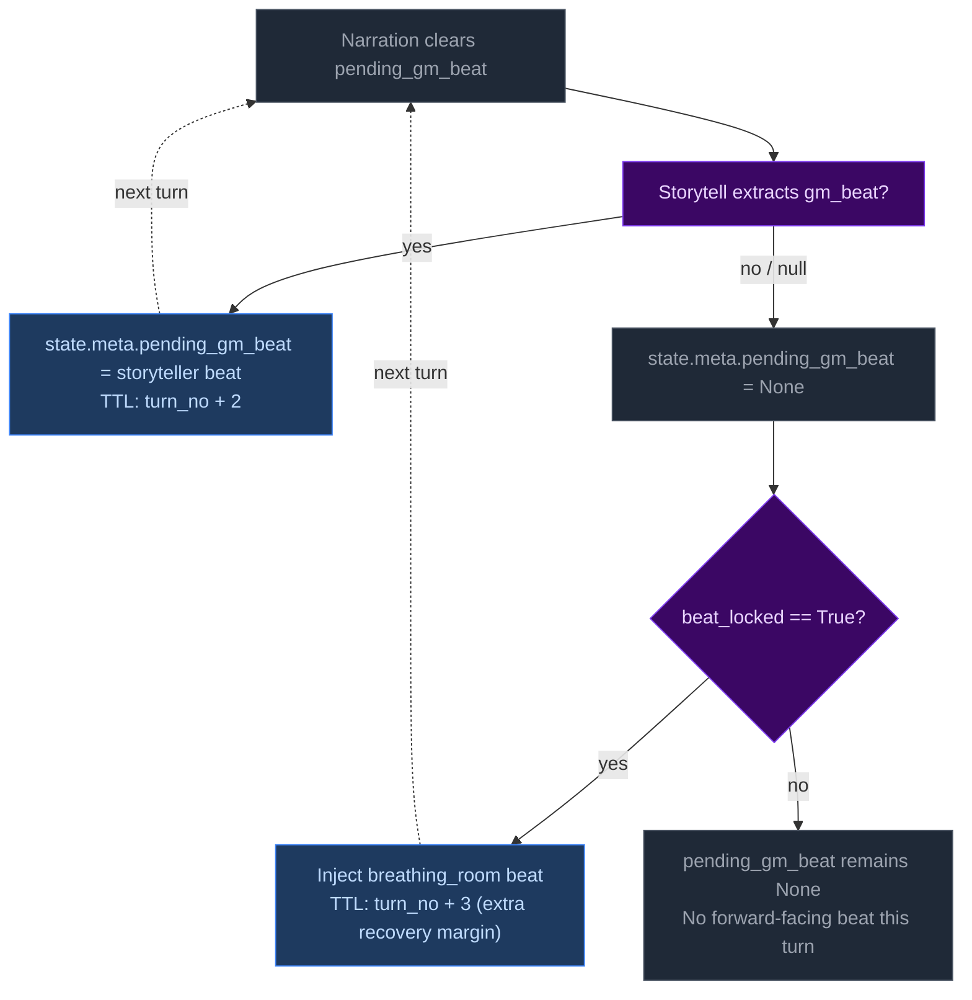

# Step 2c — Progress Extract

Extracts quest updates, recent events, and durable NPC compendium changes.

## Flowchart


## Always runs

Progress is the post-narration storytelling brain. It always executes every turn (never skipped) and feeds next turn's rules call via `recent_events_add` (durable narrative facts), `thread_advance/resolve/add` (unified thread lifecycle with scope-aware age demotion), and `gm_beat` (forward-facing beats stored in `state.meta.pending_gm_beat`).

## GMBeat schema

```
GMBeat
  type: complication | revelation | opportunity | breathing_room | pressure | twist | setback | escalation | callback
  surface_as: ambient | event | npc_behavior | environmental | player_discovery | item (default: ambient)
  beat_expires_turn: int | None (turn number at which the beat expires; set to turn_no + 2 when stored)
```

## Beat lifecycle

The beat flows through three phases per turn:

**Phase 1 — Pre-narration expiry check.** At the start of each turn, the engine reads `state.meta.pending_gm_beat` from the previous turn. If `beat_expires_turn` is set and the current turn number exceeds it, the beat is nullified. Otherwise it proceeds to narration.

**Phase 2 — Narration consumption.** The beat is passed to the narrator via `_narrate_messages(pending_gm_beat=...)`. The narrator uses the beat's type and surface_as metadata as creative guidance alongside the pacing directive. After narration completes, the pending beat is cleared from state — it is not restored for storyteller consumption.

**Phase 3 — Extraction disposition (inferred).** The storyteller receives no pending beat context in its prompt — it decides beats based solely on current extraction data (scene state, threads, pacing context, band). Unlike the previous architecture, there is no explicit `beat_disposition` field. Instead:
- If Progress emits a new `gm_beat`, it replaces the old one (`state.meta.pending_gm_beat = gm_beat` with `beat_expires_turn = turn_no + 2`)
- If Progress emits nothing and the beat's `expires_at` hasn't passed, the engine preserves the existing beat unchanged (carry)
- The engine stores beats with `beat_expires_turn = turn_no + 2` as a hard TTL ceiling. Beats past their expiry are discarded automatically on load.

## Floor relief injection priority

The floor relief mechanism fires when `_pc.beat_locked=True` AND no beat exists in `state.meta.pending_gm_beat` at extraction completion time (`turn.py:1263`). It injects a `breathing_room` beat with TTL of 3 turns (one more than storyteller-emitted beats' TTL of 2).

Floor relief beats are **fallback only** — they inject a recovery beat when the LLM didn't already provide one. If the storyteller emits any gm_beat during extraction, floor relief does NOT fire because `pending_gm_beat` is already set. The LLM's beat takes priority over Python-injected recovery signals.



## Directive-beat alignment

The storyteller prompt (`storytell_system.j2:54-65`) maps each PacingContext directive to recommended beat types (e.g., "Breathe" → breathing_room; "Overwhelm" → pressure/escalation). This alignment is **guidance only** — Python accepts whatever gm_beat the LLM emits with no validation, correction, or override. Design rationale: forcing directive-beat alignment would constrain storytelling flexibility and create brittleness if the LLM makes contextually appropriate but directive-divergent beat choices.
