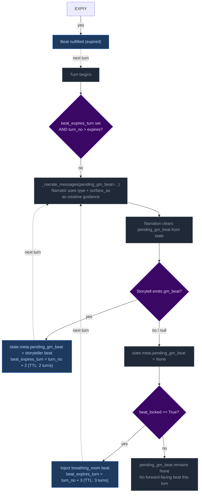
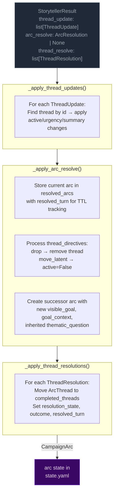
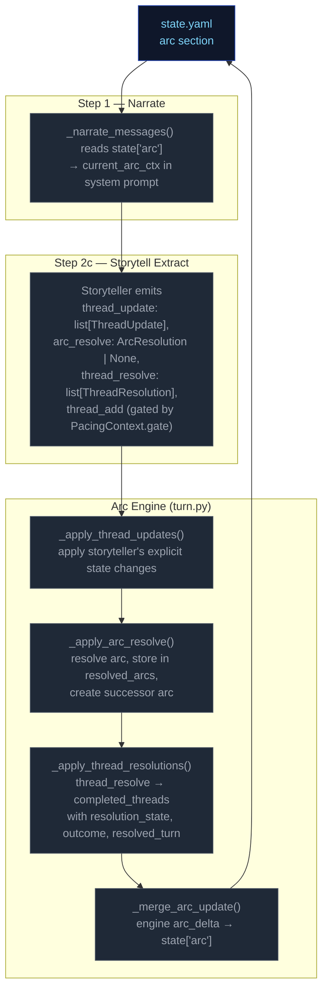

# Step 2c — Storytell

Extracts thread updates, arc actions, world state changes, and durable NPC compendium changes.

## Flowchart


## Always runs

Progress is the post-narration storytelling brain. It always executes every turn (never skipped) and feeds next turn's rules call via `world_state_add/remove` (persistent world facts), `thread_update/arc_resolve/thread_resolve/thread_add` (storyteller-managed thread lifecycle), and `gm_beat` (forward-facing beats stored in `state.meta.pending_gm_beat`).

## GM Beat

Forward-facing storytelling beats that shape scene progression across turns. Beats are emitted by Storytell (Step 2c), consumed by Narrator (Step 1) the following turn, and managed via a TTL-based lifecycle in `state.meta.pending_gm_beat`.

### GMBeat Schema

```
GMBeat
  type: complication | revelation | opportunity | breathing_room | pressure | twist | setback | escalation | callback
  surface_as: ambient | event | npc_behavior | environmental | player_discovery | item (default: ambient)
  beat_expires_turn: int | None — turn number at which the beat expires; set to turn_no + 2 when stored
```

**Validation:** Only `type` is validated by `StorytellerResult._nullify_invalid_gm_beat` — nullified if falsy. No validation on `surface_as`. Python accepts whatever gm_beat the LLM emits with no correction or override.

### PacingContext Beat Fields

The beat system intersects with pacing via two fields in `PacingContext` (see [step0-ruling](./step0-ruling.md#pacing-context)):

| Field | Type | Meaning |
|-------|------|---------|
| `directive` | str | Includes secondary modifier `"Resolve a Threat"` (appended by semicolon) when `beat_locked=True`. Drives storytell guidance for beat type selection. |
| `beat_locked` | bool | True when dual-trigger relief fired: either `consecutive_pressure_turns >= config.consecutive_pressure_threshold` OR `momentum <= config.momentum_floor`. When locked, `"Resolve a Threat"` is appended to the directive and gate is force-closed (`block_escalate`). Progress MUST emit a breathing_room beat. |

### Beat Lifecycle — Three Phases Per Turn



**Phase 1 — Pre-narration expiry check.** At the start of each turn, the engine reads `state.meta.pending_gm_beat` from the previous turn. If `beat_expires_turn` is set and the current turn number exceeds it, the beat is nullified. Otherwise it proceeds to narration.

**Phase 2 — Narration consumption.** The beat is passed to the narrator via `_narrate_messages(pending_gm_beat=...)`. The narrator uses the beat's `type` and `surface_as` metadata as creative guidance alongside the pacing directive. After narration completes, the pending beat is cleared from state — it is not restored for storyteller consumption.

**Phase 3 — Extraction disposition (inferred).** The storyteller receives no pending beat context in its prompt — it decides beats based solely on current extraction data (scene state, threads, pacing context, band). There is no explicit `beat_disposition` field. Instead:
- If Progress emits a new `gm_beat`, it replaces the old one (`state.meta.pending_gm_beat = gm_beat` with `beat_expires_turn = turn_no + 2`)
- If Progress emits nothing and the beat's TTL hasn't passed, the engine preserves the existing beat unchanged (carry) — though narration already cleared pending state in Phase 2, so this effectively means a new beat is written or None is set

### Floor Relief Injection

The floor relief mechanism fires when `_pc.beat_locked=True` AND no beat exists in `state.meta.pending_gm_beat` at extraction completion time (`turn.py:1263`). It injects a `breathing_room` beat with TTL of 3 turns (one more than storyteller-emitted beats' TTL of 2).

Floor relief beats are **fallback only** — they inject a recovery beat when the LLM didn't already provide one. If Storytell emits any gm_beat during extraction, floor relief does NOT fire because `pending_gm_beat` is already set. The LLM's beat takes priority over Python-injected recovery signals.

### Directive-Beat Alignment

The storyteller prompt (`storytell_system.j2`, pacing context guidance section) maps each PacingContext directive to recommended beat types (e.g., "Breathe" → breathing_room; "Overwhelm" → pressure/escalation). This alignment is **guidance only** — Python accepts whatever gm_beat the LLM emits with no validation, correction, or override. Design rationale: forcing directive-beat alignment would constrain storytelling flexibility and create brittleness if the LLM makes contextually appropriate but directive-divergent beat choices.

### TTL Mechanics Summary

| Source | Default TTL | Expiry Calculation |
|--------|-------------|-------------------|
| Storytell-emitted beat | 2 turns | `beat_expires_turn = turn_no + 2` |
| Floor relief (Python-injected) | 3 turns | `beat_expires_turn = turn_no + 3` (extra recovery margin) |

Beats past their expiry are discarded automatically on load. Both unconditional clears were removed from turn.py — beats survive until replacement, explicit nullification, or TTL expiry. Beat write logic in Progress step only writes if `beat_locked` AND no existing pending_gm_beat exists, preventing overwrites during locked windows.

## Campaign Arc System

The campaign arc system tracks story threads across turns. Thread state is **storyteller-managed** — the LLM explicitly controls urgency and active/dormant state via `thread_update` directives. The engine applies these without enforcement of caps, cooldowns, or silent timers.

### Arc Data Model

```
CampaignArc
  visible_goal: str          — What the PC is trying to achieve
  goal_context: str          — 2–3 sentences explaining why visible_goal matters to this character specifically
  thematic_question: str     — The moral/thematic tension of the arc
  threads: list[ArcThread]   — Unified collection with active flag; storyteller controls state via thread_update
  completed_threads: list[ArcThread] — Resolved/failed/abandoned threads
  resolution: str | None     — Set when arc is resolved via arc_resolve
  last_thread_created_turn: int — Tracks when a thread was last created for pacing

ArcThread
  id: str                    — Unique identifier
  summary: str               — What this thread is about
  scope: Literal["scene", "arc"]  # scene = short-lived tied to current location; arc = persistent story tension
  active: bool = True        # Storyteller-controlled via thread_update
  urgency: Literal["background", "normal", "urgent"] = "normal"  # Storyteller-controlled
  tags: list[str]            — Keywords for engagement matching
  resolution_state: str | None # Set when thread_resolve processes resolved/failed/abandoned
  outcome: str | None        # Set from ThreadResolution.outcome when moved to completed_threads
  resolved_turn: int | None  — Turn when thread was resolved; used for TTL filtering in prompts
  key: str | None            — Optional canonical concept label; enables engine-side dedup auto-merge
```

### Engine-Driven Arc

Thread lifecycle runs in `engine/turn.py` during the extraction phase. Three functions handle thread operations in order:



**Pipeline order:** thread updates → arc resolution → thread resolutions.

**Key rules:**
- **Storyteller-controlled:** No caps, cooldowns, or silent timers. The storyteller decides which threads to update via `thread_update` and when to resolve the arc via `arc_resolve`.
- **Arc resolution:** When `arc_resolve` is emitted, the current arc is stored in `state["resolved_arcs"]` with `resolved_turn` for TTL tracking. A successor arc is created with the new `visible_goal`, `goal_context`, and inherited `thematic_question`. Threads not mentioned in `thread_directives` carry over.
- **TTL-based cleanup:** Completed threads and resolved arcs are pruned from prompt context after `completed_thread_ttl` / `resolved_arc_ttl` turns (default 3).

### Arc Context in Narration

The arc state is passed to the narrator via `current_arc` in both system and user prompts. The narrator sees all arc metadata including resolved arcs (TTL-filtered) and completed threads.

When `goal_context` is present on the arc, the narrator treats it as narrative guidance for early turns: ground the player in personal stakes before broad exposition. When resolved arcs are present in the context, the narrator uses them to inform how the new arc relates narratively to what was resolved before — creating continuity across arc transitions.

### Arc System Integration Points



### Thread Mechanics

#### Two Thread Scopes

Threads have a `scope` field (`"scene"` or `"arc"`) that determines narrative treatment:

| Scope | Narrative role | Engine lifecycle |
|---|---|---|
| `scene` | Short-lived tension tied to current location/NPCs | **Purged on location change** — removed from `arc.threads[]` when player moves to a new location (delta_builder.py:243-248). The LLM creates arc-scoped threads for persistent story lines. |
| `arc` | Persistent story tension across scenes | Persists across location changes. Only removed via `thread_resolve` or `thread_update` with `active=False`. |

#### Entry Points

Three call sites in `run_turn()` process threads in order:
1. **`_apply_thread_updates()`** — apply storyteller's explicit state changes
2. **`_apply_arc_resolve()`** — resolve arc, store in resolved_arcs, create successor
3. **`_apply_thread_resolutions()`** — resolve/fail/abandon → completed

All three run after `apply_delta()` but before `save_state()`.

#### Step-by-Step: `_apply_thread_updates()`

Processes `storyteller_result.thread_update` (list of `ThreadUpdate` with `id`, optional `active`, `urgency`, `summary`).

For each ThreadUpdate:
1. Find matching thread by ID in `arc.threads[]`
2. If not found → log WARNING, skip
3. Apply non-None fields (`active`, `urgency`, `summary`) via `model_copy`
4. Log applied changes at INFO level

#### Step-by-Step: `_apply_arc_resolve()`

Processes `storyteller_result.arc_resolve` (optional `ArcResolution` with `resolution`, `visible_goal`, `goal_context`, optional `thematic_question`, `thread_directives`).

1. If `arc_resolve` is None → return None
2. Validate arc from state; if missing/invalid → log WARNING, return None
3. Store current arc in `state["resolved_arcs"]` with `resolved_turn` for TTL tracking
4. Process `thread_directives`:
   - `drop` → remove thread from arc
   - `move_latent` → set `active = False`
   - Threads not mentioned carry over as-is
5. Create successor arc with new `visible_goal`, `goal_context`, inherited `thematic_question`, surviving threads
6. Replace `state["arc"]` with successor

#### Thread Creation (inline in `run_turn()`)

New threads (`storyteller_result.thread_add`) are gated by:

1. **Pacing gate**: `_pc is None or _pc.gate == "allow"` — blocks escalation when pacing context says so
2. **Key collision**: exact match on thread `key` → reject with WARNING log
3. **Fuzzy auto-merge**: ≥70% token overlap on `key` → update existing thread summary/tags instead of creating new thread

#### Step-by-Step: `_apply_thread_resolutions()`

Processes `storyteller_result.thread_resolve` (list of `ThreadResolution` with `id`, `resolution_state`, `outcome`).

1. Find matching thread by ID in `arc.threads[]`
2. If not found → log warning, skip
3. If found → move to `arc.completed_threads[]`, set `resolution_state`, `outcome`, and `resolved_turn`
4. Deduplicate completed_threads entries: existing ID gets updated, not duplicated

#### Pacing Context Gate

`_compute_pacing_context()` sets `gate` based on deescalation:

```
gate = "allow" by default
gate = "block_escalate" when deescalate >= 0.5
```

The gate blocks thread creation (in `run_turn()`). The LLM is instructed not to emit `thread_add` when gate != "allow".

#### Constants Reference

| Constant | Value (default) | Effect |
|---|---|---|
| `config.resolved_arc_ttl` | 3 | Turns to keep resolved arcs in prompt context |
| `config.completed_thread_ttl` | 3 | Turns to keep completed threads in prompt context |

#### Validation Edge Cases

1. **Empty arc state** — No arc in state → log DEBUG, return None (no crash)
2. **Validation failure** — Arc fails Pydantic validation → log WARNING, return None
3. **Unknown thread ID in update** — Log WARNING, skip — does not block valid updates
4. **Unknown resolution ID** — Log WARNING, skip — does not block valid resolutions
5. **Duplicate thread ID in creation** — Checked against existing + completed IDs
6. **Key collision in creation** — Exact match rejects; fuzzy match auto-merges
