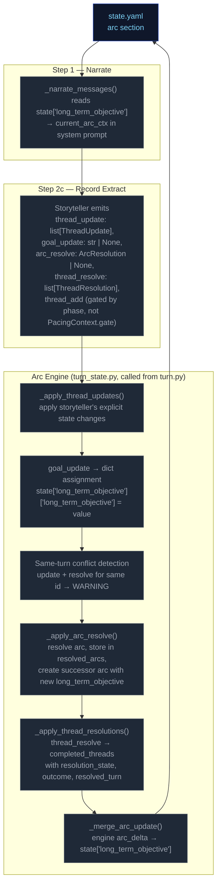

# Step 2c — Record

Backward-looking scribe step. Extracts thread updates, arc actions, and the durable player-facing recap (`outcome_summary`, `actions`). Runs as part of the synchronous extraction pipeline after Scene (2a) and State (2b).

> **Beat generation moved to Step 2d (World).** Beat selection moved to Step 0 (Ruling). The `gm_beat` field has been removed from `StorytellerResult`; the `GMBeat` Pydantic model is repurposed as the validation schema for World candidates and Ruling's `selected_beat`. See [step2d-world.md](./step2d-world.md) and [step0-ruling.md](./step0-ruling.md).

## Flowchart

```mermaid
flowchart LR
    classDef llmNode fill:#0f172a,color:#94a3b8,stroke:#334155
    classDef xstream fill:#4c1d95,color:#ddd6fe,stroke:#7c3aed
    classDef outNode fill:#500724,color:#fbcfe8,stroke:#ec4899

    subgraph IN["Inputs"]
        S1["narrative (from Step 1)"]:::xstream
        S5["pc_name<br>(player character name)"]:::xstream
        S6["arc.threads[]<br>(unified scope=scene + scope=arc)"]:::xstream
        S7["rules_outcome.band"]:::xstream
        S9["recent_turns[-10:]<br>(prior narration, last 10 turns)"]:::xstream
        S10["prior_history[:-1]<br>(all history bullets except last,<br>already shown as full text)"]:::xstream
    end

    subgraph LLM2C["LLM — record_system.j2 + record_user.j2"]
        SL["temp: 0.4 · top_p: 0.85 · freq_penalty: 0.15 · max_retries: 1<br>output: StorytellerResult JSON<br>(gm_beat field removed)"]:::llmNode
    end

    subgraph OUT["Outputs — StorytellerResult"]
        O1["thread_update: list[ThreadUpdate]<br>  id + urgency/active/summary/progress/major_update_signal changes"]:::outNode
        O1b["goal_update: dict | None<br>  new long_term_objective, mid-arc pivot<br>  applied via goal_update['long_term_objective']"]:::outNode
        O1c["arc_resolve: ArcResolution | None<br>  resolution, long_term_objective (new goal string)"]:::outNode
        O2["thread_resolve: list[ThreadResolution]<br>  id + resolution_state, outcome,<br>resolved_turn, world_state_candidate"]:::outNode
        O3["thread_add: ArcThread | None"]:::outNode
        O4["actions: list[str]<br>  exactly 4 suggested player choices, grounded in game state (NPCs, inventory, location)"]:::outNode
        O5["outcome_summary: str<br>  1–2 sentence narrative recap"]:::outNode
    end

    IN --> LLM2C
    LLM2C --> OUT
```



## Urgency interpretation (I-32)

Record receives urgency interpretation rules in its system prompt (added by I-32). These translate the Narrator's prose portrayal into urgency labels — not corrective rules that force state changes:

- **Escalate to urgent:** threat described as immediate/imminent (armed, approaching, time-sensitive), background thread's NPC appears or resurfaces, scene phase is CLIMAX.
- **Demote to background:** thread described as faded/distant/past, associated NPC departed, dormant 6+ turns.
- **CLIMAX awareness:** at least one thread MUST be urgent in CLIMAX phase; prefer `thread_resolve` for the main pressure thread.
- **Matching:** Record matches narration events to thread summaries by people, places, and actions (concrete event-mappable criteria).

## Always runs

Record is the post-narration backward-looking scribe. It always executes every turn (never skipped) and feeds the next turn's rules call via `thread_update/goal_update/arc_resolve/thread_resolve/thread_add` (record-managed thread lifecycle). World state candidates are collected in `state.world_state_candidates` from ThreadResolution.world_state_candidate; sanitizer evaluation is handled by the seed worldbuilding plan.

Record's prompt was previously the unified "Storytell" prompt. The split removed forward-looking inputs (pacing_context, candidate_npcs, npc_roster, intent, recent_beats) and forward-looking outputs (gm_beat). Beat generation now lives in Step 2d (World) and beat selection in Step 0 (Ruling).

## Campaign Arc System

The campaign arc system tracks story threads across turns. Thread state is **Record-managed** (formerly Storytell-managed — the rename is from Storytell → Record, same ownership) — the LLM explicitly controls urgency, progress, and goal direction via `thread_update` and `goal_update` directives. The engine applies these without enforcement of caps, cooldowns, or silent timers.

### Arc Data Model

```
LongTermObjective
  long_term_objective: str          — What the PC is trying to achieve
  threads: list[ArcThread]           — Unified collection with dormant flag + type field
  completed_threads: list[ArcThread] — Resolved/failed/abandoned threads
  started_turn: int | None           — Turn when arc was created/resolved
  resolution: str | None             — Set when arc is resolved via arc_resolve
  last_thread_created_turn: int      — Tracks when a thread was last created for pacing

ProgressEntry
  kind: Literal["advancement", "setback"] = "advancement"
  text: str

ArcThread
   id: str                    — Unique identifier
   summary: str               — What this thread is about
   dormant: bool = False      — Engine-set after 8 turns with no activity (urgent threads excluded); also settable via thread_update by Record/sanitizer
   type: Literal["threat", "opportunity", "complication", "revelation"] | None = None  — Semantic type; required in prompt guidance (Schema examples + "REQUIRED" directive) even though model field is optional
   urgency: Literal["background", "normal", "urgent"] = "normal"  # Storyteller-controlled; Python enforces stepwise decay (urgent→normal→background) after N turns at same level
   progress: list[ProgressEntry] = []   — Append-only log of structured progress updates
   resolution_state: str | None # Set when thread_resolve processes resolved/failed/abandoned
   outcome: str | None        # Set from ThreadResolution.outcome when moved to completed_threads
   resolved_turn: int | None  — Turn when thread was resolved; used for TTL filtering in prompts
   last_updated_turn: int | None — Turn when thread was last updated via thread_update; used for auto-dormant (8 turns), culling (oldest by last_updated_turn), and staleness display
   added_turn: int | None     — Turn when thread was created (thread_add or seed); enables age calculations for decay/expiration passes
   urgency_set_turn: int | None — Turn when urgency was last set; enables Python-side urgency decay pass to measure how long a thread has been at its current level
```

### Engine-Driven Arc

Thread lifecycle runs in `engine/turn_state.py` during the extraction phase (called from `engine/turn.py` via `_apply_state_updates`). Seven operations handle arc/thread state in strict order:

```mermaid
flowchart TD
    classDef pyNode fill:#1f2937,color:#9ca3af,stroke:#4b5563
    classDef arcNode fill:#3b0764,color:#e9d5ff,stroke:#7c3aed

    PR["StorytellerResult<br>thread_update: list[ThreadUpdate]<br>goal_update: str | None<br>arc_resolve: ArcResolution | None<br>thread_resolve: list[ThreadResolution]"]:::pyNode

    subgraph UPDATES["_apply_thread_updates(config)"]
        U1["For each ThreadUpdate:<br>Find thread by id → apply<br>dormant/urgency/type/summary/progress changes<br>progress is append-only (list[ProgressEntry])<br>Progress dedup via difflib (≥70% overlap → reject)<br>Sets last_updated_turn = current turn"]
        U2["Auto-dormant:<br>threads untouched for 8 turns (urgent threads excluded)<br>→ dormant: True, urgency: background"]
        U3["Urgency decay pass:<br>for each active thread with urgency_set_turn,<br>If age >= thread_urgency_max_age:<br>  urgent → normal, then normal → background<br>Sets urgency_set_turn = current turn on demotion"]
    end

    subgraph GOAL["goal_update (direct dict assignment)"]
        G1["If storyteller_result.goal_update is set:<br>state['long_term_objective']['visible_goal'] = value<br>Direct assignment, NOT through _merge_arc_update<br>(which would wipe threads[])"]
    end

    subgraph CONFLICT["Same-turn conflict detection"]
        C1["If same thread id appears in both<br>thread_update and thread_resolve:<br>log WARNING (LLM error)<br>resolution wins (fires after update)"]
    end

    subgraph RESOLVE["_apply_arc_resolve()"]
        R1["Store current arc in resolved_arcs<br>with resolved_turn for TTL tracking"]
        R2["Carry forward all threads (no filtering)"]
        R3["Create successor arc with<br>new long_term_objective,<br>all surviving threads"]
    end

    subgraph RESOLUTIONS["_apply_thread_resolutions()"]
        S1["For each ThreadResolution:<br>Move ArcThread to completed_threads<br>Set resolution_state, outcome, resolved_turn"]
    end

    subgraph GATE["Thread add gate (with cap eviction)"]
        T1["Phase-derived allowed_beat_types<br>governs beat type selection.<br>Gate field always 'allow' —<br>no longer rendered in prompts."]
        T2["ID collision? Thread id in existing_ids<br>or completed_ids → reject"]
        T3["Thread cap: if active > thread_max_active<br>→ evict oldest active thread (set dormant: true)"]
    end

    PR --> UPDATES --> GOAL --> CONFLICT --> RESOLVE --> RESOLUTIONS --> GATE

    GATE -- "LongTermObjective" --> ARC[arc state in<br>state.yaml]:::arcNode
```



**Pipeline order:** thread updates → goal_update (dict assignment) → conflict detection → arc resolution → thread resolutions → thread_add gate.

**Key rules:**
- **Engine-enforced thread governance:** The engine enforces four controls that constrain storyteller thread management:
  - **Auto-dormant:** Threads untouched for 8 turns (urgent threads excluded) are automatically set to `dormant: True` with `urgency: background`. This prevents stale threads from lingering as active prompts. Fires every turn after thread_updates loop completes (not gated on mutation).
  - **Thread cap eviction:** After thread_add, if active thread count exceeds `config.thread_max_active` (default 5), the oldest active thread (by `last_updated_turn`) is evicted to `dormant: True`. This prevents unbounded thread accumulation.
  - **Engine culling:** When ≥3 dormant threads exist, the oldest (by `last_updated_turn`) is moved to `completed_threads[]` with `resolution_state: "abandoned"`. This prevents context bloat from accumulated dormant threads.
  -   **Progress dedup:** New progress entries are compared against the last entry via `difflib.SequenceMatcher`. ≥70% textual overlap causes rejection with a WARNING log. This filters out near-duplicate LLM output.
  - **Urgency decay (Python-side floor):** Threads that have been at their current urgency level for >= `thread_urgency_max_age` turns (default 8) are demoted stepwise: urgent → normal, then normal → background. Only applies to active threads with `urgency_set_turn` set. Does not send signals to the LLM — it is a structural floor preventing indefinite stagnation at any urgency level.
- **goal_update:** A dict applied via `goal_update["long_term_objective"]` to update the arc's long-term objective. Does NOT route through `_merge_arc_update` (which replaces `threads[]` unconditionally — passing a bare LongTermObjective would wipe the thread list). Applied before arc_resolve; if both fire on the same turn, arc_resolve wins (ending the arc supersedes a mid-arc update).
- **Same-turn conflict detection:** When the same thread id appears in both `thread_update` and `thread_resolve` in a single output, a WARNING is logged. The processing order (update before resolve) means resolution takes precedence — correct behavior, but this is always an LLM error worth monitoring.
- **Arc resolution:** When `arc_resolve` is emitted, the current arc is stored in `state.resolved_arcs` with `resolved_turn` for TTL tracking. All threads carry forward automatically (no filtering). A new successor arc is created with the new `long_term_objective`.
- **TTL-based cleanup:** Completed threads and resolved arcs are pruned from prompt context after `completed_thread_ttl` / `resolved_arc_ttl` turns (default 3). The `arc_ttl` is wired from `config.arc_memory_ttl` (not hardcoded).

### Arc Context in Narration

The arc state is passed to the narrator via `current_objective` in both system and user prompts. `arc_origin` is a seed-time field (2–3 sentences past tense) surfaced in the sidebar UI but NOT rendered in prompt context — the narrator works from general early-turn behavioral guidance, not the raw origin text. The narrator sees arc metadata including resolved arcs (TTL-filtered) and completed threads. `goal_context` was deleted, replaced by `arc_origin` on the seed model.

### Arc System Integration Points



### Thread Mechanics

#### Entry Points

Seven call sites in `_apply_state_updates()` in `turn_state.py` (called from `run_turn()` in `turn.py`) process arc/thread operations in order:
1. **`_apply_thread_updates()`** — apply storyteller's explicit state changes; progress is append-only (`list[ProgressEntry]`); sets `last_updated_turn`; auto-dormant after 8 turns without activity (urgent threads excluded); urgency decay (stepwise urgent→normal→background after N turns at same level). Progress dedup via SequenceMatcher (≥70% overlap)
2. **`goal_update`** — typed update to `state.arc.long_term_objective` (via `model_copy` on arc)
3. **Same-turn conflict detection** — warn if same thread id in both update and resolve
4. **`_apply_arc_resolve()`** — resolve arc, store in resolved_arcs, create successor
5. **`_apply_thread_resolutions()`** — resolve/fail/abandon → completed
6. **Thread add gate** — cooldown check + ID collision checks + thread cap eviction
7. **`_merge_arc_update()`** — apply the final LongTermObjective delta to state

All seven run inside `_apply_state_updates()` which is called from `run_turn()` in `turn.py`.

#### Step-by-Step: `_apply_thread_updates(config)`

Processes `storyteller_result.thread_update` (list of `ThreadUpdate` with `id`, optional `dormant`, `urgency`, `type`, `summary`, `progress`, `major_update_signal`).

For each ThreadUpdate:
1. Find matching thread by ID in `arc.threads[]`
2. If not found → log WARNING, skip
3. If found:
   - Apply non-None fields (`dormant`, `urgency`, `type`, `summary`) via `model_copy`
    - If `progress` is non-None: wrap in `ProgressEntry(kind=update.progress_kind or "advancement", text=update.progress)`. If thread already has progress, compare against last entry via `difflib.SequenceMatcher` — ≥70% overlap rejects with WARNING. Otherwise append.
    - Set `last_updated_turn` to current turn number
 4. Log applied changes at INFO level
 5. **Auto-dormant** (post-loop, after every thread_updates loop): For each active (dormant=False) thread whose `last_updated_turn` is ≥ 8 turns ago AND is not urgent, set `dormant: True` and `urgency: background`.
 6. **Urgency decay pass**: For each active thread with `urgency_set_turn` set, if age (`turn_no - urgency_set_turn`) >= `thread_urgency_max_age`, demote stepwise (urgent→normal, normal→background). Sets `urgency_set_turn = current turn` on demotion. Skips threads without `urgency_set_turn` (pre-existing data degrades gracefully).

**Progress model:** Every progress entry is a `ProgressEntry` with `kind` field (`"advancement"` or `"setback"`) and `text`. The `major_update_signal` field on `ThreadUpdate` tags each emitted progress entry; default is `"advancement"`. Progress is rendered to prompts as `[KIND] text` by `_fmt_progress()` (module-level function in `ccya/prompts/context.py` — relocated from a static method on `ArcThreadBlock` and from `ccya/engine/narrate.py`).

**Progress dedup:** Uses `difflib.SequenceMatcher.ratio()` against the last entry to reject near-duplicate progress (≥70% textual overlap). This filters out LLM outputs that rephrase the same progress update without advancing the narrative. A WARNING is logged on rejection.

**Auto-dormant:** Prevents stale threads from accumulating as active prompts. Threads that haven't been touched by `thread_update` for 8 turns (urgent threads excluded) are automatically set to `dormant: True` with `urgency: background`. This is engine-enforced, not storyteller-managed — the storyteller can re-activate a thread by issuing a `thread_update` with `dormant: False`, but the engine will demote it again if it goes untouched. Fires every turn (not gated on mutation) so stale active threads reliably get `dormant=True` after 8 turns of no updates.

#### Step-by-Step: `_apply_arc_resolve()`

Processes `storyteller_result.arc_resolve` (optional `ArcResolution` with `resolution`, `long_term_objective`). Note: `goal_context`, `thematic_question`, `drop_threads`, `new_threads` were removed from `ArcResolution` model.

1. If `arc_resolve` is None → return None
2. Validate arc from state; if missing/invalid → log WARNING, return None
3. Store current arc in `state.resolved_arcs` with `resolved_turn` for TTL tracking
4. Carry forward all threads (no filtering — all threads survive arc resolution)
5. Create successor arc with new `long_term_objective` and all surviving threads
6. Replace `state.long_term_objective` with successor

#### Thread Creation (gated in `_apply_state_updates()` in turn_state.py with cap eviction)

New threads (`storyteller_result.thread_add`) are gated by:

1. **Cooldown gate**: `thread_creation_cooldown` (default 3) — only allow thread_add if cooldown satisfied. Checked against `state.meta.last_thread_creation_turn`.
2. **ID collision**: thread `id` already exists in `arc.threads[]` or `arc.completed_threads[]` → reject with WARNING log. Id-based dedup only — no key field or fuzzy merge.
3. **Thread cap eviction** (post-add, only if config provided): If active thread count exceeds `config.thread_max_active` (default 5), evict the oldest active thread (by `last_updated_turn`) — set `dormant: True`. This prevents unbounded thread accumulation while the storyteller can still add new threads when cooldown permits.

**Thread creation via thread_update (ungoverned):** Threads can also be created implicitly by appearing in `thread_update` without a prior `thread_add`. This is the dominant creation path in practice — the LLM introduces new thread IDs directly via updates.

#### Step-by-Step: `_apply_thread_resolutions()`

Processes `storyteller_result.thread_resolve` (list of `ThreadResolution` with `id`, `resolution_state`, `outcome`, `resolved_turn`, `world_state_candidate`).

1. Find matching thread by ID in `arc.threads[]`
2. If not found → log warning, skip
3. If found → move to `arc.completed_threads[]`, set `resolution_state`, `outcome`, and `resolved_turn`
4. Collect `world_state_candidate` into `state.world_state_candidates` if present
5. Deduplicate completed_threads entries: existing ID gets updated, not duplicated

#### Pacing Context Gate

> **Removed in Plan 3.** The `gate` field on `PacingContext` is always `"allow"` after Plan 2. Templates no longer render it. Beat type gating is now handled by phase-derived `allowed_beat_types` in the storyteller system prompt. Thread creation is governed by phase constraints, not the gate field.

#### Constants Reference

| Constant | Value (default) | Effect |
|---|---|---|
| `config.arc_memory_ttl` | 3 | Turns to keep resolved arcs in prompt context (wired to `_storytell_messages(arc_ttl=...)`) |
| `config.thread_memory_ttl` | 3 | Turns to keep completed threads in prompt context |
| `config.thread_max_active` | 5 | Max active threads; oldest evicted when exceeded on thread_add |
| `config.thread_urgency_max_age` | 8 | Turns at same urgency level before Python-side stepwise decay (urgent→normal→background) |
| `config.sanitize_every` | 5 | Run sanitizer every N turns (0=disabled) |
| `config.thread_creation_cooldown` | 3 | Minimum turns between new thread additions |
| Auto-dormant threshold | 8 | Turns without activity before thread is auto-dormant (urgent threads excluded) |

#### Validation Edge Cases

1. **Empty arc state** — No arc in state → log DEBUG, return None (no crash)
2. **Validation failure** — Arc fails Pydantic validation → log WARNING, return None
3. **Unknown thread ID in update** — Log WARNING, skip — does not block valid updates
4. **Unknown resolution ID** — Log WARNING, skip — does not block valid resolutions
5. **Duplicate thread ID in creation** — Checked against existing + completed IDs
6. **Same-turn update+resolve conflict** — Same thread id in both `thread_update` and `thread_resolve` → log WARNING, resolution wins (fires after update)
7. **Progress dedup rejection** — New progress with ≥70% textual overlap against last entry → log WARNING, skip entry (does not block rest of update)
8. **Thread cap eviction** — After thread_add, if active count > `thread_max_active`, oldest active thread evicted to `dormant: True` — log INFO with evicted thread id
