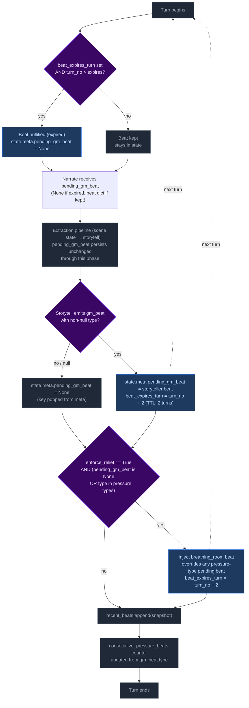
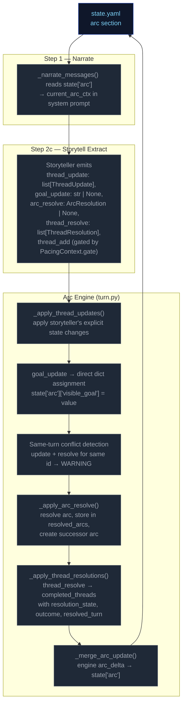

# Step 2c — Storytell

Extracts thread updates, arc actions, and durable NPC compendium changes. World state changes happen only via thread resolution `promote_to_world_state`.

## Flowchart


## Always runs

Storytell is the post-narration storytelling brain. It always executes every turn (never skipped) and feeds next turn's rules call via `thread_update/goal_update/arc_resolve/thread_resolve/thread_add` (storyteller-managed thread lifecycle), and `gm_beat` (forward-facing beats stored in `state.meta.pending_gm_beat`). World state changes are promotion-only — emitted via `thread_resolve[].promote_to_world_state`.

## GM Beat

Forward-facing storytelling beats that shape scene progression across turns. Beats are emitted by Storytell (Step 2c), consumed by Narrator (Step 1) the following turn, and managed via a write/expiry lifecycle in `state.meta.pending_gm_beat`.

### GMBeat Schema

```
GMBeat
  type: complication | revelation | opportunity | breathing_room | pressure | twist | setback | escalation | callback
  surface_as: ambient | event | npc_behavior | environmental | player_discovery | item (default: ambient)
  beat_expires_turn: int | None — turn number at which the beat expires; set to turn_no + 2 when stored
```

**Validation:** Only `type` is validated by `StorytellerResult._nullify_invalid_gm_beat` — nullified if type is falsy or not in the valid set. No validation on `surface_as`. Python accepts whatever gm_beat the LLM emits with no correction or override.

### PacingContext Fields

The beat system intersects with pacing via the `directive` field in `PacingContext` (see [step0-ruling](./step0-ruling.md#pacing-context)):

| Field | Type | Meaning |
|-------|------|---------|
| `directive` | str | Narration directive (e.g., "Breathe", "Scene Imperative", "Scene Pressure", or empty). Drives storytell guidance for beat type selection. |

> **Note:** `beat_locked` and `gate` fields were removed from `PacingContext` in the phase engine overhaul. Floor relief is now driven by `enforce_relief` derived from `scene_phase` and `consecutive_pressure_beats`. Phase-derived `allowed_beat_types` is the gating mechanism for beat type selection.

### Beat Lifecycle — Turn Sequence



**Step 1 — Pre-narration expiry check.** At the start of each turn, the engine reads `state.meta.pending_gm_beat` from the previous turn. If `beat_expires_turn` is set and the current turn number exceeds it, the beat is nullified (key set to None). Otherwise it proceeds to narration.

Note: This expiry runs early enough that the beat is gone before the extraction phase begins. This is intentional — it creates clean state for floor relief to inject breathing_room if `enforce_relief` is active and storyteller doesn't provide its own non-pressure beat. Without the pre-narration expiry, a stale expired beat could block floor relief's null check.

**Step 2 — Narration consumption.** The beat is passed to the narrator via `_narrate_messages(pending_gm_beat=...)`. The narrator uses the beat's `type` and `surface_as` metadata as creative guidance alongside the pacing directive. The beat is NOT cleared after narration — it persists through the extraction phase.

**Step 3 — Storytell writes or clears the beat.** After extraction completes:
- If Storytell emits a valid `gm_beat` (non-null `type`): replaces `pending_gm_beat` with `beat_expires_turn = turn_no + 2`.
- If Storytell emits `null` or an invalid beat: pops `pending_gm_beat` from state (null-clear). The old beat does NOT carry forward.

**Step 4 — Floor relief injection.** After delta apply, if `enforce_relief=True` (phase is CRISIS and `consecutive_pressure_beats >= config.consecutive_pressure_threshold`) AND the current `pending_gm_beat` is either `None` or a pressure-type (`pressure`, `escalation`, `complication`): injects a `breathing_room` beat with `beat_expires_turn = turn_no + 2`. This overrides pressure-type beats that would otherwise continue the pressure cycle, but does NOT override non-pressure beats the storyteller independently produced (e.g., `revelation`, `opportunity`, `breathing_room`).

**Step 5 — Beat history snapshot.** `pending_gm_beat` is appended to `state.meta.recent_beats` (capped at 5 entries). The snapshot is taken after any floor relief override, so it reflects the beat the next turn's narrator will consume.

**Step 6 — Consecutive pressure beats counter update.** The counter increments on pressure-type beats and resets to 0 otherwise.

### Floor Relief Injection

Floor relief is now driven by the phase engine, not the old momentum system. It fires after delta apply when `enforce_relief=True` (phase is CRISIS and `consecutive_pressure_beats >= config.consecutive_pressure_threshold`) AND the current `pending_gm_beat` is either `None` or a pressure-type beat (`pressure`, `escalation`, `complication`). It injects a `breathing_room` beat with TTL of 2 turns (same as storyteller-emitted beats, despite architecture docs claiming 3).

Floor relief is a **fallback override** — it breaks a pressure-type run by force-injecting recovery:
- If Storytell emitted a pressure-type beat → floor relief overrides it with breathing_room.
- If Storytell emitted a non-pressure beat (revelation, opportunity, breathing_room, etc.) → floor relief lets it stand. Relief is already being achieved.
- If Storytell emitted nothing (null) → floor relief injects breathing_room. This is appropriate: after a null turn with enforce_relief active, relief is needed.

### Phase-Beat Constraints

The storyteller prompt (`storytell_system.j2`) uses a phase→beat constraints table driven by `scene_phase` and `allowed_beat_types` context variables. Each phase (SETUP, RISING, CRISIS, RESOLUTION, BREATHER) specifies which beat types are permitted. The roll-band table becomes the secondary constraint when phase allows multiple types. Phase overrides roll band. This alignment is **guidance only** — Python accepts whatever gm_beat the LLM emits with no validation, correction, or override. Design rationale: forcing phase-beat alignment would constrain storytelling flexibility and create brittleness if the LLM makes contextually appropriate but phase-divergent beat choices.

### Beat History

`state.meta.recent_beats` stores the last 5 beats (including null entries) with `turn`, `type`, and `surface_as`. This history is rendered in both the storyteller system prompt (behavioral guidance) and the user prompt (current-turn context, more salient). Each entry shows `T{N}: {BEAT TYPE} (surface)` or `T{N}: No beat emitted this turn`.

The LLM uses this history to follow beat diversity guidance: avoid repeating the same type more than twice in a sequence; at least one in three beats should be a non-pressure type.

### TTL Mechanics Summary

| Source | Default TTL | Expiry Calculation |
|--------|-------------|-------------------|
| Storytell-emitted beat | 2 turns | `beat_expires_turn = turn_no + 2` |
| Floor relief (Python-injected) | 2 turns | `beat_expires_turn = turn_no + 2` |

### Null-Clear Behavior

When Storytell emits a null beat (or an invalid beat whose type is nullified), `pending_gm_beat` is popped from `state.meta`. The beat does NOT carry forward. This replaced the old carryover behavior where stale beats persisted through null turns.

The storyteller user prompt always renders the GM Beat section — on null-following turns it shows "No beat currently carried over from the previous turn. Choose freely." This ensures the LLM has consistent beat awareness on every turn.

### GM Beat Section in UI

The storyteller user prompt renders the `## GM Beat` section unconditionally:
- **Beat present:** Shows type, surface_as, expiration turn.
- **No beat:** Shows fallback text — "No beat currently carried over from the previous turn. Choose freely."

This was changed from the previous conditional rendering (where the section vanished on ~38% of turns), ensuring full beat awareness coverage.

## Campaign Arc System

The campaign arc system tracks story threads across turns. Thread state is **storyteller-managed** — the LLM explicitly controls urgency, progress, and goal direction via `thread_update` and `goal_update` directives. The engine applies these without enforcement of caps, cooldowns, or silent timers.

### Arc Data Model

```
CampaignArc
  visible_goal: str          — What the PC is trying to achieve
  goal_context: str          — 2–3 sentences explaining why visible_goal matters (UI-only; not rendered in prompts)
  threads: list[ArcThread]   — Unified collection with active flag
  completed_threads: list[ArcThread] — Resolved/failed/abandoned threads
  resolution: str | None     — Set when arc is resolved via arc_resolve
  last_thread_created_turn: int — Tracks when a thread was last created for pacing

ProgressEntry
  kind: Literal["advancement", "setback", "shift"] = "advancement"
  text: str

ArcThread
  id: str                    — Unique identifier
  summary: str               — What this thread is about
  active: bool = True        # Storyteller-controlled via thread_update; engine may auto-demote via auto-latent
  urgency: Literal["background", "normal", "urgent"] = "normal"  # Storyteller-controlled; Python enforces stepwise decay (urgent→normal→background) after N turns at same level
  progress: list[ProgressEntry] = []   — Append-only log of structured progress updates
  resolution_state: str | None # Set when thread_resolve processes resolved/failed/abandoned
  outcome: str | None        # Set from ThreadResolution.outcome when moved to completed_threads
  resolved_turn: int | None  — Turn when thread was resolved; used for TTL filtering in prompts
  last_updated_turn: int | None — Turn when thread was last updated via thread_update; used for auto-latent demotion and staleness display
  added_turn: int | None     — Turn when thread was created (thread_add or seed); enables age calculations for decay/expiration passes
  urgency_set_turn: int | None — Turn when urgency was last set; enables Python-side urgency decay pass to measure how long a thread has been at its current level
```

### Engine-Driven Arc

Thread lifecycle runs in `engine/turn.py` during the extraction phase. Seven operations handle arc/thread state in strict order:

```mermaid
flowchart TD
    classDef pyNode fill:#1f2937,color:#9ca3af,stroke:#4b5563
    classDef arcNode fill:#3b0764,color:#e9d5ff,stroke:#7c3aed

    PR["StorytellerResult<br>thread_update: list[ThreadUpdate]<br>goal_update: str | None<br>arc_resolve: ArcResolution | None<br>thread_resolve: list[ThreadResolution]"]:::pyNode

    subgraph UPDATES["_apply_thread_updates(config)"]
        U1["For each ThreadUpdate:<br>Find thread by id → apply<br>active/urgency/summary/progress changes<br>progress is append-only (list[ProgressEntry])<br>Progress dedup via difflib (≥50% overlap → reject)<br>Sets last_updated_turn = current turn"]
        U2["Auto-latent demotion:<br>threads untouched for thread_stale_threshold turns<br>→ active: false"]
        U3["Urgency decay pass:<br>for each active thread with urgency_set_turn,<br>If age >= thread_urgency_max_age:<br>  urgent → normal, then normal → background<br>Sets urgency_set_turn = current turn on demotion"]
    end

    subgraph GOAL["goal_update (direct dict assignment)"]
        G1["If storyteller_result.goal_update is set:<br>state['arc']['visible_goal'] = value<br>Direct assignment, NOT through _merge_arc_update<br>(which would wipe threads[])"]
    end

    subgraph CONFLICT["Same-turn conflict detection"]
        C1["If same thread id appears in both<br>thread_update and thread_resolve:<br>log WARNING (LLM error)<br>resolution wins (fires after update)"]
    end

    subgraph RESOLVE["_apply_arc_resolve()"]
        R1["Store current arc in resolved_arcs<br>with resolved_turn for TTL tracking"]
        R2["Carry forward all threads (minus drop_threads)"]
        R3["Add new_threads from resolution"]
        R4["Create successor arc with<br>new visible_goal, goal_context,<br>surviving + new threads"]
    end

    subgraph RESOLUTIONS["_apply_thread_resolutions()"]
        S1["For each ThreadResolution:<br>Move ArcThread to completed_threads<br>Set resolution_state, outcome, resolved_turn"]
    end

    subgraph GATE["Thread add gate (with cap eviction)"]
        T1["Phase-derived allowed_beat_types<br>governs beat type selection.<br>Gate field always 'allow' —<br>no longer rendered in prompts."]
        T2["ID collision? Thread id in existing_ids<br>or completed_ids → reject"]
        T3["Thread cap: if active > thread_max_active<br>→ evict oldest active thread (set active: false)"]
    end

    PR --> UPDATES --> GOAL --> CONFLICT --> RESOLVE --> RESOLUTIONS --> GATE

    GATE -- "CampaignArc" --> ARC[arc state in<br>state.yaml]:::arcNode
```



**Pipeline order:** thread updates → goal_update (dict assignment) → conflict detection → arc resolution → thread resolutions → thread_add gate.

**Key rules:**
- **Engine-enforced thread governance:** The engine enforces four controls that constrain storyteller thread management:
  - **Auto-latent demotion:** Threads untouched for `config.thread_stale_threshold` turns (default 3) are automatically set to `active: false`. This prevents stale threads from lingering as active prompts. Fires every turn after thread_updates loop completes (not gated on mutation).
  - **Thread cap eviction:** After thread_add, if active thread count exceeds `config.thread_max_active` (default 5), the oldest active thread (by `last_updated_turn`) is evicted to `active: false`. This prevents unbounded thread accumulation.
  - **Progress dedup:** New progress entries are compared against the last entry via `difflib.SequenceMatcher`. ≥50% textual overlap causes rejection with a WARNING log. This filters out near-duplicate LLM output.
  - **Urgency decay (Python-side floor):** Threads that have been at their current urgency level for >= `thread_urgency_max_age` turns (default 8) are demoted stepwise: urgent → normal, then normal → background. Only applies to active threads with `urgency_set_turn` set. Does not send signals to the LLM — it is a structural floor preventing indefinite stagnation at any urgency level.
- **goal_update:** A bare string applied directly to `state["arc"]["visible_goal"]` via dict assignment. Does NOT route through `_merge_arc_update` (which replaces `threads[]` unconditionally — passing a bare CampaignArc would wipe the thread list). Applied before arc_resolve; if both fire on the same turn, arc_resolve wins (ending the arc supersedes a mid-arc update).
- **Same-turn conflict detection:** When the same thread id appears in both `thread_update` and `thread_resolve` in a single output, a WARNING is logged. The processing order (update before resolve) means resolution takes precedence — correct behavior, but this is always an LLM error worth monitoring.
- **Arc resolution:** When `arc_resolve` is emitted, the current arc is stored in `state["resolved_arcs"]` with `resolved_turn` for TTL tracking. All threads carry forward (minus any in drop_threads), plus any new_threads from the resolution.
- **TTL-based cleanup:** Completed threads and resolved arcs are pruned from prompt context after `completed_thread_ttl` / `resolved_arc_ttl` turns (default 3). The `arc_ttl` is wired from `config.arc_memory_ttl` (not hardcoded).

### Arc Context in Narration

The arc state is passed to the narrator via `current_arc` in both system and user prompts. `goal_context` is present in the model but only surfaced in the player UI (tooltip/description text) — the pipeline and prompts never read it directly. The narrator sees arc metadata including resolved arcs (TTL-filtered) and completed threads.

### Arc System Integration Points



### Thread Mechanics

#### Entry Points

Seven call sites in `run_turn()` process arc/thread operations in order:
1. **`_apply_thread_updates()`** — apply storyteller's explicit state changes; progress is append-only (`list[ProgressEntry]`); sets `last_updated_turn`; auto-latent demotion when untouched past threshold; urgency decay (stepwise urgent→normal→background after N turns at same level). Progress dedup via SequenceMatcher
2. **`goal_update`** — direct dict assignment to `state["arc"]["visible_goal"]`
3. **Same-turn conflict detection** — warn if same thread id in both update and resolve
4. **`_apply_arc_resolve()`** — resolve arc, store in resolved_arcs, create successor
5. **`_apply_thread_resolutions()`** — resolve/fail/abandon → completed
6. **Thread add gate** — pacing gate + ID collision checks + thread cap eviction
7. **`_merge_arc_update()`** — apply the final CampaignArc delta to state

All seven run after `apply_delta()` but before `save_state()`.

#### Step-by-Step: `_apply_thread_updates(config)`

Processes `storyteller_result.thread_update` (list of `ThreadUpdate` with `id`, optional `active`, `urgency`, `summary`, `progress`, `progress_kind`).

For each ThreadUpdate:
1. Find matching thread by ID in `arc.threads[]`
2. If not found → log WARNING, skip
3. If found:
   - Apply non-None fields (`active`, `urgency`, `summary`) via `model_copy`
   - If `progress` is non-None: wrap in `ProgressEntry(kind=update.progress_kind or "advancement", text=update.progress)`. If thread already has progress, compare against last entry via `difflib.SequenceMatcher` — ≥50% overlap rejects with WARNING. Otherwise append.
    - Set `last_updated_turn` to current turn number
 4. Log applied changes at INFO level
 5. **Auto-latent demotion** (post-loop, after every thread_updates loop): For each active thread whose `last_updated_turn` is ≥ `config.thread_stale_threshold` turns ago, set `active: false`.
 6. **Urgency decay pass**: For each active thread with `urgency_set_turn` set, if age (`turn_no - urgency_set_turn`) >= `thread_urgency_max_age`, demote stepwise (urgent→normal, normal→background). Sets `urgency_set_turn = current turn` on demotion. Skips threads without `urgency_set_turn` (pre-existing data degrades gracefully).

**Progress model:** Every progress entry is a `ProgressEntry` with `kind` field (`"advancement"`, `"setback"`, or `"shift"`) and `text`. The `progress_kind` field on `ThreadUpdate` tags each emitted progress entry; default is `"advancement"`. Progress is rendered to prompts as `[KIND] text` by `_fmt_progress()` (module-level function in `ccya/prompts/context.py` — relocated from a static method on `ArcThreadBlock` and from `ccya/engine/narrate.py`).

**Progress dedup:** Uses `difflib.SequenceMatcher.ratio()` against the last entry to reject near-duplicate progress (≥50% textual overlap). This filters out LLM outputs that rephrase the same progress update without advancing the narrative. A WARNING is logged on rejection.

**Auto-latent demotion:** Prevents stale threads from accumulating as active prompts. Threads that haven't been touched by `thread_update` for `config.thread_stale_threshold` turns (default 3) are automatically demoted to `active: false`. This is engine-enforced, not storyteller-managed — the storyteller can re-activate a thread by issuing a `thread_update` with `active: true`, but the engine will demote it again if it goes untouched. Fires every turn (not gated on mutation) so stale active threads reliably get `active=false` after 3 turns of no updates.

#### Step-by-Step: `_apply_arc_resolve()`

Processes `storyteller_result.arc_resolve` (optional `ArcResolution` with `resolution`, `visible_goal`, `goal_context`, `drop_threads: list[str]`, `new_threads: list[ArcThread]`).

1. If `arc_resolve` is None → return None
2. Validate arc from state; if missing/invalid → log WARNING, return None
3. Store current arc in `state["resolved_arcs"]` with `resolved_turn` for TTL tracking
4. Carry forward all threads minus any IDs listed in drop_threads
5. Add new_threads from the ArcResolution model
6. Create successor arc with new `visible_goal`, `goal_context`, and combined surviving + new threads
7. Replace `state["arc"]` with successor

#### Thread Creation (gated in `run_turn()` with cap eviction)

New threads (`storyteller_result.thread_add`) are gated by:

1. **Pacing gate**: `PacingContext.gate == "allow"` — blocks escalation when pacing context says so. Gate status is rendered in the prompt (`_thread_list.j2`) so the storyteller has awareness instead of silent drops.
2. **ID collision**: thread `id` already exists in `arc.threads[]` or `arc.completed_threads[]` → reject with WARNING log. Id-based dedup only — no key field or fuzzy merge.
3. **Thread cap eviction** (post-add, only if config provided): If active thread count exceeds `config.thread_max_active` (default 5), evict the oldest active thread (by `last_updated_turn`) — set `active: false`. This prevents unbounded thread accumulation while the storyteller can still add new threads when pacing context permits.

**Thread creation via thread_update (ungoverned):** Threads can also be created implicitly by appearing in `thread_update` without a prior `thread_add`. This is the dominant creation path in practice — the LLM introduces new thread IDs directly via updates.

#### Step-by-Step: `_apply_thread_resolutions()`

Processes `storyteller_result.thread_resolve` (list of `ThreadResolution` with `id`, `resolution_state`, `outcome`).

1. Find matching thread by ID in `arc.threads[]`
2. If not found → log warning, skip
3. If found → move to `arc.completed_threads[]`, set `resolution_state`, `outcome`, and `resolved_turn`
4. Deduplicate completed_threads entries: existing ID gets updated, not duplicated

#### Pacing Context Gate

> **Removed in Plan 3.** The `gate` field on `PacingContext` is always `"allow"` after Plan 2. Templates no longer render it. Beat type gating is now handled by phase-derived `allowed_beat_types` in the storyteller system prompt. Thread creation is governed by phase constraints, not the gate field.

#### Constants Reference

| Constant | Value (default) | Effect |
|---|---|---|
| `config.arc_memory_ttl` | 3 | Turns to keep resolved arcs in prompt context (wired to `_storytell_messages(arc_ttl=...)`) |
| `config.thread_memory_ttl` | 3 | Turns to keep completed threads in prompt context |
| `config.thread_stale_threshold` | 3 | Turns of inactivity before auto-latent demotion (`active: false`) |
| `config.thread_max_active` | 5 | Max active threads; oldest evicted when exceeded on thread_add |
| `config.thread_urgency_max_age` | 8 | Turns at same urgency level before Python-side stepwise decay (urgent→normal→background) |

#### Validation Edge Cases

1. **Empty arc state** — No arc in state → log DEBUG, return None (no crash)
2. **Validation failure** — Arc fails Pydantic validation → log WARNING, return None
3. **Unknown thread ID in update** — Log WARNING, skip — does not block valid updates
4. **Unknown resolution ID** — Log WARNING, skip — does not block valid resolutions
5. **Duplicate thread ID in creation** — Checked against existing + completed IDs
6. **Same-turn update+resolve conflict** — Same thread id in both `thread_update` and `thread_resolve` → log WARNING, resolution wins (fires after update)
7. **Progress type migration** — Old saves with `progress: "str"` or `progress: list[str]` are coerced via `field_validator("progress", mode="wrap")`: bare strings wrapped in `[{"text": v, "kind": "advancement"}]`; string lists converted to `[{"text": s, "kind": "advancement"} for s in list]`.
8. **Progress dedup rejection** — New progress with ≥50% textual overlap against last entry → log WARNING, skip entry (does not block rest of update)
9. **Thread cap eviction** — After thread_add, if active count > `thread_max_active`, oldest active thread evicted to `active: false` — log INFO with evicted thread id

### Progress Migration

`ArcThread.progress` has migrated through two versions:
- **v1:** `str` — single progress string
- **v2:** `list[str]` — append-only list of progress strings
- **v3 (current):** `list[ProgressEntry]` — structured entries with `kind` + `text`

A Pydantic `field_validator("progress", mode="wrap")` on `ArcThread` handles all legacy shapes:
- Bare `str`: wraps in `[{"text": v, "kind": "advancement"}]`
- `list[str]`: converts to `[{"text": s, "kind": "advancement"} for s in list]`
- `list[ProgressEntry]`: passes through
