# Step 2d — World

Async beat-candidate generation step. Runs after the synchronous turn completes (`yield ("complete", ...)`) while the player reads the current turn's narration. Generates 2-3 candidate GM beats for the *next* turn's Ruling phase.

World runs inside the `_inflight` lock (it does not release until the generator returns), so the submit guard remains asserted for the full World window. Ruling on the next turn consumes `state.meta.beat_candidates` to select a single beat.

## Why a separate step?

The pre-split Storytell (Step 2c) generated the GM beat immediately after narration, with no knowledge of the player's intent for the upcoming turn. This produced a recurring mismatch: the narrator would reconcile a beat the player had no intention of acting on. World defers beat generation to an async window after persist — at this point the narrative state is stable and the world layer can think about what should happen next. Ruling then picks the candidate that best matches the player's actual intent.

## Flowchart

```mermaid
flowchart LR
    classDef llmNode fill:#0f172a,color:#94a3b8,stroke:#334155
    classDef xstream fill:#4c1d95,color:#ddd6fe,stroke:#7c3aed
    classDef outNode fill:#500724,color:#fbcfe8,stroke:#ec4899

    subgraph IN["Inputs (read at start of World)"]
        S1["npc_roster<br>(from build_npc_roster(), filtered to present/nearby)"]:::xstream
        S2["arc.threads[]<br>(urgency counts, active threads)"]:::xstream
        S3["pacing_context<br>(directive, outcome_hint)"]:::xstream
        S4["recent_beats<br>(state.meta.recent_beats)"]:::xstream
        S5["allowed_beat_types<br>(phase-derived)"]:::xstream
        S6["narration (full)"]:::xstream
    end

    subgraph LLM["LLM — world_system.j2 + world_user.j2"]
        WL["temp: 0.55 · max_retries: 1<br>output: JSON array of GMBeat"]:::llmNode
    end

    subgraph OUT["Outputs"]
        O1["state.meta.beat_candidates<br>[ {type, effect}, ... ]<br>0-3 candidates"]:::outNode
        O2["extraction.world.purged<br>[ purged candidates ]"]:::outNode
    end

    IN --> LLM --> OUT
```



## Placement — end-of-turn async window

World runs after `yield ("complete", result_obj)` inside `run_turn`, while the `_inflight` lock is still held. The generator drains through Sanitize → World → return; only when the generator returns does `finally` release `_inflight`. The SSE route already drains the async generator to exhaustion (no `break` after `complete`), so the route handler requires no change.

```python
yield ("complete", result_obj)        # ← player sees narration
# --- end-of-turn async window (lock still held) ---
yield ("phase", {"phase": "sanitize_start"})
if config.sanitize_every > 0:
    state, _ = await sanitize_threads(save_dir, state, config, trace_id=trace_id)
yield ("phase", {"phase": "sanitize_done"})
yield ("phase", {"phase": "world_start"})
beat_candidates = await _run_world_step(env, state, narrative, scene_result, _pc, config, trace_id, turn_no)
state = state.set_beat_candidates(beat_candidates or [])
save_state(save_dir, state)          # single end-of-turn persist (Sanitize + candidates)
yield ("phase", {"phase": "world_done"})
# return → finally releases _inflight
```

**Stale-input invariant.** World receives the same `WorldState` that Sanitize just returned — no reload, no snapshot, no intermediate `save_state`. Sanitize returns a new `WorldState` with updated `state.long_term_objective.threads`; World's `_run_world_step` reads that exact state, so it sees sanitized threads by construction.

## Inputs

| Input | Source |
|-------|--------|
| `npc_roster` | `build_npc_roster()` from compendium (filtered to present/nearby) |
| `long_term_objective.threads[]` | `state.long_term_objective.threads` |
| `narration` | passed in from `run_turn` |
| `pacing_context` | passed in from `run_turn` |
| `recent_beats` | `state.meta.recent_beats` |
| `allowed_beat_types` | `derive_allowed_beat_types(scene_phase, directive)` |
| `rules_outcome.band` | (optional) used for roll-band guidance |

World reads NPC profiles directly from the compendium via `build_npc_roster()`, filtering to `presence in ["present", "nearby"]`. Beat generation follows priority order: cross-NPC blending → NPC/Thread blending → single-NPC depth → environmental.

## Outputs

`state.meta.beat_candidates: list[dict]` — 0-3 validated candidate dicts (after phase validation + `GMBeat(**candidate)` validation; invalid candidates silently dropped, no retry). Each dict has `{type, effect, npcs}`. Ruling reads by index.

`extraction.world.purged: list[dict]` — candidates purged by phase validation (stored for EV debugging).

**Failure mode.** If the World LLM call times out, returns invalid JSON, or all candidates fail validation, the candidates list is `[]` and the next turn's Ruling proceeds without a beat selection (no `selected_beat` in JSON). The `world_done` event still fires; the lock releases; the next turn can submit. World resolves one way or another before the lock lifts.

## GMBeat schema (repurposed)

The `GMBeat` Pydantic model is used as the validation schema for World candidates. Ruling no longer validates against GMBeat — it selects by index. Fields: `type` (Literal — silently coerced to `None` if not in valid set), `effect` (str), `npcs` (list[str] — NPC IDs involved in this beat). The `npc_id`, `driver`, and `beat_expires_turn` fields are removed (no TTL — see "Beat lifecycle" below).

```
GMBeat
  type: complication | revelation | opportunity | breathing_room |
        pressure | twist | setback | escalation | callback | None
  effect: str                       # required
  npcs: list[str]                   # NPC IDs involved in this beat
```

A candidate whose `type` ends up empty is dropped.

## Phase validation layer

Before GMBeat validation, World validates each candidate's `type` against the phase-derived `allowed_beat_types`. Candidates whose `type` is not in the allowed set are purged before reaching the GMBeat validation step. This prevents the LLM from generating beat types that the current phase machine considers inappropriate.

- Purged candidates are logged at `WARNING` level if some remain after purging, `ERROR` if all are purged.
- The purged list is returned as a 6th element from `_run_world_step()` and stored in `extraction.world.purged` for EV debugging.
- This validation runs before GMBeat validation, so invalid-type candidates never reach the Pydantic validation step.

## Temperature

`config.world_temperature` (default `0.55`) — medium temperature for constrained creative generation. The system prompt is lightweight (~200-250 tokens) and the user prompt carries the structured inputs (~1000-2000 tokens).

## Event and prompt recording

World data is recorded in the main turn event under `extraction.world` (not as a separate event type). This matches the existing pattern for scene/state/record extraction steps and keeps the turn viewer pipeline unified.

**events.jsonl** — After the async window completes, `extraction_event["world"]` is added to the main turn event with the following shape:

```
extraction.world = {
    "output": beat_candidates,       # list[dict] — validated GMBeat dicts
    "purged": [...],                 # list[dict] — phase-purged candidates
    "skipped": False,
    "tokens_in": 0,                  # reserved for future LLM token tracking
    "tokens_out": 0,                 # reserved for future LLM token tracking
    "ms": <world_ms>,                # total wall-clock ms for world step
}
```

The main turn event is appended to `events.jsonl` and `state.yaml` is saved **after** the async window (previously they were appended before), ensuring `extraction.world` is included in the persisted event.

**prompts.jsonl** — World prompts are written via `append_prompts(save_dir, [...])` with a single entry:

```
{
    "ts": "<ISO timestamp>",
    "trace_id": "<trace_id>",
    "turn": <turn_number>,
    "stream": "world",
    "rendered_system": "<world_system.j2 rendered>",
    "rendered_user": "<world_user.j2 rendered>",
}
```

The `turn_viewer_prompts` route automatically includes world prompts since it reads all prompts with matching `turn` from `prompts.jsonl`.

**Turn viewer pipeline** — World appears as the 6th stage in the pipeline view, with its `StreamDescriptor` in `tv_mirror.py` defining:
- `metrics_path="extraction.world"` — resolves to the world metrics blob
- `prompt_path="extraction.world"` — resolves to the world prompt/output blob
- `inputs=["narrate"]` — drives connector generation from narrate stage
- `stage_css="world"` — maps to `tv-stage-world` CSS class

## Beat lifecycle (after split)

Beats are now single-turn commitments:

1. **World (turn N, async after `complete`):** generates 2-3 candidates → `state.meta.beat_candidates`.
2. **Ruling (turn N+1, sync at start):** reads `state.meta.beat_candidates`, picks one by index (or none), sets `state.meta.pending_gm_beat` (if selected) or pops it (if not). Always pops `state.meta.beat_candidates` (no carryover).
3. **Narrate (turn N+1, sync):** reads `state.meta.pending_gm_beat` (set by Ruling this same turn), integrates it as atmospheric pressure / scene direction. Narrate is a pure reader of `pending_gm_beat` — it does not mutate it.
4. **Turn boundary:** Ruling's per-turn "always replace or pop" rule keeps `pending_gm_beat` hygienic. No expiry arithmetic — beats are single-turn commitments.

**Why no TTL?** Ruling unconditionally resolves `pending_gm_beat` every turn (replace with new or pop to None). An orphan can never survive a turn boundary, so `beat_expires_turn` is vestigial and was removed.

## See also

- [step0-ruling.md](./step0-ruling.md) — Ruling reads `state.meta.beat_candidates` and outputs `selected_beat`
- [step2c-record.md](./step2c-record.md) — synchronous extraction pipeline (replaces Storytell)
- [OUT-OF-BAND.md](./out-of-band.md) — async phase pattern in this codebase
- [cross-module-contracts.md](./cross-module-contracts.md) — state model contract
